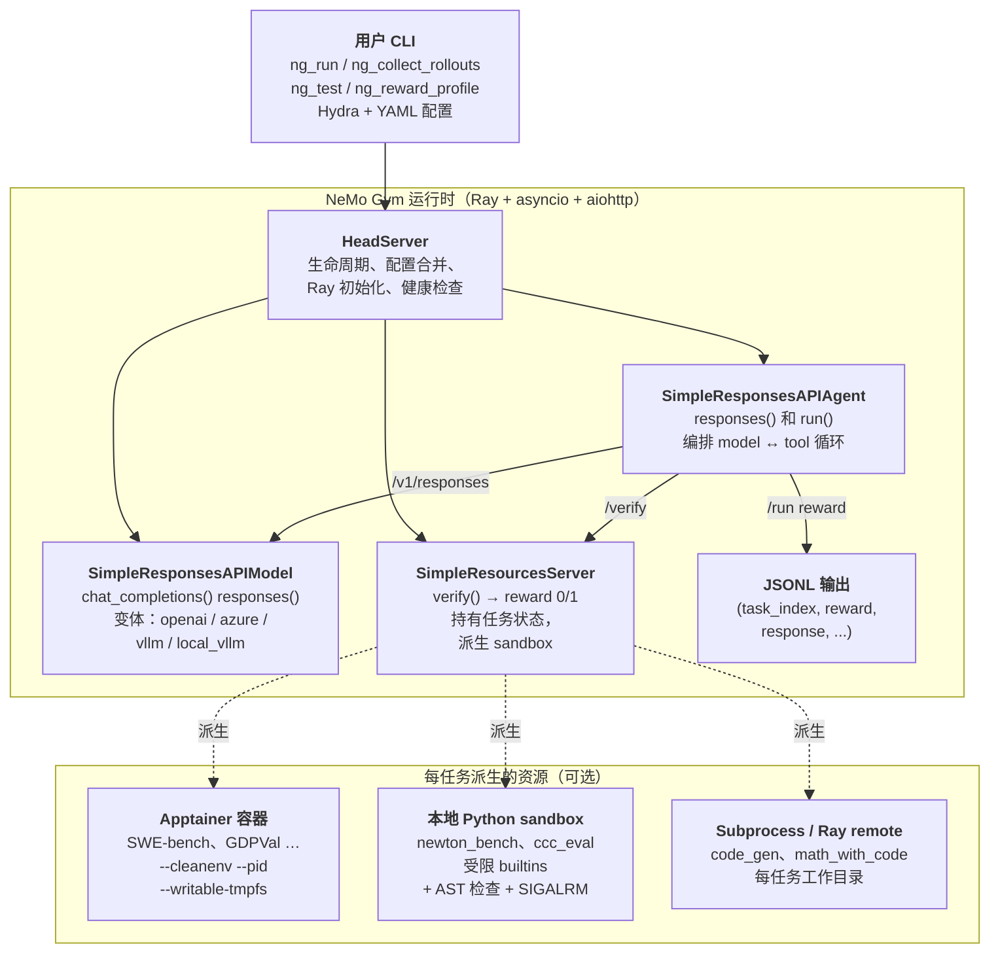
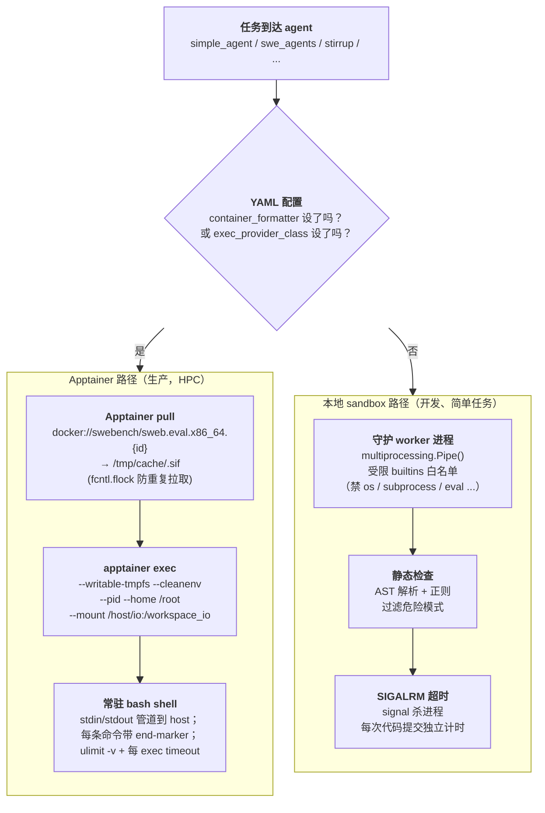

# NeMo Gym：NVIDIA 的 LLM RL 环境框架

> [!info] 项目元信息
> - **仓库**：[github.com/NVIDIA-NeMo/Gym](https://github.com/NVIDIA-NeMo/Gym)
> - **文档**：[docs.nvidia.com/nemo/gym/latest](https://docs.nvidia.com/nemo/gym/latest/)
> - **生态位**：NVIDIA NeMo 平台的一部分（训练侧：NeMo RL；推理侧：Nemotron）
> - **状态**：早期开发中（API 仍在演进）。在 Nemotron 训练中已经实战。

> [!abstract]+ TL;DR
> NeMo Gym 是 NVIDIA RL 训练栈的 **环境 / rollout 侧** —— 与 trainer 库（[[rl-training-frameworks|NeMo RL、VeRL、Unsloth]]）配对使用。你交给它一份任务数据集 + 一个 agent harness + 一个 verifier，它会起三个 FastAPI 微服务（resources / model / agent），按任意并发度在这些任务上跑你的 agent，给每条 rollout 打分，然后把 `(input, output, reward)` 三元组送给你的 trainer。库里自带 **84 个 benchmark**（SWE-bench、GPQA、BigCodeBench、MATH、IFBench、GDPVal、Newton Bench …）、**19 个 agent harness**（simple、OpenHands-style SWE、LangGraph、Mini-SWE、Verifiers …）和 **6 种 model server**（OpenAI、Azure OpenAI、vLLM、local vLLM …）。涉及不可信代码执行（SWE-bench、code-gen）时用 **Apptainer**（不是 Docker —— 训练集群节点本身就跑在 enroot 容器里，套娃只有 Apptainer 玩得转）。简单任务用 Python 进程级 sandbox。配置走 Hydra / OmegaConf YAML；分布式协调走 Ray；HTTP 走 aiohttp（不是 httpx —— [[#值得记住的工程选择|为什么]]）。

---

## 它解决什么问题

LLM 的 RL 后训练需要按高并发对当前策略生成 rollout，对每条 rollout 打分得到 reward，再把 reward 回传给 trainer。最朴素的做法 —— 调一个模型 API、在同一进程里跑 verifier 脚本、循环 —— 在三个点上崩：

1. **规模。** 现代 RL 训练每个训练步需要 **数千条并发 rollout** 才能喂饱 GPU。单脚本驱动数千次模型调用 + verifier 执行做不下来。
2. **状态。** 很多真实任务需要 **持久执行上下文** —— code-gen 任务需要一个挂着测试 harness 的工作目录；SWE-bench 任务需要一整个停在某个 commit 的 git 仓库；tool-use 任务需要跨轮次保留 session。verifier 需要 *观察* 这些状态，不只是看最终文本。
3. **复用。** 同一个环境（数据集 + harness + verifier）要能 **今天评测、下周做 agent 优化、下个月跑 RL 训练**。如果每个用例都自己写一套集成，环境就攒不起来。

NeMo Gym 的答案是一个三服务微服务架构（resources / model / agent），都是 FastAPI 应用，走异步 HTTP，由 Ray 协调，由 Hydra YAML 配置。每个环境是 **独立打包的 server**，任何 trainer 或评测器都能调。

> [!quote] 一句话定义
> **环境**（environment）是 agent 为完成任务而与之交互的完整系统：数据集（任务）、harness（模型如何交互）、verifier（如何打分）、state（每任务的执行上下文）。

---

## 心智模型：环境 = 数据集 + harness + verifier + state

NeMo Gym 其它部分都从这个概念派生：

- **数据集。** 一个 JSONL 文件，一行一个任务。每行带模型面向的 prompt（`responses_create_params.input`）和 verifier 面向的元数据（`verifier_metadata`）。
- **Harness。** 模型如何与世界交互。静态 QA 任务的 harness 就是"发 prompt → 取输出"；SWE-bench 的 harness 是一个多轮循环，给模型 bash + 文件编辑工具，把工具运行在容器里，再把报错信息反馈回去。Harness 是一个 **agent server**。
- **Verifier。** 接收最终输出（+ 任务元数据）返回 reward 的函数，通常 0.0 或 1.0。Verifier 住在 **resources server** 里，是 *唯一* 不能跨任务复用的组件 —— 它编码了"这个 benchmark 上成功长什么样"。
- **State。** 每任务的执行上下文。代码任务需要一个可写目录；SWE-bench 需要打过 patch 的仓库；tool-use 需要 session id。State 住在 resources server 里（或它启动的容器里）。

具体：

```
data/example.jsonl  ─►  agent server  ─►  model server  ─►  agent server  ─►  resources server  ─►  reward
   (一行一个任务)        (跑 harness)     (LLM forward)     (解析输出)        (在 sandbox 里 verify)
```

整个 loop 就这么一条。精彩处在每个箭头怎么实现。

---

## 系统架构



图里三个点值得注意：

- **三种 server 都是 FastAPI 应用**，不是 Python 库 import。它们之间走 HTTP（aiohttp）。原因：同一架构同时服务 *评测*（一次性、一进程）和 *训练*（多节点上数千条并发 rollout）。要扩容就加副本，不靠多线程。
- **HeadServer** 是指挥 —— 合并 config、起 Ray、启动三个子 server、暴露统一健康端点。你的 CLI 永远只跟 HeadServer 对话。
- **容器 / sandbox 是在 resources server *内部* 派生的**，只有任务需要隔离执行时才会派生。大多数 benchmark（MCQA、format 检查、judge 打分）根本不要 sandbox。SWE-bench / GDPVal / Newton Bench 才需要。

---

## 三种 server 详解

### Resources server（`resources_servers/`）

Verifier 那一侧。每个 resources server 是一个实现 `verify()` 的子目录：

```python
# resources_servers/my_benchmark/app.py
class MyBenchmarkServer(SimpleResourcesServer):
    async def verify(self, request: VerifyRequest) -> VerifyResponse:
        output_text = request.output_text
        metadata = request.verifier_metadata  # 任务特定

        # 任务特定的打分逻辑
        score = check_answer(output_text, metadata)

        return VerifyResponse(reward=1.0 if score else 0.0)
```

必备目录结构：

```
resources_servers/my_benchmark/
├── app.py              # MyBenchmarkServer，继承 SimpleResourcesServer
├── configs/my_benchmark.yaml
├── data/example.jsonl  # 5 个示例（提交到 git）
├── tests/test_app.py
├── requirements.txt    # -e nemo-gym[dev] @ ../../
└── README.md
```

`verifier_metadata` 字典 **对框架不透明** —— 你想塞什么字段就塞什么（测试用例、标准答案、task ID、gold patch、隐藏测试输入 …），框架会原样从 JSONL 行管道到你的 `verify()`。

仓库里自带 **84 个 resources server**。粗略按类别抽样：

| 类别                     | 示例                                                                                              |
| ------------------------ | ------------------------------------------------------------------------------------------------ |
| 代码生成                 | `code_gen`、`bigcodebench`、`evalplus`、`competitive_coding_challenges`、`code_fim`               |
| SWE / 仓库级代码         | `swerl_gen`、`swerl_llm_judge`（SWE-Agents harness 在 agent 侧）                                  |
| 数学与形式推理           | `math_with_code`、`math_with_judge`、`math_formal_lean`、`math_proof_judgement`、`imo_proofbench_judge`、`polymath` |
| 科学 Q&A                 | `gpqa_diamond`、`mcqa`、`ugphysics_judge`、`frontierscience_judge`、`physics_judge`               |
| 长上下文 / 检索          | `ruler`、`mrcr`、`hotpotqa_qa`、`aalcr`                                                           |
| 工具使用与 agent         | `tavily_search`、`google_search`、`xlam_fc`、`single_step_tool_use_with_argument_comparison`、`ns_tools` |
| 安全 / 对齐              | `jailbreak_detection`、`indirect_prompt_injection`、`over_refusal_detection`、`xstest`、`abstention` |
| 结构化输出               | `format_verification`、`structured_outputs`、`structeval`、`instruction_following`、`ifbench`    |
| 视觉 / 多模态            | `labbench2_vlm`、`vlm_eval_kit`、`gdpval`（PDF / 文档任务）                                       |
| SQL 与数据               | `bird_sql`、`spider2_lite`、`text_to_sql`                                                         |
| 领域（化学 / 金融 …）    | `rdkit_chemistry`、`ether0`、`finance_sec_search`、`cvdp`                                         |
| RL 环境（Gym 风格）      | `gymnasium`、`grl_sokoban`、`grl_tetris`、`blackjack`、`circle_click`、`circle_count`             |
| 管线示例                 | `example_single_tool_call`、`example_multi_step`、`example_session_state_mgmt`                   |

外部库桥接（让第三方环境寄居在框架内）：`aviary`（FutureHouse）、`openenv`（OpenEnv 系列）、`reasoning_gym`、`arc_agi`、`terminus_judge` …

### Response API model（`responses_api_models/`）

模型那一侧。把 OpenAI 兼容端点（`/v1/responses`、`/v1/chat/completions`）暴露给 agent 的薄包装。仓库自带 6 种：

| Server                   | 后端                                                              |
| ------------------------ | ----------------------------------------------------------------- |
| `openai_model`           | OpenAI 公网 API（或任何兼容端点）                                  |
| `azure_openai_model`     | Azure OpenAI 部署                                                  |
| `vllm_model`             | 远程 vLLM server（`/v1/chat/completions`）                         |
| `local_vllm_model`       | HeadServer 启动时本机起 vLLM                                       |
| `local_vllm_model_proxy` | 同上但作为 proxy（在本地多副本上 round-robin）                     |
| `genrm_model`            | 生成式 reward model 变体                                           |

为什么不直接用 OpenAI 客户端库要单独抽一层 model server：让 agent 代码 **后端无关**。同一份 SWE-Agent harness 既能跑 GPT-5（用 `openai_model`），也能跑某个 Nemotron checkpoint（用 `vllm_model`），还能在训练中跑进程内 vLLM（用 `local_vllm_model`）—— agent 代码一字不改，只换 YAML。

### Response API agent（`responses_api_agents/`）

Harness 那一侧。实现 `responses()` 和 `run()`。Harness 决定模型怎么跟任务交互 —— 单轮、多轮、带工具、错了重试、思维链 refine 等等。仓库自带 **19 个 agent harness**：

| Harness                   | 干什么                                                                              |
| ------------------------- | ---------------------------------------------------------------------------------- |
| `simple_agent`            | 一次模型调用，无工具。默认选择，多数 QA 风格 benchmark 够用。                       |
| `proof_refinement_agent`  | 多轮修正循环：模型拿到 verifier 的报错后重试。                                      |
| `swe_agents`              | OpenHands 风格 SWE-bench harness（bash + 文件编辑工具，每任务一个容器）。           |
| `mini_swe_agent`          | 更轻量的 SWE harness。                                                              |
| `stirrup_agent`           | 通用代码执行 harness，executor 可插拔（本地 sandbox / Apptainer）。                 |
| `langgraph_agent`         | 把 LangGraph 定义的 agent 桥接进 Gym schema。                                       |
| `verifiers_agent`         | 桥接 `Verifiers` 库。                                                               |
| `aviary_agent`            | 桥接 FutureHouse 的 Aviary 环境。                                                   |
| `harbor_agent`            | HPC 集群上的 Singularity 环境，容器内跑 FastAPI。                                   |
| `gymnasium_agent`         | 经典 Gym / Gymnasium 环境（Sokoban、Tetris、Blackjack …）。                         |
| `browsecomp_agent`        | 浏览网页类任务。                                                                    |
| `tool_simulation_agent`   | 模拟工具响应的 tool-use 评测。                                                      |

**对训练很重要的契约**：多轮 agent 必须把以下两类东西沿调用链 *显式传下去*：(a) **cookies**（`cookies=request.cookies` —— 有状态环境靠它标识 session）；(b) 每次模型响应里的 **token id 与 log-prob**（`prompt_token_ids`、`generation_token_ids`、`generation_log_probs`）—— trainer 下游算 advantage 要用。

---

## 配置：Hydra + YAML

所有配置都是 Hydra / OmegaConf YAML。每个 server 实例是一个顶层 key：

```yaml
my_benchmark_server:
  resources_servers:
    my_benchmark:
      entrypoint: app.py
      domain: coding
      verified: false
      # ... server 特定字段
```

Agent 按名字引用 resources 和 model server：

```yaml
my_agent_instance:
  responses_api_agents:
    simple_agent:
      entrypoint: app.py
      resources_server:
        type: resources_servers
        name: my_benchmark
      model_server:
        type: responses_api_models
        name: policy_model
      datasets:
      - name: my_dataset
        type: train
        jsonl_fpath: path/to/data.jsonl
        gitlab_identifier:                  # 可选，参见数据章节
          dataset_name: my_benchmark
          version: 0.0.1
          artifact_fpath: my_dataset.jsonl
        license: MIT
```

模型端点凭据放在项目根目录的 `env.yaml`（不放进 server config 是因为它们是 per-user 的）：

```yaml
policy_base_url: http://localhost:8000/v1
policy_api_key: your-key
policy_model_name: your-model
mlflow_tracking_uri: https://<gitlab-host>/api/v4/projects/<PID>/ml/mlflow
mlflow_tracking_token: your-gitlab-token
```

CLI 覆盖用 Hydra 的 `+key=value` 语法。最常用的入口：

```bash
# 起 YAML 文件集里定义的所有 server。
ng_run "+config_paths=[resources_servers/mcqa/configs/mcqa.yaml,
                       responses_api_models/openai_model/configs/openai_model.yaml]"

# 在运行中的 server 上跑 rollout。
ng_collect_rollouts +agent_name=simple_agent \
                    +input_jsonl_fpath=data.jsonl \
                    +output_jsonl_fpath=rollouts.jsonl \
                    +num_repeats=5 \
                    "+responses_create_params={max_output_tokens: 16384, temperature: 1.0}"

# 算每任务通过率（pass@k）。
ng_reward_profile +input_jsonl_fpath=data.jsonl \
                  +rollouts_jsonl_fpath=rollouts.jsonl \
                  +output_jsonl_fpath=profiled.jsonl \
                  +pass_threshold=1.0

# 按 server 在隔离 venv 里跑测试。
ng_test +entrypoint=resources_servers/my_benchmark

# 整套 server 健康检查。
ng_status
```

---

## 数据：JSONL schema 与 GitLab 数据集仓

### Schema

所有 benchmark 共享同一种 JSONL 行格式：

```json
{
  "responses_create_params": {
    "input": [
      {"role": "system", "content": "..."},
      {"role": "user", "content": "..."}
    ]
  },
  "verifier_metadata": {
    "task_id": "...",
    "test_cases": [...],
    "expected_answer": "..."
  }
}
```

- `responses_create_params.input` 是 agent 传给 model 的 OpenAI 消息格式。
- `verifier_metadata` 是 **对框架不透明** 的字典 —— 任意结构，resources server 的 `verify()` 会原样收到。测试用例、标准答案、仓库状态，什么都行。

Rollout 输出 JSONL 在此基础上加上模型响应和 verifier reward（外加 `VerifyResponse` 自定义字段）：

```json
{
  "task_index": 0,
  "reward": 1.0,
  "response": {"output_text": "..."}
  // 加上 verifier 自定义的字段
}
```

### 三档数据等级

NeMo Gym 给数据分三种角色：

| 等级         | 住哪儿                                          | 什么时候用                                          |
| ------------ | ----------------------------------------------- | --------------------------------------------------- |
| `example`    | `data/example.jsonl` —— 5 条，提交进 git        | 冒烟测试、CI、给人演示这个 server                    |
| `train`      | GitLab 数据集仓（**不** 进 git）                | RL 训练 rollout                                      |
| `validation` | GitLab 数据集仓（**不** 进 git）                | held-out 评测                                        |

`train` 和 `validation` 不进 git 是因为体量、license、刷新节奏的原因。每个 resources server 自带 `data/.gitignore` 屏蔽 `*train.jsonl`、`*validation.jsonl` 等。

### 上传 / 下载

数据集仓借 GitLab 的 MLflow 集成：

```bash
ng_upload_dataset_to_gitlab \
    +dataset_name=my_benchmark \
    +version=0.0.1 \
    +input_jsonl_fpath=resources_servers/my_benchmark/data/my_dataset.jsonl

ng_prepare_data "+config_paths=[...]" +output_dirpath=data/my_benchmark \
                +mode=train_preparation +should_download=true +data_source=gitlab
```

Tracking URI 形如 `https://<gitlab-host>/api/v4/projects/<PROJECT_ID>/ml/mlflow`。

公开数据集还有 HuggingFace 通路（`ng_upload_dataset_to_hf` / `ng_download_dataset_from_hf`）。

---

## 容器与 sandbox 的故事

NeMo Gym 这块最容易被读错。一句话总结：

> [!important] NeMo Gym 不直接用 Docker。
> 生产隔离走 **Apptainer**（因为训练集群节点自己就跑在 enroot 容器里，Apptainer 是唯一能套娃的方案）。Apptainer *会消费* Docker 镜像 —— 你会在配置里看到 `docker://...` URI —— 但跑容器的是 Apptainer，不是 Docker。简单 benchmark 走另一条很轻的 Python 进程级 sandbox。

### 两条互不相干的路径



### Apptainer 路径（生产）

用户：`swe_agents`、`stirrup_agent`（配置开启时）、`harbor_agent`。

具体讲一遍：一条 SWE-bench 任务进 `swe_agents` 时发生什么：

1. **YAML 告诉 harness 用哪个镜像。** 配置字段：
   ```yaml
   container_formatter: "docker://swebench/sweb.eval.x86_64.{instance_id}"
   apptainer_memory_limit_mb: 32768
   swebench_tests_timeout: 900
   swebench_agent_timeout: 1800
   command_exec_timeout: 300
   ```
   任务 `instance_id=django__django-12345` 套进模板得到镜像 URI `docker://swebench/sweb.eval.x86_64.django__django-12345`。
2. **Apptainer 把它拉成 `.sif`**（缓存到本地磁盘；`fcntl.flock` 防两个 Ray worker 同时拉同一个镜像）。
3. **容器里起一个长生命周期 bash shell：**
   ```bash
   apptainer exec \
     --writable-tmpfs \
     --cleanenv --pid \
     --home /root \
     --mount type=bind,src=/host/io,dst=/workspace_io \
     /tmp/cache/django__django-12345.sif \
     bash
   ```
   `--cleanenv --pid` 提供命名空间隔离；`--writable-tmpfs` 让容器内可写但退出即抹除；`/workspace_io` 是容器能看到 host 的唯一目录。
4. **Agent 把命令通过 stdin 一条条发给 shell**，每条命令后跟一个独一无二的 end-marker echo：
   ```bash
   pytest tests/test_models.py; echo ___END_a7b3___
   ```
   harness 读 stdout 直到看见 marker —— 这是知道这条命令输出在哪结束的方式。
5. **每条命令的隔离：** 每条命令前都套 `timeout 300 ...`；整个 shell 启动时先 `ulimit -v 33554432`（32 GB）。卡死的命令返 124；OOM 返 137。

整套编排在 `responses_api_agents/stirrup_agent/apptainer_provider.py`（~700 行）和 `responses_api_agents/swe_agents/app.py`（~2000 行）里。

### 本地 sandbox 路径（开发 / 简单任务）

用户：`newton_bench`、`competitive_coding_challenges`、`stirrup_agent`（默认无容器配置时）。

机制（见 `resources_servers/newton_bench/newton_bench_utils/sandbox.py`）：

- **守护 worker 进程** 由 `multiprocessing.Pipe()` 派生 —— 父进程通过 pipe 喂代码进去。
- **受限 builtins。** worker 重写 `__builtins__` 为白名单（禁 `os`、`sys`、`subprocess`、`eval`、`exec`、`open`、`__import__`）。
- **AST + 正则预检。** 提交进来的代码先解析 AST 扫危险节点，再 eval。
- **`signal.SIGALRM` 超时。** 卡死的 sandbox 由 wall-clock alarm 杀掉。

这 **不是真隔离** —— 是"限制 Python 能做什么，赌模型不会逃逸"。可以拿来跑"实现这个纯函数我们检查输出"；不能拿来跑"让模型任意起 shell"。

### 为什么是 Apptainer，不是 Docker

```
训练集群节点
└── enroot 容器（trainer 进程）
    └── ??? （SWE 任务还需要再嵌一层隔离）
        ├── Docker?     × —— 要 Docker daemon，在 enroot 内跑不起来
        ├── nsjail?     × —— 命名空间重叠，文件系统故事别扭
        └── Apptainer?  ✓ —— 为 HPC 设计、单一可执行、无 daemon、
                              而且 *能* 直接消费 Docker 镜像（通过
                              `docker://...` URI，Apptainer 内部转 .sif）
```

`docs/infrastructure/engineering-notes/swe-rl-case-study.md` 里写得清楚：

> *"Apptainer was the only containerization framework that we could run from within an enroot container."*

所以你在 NeMo Gym 配置里看见 `docker://...`，请读作 "**Apptainer，请去 Docker Hub 拉这个镜像**"。整条链路上没有 Docker daemon 参与。

### 哪些东西 *不* 在容器里

为防混淆，明确一下：

- **三种 NeMo Gym server 自己不跑在容器里。** 它们是 host（或 Ray worker）上的普通 Python 进程，跑 FastAPI + venv。
- **大多数 resources server 也不派生容器。** MCQA、format 检查、judge 打分、math-with-judge、structured-output 检查 —— 全在 resources server 自身的进程里跑。任务 *本身* 需要执行不可信代码或重 build 时（SWE-bench、code-gen、GDPVal 文档转换 …）才会用容器。
- **CI 也不建镜像。** `.github/workflows/_build_container.yml` 转发到共享的 NVIDIA FW-CI 模板；NeMo Gym 自身 CI 只跑 `pytest`。

---

## 分布式执行：Ray

为了训练规模（数千并发）的 rollout，NeMo Gym 用 Ray 配 `SPREAD` 调度：

```python
@ray.remote(
    scheduling_strategy="SPREAD",
    runtime_env={"py_executable": sys.executable},
)
def run_agent_remote(params: dict[str, Any]) -> Any:
    ...
```

两种模式都出现了：

1. **Agent 级 Ray remote**（`stirrup_agent`、`swe_agents`）：每条任务一个 Ray task，可能落在不同节点上，task 内部再派生 Apptainer 容器。SPREAD 调度防止吃内存的任务堆到同一节点。
2. **Subprocess 级 Ray remote**（`code_gen`）：resources server 的 `verify()` 把真正的代码执行委托给 Ray remote，用 `await future` 等。

异步代码里：**永远** `await future` 直接等（Ray future 本身可 await）。**别** 在异步上下文里直接调 `ray.get()` —— 会阻塞 event loop，高并发下挂死。

> [!warning] Lustre 上的 Ray socket 路径坑
> 工作目录路径过长（NVIDIA 集群上的 Lustre 挂载）时，Ray 的 AF_UNIX socket 路径会超过 Linux 107-byte 限制，`ray.init()` 报错莫名其妙。解法：跑测试或起 server 前 `RAY_TMPDIR=/tmp`。`ng_test` 会派生隔离 venv，Python 里写 `os.environ` 不会传过去 —— 必须 **外部** 设（`RAY_TMPDIR=/tmp ng_test ...`）。

---

## 值得记住的工程选择

这些都是非显然的决定，已经踩过坑：

### 用 aiohttp，不用 httpx

所有异步 HTTP **必须** 走 NeMo Gym 全局 aiohttp 客户端（`nemo_gym.server_utils.request()`）。原因：高并发（16 K+ 请求）下 httpx / httpcore 的连接池是 **O(n²)** 复杂度，会挂死。包装内部用 httpx 的第三方库时，把它们的 transport 换成 aiohttp adapter —— `resources_servers/tavily_search/app.py:TavilySearchAIOHTTPClient` 是参考实现。完整论证在 `docs/infrastructure/engineering-notes/aiohttp-vs-httpx.md`。

### 全异步

- 所有 `/run` 端点 **必须** 是 async。
- 用 `asyncio.Semaphore` 给并发 subprocess / 外部调用设上限（否则 4 K-65 K 并发 rollout 会耗尽 file descriptor）。
- subprocess 输出用 `errors="replace"` 解码（模型输出很少是纯净 UTF-8）。
- 嵌套可选字段记得护栏：`(body.field or {}).get("key", default)` —— agent 经常拿到部分响应。

### 配置走 config，不走环境变量

模型 URL、API key、参数全走 Hydra 配置树，不走 `os.environ`。理由：可复现、单节点上跑多实例、审计。**唯一** 合法的环境变量是 `RAY_TMPDIR`（前述 Lustre 坑）。

### 只钉一个 OpenAI 客户端版本

NeMo Gym 钉 `openai<=2.6.1` 求 schema 兼容。别在 resources / agent server 代码里掺 LiteLLM、Anthropic SDK 或其它客户端 —— 用 `nemo_gym/openai_utils.py`。

### 外部工具自动安装

benchmark 需要非 Python 工具（编译器、JRE、libreoffice …）时，别让用户手装。写一个 `setup_<tool>.py`，里面有个 `ensure_<tool>()` 函数：

1. 先 `shutil.which("tool")` —— 找到就提前返回。
2. 按 `sys.platform` 分叉（macOS 走 brew，Linux 走 apt-get / 源码编译）。
3. 更新当前进程的 `os.environ["PATH"]`（必要时还有 `LD_LIBRARY_PATH`）。
4. 装完跑一遍验证。

在 `model_post_init()` 里调（server 启动时跑一次）。测试用：在 `conftest.py` 加一个 `pytest_configure` 钩子先调 `ensure_<tool>()`，这样 `pytest.mark.skipif(shutil.which("tool") is None, ...)` 才看得见已装的工具。源码编译脚本必须幂等，装到本地前缀（`.<tool>/`，gitignore 掉）。

---

## 在更大栈里的位置

```
┌──────────────────────────────────────────────────────────────────────┐
│  Trainer 一侧                                                         │
│   • NeMo RL (GRPO / DAPO)        ─┐                                  │
│   • VeRL                          ├─► rollout 请求 ─► NeMo Gym       │
│   • Unsloth                       │                                  │
│   • TRL                          ─┘   reward + token id ◄──          │
└──────────────────────────────────────────────────────────────────────┘
                                       │
                                       ▼
┌──────────────────────────────────────────────────────────────────────┐
│  NeMo Gym（本页）                                                     │
│   • 84 个 benchmark（resources_servers/）                             │
│   • 19 个 agent harness（responses_api_agents/）                      │
│   • 6 种 model server 后端（responses_api_models/）                    │
│   • Hydra 配置、Ray 分布、aiohttp HTTP                                │
│   • Apptainer 跑危险代码、本地 sandbox 跑安全代码                      │
└──────────────────────────────────────────────────────────────────────┘
                                       │
                                       ▼
┌──────────────────────────────────────────────────────────────────────┐
│  Model 一侧                                                          │
│   • vLLM / SGLang / TensorRT-LLM（本地、多节点）                      │
│   • 托管：OpenAI、Azure、Fireworks、OpenRouter …                      │
└──────────────────────────────────────────────────────────────────────┘
```

跟以下东西相关但有别：

- [[prorl-agent|ProRL Agent]] —— 另一个 NVIDIA 项目，同样是 rollout 基础设施但定位是"多轮 LLM agent 的 rollout 即服务"。可与 NeMo Gym 叠加（NeMo Gym 的 `swe_agents` 可以想象成跑在 ProRL 后端上）。
- [[rl-training-frameworks|RL 训练框架]] —— trainer 一侧（OpenRLHF、TRL、VeRL、NeMo RL）。NeMo Gym *不算* 梯度；它做 rollout 和 verify。
- [[environment-design]] —— 概念基础：什么样的 RL 环境对 LLM 来说算好？NeMo Gym 是其中一个具体答案。
- [[das-spec-rl|DAS：分布感知投机解码]] —— rollout 阶段的正交加速，可接到任意 model server 上。NeMo Gym 受益是因为它的长尾 rollout 正是 DAS 针对的工作负载。

---

## 优势

- **覆盖广。** 自带 84 个 benchmark + 19 个 harness + 6 种 model 后端在学术风格 RL 库里很罕见。主流 SWE / 代码 / 数学 / 安全 / 工具使用基本都接好了。
- **架构契合规模。** FastAPI + aiohttp + Ray + Apptainer 这一套是"Slurm 集群上数千并发 rollout"的正解。这种决定换别的框架做到才知道贵。
- **环境 / trainer 分离真的有用。** 同一个环境 server 服务评测、agent 优化、RL 训练。Verifier 不用写三遍。
- **工程意见写下来了。** 光是 `aiohttp-vs-httpx` 这份笔记就帮人省过几个周末。这里真有一种"高并发下什么能用"的工程文化。
- **外部库桥接。** Aviary、OpenEnv、Reasoning Gym、Verifiers、LangGraph、OpenHands、Mini-SWE —— 都能接。NeMo Gym 不试图替代这些，而是托管它们。

## 限制

- **早期开发。** README 自己写了。API 会变；下游集成最好钉 commit。
- **多数 benchmark 仅限 Linux。** 可执行文件必须能在 Linux 跑（见 `CLAUDE.md`）。macOS / Windows 只能开发用。
- **GitLab 数据集仓是 NVIDIA 内部的。** 外部用户能 fallback 到 HuggingFace，但主路径假设 NVIDIA 的 GitLab + MLflow。
- **pre-commit hook 会自动改文件。** 新贡献者经常踩 "hook 改了文件，commit 失败" —— `add-verified-flag` 和 `update-readme-table` 会重写 YAML 和 README，重新 `git add` 再 commit 一次就好。
- **SWE 风格任务依赖 Apptainer。** 在没有 Apptainer 的平台上（比如随便一台云 VM），要先装（`apt-get install -y apptainer` 在新版 Ubuntu 上可以），或者回落到本地 sandbox —— 但 sandbox 跑不了真的 SWE-bench。
- **测试隔离很重。** `ng_test` 每个 server 起一个新 venv，依赖隔离是对的，但第一次跑慢；可以靠 `skip_venv_if_present` 加速迭代。
- **文档落后于代码。** 仓库里 ~84 个 benchmark；公开文档只深入讲了少数几个。其它的合同就是源代码 README + 测试。

---

## 快速上手（本机跑起来）

从零到一条有打分的 rollout，最短路径：

```bash
# 1. clone、起 venv（需要 uv）。
git clone git@github.com:NVIDIA-NeMo/Gym.git && cd Gym
uv venv --python 3.12 && source .venv/bin/activate
uv sync

# 2. 配置一个模型端点。
cat > env.yaml <<'EOF'
policy_base_url: https://api.openai.com/v1
policy_api_key: sk-...
policy_model_name: gpt-4.1-2025-04-14
EOF

# 3. 起 server，跑自带的 MCQA 环境。
ng_run "+config_paths=[resources_servers/mcqa/configs/mcqa.yaml,
                       responses_api_models/openai_model/configs/openai_model.yaml]"

# 4. 另开一个终端：用 example 数据每题跑 5 条 rollout。
ng_collect_rollouts +agent_name=simple_agent \
                    +input_jsonl_fpath=resources_servers/mcqa/data/example.jsonl \
                    +output_jsonl_fpath=results/rollouts.jsonl \
                    +num_repeats=5

# 5. 打分（per-task 通过率）。
ng_reward_profile +input_jsonl_fpath=resources_servers/mcqa/data/example.jsonl \
                  +rollouts_jsonl_fpath=results/rollouts.jsonl \
                  +output_jsonl_fpath=results/profiled.jsonl \
                  +pass_threshold=1.0
```

整个 loop 就这些。要跑 SWE-bench，把 `mcqa` 换成 `swe_agents` 配置、给 JSONL 真实 instance ID —— 还要保证 `apptainer` 在 `PATH` 上。

---

## 最值得先读的文件

真要看代码，按这个顺序：

| 文件                                                                     | 为什么                                                                                                  |
| ------------------------------------------------------------------------ | ------------------------------------------------------------------------------------------------------ |
| `CLAUDE.md`                                                              | 你正在读的这页架构摘要正是其改写版。命令名 + 约定的权威。                                              |
| `nemo_gym/cli.py`                                                        | 所有 `ng_*` CLI 命令。读完知道有哪些 flag、Hydra 怎么组合配置。                                         |
| `nemo_gym/base_resources_server.py` + `base_responses_api_model.py` + `base_responses_api_agent.py` | 三种基类。你写任何 benchmark 都是继承其中之一。                                       |
| `resources_servers/example_single_tool_call/`                            | 最简端到端示例。当模板用。                                                                              |
| `responses_api_agents/stirrup_agent/apptainer_provider.py`               | 仓库里最复杂的容器编排。即使现在用不上也值得读一遍。                                                    |
| `responses_api_agents/swe_agents/app.py`                                 | 真实的 SWE-bench harness；展示多 dataset 支持、Apptainer + Ray 组合。                                   |
| `docs/infrastructure/engineering-notes/aiohttp-vs-httpx.md`              | HTTP 栈选型的"为什么"。能帮你省一个调试周末。                                                          |
| `docs/infrastructure/engineering-notes/swe-rl-case-study.md`             | 为什么 Apptainer、部署拓扑、CPU 容量估算。                                                              |

---

## 相关阅读

- [[prorl-agent]] —— Rollout 即服务基础设施（不同但概念邻近的 NVIDIA 项目）。
- [[environment-design]] —— 什么样的 RL 环境对 LLM 来说算好？
- [[rl-training-frameworks]] —— 消费 NeMo Gym rollout 的 trainer 一侧。
- [[grpo]] / [[ppo-for-llm]] / [[rlhf-overview]] —— 驱动对环境需求的 RL 算法。
- [[das-spec-rl]] —— rollout 阶段的投机解码加速；在 model server 层互补。
- [[vllm]] / [[sglang]] —— NeMo Gym 的 model server 包装的推理引擎。
- [[multi-step-reasoning-rl]] —— NeMo Gym 多轮 agent harness 支持的训练形式。

## 参考资料

- 仓库：[NVIDIA-NeMo/Gym](https://github.com/NVIDIA-NeMo/Gym)
- 公开文档：[docs.nvidia.com/nemo/gym/latest](https://docs.nvidia.com/nemo/gym/latest/)
- 生态页：[docs.nvidia.com/nemo/gym/latest/about/ecosystem.html](https://docs.nvidia.com/nemo/gym/latest/about/ecosystem.html)
- 内部工程笔记：`docs/infrastructure/engineering-notes/`（aiohttp vs httpx、SWE-RL case study）。
