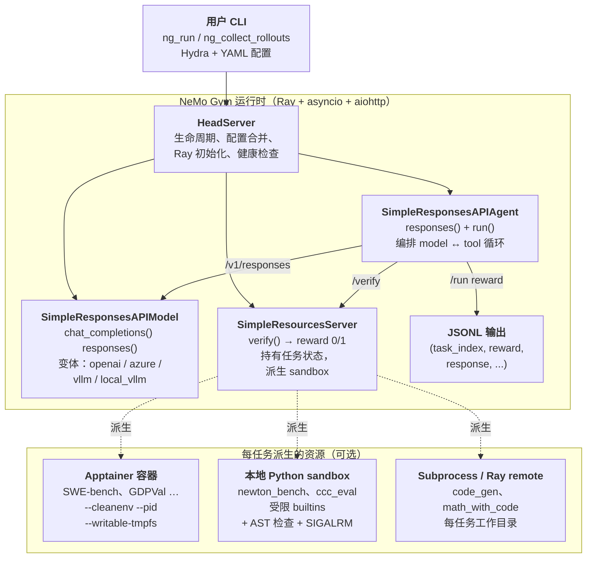
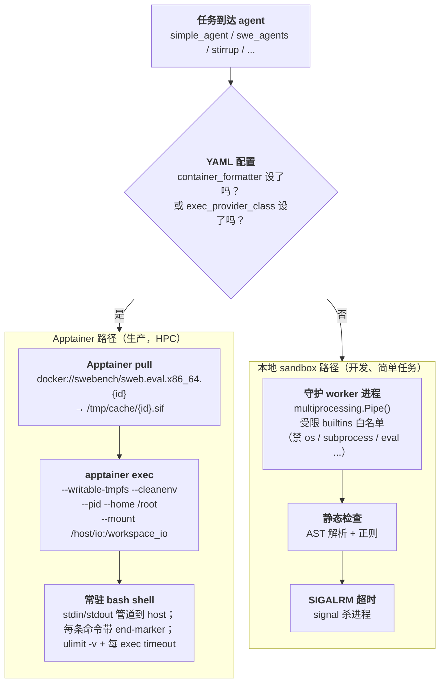

# NeMo Gym：NVIDIA 的 LLM RL 环境框架

> [!info] 项目元信息
> - **仓库**：[github.com/NVIDIA-NeMo/Gym](https://github.com/NVIDIA-NeMo/Gym) —— Apache-2.0
> - **文档**：[docs.nvidia.com/nemo/gym/latest](https://docs.nvidia.com/nemo/gym/latest/)
> - **生态位**：NVIDIA NeMo 平台的一部分（训练侧：NeMo RL；推理侧：Nemotron）
> - **状态**：早期开发中（API 仍在演进）。在 Nemotron 训练中已经实战。

---

## 摘要（2 分钟读完这一节就够）

**它是什么**。NeMo Gym 是 NVIDIA RL 训练栈的 **环境 / rollout 侧** —— 与 trainer 库（[[rl-training-frameworks|NeMo RL、VeRL、Unsloth]]）配对使用。你交给它一份任务数据集 + 一个 agent harness + 一个 verifier，它会起三个 FastAPI 微服务，按任意并发度在这些任务上跑你的 agent，给每条 rollout 打分，然后把 `(input, output, reward)` 三元组送给你的 trainer。

**核心思想**。**环境 = 数据集 + harness + verifier + state**，打包成 **三个独立 FastAPI 服务 + 稳定 HTTP 合约**。三个支撑次级声明：

1. **四组件拆分够用** —— 任何想叫 "RL post-training 环境" 的东西都能干净映射到 dataset（任务）+ harness（模型如何交互）+ verifier（如何打分）+ state（每任务执行上下文）。
2. **3-server 切分**（resources / model / agent）—— Verifier + state 住 *resources*，LLM 推理住 *model*，编排住 *agent*。各自独立扩展，YAML 里可换。
3. **HTTP + Hydra 合约** —— Trainer 用版本化 Pydantic schema 通过 HTTP 跟 HeadServer 对话；Ray、sandbox 生命周期、容器选型全部藏在合约后面。

去掉任何一个：verifier 代码就跟 harness 代码混；无法独立扩展 model 推理；trainer 跟 rollout 实现耦合。

**具体系统 / 生产部署**。在 **Nemotron** 训练里实战过（框架 README 自己写了）；[[on-policy-distillation#生产部署primary-source-验证|Nemotron-Cascade 2]]（2026-03，IMO / IOI / ICPC 金牌）的多 domain GRPO + MOPD 管线用 NeMo Gym。库里自带 **84 个 benchmark**、**19 个 agent harness**、**6 种 model server**；一等公民对接 [[rl-training-frameworks|NeMo RL]]（GRPO/DAPO）、VeRL、Unsloth。Agent 一侧的 rollout-driver 对应物是 [[prorl-agent]]。

**为什么这重要**。

- **Rollout 即服务把 trainer 跟环境解耦**。加 benchmark、改工具、换 sandbox 不动 RL 框架。换 trainer（VeRL ↔ NeMo RL ↔ Unsloth）就是改 config，不是 port 代码。
- **84-benchmark 目录是护城河**。任何人都能一周搭出架构；搭 84 个生产级集成要花年。战略价值在目录，不在 FastAPI 设计。
- **工程选择能省几个调试周末**。aiohttp 不 httpx（httpcore 在 16K+ 并发下 O(n²) 连接池挂死）、Apptainer 不 Docker（训练节点本身在 enroot 容器里）、Lustre 上 `RAY_TMPDIR=/tmp`（AF_UNIX 107-byte 限制）。规模化跑出来的细节。

---

# 深度部分（往下展开细节）

上面摘要是 executive 层。下面是给愿意细读架构和工程细节的人准备的。

## 背景：RL 环境为什么是它自己独立的基础设施问题

LLM 的 RL 后训练需要按高并发对当前策略生成 rollout，对每条 rollout 打分得到 reward，再把 reward 回传给 trainer。最朴素的做法 —— 调一个模型 API、在同一进程里跑 verifier 脚本、循环 —— 在生产规模上三个点上崩：

| 问题 | 怎么显现 | 代价 |
| ---- | -------- | ---- |
| **并发** | 现代 RL 训练每个训练步需要 **数千条并发 rollout** 才能喂饱 GPU | 单脚本驱动 16K+ 并发模型调用做不下来 |
| **有状态** | 代码任务需要工作目录 + 测试 harness；SWE-bench 需要整个 git 仓库；tool-use 任务需要跨轮次 session 状态 | Verifier 必须 *观察* 执行状态，不只是文本 —— 不能是纯函数 |
| **复用** | 同一个环境要服务评测、agent 优化、跨团队 RL 训练 | Per-use-case bespoke 集成攒不起来；环境必须是自包含服务 |

标准的"trainer 库捆绑环境"做法（TRL `make_env`、OpenRLHF runner）把环境代码耦合进 trainer 进程 —— 导致 (a) 跨 trainer 复用难、(b) 并发被 trainer event loop 卡住、(c) 共享内存里状态管理危险。NeMo Gym 的设计思路是 **把关切拆成独立的 FastAPI 服务、用稳定 HTTP 合约连接** —— 跟 2014 年微服务的论点同一个，应用在 RL rollout 上。

| 维度 | Trainer 捆绑（TRL、OpenRLHF） | NeMo Gym（微服务） |
| ---- | -------------------------- | ---------------- |
| 耦合 | 环境代码住 trainer 进程 | 三个 FastAPI 服务 via aiohttp 连接 |
| 并发扩展 | 被 trainer event loop 限 | 加副本就行 |
| 跨 trainer 复用 | 每个 trainer 重新实现 | 同一 HTTP 合约服务任意 trainer |
| 状态隔离 | 共享进程状态 | Per-server 状态，可独立重启 |
| 故障恢复 | Crash 杀整个 trainer | 服务 crash 独立隔离 |

## 系统架构

> [!quote] 一句话总结贡献
> **环境**（environment）是 agent 为完成任务而与之交互的完整系统 —— 数据集（任务）、harness（模型如何交互）、verifier（如何打分）、state（每任务执行上下文） —— 它的正确打包方式是 **三个独立 FastAPI 服务 + 稳定 HTTP 合约**。

端到端 loop：

```
data/example.jsonl  ─►  agent server  ─►  model server  ─►  agent server  ─►  resources server  ─►  reward
   (一行一个任务)        (跑 harness)     (LLM forward)     (解析输出)        (在 sandbox 里 verify)
```



图中三个结构性选择：

- **三种 server 都是 FastAPI 应用**，不是 Python 库 import —— 走 HTTP（aiohttp）。同一架构服务评测（一次性、一进程）和训练（多节点上数千条并发 rollout）。靠副本扩展，不靠多线程。
- **HeadServer 是指挥** —— 合并 config、起 Ray、启动子 server、暴露统一健康端点。你的 CLI 只跟 HeadServer 对话。
- **容器 / sandbox 在 resources server 内派生**，只有任务需要隔离执行时才派生。多数 benchmark（MCQA、judge-based）根本不要 sandbox；SWE-bench / GDPVal / Newton Bench 才需要。

## 三种 server 详解

### Resources server —— Verifier 那一侧

每个实现 `verify()`：

```python
class MyBenchmarkServer(SimpleResourcesServer):
    async def verify(self, request: VerifyRequest) -> VerifyResponse:
        output_text = request.output_text
        metadata = request.verifier_metadata  # 不透明字典
        score = check_answer(output_text, metadata)
        return VerifyResponse(reward=1.0 if score else 0.0)
```

`verifier_metadata` 字典 **对框架不透明** —— 你想塞什么字段就塞什么（测试用例、标准答案、task id、gold patch、隐藏测试输入），框架原样从 JSONL 行管道到你的 `verify()`。仓库自带 **84 个 resources server**。

> [!note]- 84 个 benchmark 按类别（参考资料 —— 不做调研可跳过）
>
> | 类别 | 示例 |
> | ---- | ---- |
> | 代码生成 | `code_gen`、`bigcodebench`、`evalplus`、`competitive_coding_challenges`、`code_fim` |
> | SWE / 仓库级 | `swerl_gen`、`swerl_llm_judge` |
> | 数学与形式推理 | `math_with_code`、`math_with_judge`、`math_formal_lean`、`imo_proofbench_judge`、`polymath` |
> | 科学 Q&A | `gpqa_diamond`、`mcqa`、`ugphysics_judge`、`frontierscience_judge` |
> | 长上下文 / 检索 | `ruler`、`mrcr`、`hotpotqa_qa`、`aalcr` |
> | 工具使用与 agent | `tavily_search`、`google_search`、`xlam_fc`、`ns_tools` |
> | 安全 / 对齐 | `jailbreak_detection`、`indirect_prompt_injection`、`over_refusal_detection`、`xstest`、`abstention` |
> | 结构化输出 | `format_verification`、`structured_outputs`、`structeval`、`ifbench` |
> | 视觉 / 多模态 | `labbench2_vlm`、`vlm_eval_kit`、`gdpval` |
> | SQL 与数据 | `bird_sql`、`spider2_lite`、`text_to_sql` |
> | 领域 | `rdkit_chemistry`、`ether0`、`finance_sec_search`、`cvdp` |
> | RL 环境（Gym 风格） | `gymnasium`、`grl_sokoban`、`grl_tetris`、`blackjack` |
> | 外部库桥接 | `aviary`、`openenv`、`reasoning_gym`、`arc_agi` |

### Response API model —— LLM 那一侧

暴露 OpenAI 兼容端点的薄包装。6 种：

| Server | 后端 |
| ------ | ---- |
| `openai_model` | OpenAI 公网 API 或兼容端点 |
| `azure_openai_model` | Azure OpenAI 部署 |
| `vllm_model` | 远程 vLLM server（`/v1/chat/completions`） |
| `local_vllm_model` | HeadServer 启动时本机起 vLLM |
| `local_vllm_model_proxy` | 本地 vLLM 多副本上 round-robin |
| `genrm_model` | 生成式 reward model 变体 |

为什么单独抽 model 层：agent 代码后端无关。同一份 SWE-Agent harness 既能跑 GPT-5（用 `openai_model`），也能跑某个 Nemotron checkpoint（用 `vllm_model`），还能跑进程内 vLLM（用 `local_vllm_model`）—— agent 代码一字不改，只换 YAML。

### Response API agent —— Harness 那一侧

19 个自带 harness 覆盖从单次 QA 到 OpenHands 风格 SWE-bench：

> [!note]- 19 个 agent harness（参考资料 —— 不选型可跳过）
>
> | Harness | 干什么 |
> | ------- | ------ |
> | `simple_agent` | 一次模型调用，无工具。QA 风格 benchmark 的默认。 |
> | `proof_refinement_agent` | 多轮修正循环：模型看 verifier 报错再重试。 |
> | `swe_agents` | OpenHands 风格 SWE-bench harness（bash + 文件编辑工具，每任务一个容器）。 |
> | `mini_swe_agent` | 更轻量的 SWE harness。 |
> | `stirrup_agent` | 通用代码执行 harness，executor 可插拔（本地 sandbox / Apptainer）。 |
> | `langgraph_agent` | 把 LangGraph 定义的 agent 桥接进 Gym schema。 |
> | `verifiers_agent` | 桥接 `Verifiers` 库。 |
> | `aviary_agent` | 桥接 FutureHouse 的 Aviary 环境。 |
> | `harbor_agent` | HPC 集群上的 Singularity 环境，容器内跑 FastAPI。 |
> | `gymnasium_agent` | 经典 Gym/Gymnasium 环境（Sokoban、Tetris、Blackjack）。 |
> | `browsecomp_agent` | 浏览网页类任务。 |
> | `tool_simulation_agent` | 模拟工具响应的 tool-use 评测。 |

> [!important] 多轮 agent 契约
> 多轮 agent 必须把以下两类东西沿调用链 *显式传下去*：**cookies**（`cookies=request.cookies` —— 有状态环境靠它标识 session）；每次模型响应里的 **token id 与 log-prob**（`prompt_token_ids`、`generation_token_ids`、`generation_log_probs`）—— trainer 下游算 advantage 要用。丢掉它们梯度就废。

## 容器与 sandbox 的故事

NeMo Gym 这块最容易被读错。两条互不相干的路径。

> [!warning] NeMo Gym 不直接用 Docker
> 生产隔离走 **Apptainer**。训练集群节点本身就跑在 enroot 容器里 —— Docker daemon 在 enroot 里嵌不起来 —— 所以 Apptainer 是唯一能套娃的方案。Apptainer *会消费* Docker 镜像（`docker://...` URI）但跑容器的是 Apptainer，不是 Docker。引用 `docs/infrastructure/engineering-notes/swe-rl-case-study.md`：*"Apptainer was the only containerization framework that we could run from within an enroot container."*



**Apptainer 路径**（生产 HPC）—— 用户：`swe_agents`、`stirrup_agent`（开启时）、`harbor_agent`。YAML：

```yaml
container_formatter: "docker://swebench/sweb.eval.x86_64.{instance_id}"
apptainer_memory_limit_mb: 32768
swebench_tests_timeout: 900
swebench_agent_timeout: 1800
command_exec_timeout: 300
```

容器内起一个长生命周期 `bash`；agent 通过 stdin 发命令，每条命令后跟独一无二的 end-marker echo 用来分隔输出。`ulimit -v` 限内存，`timeout` 限单条 exec 时间。整套编排在 `responses_api_agents/stirrup_agent/apptainer_provider.py`（~700 行）和 `responses_api_agents/swe_agents/app.py`（~2000 行）。

**本地 sandbox 路径**（开发 / 简单任务）—— 用户：`newton_bench`、`competitive_coding_challenges`、`stirrup_agent`（默认无容器配置时）。实现在 `resources_servers/newton_bench/newton_bench_utils/sandbox.py`：守护 worker 进程 via `multiprocessing.Pipe()`、受限 `__builtins__` 白名单（禁 `os`、`sys`、`subprocess`、`eval`、`exec`、`open`）、AST + 正则预检、`signal.SIGALRM` wall-clock 超时。不是真隔离 —— "限制 Python 能做什么，赌模型不会逃逸"。适合做纯函数正确性检查，不适合任意 shell。

**哪些不在容器里**：三种 NeMo Gym server 自己跑在 host（或 Ray worker）上的普通 Python 进程；多数 resources server 也不派生容器；CI 不建镜像 —— `.github/workflows/_build_container.yml` 转发到共享的 NVIDIA FW-CI 模板；NeMo Gym CI 只跑 `pytest`。

> [!warning] 别把"用 Docker 镜像"和"用 Docker"搞混
> NeMo Gym 配置里到处是 `docker://...` URI。这是 **Apptainer 从 Docker Hub 拉镜像**，不是 Docker daemon 执行。任何 NeMo Gym 部署里都没有 `docker` 进程。搞错了你会在 HPC 节点上浪费一下午装 Docker —— 那里根本装不上。

## 分布式执行与工程选择

### Ray

```python
@ray.remote(
    scheduling_strategy="SPREAD",
    runtime_env={"py_executable": sys.executable},
)
def run_agent_remote(params: dict[str, Any]) -> Any:
    ...
```

两种模式：**agent 级 Ray remote**（每条任务一个 Ray task，可能落不同节点，task 内部再派生 Apptainer）；**subprocess 级 Ray remote**（resources server `verify()` 把代码执行委托给 Ray remote，`await future`）。异步代码里：**永远** `await future` 直接等。**别** 在异步上下文里直接调 `ray.get()` —— 会阻塞 event loop。

> [!warning] Lustre Ray socket 路径坑
> 工作目录路径过长（NVIDIA 集群上的 Lustre 挂载）时，Ray AF_UNIX socket 路径超过 Linux 107-byte 限制，`ray.init()` 报错莫名其妙。解法：跑前 `RAY_TMPDIR=/tmp`。`ng_test` 派生隔离 venv，Python 里写 `os.environ` 不会传过去 —— 必须外部设（`RAY_TMPDIR=/tmp ng_test ...`）。

### 非显然的工程选择，已经踩过坑

| 规则 | 为什么 |
| ---- | ------ |
| **用 aiohttp，不用 httpx** | 16K+ 并发下 httpx/httpcore 的连接池是 O(n²) 复杂度，会挂死。所有异步 HTTP 必须走 `nemo_gym.server_utils.request()`。见 `docs/infrastructure/engineering-notes/aiohttp-vs-httpx.md`。 |
| **所有 `/run` 端点必须 async** | 同步端点把 trainer 的 rollout 收集串行化。 |
| **`asyncio.Semaphore` 给并发 subprocess 设上限** | 否则 4K–65K 并发 rollout 会耗尽 file descriptor。 |
| **subprocess 输出用 `errors="replace"` 解码** | 模型输出很少是纯净 UTF-8。 |
| **嵌套可选字段加护栏**：`(body.field or {}).get("key", default)` | Agent 经常拿到部分响应。 |
| **配置走 Hydra 不走环境变量** | 可复现、单节点跑多实例、审计。唯一合法环境变量是 `RAY_TMPDIR`（前述 Lustre 坑）。 |
| **钉 `openai<=2.6.1`** | Schema 兼容。别引 LiteLLM / Anthropic SDK / 其它客户端。用 `nemo_gym/openai_utils.py`。 |
| **外部工具自动安装** | `setup_<tool>.py` 加 `ensure_<tool>()`，在 `model_post_init()` 里调；`conftest.py` 加 `pytest_configure` 钩子让 `skipif` marker 看见装好的工具。 |

## 配置与数据

### Hydra + YAML

每个 server 实例是一个顶层 key：

```yaml
my_benchmark_server:
  resources_servers:
    my_benchmark:
      entrypoint: app.py
      domain: coding
      verified: false

my_agent_instance:
  responses_api_agents:
    simple_agent:
      entrypoint: app.py
      resources_server:
        type: resources_servers
        name: my_benchmark
      model_server:
        type: responses_api_models
        name: policy_model
      datasets:
      - name: my_dataset
        type: train
        jsonl_fpath: path/to/data.jsonl
        gitlab_identifier:
          dataset_name: my_benchmark
          version: 0.0.1
        license: MIT
```

模型端点凭据放在项目根目录的 `env.yaml`（per-user，不进 server config）。

### JSONL schema 与数据集等级

```json
{
  "responses_create_params": {
    "input": [
      {"role": "system", "content": "..."},
      {"role": "user", "content": "..."}
    ]
  },
  "verifier_metadata": {"task_id": "...", "test_cases": [...]}
}
```

| 等级 | 住哪儿 | 什么时候用 |
| ---- | ------ | --------- |
| `example` | `data/example.jsonl` —— 5 条，进 git | 冒烟测试、CI、演示 |
| `train` | GitLab MLflow 仓（**不** 进 git） | RL 训练 rollout |
| `validation` | GitLab MLflow 仓（**不** 进 git） | held-out 评测 |

## 具体系统与生产部署

框架页的 "Experiments" 槽 —— 验证过的部署和集成。

### NVIDIA 内部

**Nemotron 训练里实战过**。框架 README 自己写了；[[on-policy-distillation#生产部署primary-source-验证|Nemotron-Cascade 2]] 的多 domain GRPO + MOPD 管线（2026-03，IMO / IOI / ICPC 金牌）用 NeMo Gym。

### 集成的 trainer（Gym rollout 的消费者）

| Trainer | 集成 | 来源 |
| ------- | ---- | ---- |
| [[rl-training-frameworks\|NeMo RL]] | 一等公民 —— GRPO / DAPO via Gym rollout | [Tutorial](https://docs.nvidia.com/nemo/gym/latest/training-tutorials/nemo-rl-grpo/index.html) |
| veRL | 一等公民 | [Tutorial](https://docs.nvidia.com/nemo/gym/latest/training-tutorials/verl.html) |
| Unsloth | 一等公民 | [Tutorial](https://docs.nvidia.com/nemo/gym/latest/training-tutorials/unsloth-training.html) |

### 集成的环境库与 harness

| 库 / harness | 在哪 |
| ------------ | ---- |
| Aviary (FutureHouse) | `resources_servers/aviary` |
| Harbor | `responses_api_agents/harbor_agent` |
| OpenEnv | `resources_servers/openenv` |
| Reasoning Gym | `resources_servers/reasoning_gym` |
| Verifiers | `responses_api_agents/verifiers_agent` |
| OpenHands | `responses_api_agents/swe_agents` |
| Mini SWE Agent | `responses_api_agents/mini_swe_agent` |
| LangGraph | `responses_api_agents/langgraph_agent` |

### 在更大栈里的位置

```
┌──────────────────────────────────────────────────────────────────────┐
│  Trainer 一侧                                                         │
│   • NeMo RL (GRPO / DAPO)        ─┐                                  │
│   • VeRL                          ├─► rollout 请求 ─► NeMo Gym       │
│   • Unsloth                       │                                  │
│   • TRL                          ─┘   reward + token id ◄──          │
└──────────────────────────────────────────────────────────────────────┘
                                       │
                                       ▼
┌──────────────────────────────────────────────────────────────────────┐
│  NeMo Gym（本页）                                                     │
│   • 84 个 benchmark / 19 个 harness / 6 种 model server 后端          │
│   • Hydra 配置、Ray 分布、aiohttp HTTP                                │
│   • Apptainer 跑危险代码、本地 sandbox 跑安全代码                      │
└──────────────────────────────────────────────────────────────────────┘
                                       │
                                       ▼
┌──────────────────────────────────────────────────────────────────────┐
│  Model 一侧                                                          │
│   • vLLM / SGLang / TensorRT-LLM（本地、多节点）                      │
│   • 托管：OpenAI、Azure、Fireworks、OpenRouter …                      │
└──────────────────────────────────────────────────────────────────────┘
```

## 优势与限制

最强两点：(1) **覆盖广** —— 自带 84 个 benchmark + 19 个 harness + 6 种 model 后端在学术风格 RL 库里很罕见；(2) **架构契合规模** —— FastAPI + aiohttp + Ray + Apptainer 这一套是 "Slurm 集群上数千并发 rollout" 的正解，工程选择（`aiohttp-vs-httpx`、Lustre 坑）那种能省几个周末的调试。

诚实承认的限制：

- **早期开发**。API 会变；下游集成最好钉 commit。
- **多数 benchmark 仅限 Linux**。macOS / Windows 只能开发用。
- **GitLab 数据集仓是 NVIDIA 内部的**。外部用户能 fallback 到 HuggingFace，但主路径假设 NVIDIA 的 GitLab + MLflow。
- **pre-commit hook 会自动改文件**。新贡献者经常踩 "hook 改了文件，commit 失败" —— `add-verified-flag` 和 `update-readme-table` 会重写 YAML 和 README；重新 `git add` 再 commit 就好。
- **SWE 风格任务依赖 Apptainer**。在没有 Apptainer 的平台上得先装（`apt-get install -y apptainer` 在新版 Ubuntu 上可以），或者回落到本地 sandbox —— 但 sandbox 跑不了真的 SWE-bench。
- **测试隔离很重**。`ng_test` 每个 server 起一个新 venv —— 依赖隔离对，但第一次跑慢。`skip_venv_if_present` 用于迭代。
- **文档落后于代码**。仓库里 ~84 个 benchmark；公开文档只深入讲了少数几个。其它的合同就是源代码 README + 测试。

## 启示

两条值得跟踪的预测：

1. **"rollout 即服务"模式会扩散**。一旦把 rollout 和训练通过稳定 HTTP 合约解耦，换 trainer 就从重新移植变成改配置。预期开源 RL 框架（OpenRLHF、TRL）会加类似的服务层集成 —— 可能直接消费 Gym 的 HTTP API。
2. **84-benchmark 表面是护城河**。任何人都能一周搭出 3-server FastAPI 架构；搭 84 个生产级 benchmark 集成要花年。NeMo Gym 的战略位置 *不是* 架构，而是目录。

这 *不是*：通用 agent 平台（harness 合约是 RL-rollout-shaped 不是 chat-shaped），也不是 trainer 库替代品（Gym 做 rollout 不算梯度），也不是托管服务（自己跑）。

## 源码与复现

```bash
# 1. clone、起 venv（需要 uv）。
git clone git@github.com:NVIDIA-NeMo/Gym.git && cd Gym
uv venv --python 3.12 && source .venv/bin/activate
uv sync

# 2. 配置一个模型端点。
cat > env.yaml <<'EOF'
policy_base_url: https://api.openai.com/v1
policy_api_key: sk-...
policy_model_name: gpt-4.1-2025-04-14
EOF

# 3. 起 server，跑自带的 MCQA 环境。
ng_run "+config_paths=[resources_servers/mcqa/configs/mcqa.yaml,
                       responses_api_models/openai_model/configs/openai_model.yaml]"

# 4. 另开一个终端：用 example 数据每题跑 5 条 rollout。
ng_collect_rollouts +agent_name=simple_agent \
                    +input_jsonl_fpath=resources_servers/mcqa/data/example.jsonl \
                    +output_jsonl_fpath=results/rollouts.jsonl \
                    +num_repeats=5

# 5. 打分（per-task 通过率）。
ng_reward_profile +input_jsonl_fpath=resources_servers/mcqa/data/example.jsonl \
                  +rollouts_jsonl_fpath=results/rollouts.jsonl \
                  +output_jsonl_fpath=results/profiled.jsonl \
                  +pass_threshold=1.0
```

跑 SWE-bench：把 `mcqa` 换成 `swe_agents` 配置、给 JSONL 真实 instance ID —— 还要保证 `apptainer` 在 `PATH` 上。

按顺序值得先读的文件：

| 文件 | 角色 |
| ---- | ---- |
| `CLAUDE.md` | 架构摘要权威版。 |
| `nemo_gym/cli.py` | 所有 `ng_*` CLI 命令；Hydra 怎么组合配置。 |
| `nemo_gym/base_resources_server.py` + `base_responses_api_model.py` + `base_responses_api_agent.py` | 三种基类。你写任何 benchmark 都是继承其中之一。 |
| `resources_servers/example_single_tool_call/` | 最简端到端示例。当模板用。 |
| `responses_api_agents/stirrup_agent/apptainer_provider.py` | 仓库里最复杂的容器编排。 |
| `responses_api_agents/swe_agents/app.py` | 真实 SWE-bench harness；多 dataset 支持、Apptainer + Ray 组合。 |
| `docs/infrastructure/engineering-notes/aiohttp-vs-httpx.md` | HTTP 栈选型的"为什么"。能省一个调试周末。 |
| `docs/infrastructure/engineering-notes/swe-rl-case-study.md` | 为什么 Apptainer、部署拓扑、CPU 容量估算。 |

## 相关阅读

- [[prorl-agent]] —— Rollout-driver 在 agent 一侧的对应物，同样来自 NVIDIA。NeMo Gym 是*环境层*（84 benchmark + 19 harness、OpenAI 风格 text wire 协议）；ProRL Agent 是 *rollout 驱动层*（`POST /process` token-in/token-out 保证 off-policy 信号正确）。完整对比 —— 共同点、轴对轴差异、组合方式、重叠之处 —— 见 [[prorl-agent#ProRL Agent vs NeMo Gym —— 同族、不同层]]。
- [[environment-design]] —— 什么样的 RL 环境对 LLM 来说算好？
- [[rl-training-frameworks]] —— 消费 NeMo Gym rollout 的 trainer 一侧。
- [[grpo]] / [[ppo-for-llm]] / [[rlhf-overview]] —— 驱动对环境需求的 RL 算法。
- [[on-policy-distillation]] / [[deepseek-v4-opd]] —— OPD 管线也是 rollout 密集；NeMo Gym 容纳它们。
- [[das-spec-rl]] —— rollout 阶段的投机解码加速；在 model server 层互补。
- [[vllm]] / [[sglang]] —— NeMo Gym 的 model server 包装的推理引擎。
- [[multi-step-reasoning-rl]] —— NeMo Gym 多轮 agent harness 支持的训练形式。

## 参考文献

- **仓库**：[NVIDIA-NeMo/Gym](https://github.com/NVIDIA-NeMo/Gym)
- **公开文档**：[docs.nvidia.com/nemo/gym/latest](https://docs.nvidia.com/nemo/gym/latest/)
- **生态页**：[docs.nvidia.com/nemo/gym/latest/about/ecosystem.html](https://docs.nvidia.com/nemo/gym/latest/about/ecosystem.html)
- **内部工程笔记**：`docs/infrastructure/engineering-notes/`（aiohttp vs httpx；SWE-RL case study）
- **Nemotron-Cascade 2**（生产部署）：[research.nvidia.com/labs/nemotron/nemotron-cascade-2](https://research.nvidia.com/labs/nemotron/nemotron-cascade-2/)
