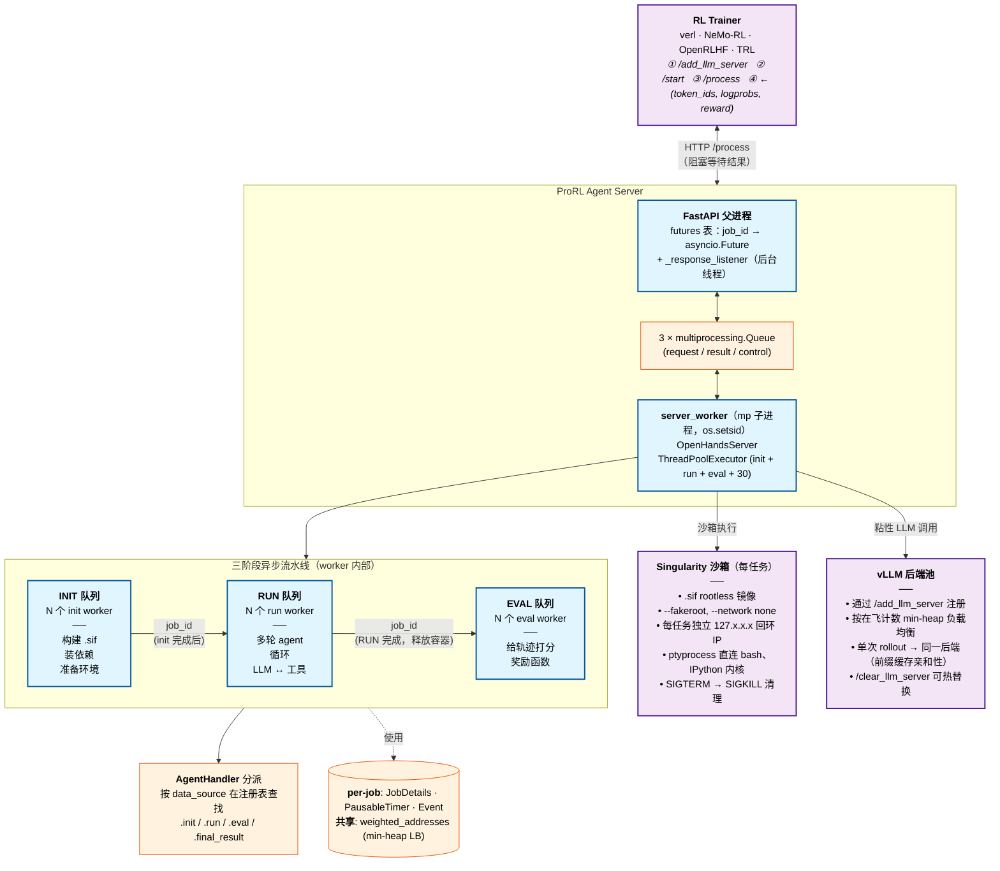

# ProRL Agent：面向多轮智能体 RL 的 Rollout-as-a-Service

> [!info] 论文元信息
> - **论文**：[arXiv:2603.18815](https://arxiv.org/abs/2603.18815) — NVIDIA, 2026 年 3 月
> - **代码**：[NVIDIA-NeMo/ProRL-Agent-Server](https://github.com/NVIDIA-NeMo/ProRL-Agent-Server)（分支 `stable`，Apache-2.0）
> - **作者**：Hao Zhang, Mingjie Liu, Shaokun Zhang, Songyang Han, Jian Hu, Zhenghui Jin, Yuchi Zhang, Shizhe Diao, Ximing Lu, Binfeng Xu, Zhiding Yu, Jan Kautz, Yi Dong

> [!abstract]+ TL;DR
> ProRL Agent 把 **rollout** —— 在环境中运行多轮智能体并产出轨迹的过程 —— 做成一个独立的 HTTP 服务，任何 RL trainer 都可以消费。服务端（FastAPI 父进程 + 持有三个异步 worker pool 的 multiprocessing 子进程）负责容器生命周期、多轮 agent 循环、工具执行、奖励计算；trainer 只需发送 `POST /process` 请求并接收 `(token_ids, logprobs, reward)` 元组。在 SWE-Bench Verified 上由此构成的 RL 训练循环把 Qwen3-4B/8B/14B 的 Pass@1 提升 **6–8 个百分点**，8B 结果约为 SkyRL-Agent-8B-v0 的**两倍**。

---

## 背景：为什么智能体 RL 的基础设施是一个独立的问题

用 RL 训练 LLM 智能体涉及两种形态根本不同的工作负载：

|              | Rollout                                                | Training                                |
| ------------ | ------------------------------------------------------ | --------------------------------------- |
| 资源         | I/O bound：沙箱启动、多轮循环、异步工具执行             | GPU bound：前向反向、梯度同步             |
| 时间尺度     | 每 episode 数秒至数分钟（方差由工具 I/O 主导）           | 每步十数毫秒                              |
| 失败模式     | 容器崩溃、网络超时、工具错误                             | OOM、NaN、NCCL 卡死                      |
| 适配硬件     | 多个 CPU + 沙箱节点                                     | 少量大型 8×GPU 节点                       |

现有智能体 RL 框架 —— SkyRL-Agent、VeRL-Tool、Agent Lightning、rLLM、GEM —— 都把两种工作负载放在 **trainer 进程内部**：协程式 rollout、内存中的环境对象、嵌入式 agent loop + 卸载工具。这种紧耦合带来三个具体问题：（1）突发 rollout 破坏训练缓存局部性，挤占推理时隙；（2）切换 trainer（如 veRL → NeMo-RL）必须重新移植 agent loop 与沙箱；（3）智能体的任何改进（新工具、新记忆模块）都得从 trainer 一侧推进。

ProRL Agent 的回应是 Web 系统圈很熟悉的一招：**用稳定的 HTTP 契约把关注点拆成独立服务。** 这是 2014 年催生微服务的同一论证。非平凡的主张是：**这套范式即便在延迟敏感的 RL 内循环里也成立。**

| 框架               | 训练-Rollout 解耦  | 无 root 沙箱  | Scaffold 独立  |
| ------------------ | ------------------ | ------------- | -------------- |
| SkyRL-Agent        | ✗                  | ✗             | ✓              |
| VeRL-Tool          | ✗                  | ✗             | ✓              |
| Agent Lightning    | ✗                  | ✗             | ✗              |
| rLLM               | ✗                  | ✗             | ✓              |
| GEM                | ✗                  | ✗             | ✓              |
| **ProRL Agent**    | **✓**              | **✓**         | **✓**          |

"无 root 沙箱"那一列是部署侧的现实主义贡献 —— 让前一列在科研所用的共享 HPC 集群上**真的能跑**。

> [!question]+ Shiki — 名词表：scaffold / 稳定 HTTP 契约 / rootless 沙箱 (2026-05-08)
>
> 本节出现的三个跨智能体 RL 文献的术语，论文的论证都建立在这些定义之上，值得把每个讲精确。
>
> **Scaffold（脚手架）**—— 在智能体 RL 语境里，*scaffold* 指 LLM 的 `model.generate()` 调用与用户任务之间的全部应用层逻辑：agent loop（ReAct、plan-and-execute）、工具定义、prompt 模板、记忆管理、工具调用解析、重试逻辑等。它是把"模型输出文本"变成"环境中的动作"的应用层。ProRL 的"scaffold 独立"那一列意思是：rollout server 的 HTTP API 不绑定任何具体 scaffold —— 你可以接 OpenHands 的 CodeAct、自家的 ReAct loop、或别的实现，只要实现了 [[#AgentHandler 插件接口|`AgentHandler`]] 接口。其他智能体 RL 框架把具体的 scaffold 焊死在 trainer 进程里；切换 scaffold 等于重构 trainer。
>
> **稳定的 HTTP 契约**—— 一个**版本化、定义明确**的 HTTP API，请求/响应模式固定且文档化（这里通过 Pydantic 模型如 `ProcessRequest`）。"稳定"意思是：(1) 模式不会以不兼容的方式破坏，除非显式版本协商；(2) 不同版本的 trainer 与 server 可互通。这是两个进程之间**唯一的耦合点** —— 任何时候一个团队可以重写 server、换一种语言实现、跨机器迁移，trainer 都不需要关心，只要 `POST /process` 仍然接受 `ProcessRequest` 并返回 `(token_ids, logprobs, reward)`。这正是 2014 年微服务模式的工作原理；ProRL 的非平凡主张是：在延迟敏感的 RL 内循环里这套也成立。
>
> **Rootless 沙箱**—— 完全以非特权用户运行的容器/沙箱 —— 整条链路上不需要 root。Docker 出名地**不是** rootless：它需要一个以 root 身份运行的 daemon（或 `docker` 组成员资格，在 Linux 上等价于 root）。在 Slurm 管理的 HPC 集群上你没有 root 也没有 Docker daemon —— Docker 根本跑不起来。**Singularity**（现称 **Apptainer**）专为这个场景设计：容器在用户空间通过 user namespace 执行，`--fakeroot` 在容器*内部*提供"root 的表象"而*不*在容器*外部*真正提权。ProRL Agent 使用 Singularity 镜像文件（`.sif`），因此可以部署在与训练基础设施同一组共享 HPC 集群上。"Rootless" 才是"在生产研究集群上真的能部署"的解锁条件 —— 任何依赖 Docker daemon 的服务框架在那种环境下根本无法启动。

---

## 核心思想：Rollout-as-a-Service

> [!quote] 一句话贡献
> 把智能体 rollout 做成一个有 typed `POST /process` 端点的 HTTP 服务，输出 `(token_ids, logprobs, reward)` 元组，供任何 RL trainer 消费。

支撑这一思想需要三个子 idea：

- **Token-in / Token-out 线协议** —— trainer 与 server 共享同一份规范化 token 序列，避免跨轮 re-tokenization 漂移。
- **三阶段异步流水线**（INIT → RUN → EVAL），每阶段独立 worker pool，不同阶段任务互不阻塞。
- **rootless HPC 兼容沙箱**（Singularity + 非特权用户 + 每任务独立回环 IP），让系统**真的能在 Slurm 集群上部署**。

去掉任意一个：系统要么 off-policy 不稳（无 token-in/out），要么吞吐受限（无流水线），要么无法部署（无 rootless 沙箱）。

---

## 系统是如何工作的

### 系统架构

下面这张图使用 Mermaid（Obsidian 与 GitHub 都原生渲染）。它展示了 FastAPI 父进程 / multiprocessing 子进程的拆分、worker 内部的三阶段流水线、AgentHandler 分派、以及两个外部资源（沙箱 + vLLM 池）。



**怎么读这张图：** trainer 只通过 HTTP API 与 server 通信（顶端）；server 内部 FastAPI 只是一个薄父进程，通过 `multiprocessing.Queue` 把请求转发给真正干活的子进程；子进程跑三个队列各自独立的 worker 池，通过 `AgentHandler` 分派，最后接到两个外部资源（每任务的沙箱 + 负载均衡的 vLLM 池）。

### HTTP API

线协议是几个用 Pydantic 校验的端点（`openhands/nvidia/utils.py`）：

```python
class ProcessRequest(BaseModel):
    instance: dict[str, Any]          # 任务定义（data_source、instance_id 等）
    sampling_params: dict[str, Any]   # model、temperature、top_p、max_tokens 等
    job_id: str | None = None         # 客户端可选自带 id（否则服务端 hash 生成）

class CancelRequest(BaseModel):
    job_id: str

class LLMServerRequest(BaseModel):
    address: str                      # 要注册的 vLLM 端点 URL
```

| 端点                    | Body                | 用途                                                                          |
| ----------------------- | ------------------- | ----------------------------------------------------------------------------- |
| `POST /process`         | `ProcessRequest`    | 提交 rollout；阻塞至 `(token_ids, logprobs, reward, timing)` 就绪              |
| `POST /cancel`          | `CancelRequest`     | 按 id 中断在飞任务                                                              |
| `POST /add_llm_server`  | `LLMServerRequest`  | 把 vLLM 端点注册进负载均衡 min-heap                                             |
| `POST /clear_llm_server`| —                   | 清空所有后端（checkpoint 更新时使用）                                            |
| `GET /status`           | —                   | 队列深度、server-running 标志                                                    |
| `POST /start /stop`     | —                   | 子进程 server worker 的生命周期控制                                              |

### 三阶段异步流水线

`OpenHandsServer.__init__`（`openhands/nvidia/async_server.py`）为每个阶段配置一条队列：

```python
self.init_queue: queue.Queue[str] = queue.Queue()
self.run_queue:  queue.Queue[str] = queue.Queue()
self.evaluate_queue: queue.Queue[str] = queue.Queue()

self._active_init_jobs: set[str] = set()
self._active_run_jobs:  set[str] = set()
self._active_eval_jobs: set[str] = set()

# 三把独立的锁，而不是一把大锁 —— 粗粒度锁会把阶段串行化。
self._state_lock        = threading.RLock()
self._job_details_lock  = threading.RLock()
self._address_lock      = threading.RLock()

# 用于 vLLM 负载均衡的 min-heap，元素是 [in_flight_count, address]。
self.weighted_addresses = [[0, addr] for addr in llm_server_addresses]
heapq.heapify(self.weighted_addresses)
```

`start()` 把三种 worker 提交到**同一个** `ThreadPoolExecutor`：

```python
self._executor = ThreadPoolExecutor(
    max_workers=self.max_init_workers + self.max_run_workers + self.max_eval_workers
)
for i in range(self.max_init_workers):
    self._executor.submit(self._run_worker_in_thread, i, JobType.INIT)
for i in range(self.max_run_workers):
    self._executor.submit(self._run_worker_in_thread, i, JobType.RUN)
for i in range(self.max_eval_workers):
    self._executor.submit(self._run_worker_in_thread, i, JobType.EVAL)
```

每个 worker 跑一个统一的 `_worker(self, wid, job_type)` 协程，从对应队列取 job 并分派到注册的 handler：

```python
with phase_context(job_details.timer, function_type):   # 仅这段计入超时预算
    if job_type == JobType.INIT:
        runtime, metadata, config = await run_with_timeout_awareness(
            timer, init_coro, job_details
        )
        job_details.runtime = runtime
        self.run_queue.put(job_id)              # 推进到 RUN 阶段

    elif job_type == JobType.RUN:
        run_results = await run_with_timeout_awareness(timer, run_coro, job_details)
        job_details.run_results = run_results
        self._cleanup_job_runtime(job_details.runtime, job_id)  # EVAL 前释放容器
        self.evaluate_queue.put(job_id)         # 推进到 EVAL 阶段

    elif job_type == JobType.EVAL:
        eval_report = await run_with_timeout_awareness(timer, eval_coro, job_details)
        job_details.eval_results = eval_report.get('report', eval_report)
        job_details.event.set()                  # 唤醒阻塞中的 /process 调用方
```

> [!note] 只有读源码才会注意到的两个设计选择
> - **容器在 RUN 结束时释放，不是 EVAL 结束。** EVAL 通常在另一个测试沙箱里跑产出的 patch；保留 rollout 容器到 EVAL 结束是浪费内存。
> - **阶段间时间属于 `others` 阶段。** `phase_context` 是一个上下文管理器，在活跃阶段间切换计时；阶段间排队时间自动归入 `others` 并从超时预算中排除。否则负载抖动时的 worker 短缺会静默触发误超时，污染训练信号。

### `/process` —— 完整的任务生命周期

```python
def process(self, instance, sampling_params, job_id=None, timeout=300.0):
    # 1. 按 data_source 字段分派 handler（按键分发）。
    dataset_type = instance.get('data_source', 'swebench')
    if not is_registered_handler(dataset_type, reasoning=is_reasoning_task):
        raise FunctionNotRegisteredError(...)

    # 2. 用阶段感知计时器构造 job 状态。
    job_details = JobDetails(
        job_id=job_id or self.get_unique_id(instance),
        instance=instance, is_reasoning_task=is_reasoning_task,
    )
    job_details.timer = PausableTimer(timeout=timeout); job_details.timer.start()

    # 3. 通过 min-heap 分配 vLLM 后端（见负载均衡）。
    job_details.llm_config = self.create_llm_config(sampling_params)
    job_details.event = threading.Event()
    self._job_details[job_id] = job_details

    # 4. 入 INIT 队列；阻塞在完成 Event 上。
    self.init_queue.put(job_id)
    job_details.event.wait()

    # 5. 通过 handler 的 final_result 聚合 + 时间分解。
    result = get_registered_functions('final_result', dataset_type, ...)(job_details)
    result['timing'] = job_details.timer.get_timing_info()
    return result
```

`PausableTimer.get_timing_info()` 返回 `{init, run, eval, others, total}`，trainer 因此可以做延迟归因。

### AgentHandler：插件接口

任务相关逻辑通过抽象基类插入（`openhands/nvidia/registry.py`）：

```python
class AgentHandler(ABC):
    @property
    @abstractmethod
    def name(self) -> str: ...                                    # 分派键

    @abstractmethod
    async def init(self, job_details: JobDetails, sid: str | None = None
                  ) -> tuple[Runtime, EvalMetadata, OpenHandsConfig]: ...

    @abstractmethod
    async def run(self, job_details: JobDetails, sid: str | None = None
                 ) -> dict[str, object]: ...                      # 轨迹 + artifacts

    @abstractmethod
    async def eval(self, job_details: JobDetails, sid: str | None = None,
                   allow_skip: bool = True, reward: Optional[Reward] = None
                  ) -> dict[str, Any]: ...                        # 奖励信号

    @abstractmethod
    def init_exception(self, job_details, exc) -> dict[str, Any]: ...
    @abstractmethod
    def run_exception(self,  job_details, exc) -> dict[str, Any]: ...
    @abstractmethod
    def eval_exception(self, job_details, exc) -> dict[str, Any]: ...

    @abstractmethod
    def final_result(self, job_details: JobDetails) -> dict[str, Any]: ...
```

一次 rollout 的共享可变状态被装进一个 dataclass —— 每个 handler 方法都接收并就地修改它：

```python
@dataclass
class JobDetails:
    job_id: str | None = None
    instance: dict | None = None
    agent_config: dict = field(default_factory=lambda: _DEFAULT_AGENT_CONFIG.copy())
    llm_config: LLMConfig | None = None
    runtime: Runtime | None = None
    metadata: EvalMetadata | None = None
    config: OpenHandsConfig | None = None
    agent: CodeActAgent | None = None        # 用于中间结果检查
    controller: AgentController | None = None
    run_results: dict | None = None
    eval_results: dict | None = None
    results: dict | None = None
    event: threading.Event | None = None
    timeout_error: bool = False
    timer: Optional['PausableTimer'] = None
    current_task: Optional[asyncio.Task] = None
    is_reasoning_task: bool = False
```

注册是按 handler `.name` 为键的扁平 dict，每个 handler 注册七个回调（每个抽象方法一个）：

```python
def register_agent_handler(handler: AgentHandler, reasoning=False):
    registries['init'][handler.name]            = handler.init
    registries['run'][handler.name]             = handler.run
    registries['eval'][handler.name]            = handler.eval
    registries['init_exception'][handler.name]  = handler.init_exception
    registries['run_exception'][handler.name]   = handler.run_exception
    registries['eval_exception'][handler.name]  = handler.eval_exception
    registries['final_result'][handler.name]    = handler.final_result
    name_mapping[handler.name] = handler.name
```

另有一份独立的 `_registries_reasoning` 注册表用于推理类任务（math、STEM），所以单次部署可以同时服务 code-agent 与 reasoning-agent 两类负载。仓库自带 SWE-Gym、R2E-Gym、SWE-Bench、math、STEM、code 的 handler。

### Token-in / Token-out（多数论文都没做对的部分）

多轮 RL 有一个沉默的杀手：**re-tokenization 漂移**。在第 $t$ 轮，LLM 用自己的 chat template 与空格规则采样回复 ID。如果客户端只记录解码后的文本，并在第 $t + 1$ 轮重建完整历史，任何细微的格式变化（system/tool 前缀、空格、XML 函数调用包装）都会让整段对话被重新分词。Actor 与 Reference 不再共享 token 边界；per-token logprob 错位；KL/熵 可能炸到 NaN；PPO/GRPO 更新崩盘。

ProRL 的修正是让 token IDs 成为整个训练流程的规范表示。轨迹中每条消息携带四个额外字段，trainer 直接消费（`openhands/nvidia/utils.py:process_messages_from_agent_state`）：

```python
new_message['token_ids']          = output_ids                            # 实际生成的 token
new_message['repetition_penalty'] = ngram_repetition_reward(output_ids).tolist()
new_message['input_ids']          = input_ids                             # 采样时的上下文 ids
new_message['logprobs']           = logprobs                              # 采样时的 per-token logprobs
```

如果 `output_ids` 缺失（如合成的观察消息），系统会用自定义 Qwen3 chat template 进行 tokenize —— 这个模板**保留思考内容在 content 字段中**（Qwen3 默认模板在某些条件下会剥掉 `<think>` 块，会静默丢失推理轨迹）：

```python
new_message['token_ids'] = convert_messages_to_tokens(
    [new_message],
    tokenizer,
    chat_template=chat_template,           # qwen3_chat_template，定制变体
    add_generation_prompt=True,
    enable_thinking=enable_thinking,
    tools=tools,
)[0]
```

一个小但实用的奖励整形细节：`ngram_repetition_reward(output_ids, ngram_size=64, penalty=-0.001)` 在每个重复 64-gram 的起始位置施加 per-token 惩罚。它随 `token_ids` 一起返回 trainer，从而无需额外评估通道就能对退化循环施加 off-policy 安全的惩罚。

代码还显式处理一个边界情况：当 Qwen3 模型输出 `<think>\n` 紧接工具调用却从不闭合 `</think>` 时，HuggingFace tokenizer 会崩。Agent 的后处理把工具调用内容压回 `content` 字符串并补上 `</think>`，让规范 token IDs 仍可解析。这是那种"作者真的训过模型"才会写的细节 —— 同样的 bug 在其他 [[grpo|GRPO]] 训练发散报告里也被引用为根因。

> [!question]+ Shiki — token-in/token-out 是什么？为什么去掉之后 off-policy 不稳？(2026-05-08)
>
> Token-in/token-out 线协议把 `token_ids`（连同 `logprobs`、`input_ids`）作为整个训练流程中**规范的状态表示**，永远不用解码后的文本。server 在第 $t$ 轮采样回复时，返回的就是 vLLM 实际产出的 token ID 加上采样时的 per-token logprobs；第 $t+1$ 轮的 prompt 直接复用这些 ID，**绝不**再经过 tokenizer 重新编码。每条消息上的四个额外字段（`token_ids`、`input_ids`、`logprobs`、`repetition_penalty`）就是 trainer 直接消费的入口。
>
> 反过来如果你走 text-in/text-out（早期很多智能体 RL 框架就是这样），就会撞上 **re-tokenization 漂移**。server 记录第 $t$ 轮解码后的文本；第 $t+1$ 轮 trainer 把对话历史用 tokenizer 重新编码，但 chat template（system/tool 前缀、空格、XML 包装等）让产生的 token 序列和模型原本生成的 *不一样*。看上去字面相同的字符串，会因为前后文不同而被 tokenize 成不同的 ID。
>
> 对 off-policy 方法这是灾难性的。Actor 和 reference 现在对 token 边界的看法不一致；per-token logprobs 错位；重要性比率 $\pi_\theta(y_t \mid s_t) / \pi_\text{old}(y_t \mid s_t)$ 是在*"同一段文本"的不同 tokenization* 上计算的。KL 散度变得无意义甚至 NaN。PPO 的裁剪替代目标和 GRPO 的优势归一化都依赖于一个有定义的重要性比率 —— 一旦它崩了，梯度就是垃圾，几次迭代之内训练就发散。
>
> Token-in/out 通过构造直接消除了这个问题。整个训练流程中规范的状态就是当初采样出来的 token IDs —— 不存在解码再重新编码的步骤，因此**没有漂移的机会**。off-policy 方法保持有效，因为每一轮的 token 完全等于上一个策略生成的 token。这就是 SGLang fork 的 `openhands/llm/nvidia/qwen3.py` 故意操作 `prompt_ids` / `response_ids` 而不是解码后的字符串 `messages` 的原因 —— 也是内核 docstring 警告 *"KL/entropy 可能炸到 NaN"* 的根因。

### LLM 后端负载均衡

min-heap 实现就两行加一把锁。来自 `OpenHandsServer.create_llm_config`：

```python
def create_llm_config(self, sampling_params):
    with self._address_lock:
        if not self.weighted_addresses:
            raise ValueError('No LLM server addresses added')
        address = self.weighted_addresses[0][1]      # 取负载最轻的后端
        self.weighted_addresses[0][0] += 1           # 增加其在飞计数
        heapq.heapreplace(self.weighted_addresses,   # 用新权重重建堆
                          self.weighted_addresses[0])
    return LLMConfig(base_url=address, **sampling_params)
```

**一次 rollout 的整个调用序列绑定同一后端**（因为 `LLMConfig` 在每次 `/process` 时构造一次，并在多轮循环中复用），最大化该后端的前缀缓存命中（参见 [[kv-cache-optimization]]）。高负载后端在下次 pop 时自然降级。比 power-of-two-choices 简单 —— 因为单次调用成本主要由序列长度决定，而非后端瞬时慢速。

`add_llm_server_address` 与 `clear_llm_server_addresses`（由 `POST /add_llm_server` 与 `POST /clear_llm_server` 调用）支持热替换后端 —— 在 trainer 把新 checkpoint 推到 vLLM 并希望排空旧实例时很有用。

### Rootless HPC 沙箱（SingularityRuntime）

硬约束：系统必须以 Slurm 非特权用户身份运行 —— 没有 Docker daemon，没有 root。解法：

- **Singularity 镜像文件 (`.sif`)** —— 单文件、可移植容器镜像，对共享文件系统友好。
- `--fakeroot` 让容器内可装包；`--network none` 与外界隔离。
- **每任务独立回环 IP**：在 `127.x.x.x` 范围内由线程安全分配器分配 → 大规模下消除端口冲突。
- 每个容器作为独立 session 的子进程；SIGTERM → SIGKILL 升级清理。
- `SingularityRuntimeBuilder` 用 Jinja2 模板构建镜像，三档缓存：*Scratch*（重建）、*Versioned*（基础镜像/框架不变则复用）、*Lock*（依赖 lockfile 一致则复用）。

运行时由配置选择（`example.config.toml`）：

```toml
[core]
runtime          = "singularity"
run_as_openhands = false             # 不假定有 "openhands" 用户

[sandbox]
run_as_fakeroot       = true          # 在 .sif 内模拟 root
base_container_image  = "ubuntu:24.04"
# isolate_network     = false        # 启用更严格的网络隔离

[llm]
api_key  = "xxx"
base_url = "http://localhost:8000/v1"
model    = "hosted_vllm/Qwen3-1.7B"
```

`utils.py` 提供 `kill_all_singularity_jobs(exclude_pids)` 工具函数，使用 `pgrep -f apptainer` 与 `pgrep -f openhands` 清理训练运行间残留的孤儿沙箱进程 —— 粗糙但在共享集群上实用。

### 工具延迟：墙钟时间真正花在哪里

高并发下，工具延迟**压倒** LLM 推理成为瓶颈。三个具体优化：

| 工具    | 默认做法                    | ProRL 做法                  | 为什么                            |
| ------- | -------------------------- | --------------------------- | --------------------------------- |
| Bash    | tmux 会话路由               | `ptyprocess` 直连 PTY        | shell 往返 ~6× 快                 |
| IPython | 网络 Jupyter Gateway        | 进程内直连内核 API           | 省一次网络 hop                    |
| IPC     | TCP 回环                    | Unix 域套接字                | 更低延迟、无端口管理              |

这些不是新 research，是**正确的 engineering**。后面消融实验显示开启高效 bash 后单步 action 时间从 0.78 s 降到 0.42 s。

### 异步 DAPO 续填

[[grpo|DAPO]] 会过滤"零方差 prompt"（奖励均匀 → 零梯度）。朴素的批次过滤会同步浪费：rollout 一批，过滤，再 rollout 下一批。ProRL 用三个原语替换：

1. **持续续填** —— 队列空时立刻补。
2. **早停** —— 信息量足够的任务收齐就停（`POST /cancel` 配合 job ids）。
3. **跨迭代延续** —— 未完成的任务带到下一个训练迭代。

这不只是部署管道，是**对已发表 RL 算法的系统级延伸**。

### 服务端进程内部（FastAPI 父进程 + multiprocessing 子进程）

读 `scripts/start_server.py`：所谓"server"实际是 FastAPI 父进程 fork 出 `server_worker` 子进程持有 `OpenHandsServer` 实例。二者通过三个 `multiprocessing.Queue` 通信 —— `request_queue`、`job_result_queue`、`control_response_queue`。父进程持一张以 `job_id` 为键的 asyncio future 表；后台 `_response_listener` 线程消费 result queue 并 resolve future。

为何要两层：

- **崩溃隔离** —— 失控的 rollout（如容器 daemon 卡死、`apptainer` 僵尸）可被杀掉而不波及 FastAPI。
- **两层并发** —— 子进程内既用 `multiprocessing`（每任务干净进程树；入口 `os.setsid()`，所以 SIGTERM 给子进程能可靠杀掉其后代），又用 `ThreadPoolExecutor`，大小为 `max_init + max_run + max_eval + 30`。那个 `+30` 是给 `process_with_timeout` 线程开销的宽裕余量 —— 工程实用主义，不是原则。
- **背压隐含在队列里** —— 父进程从不阻塞在子进程上；子进程忙时父进程的 future 只是 resolve 得慢一些。取消通过翻一个标志位并 set 每任务 `threading.Event` 传播，任意 worker 在下个阶段边界时会检查。

`process_with_timeout` 是桥梁：父进程对每个 job 在线程里跑 `asyncio.run(process_with_timeout(...))`，每次调用又有自己的内层 `ThreadPoolExecutor`，避免阻塞型 handler 代码饿死 worker 的 event loop：

```python
async def process_with_timeout(server, instance, sampling_params, timeout,
                               thread_pool: ThreadPoolExecutor | None = None,
                               job_id: str | None = None):
    loop = asyncio.get_event_loop()
    future = loop.run_in_executor(
        thread_pool,
        lambda: server.process(instance, sampling_params, job_id, timeout),
    )
    try:
        return await future
    except asyncio.TimeoutError:
        await cleanup_timed_out_job(server, job_id)
        raise JobTimeoutError(...)
```

`cleanup_timed_out_job` 翻 `timeout_error` 标志、set per-job `Event`、把 job 从三个 active-set 跟踪器中移除、关闭 `Runtime`、释放 `JobDetails` 槽位 —— 即强制"超时 job 不留任何资源"的不变量。

---

## 实验

**设置。** 32× NVIDIA H100。RL 算法：DAPO（[[grpo|GRPO]] 变体，过滤零方差 prompt）。Batch 32，mini-batch 8，每实例 8 rollouts，KL = $10^{-4}$，lr = $10^{-6}$。Trainer 集成 ProRL framework / veRL / NVIDIA NeMo RL。模型：Qwen3 系列。

### 主实验 —— SWE-Bench Verified

SWE-Gym 的 293 实例训练子集：

| 模型                       | 基线 (Pass@1)      | RL 后        | Δ           |
| -------------------------- | -----------------: | -----------: | ----------: |
| Qwen3-4B-Instruct-2507     | 14.8 %             | 21.2 %       | +6.4 pp     |
| Qwen3-8B                   | 9.6 %              | 18.0 %       | +8.4 pp     |
| Qwen3-14B                  | 15.4 %             | 23.6 %       | +8.2 pp     |

> [!important] 8B 头条数字
> ProRL Agent 的 18.0 % 约为 SkyRL-Agent-8B-v0 的 9.4 % 的 **2 倍** —— 三个尺寸里差距最大的，也是论文主推的结果。

### 跨领域泛化

在同一基础设施上训练的另外三个 agent：

| Agent                                   | 训练数据             | 基准         | Reward / Pass@1                |
| --------------------------------------- | ------------------- | ------------ | ------------------------------ |
| STEM（网搜 + 工具）                       | SCP-116K            | 平均 reward | 60 步内 0.20 → 0.65            |
| Math（IPython + NumPy/SciPy/SymPy）       | DeepScaleR         | AMC          | 0.40 → 0.90                    |
| Code（str_replace_editor）               | Eurus-2-RL-Data     | Codeforces   | 0.23 → 0.42                    |

### 可扩展性

SWE 任务在 rollout 节点数上接近线性吞吐扩展。

### 消融

Qwen3-14B，8 H100：

| 配置                  | Action 时间 (s)  | GPU 利用率 | 吞吐 (inst/s)        |
| --------------------- | --------------: | ---------: | -------------------: |
| 完整                  | 0.42            | 78 %       | 0.37                 |
| 去负载均衡             | 0.42            | 42 %       | 0.25                 |
| 去高效 bash           | 0.78            | 68 %       | 0.29                 |
| 去陈旧任务清理         | 0.42            | 65 %       | 0.30                 |

读法：负载均衡和陈旧任务清理通过恢复 GPU 利用率提升吞吐（失败 rollout → 陈旧 KV → 浪费推理）；高效 bash 减少每动作的 wall-clock。

---

## 优点与不足

最突出的优点是支撑架构的三个子 idea —— token-in/token-out、三阶段流水线、rootless 沙箱 —— 每一个都对应着先前系统的一个真实失效模式，并在代码里被认真实现。

论文不那么有说服力的地方：

- **HTTP 开销从未被量化。** 解耦的代价隐含每次调用一次网络往返。论文展示了吞吐扩展，但**端到端训练步延迟**从未与耦合基线（如 SkyRL-Agent）在相同负载上对比。长 rollout 没问题；短的单轮数学问题可能影响明显。
- **沙箱故事仅限 Singularity。** 很多团队用 Docker、podman、microVM（Firecracker）。HPC-rootless 故事是真的，但没有论文暗示的那么普适。
- **只验证了一种 RL 算法。** 全部实验都用 DAPO。PPO、GRPO、RLOO、REINFORCE++ 可能让系统受到不同的压力 —— 不同的 rollout-batch 形状、不同的 KV cache 复用模式。跨算法泛化是断言，不是证明。
- **293 实例训练集偏小。** SWE-Bench Verified 上 +6–8 pp 的 Pass@1 提升是真的，但**上限**没刻画 —— 增加数据是否继续 scale，或这就是当前奖励设计下的近渐进？
- **未对比分布式前缀缓存策略。** 把一次 rollout 锁到一个 vLLM 后端可最大化该后端的缓存命中；但若多个 rollout 共享系统提示，分散到多后端可能更优。这个 trade-off 没分析。
- **开源但只是部分。** `stable` 分支公开，但论文实验用了 ProRL/veRL/NeMo-RL 的内部扩展。从零复现 SWE-Bench 数字需要拼装多个 stack。

> [!warning] Reward server 抽象解释不足
> 代码里有 `reward_server_ip` 配置和 `Reward` 类，但论文文本对 reward-server 契约及其与 `AgentHandler.eval` 的关系说明不充分。`OpenHandsServer.__init__` 里的一行警告写道：*"No reward server IP provided. Evaluations would only work for swebench problems."* —— 这是一个承重的限制，仅用警告说明不够。

作者本身把"更丰富的环境"和"集群级鲁棒性"留给未来工作 —— 即承认当前任务套件（SWE / math / STEM / code）较窄，且生产集群级失败模式研究不充分。

---

## 这意味着什么

系统本身扎实，但更有意思的是它的架构论证：**对智能体 RL 而言，服务化设计胜过嵌入式设计 —— 即便在延迟预算紧的场景。** 这个论点会泛化。我预期未来 12 个月里会出现 **environment-as-a-service**（参考 [[environment-design]] 中的 OpenReward）、**reward-as-a-service**、**trajectory-store-as-a-service**。"智能体 RL 平台"最终的形态会更像一个连接可互换服务的控制平面，而不是单体 trainer。

两条值得内化的具体教训（无论你是否采用这套栈）：

- **Token-in / Token-out 是多轮 RL 唯一安全的线协议。** 如果你要做任何 agentic-RL 栈，第一天就把它设计进去。Re-tokenization 漂移是沉默的杀手。
- **Job 级流水线并行被严重低估。** ProRL 的三阶段队列在不动任何 RL 算法的前提下接近线性扩展。多数团队把这块吞吐量留在桌上。

---

## 源码与复现

快速开始（来自 README）：

```bash
poetry install --with dev,test,runtime,evaluation
pip install git+https://github.com/SWE-Gym/SWE-Bench-Package.git
pip install git+https://github.com/R2E-Gym/R2E-Gym.git
sudo apt-get install -y apptainer

# 1. 起 vLLM 服务（HuggingFace 模型）
# 2. 拉取 Singularity 沙箱
python scripts/pull_swe_images.py
# 3. 起评估服务
python scripts/start_server.py \
  --port 8006 \
  --max-init-workers 8 --max-run-workers 8 --max-eval-workers 4
# 4. POST /add_llm_server，再 /start，然后 /process
```

值得继续阅读的源码（带各文件的角色）：

| 文件                                                   | 角色                                                                                                                                                              |
| ------------------------------------------------------ | ----------------------------------------------------------------------------------------------------------------------------------------------------------------- |
| `openhands/nvidia/registry.py`                         | `AgentHandler` ABC、`JobDetails` dataclass、注册表。                                                                                                              |
| `openhands/nvidia/async_server.py`                     | `OpenHandsServer`、三队列流水线、统一 `_worker`、min-heap 负载均衡。                                                                                              |
| `openhands/nvidia/async_server_process.py`             | 服务的进程版变体（默认；`_Thread` 版本用于调试）。                                                                                                                  |
| `openhands/nvidia/utils.py`                            | `ProcessRequest` / `CancelRequest` / `LLMServerRequest` Pydantic 模型、`process_with_timeout`、`cleanup_timed_out_job`、`process_messages_from_agent_state`、`ngram_repetition_reward`。 |
| `openhands/nvidia/timer.py`                            | `PausableTimer`、`phase_context`、`run_with_timeout_awareness`。                                                                                                  |
| `openhands/llm/nvidia/qwen3.py`                        | `convert_messages_to_tokens`、`parse_response_ids`、自定义 Qwen3 chat template。                                                                                  |
| `openhands/runtime/impl/singularity/singularity_runtime.py` | 沙箱生命周期、回环 IP 分配器。                                                                                                                                  |
| `scripts/start_server.py`                              | FastAPI 父进程 + multiprocessing 子进程的接线。                                                                                                                    |
| `trainer_integration/verl/`                            | rollout server 如何插入 verl trainer。                                                                                                                            |

---

## 相关阅读

- [[agentic-rl-overview]] —— 智能体 RL 框架全景。
- [[environment-design]] —— 沙箱基础设施（OpenReward、ARES、Daytona）。
- [[rl-training-frameworks]] —— veRL、OpenRLHF、TRL，ProRL 对接的 trainer。
- [[grpo]] —— DAPO 是 GRPO 变体；GRPO 页面有算法上下文。
- [[tool-use-rl]] —— 工具使用型 rollout 的训练。
- [[kv-cache-optimization]] —— 为何 per-task vLLM 亲和性对前缀缓存重要。
- [[multi-turn-optimization]] —— 多轮 KV 缓存复用，与 LLM 后端效率相关。
