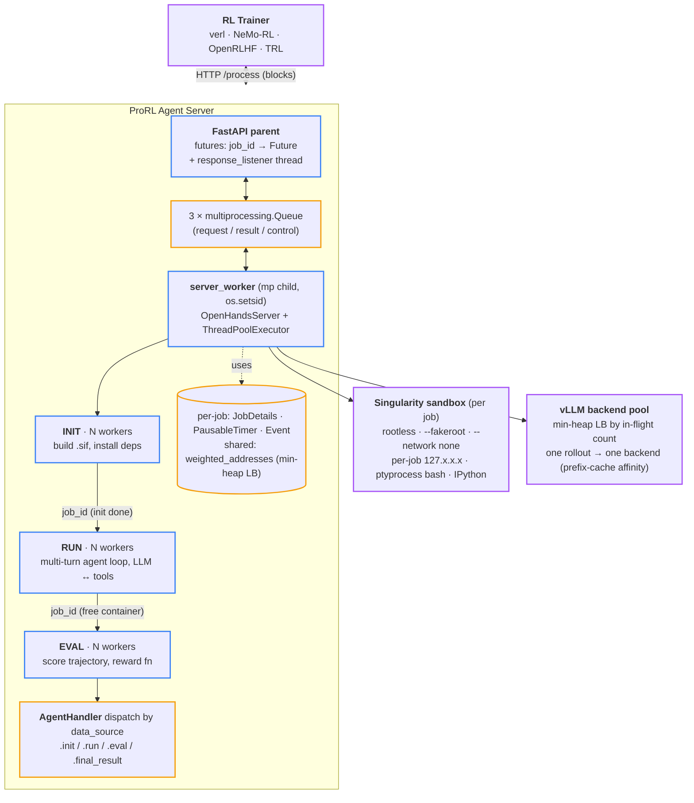

# ProRL Agent：面向多轮智能体 RL 的 Rollout-as-a-Service

> [!info] 论文元信息
> - **论文**：[arXiv:2603.18815](https://arxiv.org/abs/2603.18815) — NVIDIA, 2026 年 3 月
> - **代码**：[NVIDIA-NeMo/ProRL-Agent-Server](https://github.com/NVIDIA-NeMo/ProRL-Agent-Server)（分支 `stable`，Apache-2.0）
> - **作者**：Hao Zhang, Mingjie Liu, Shaokun Zhang, Songyang Han, Jian Hu, Zhenghui Jin, Yuchi Zhang, Shizhe Diao, Ximing Lu, Binfeng Xu, Zhiding Yu, Jan Kautz, Yi Dong

> [!warning] 已被 [[polar|Polar]] 取代（2026-05）
> 同一个 NVIDIA 团队在**同一个 GitHub repo** 里发布了 [[polar|Polar]]（arXiv:2605.24220, 2026-05）——它把这里记录的 `AgentHandler` ABC plugin 模型换成了 **LLM-API proxy**，让任何未修改的 harness（Codex / Claude Code / Qwen Code / Pi）都能训练。Polar 也已注册成 [[nemo-gym|NeMo Gym]] 环境，填上了下面 [ProRL Agent vs NeMo Gym](#prorl-agent-vs-nemo-gym--同族不同层) 节里讨论的桥。**当前架构请先读 [[polar]]**；本页保留作为 ProRL Agent 设计的记录，以及 Polar 继承的架构论点（rollout-as-a-service、异步 pipeline、rootless HPC 沙箱）。

---

## 摘要（2 分钟读完这一节就够）

**它是什么**。ProRL Agent（NVIDIA, 2026-03）是一个 HTTP 服务器，运行多轮智能体 rollout 并向任何能 `POST /process` 的 RL trainer 返回 `(token_ids, logprobs, reward)` 元组。把 rollout 工作负载（I/O 密集、容器拉起慢）和训练工作负载（GPU 密集、快）分开，让两者能独立扩展、调试、迭代。

**核心思想**。把 rollout 做成 *服务*，不是协程。三个支柱：

1. **Token-in / token-out 协议** —— trainer 和服务端共享标准 token 序列，跨轮没有重新分词漂移。
2. **三阶段异步 pipeline**（INIT → RUN → EVAL）独立 worker pool —— 不同 stage 的不同 job 不会互相阻塞。
3. **Rootless HPC 沙箱** 基于 Singularity / Apptainer + `--fakeroot` + 每 job 回环 IP —— 跑在 Docker 跑不了的 Slurm 集群上。

少任一支柱：系统就会变成 off-policy 不稳定、吞吐受限、或者无法部署。

**头条结果**。SWE-Bench Verified Pass@1：

| 模型           | Baseline | RL 后       | Δ           |
| -------------- | -------- | ----------- | ----------- |
| Qwen3-4B       | 14.8 %   | **21.2 %**  | **+6.4 pp** |
| Qwen3-8B       | 9.6 %    | **18.0 %**  | **+8.4 pp** |
| Qwen3-14B      | 15.4 %   | **23.6 %**  | **+8.2 pp** |

8B 数字（18.0 %）大约是 **SkyRL-Agent-8B-v0**（9.4 %）的 **2 倍** —— 论文 lead 的结果。关键消融：移除异步 refilling 后，GPU 利用率从 78 % → 31 %，SWE-Bench Pass@1 从 18.0 % → 13.4 %。解耦的服务架构不是为了代码整洁 —— 它对头条数字是 **load-bearing**。

**为什么这重要**。

- **换 trainer 零成本**。veRL ↔ NeMo-RL 切换不再意味着重写 agent 循环 / 沙箱 / 工具定义。
- **Agent 和 trainer 独立迭代**。新工具、新内存模块、新 scaffold 改动都不动 RL 框架。
- **HPC 集群可部署**。绝大部分 agentic-RL 框架假设 Docker / root。ProRL 的 rootless Singularity 沙箱跟其它训练用同一批 Slurm 集群。
- **2027 年预测**。这个 "rollout-as-a-service" 模式会成为 agentic-RL 默认架构；environment-as-a-service、reward-as-a-service、trajectory-store-as-a-service 会跟上。

---

# 深度部分（往下展开细节）

上面摘要是 executive 层。下面是给愿意细读架构和代码的人准备的。

## 背景：为什么智能体 RL 的基础设施是独立问题

用 RL 训练 LLM 智能体涉及两种工作负载，shape 完全不同：

|                | Rollout                                                                  | Training                                       |
| -------------- | ------------------------------------------------------------------------ | ---------------------------------------------- |
| 资源           | I/O 密集：沙箱拉起、多轮循环、异步工具调用                                 | GPU 密集：forward/backward、梯度同步           |
| 时间尺度       | 每 episode 几秒到几分钟（方差由工具 I/O 主导）                              | 每 step ~10 毫秒                                |
| 失败模式       | 容器崩、网络超时、工具错误                                                | OOM、NaN、NCCL hang                            |
| 适合的硬件      | 多 CPU + 沙箱节点                                                         | 少量大型 8×GPU 节点                            |

现有的 agentic-RL 框架 —— SkyRL-Agent、VeRL-Tool、Agent Lightning、rLLM、GEM —— 都把两种负载塞在 **trainer 进程内**：rollout 协程、in-memory 环境、或者带工具卸载的嵌入式 agent 循环。这种紧耦合带来三个失败：(1) 突发 rollout 打断训练缓存局部性、饿死 inference 时间片；(2) 切 trainer（如 veRL → NeMo-RL）要重新 port agent 循环和沙箱；(3) 任何对 agent 的改进 —— 新工具、新内存模块 —— 都必须穿过 trainer。

ProRL Agent 的回应来自 web 系统圈的明显套路：**把关注点拆分成独立服务，用稳定 HTTP 协议契约相连**。这就是 2014 年 microservices 的原始论点。非平凡的论点是：这个模式在 latency-sensitive 的 RL 内循环里也能跑。

| 框架              | 训练-Rollout 解耦  | Rootless 沙箱 | Scaffold-独立 |
| ----------------- | ----------------- | ------------- | ------------ |
| SkyRL-Agent       | ✗                 | ✗             | ✓            |
| VeRL-Tool         | ✗                 | ✗             | ✓            |
| Agent Lightning   | ✗                 | ✗             | ✗            |
| rLLM              | ✗                 | ✗             | ✓            |
| GEM               | ✗                 | ✗             | ✓            |
| **ProRL Agent**   | **✓**             | **✓**         | **✓**        |

"Rootless 沙箱" 那列是部署现实的贡献 —— 让第一列在共享 HPC 集群上真正能跑。

> [!question]+ Shiki —— 名词表：scaffold、stable HTTP contract、rootless sandbox（2026-05-08）
>
> 背景里三个术语在 agentic-RL 文献里反复出现，论文论点也建立在它们之上，值得精确定义。
>
> **Scaffold（脚手架）** —— 在 agentic-RL 术语里，scaffold 是用户任务和 LLM `model.generate()` 之间的所有东西：agent 循环（ReAct、plan-and-execute）、工具定义、prompt 模板、内存管理、工具调用解析、重试逻辑。是把 text-out 转成 actions-in-environment 的应用层。ProRL 的 "scaffold 独立" 那列意思是：rollout 服务器的 HTTP API 不绑死任何特定 scaffold —— 可以接 OpenHands 的 CodeAct、自研的 ReAct 循环、或任何其它实现了 `AgentHandler` 接口的东西。其它 agentic-RL 框架把特定 scaffold 烧进 trainer 进程，换 scaffold 等于重构 trainer。
>
> **Stable HTTP contract（稳定的 HTTP 契约）** —— 一个版本化、定义良好的 HTTP API，请求/响应 schema 固定且文档化（这里通过 `ProcessRequest` 这样的 Pydantic model）。"Stable" 意味着：(1) schema 不会无版本协商破坏性变化；(2) 不同版本的 trainer 和 server 能互通。这是两个进程之间 *唯一* 的耦合 —— 某天一个团队可以重写 server、换语言、跨机器搬，trainer 不用关心，只要 `POST /process` 仍然接 `ProcessRequest` 返 `(token_ids, logprobs, reward)`。同一个模式让 2014 年的 microservices 在 web 栈里跑通；ProRL 的论点是它在 latency-sensitive 的 RL 内循环里也能跑。
>
> **Rootless sandbox（无 root 沙箱）** —— 全程作为非特权用户运行的容器/沙箱 —— 整条链上没有 root。Docker 因为需要一个跑在 root 下的 daemon（或 `docker` 组成员，在 Linux 上等价于 root）而 *不是* rootless。在 Slurm 管的 HPC 集群上你没有 root，也没有 Docker daemon，所以 Docker 根本跑不了。**Singularity**（现叫 **Apptainer**）就是为这个而设计：容器用 user namespaces 在用户空间执行，`--fakeroot` 让容器 *内部* 看起来有 root，但 *外部* 不真的提升权限。ProRL Agent 用 Singularity Image File（`.sif`）所以能部署在其它训练基础设施已经在用的同一批共享 HPC 集群上。"Rootless" 是 "在生产研究集群里真的能部署" 的解锁条件 —— 需要 Docker daemon 的 serving 框架在那里跑不起来。

## 三大组件详解

Trainer 的 API 契约是 `① POST /add_llm_server → ② POST /start → ③ POST /process { instance, sampling_params }`（阻塞）`→ ④ ← (token_ids, logprobs, reward, timing)`。


论文图展示了双集群部署（左：GPU 节点的 trainer 集群；右：CPU/GPU 的 server 集群）。下面的 Mermaid 补充进程内的细节 —— 三个 queue、FastAPI 父进程 + multiprocessing 子进程、沙箱 / vLLM 外部资源。



### 组件 1 —— `POST /process` 与 token wire protocol

线材表面是几个 Pydantic 校验的端点（`openhands/nvidia/utils.py`）：

```python
class ProcessRequest(BaseModel):
    instance: dict[str, Any]
    sampling_params: dict[str, Any]
    job_id: str | None = None

class CancelRequest(BaseModel):
    job_id: str

class LLMServerRequest(BaseModel):
    address: str
```

| 端点                    | Body                | 用途                                                                                |
| ----------------------- | ------------------- | ----------------------------------------------------------------------------------- |
| `POST /process`         | `ProcessRequest`    | 提交一个 rollout；阻塞直到 `(token_ids, logprobs, reward, timing)` ready              |
| `POST /cancel`          | `CancelRequest`     | 按 id 取消进行中的 job                                                               |
| `POST /add_llm_server`  | `LLMServerRequest`  | 把一个 vLLM 端点注册进负载均衡 min-heap                                              |
| `POST /clear_llm_server`| —                   | 清空所有 backends（checkpoint 更新时用）                                              |
| `GET /status`           | —                   | 队列深度、server 运行标志                                                            |
| `POST /start /stop`     | —                   | 子 server worker 的生命周期控制                                                       |

**它规避的隐形杀手**。多轮 RL 有 *重新分词漂移*。在第 $t$ 轮，LLM 按其 chat template 和空格规则采样 reply IDs。如果客户端只记 decoded 文本，第 $t+1$ 轮重建完整历史时按文本重新分词 —— 微小的格式变化（system/tool 前缀、空格、XML 包装）会让整个对话以不同方式分词。actor 和 reference 不再共享 token 边界；per-token logprobs 错位；KL/entropy spike 到 NaN；PPO/GRPO 更新崩溃。

ProRL 通过让 token IDs 成为训练全程的规范表示来根治这个问题。轨迹里每条消息携带四个额外字段，trainer 直接消费：

```python
new_message['token_ids']          = output_ids
new_message['repetition_penalty'] = ngram_repetition_reward(output_ids).tolist()
new_message['input_ids']          = input_ids
new_message['logprobs']           = logprobs
```

一个实用细节：`ngram_repetition_reward(output_ids, ngram_size=64, penalty=-0.001)` 在每个重复 64-gram 的起始位置加 per-token 惩罚。跟着 `token_ids` 一起走，trainer 不用额外评估 pass 就能 off-policy-safe 地惩罚退化循环。

还有一个边角情况：当 Qwen3 模型发出 `<think>\n` 紧接着工具调用但从来没用 `</think>` 收尾时，HuggingFace tokenizer 会炸。agent 把工具调用内容压回 `content` 字符串，再追加合成的 `</think>`，让规范 token IDs 仍然可解析。这种细节告诉你作者真的训过模型 —— 同一个 bug 也出现在其它 [[grpo|GRPO]] 散度报告里被列作不稳定原因。

> [!question]+ Shiki —— 什么是 token-in/token-out，去掉它为什么会导致 off-policy 不稳定？（2026-05-08）
>
> Token-in/token-out 协议让 `token_ids`（加上 `logprobs`、`input_ids`）成为训练全程的规范表示，永远不用 decoded text。当 server 在第 $t$ 轮采样回复时，它返回 vLLM 产生的 *精确* token IDs 加 sample 时的 per-token logprobs；第 $t+1$ 轮的 prompt 直接复用这些 IDs，从不经过 tokenizer 重新编码。每条消息上四个额外字段（`token_ids`、`input_ids`、`logprobs`、`repetition_penalty`）就是 trainer 直接消费这股流的接口。
>
> 如果改成 text-in/text-out —— 早期很多 agentic-RL 框架的做法 —— 你会撞上 **重新分词漂移**。server 记录第 $t$ 轮的 decoded text。第 $t+1$ 轮 trainer 通过把 decoded text 重新分词来重建对话历史，但 chat template（system/tool 前缀、空格、XML 包装）让得到的 token 序列 *不同于* 模型最初产生的。两个文本上相同的字符串，前面文本不同时，会分成不同 IDs。
>
> 对 off-policy 方法这是致命的。actor 和 reference 现在对 token 边界落在哪里有分歧；per-token logprobs 错位；重要性比率 $\pi_\theta(y_t \mid s_t) / \pi_\text{old}(y_t \mid s_t)$ 被计算在 *相同文本的不同分词* 上。actor 和 reference 之间的 KL 失去意义或 spike 到 NaN。PPO 的 clipped surrogate 和 GRPO 的优势归一化都依赖良定义的重要性比率，梯度变成垃圾，训练几个 iteration 内就发散。
>
> Token-in/out 从构造上让这件事不可能发生。训练全程的规范状态就是原始采样的 token IDs —— 没有 decode-再-encode 步骤，也就没有漂移的机会。off-policy 方法保持有效，因为每一轮的 token 都是前一个 policy 模型实际产生的 token。这就是为什么 SGLang fork 的 `openhands/llm/nvidia/qwen3.py` 故意操作 `prompt_ids`/`response_ids` 而不是 decoded string 形式的 `messages` —— 也是为什么 kernel docstring 警告 *"KL/entropy can spike to NaN"* 如果你绕过它。

### 组件 2 —— INIT → RUN → EVAL 异步 pipeline

`OpenHandsServer.__init__` 接线三个 queue（每个 stage 一个），独立 lock：

```python
self.init_queue: queue.Queue[str] = queue.Queue()
self.run_queue:  queue.Queue[str] = queue.Queue()
self.evaluate_queue: queue.Queue[str] = queue.Queue()

# 三个独立锁，不是一个 —— 粗粒度加锁会让 stages 串行化。
self._state_lock        = threading.RLock()
self._job_details_lock  = threading.RLock()
self._address_lock      = threading.RLock()
```

`start()` 提交三池 workers，全部由 **一个** `ThreadPoolExecutor` 支撑：

```python
self._executor = ThreadPoolExecutor(
    max_workers=self.max_init_workers + self.max_run_workers + self.max_eval_workers
)
for i in range(self.max_init_workers):
    self._executor.submit(self._run_worker_in_thread, i, JobType.INIT)
# ... RUN, EVAL 池同理
```

每个 worker 从指定 queue 取 job，推进到下一 stage：

```python
with phase_context(job_details.timer, function_type):
    if job_type == JobType.INIT:
        runtime, metadata, config = await run_with_timeout_awareness(timer, init_coro, job_details)
        job_details.runtime = runtime
        self.run_queue.put(job_id)
    elif job_type == JobType.RUN:
        run_results = await run_with_timeout_awareness(timer, run_coro, job_details)
        job_details.run_results = run_results
        self._cleanup_job_runtime(job_details.runtime, job_id)  # EVAL 前释放容器
        self.evaluate_queue.put(job_id)
    elif job_type == JobType.EVAL:
        eval_report = await run_with_timeout_awareness(timer, eval_coro, job_details)
        job_details.eval_results = eval_report.get('report', eval_report)
        job_details.event.set()
```

> [!note] 只在代码里能看到的两个设计选择
> - **容器在 RUN 结束时释放，不是 EVAL 结束**。EVAL 常常在独立测试沙箱里跑产出 patch；保留 rollout 容器跨过 EVAL 浪费内存。
> - **跨 stage 的等待时间归 "others" phase**。`phase_context` 在活跃 phase 间切换 timer；stages 之间的排队等待自动归 `others` 不计入超时预算。否则负载尖峰时 worker 短缺会静默触发假阴性超时，污染训练信号。

**Pipeline 外的两层进程**。"服务器" 其实是一个 FastAPI 父进程 fork 了一个持有 `OpenHandsServer` 实例的子进程 `server_worker`。它们通过三个 `multiprocessing.Queue` 通信 —— `request_queue`、`job_result_queue`、`control_response_queue`。

- **崩溃隔离** —— 失控的 rollout（容器守护进程 hang、`apptainer` 僵尸）可以被杀掉而不带垮 FastAPI。
- **两级并发** —— 子进程同时跑 `multiprocessing`（每 job 一个干净进程树；入口 `os.setsid()`，SIGTERM 子进程能可靠杀其后代）和 `ThreadPoolExecutor`，大小 `max_init + max_run + max_eval + 30`。
- **背压隐含在 queue 里** —— 父进程从不阻塞在子进程上；取消传播是因为 `cancel_job` 翻一个 flag 并 set per-job `threading.Event`，任何 worker 在下一个 phase 边界检查。

**异步 DAPO refilling**。[[grpo|DAPO]] 过滤 "零方差 prompt"（reward 均匀 → 梯度为零）。朴素的逐 batch 实现是同步浪费。ProRL 用三个原语替代：持续补充（队列空时立即 refill）、提前终止（足够 informative job 完成后用 `POST /cancel` 取消其余）、跨迭代持久化（未完成的 job 续到下一轮训练 iteration）。这是对已发表 RL 算法的真实系统级扩展，不只是部署 plumbing。

### 组件 3 —— Rootless HPC 沙箱

硬约束：作为非特权 Slurm 用户运行 —— 没有 Docker daemon、没有 root。解决方案：

- **Singularity Image File（`.sif`）** —— 单文件、可移植容器镜像，对共享文件系统友好。
- `--fakeroot` 用于容器内包安装；`--network none` 用于对外隔离。
- **每 job 一个回环 IP**（在 `127.x.x.x` 段，线程安全分配器）→ 大规模下消除端口冲突。
- 每个容器是其自己 session 里的子进程；SIGTERM → SIGKILL 升级清理。
- `SingularityRuntimeBuilder` 用 Jinja2 模板构建镜像，三层缓存：*Scratch*（完整重建）、*Versioned*（base image/framework 未变就复用）、*Lock*（依赖 lockfile 未变就复用）。

运行时由配置选择（`example.config.toml`）：

```toml
[core]
runtime          = "singularity"
run_as_openhands = false             # 不要求 "openhands" 用户存在

[sandbox]
run_as_fakeroot       = true          # 在 .sif 里模拟 root
base_container_image  = "ubuntu:24.04"
```

**工具延迟：墙钟去哪了**。高并发下工具延迟比 LLM 推理还重：

| 工具    | 默认方法                      | ProRL 方法                       | 原因                                |
| ------- | ----------------------------- | ------------------------------- | ---------------------------------- |
| Bash    | tmux session 路由             | `ptyprocess` 直连 PTY            | shell round-trip ~6× 加速           |
| IPython | Jupyter gateway 走网络         | 直接 in-process kernel API        | 没有网络跳数                        |
| IPC     | TCP loopback                  | Unix domain socket               | 更低延迟，无端口管理                 |

不是新研究 —— 只是该有的工程。后面消融显示开启高效 bash 时 action 时间从 0.78s 降到 0.42s。

### 辅助机制（可跳读）

> [!note]- AgentHandler 插件接口 —— 如果你要做 ProRL 集成就展开
> 任务特定逻辑通过一个抽象基类插入（`openhands/nvidia/registry.py`）：
>
> ```python
> class AgentHandler(ABC):
>     @property
>     @abstractmethod
>     def name(self) -> str: ...
>
>     @abstractmethod
>     async def init(self, job_details: JobDetails, sid: str | None = None
>                   ) -> tuple[Runtime, EvalMetadata, OpenHandsConfig]: ...
>     @abstractmethod
>     async def run(self, job_details: JobDetails, sid: str | None = None
>                  ) -> dict[str, object]: ...
>     @abstractmethod
>     async def eval(self, job_details: JobDetails, sid: str | None = None,
>                    allow_skip: bool = True, reward: Optional[Reward] = None
>                   ) -> dict[str, Any]: ...
>     @abstractmethod
>     def final_result(self, job_details: JobDetails) -> dict[str, Any]: ...
> ```
>
> 一次 rollout 的共享可变状态是一个 `JobDetails` 数据类 —— 每个 handler 方法都接它并就地修改（`job_id`、`instance`、`agent_config`、`llm_config`、`runtime`、`event`、`timer` 等）。
>
> 注册是一个扁平 dict，键是 handler `.name`，每个 handler 七个 entry（每个抽象方法一个）。reasoning 风格任务（math、STEM）有独立的 `_registries_reasoning` 注册表，单个部署可以同时服务 code-agent 和 reasoning-agent 工作负载。仓库自带 SWE-Gym、R2E-Gym、SWE-Bench、math、STEM、code 的 handler。

> [!note]- LLM 后端负载均衡 —— 如果你要调 prefix-cache 命中率就展开
> Min-heap 加锁两行就够：
>
> ```python
> def create_llm_config(self, sampling_params):
>     with self._address_lock:
>         address = self.weighted_addresses[0][1]
>         self.weighted_addresses[0][0] += 1
>         heapq.heapreplace(self.weighted_addresses, self.weighted_addresses[0])
>     return LLMConfig(base_url=address, **sampling_params)
> ```
>
> 一个完整 rollout 的调用序列粘住同一个 backend（因为 `LLMConfig` 每 `/process` 构建一次并在多轮循环里复用），所以 prefix-cache 命中率高。比 power-of-two-choices 简单，能 work 是因为单次调用 cost 方差由序列长度主导，不是 server 侧慢。`add_llm_server_address` 和 `clear_llm_server_addresses` 支持热轮换 backend —— trainer 发布新 checkpoint 到 vLLM 想 drain 老的时候用。

## 头条证据

**配置**。32× NVIDIA H100。RL 算法：DAPO（[[grpo|GRPO]] 变体，带零方差 prompt 过滤）。batch 32、mini-batch 8、每实例 8 rollouts、KL = $10^{-4}$、lr = $10^{-6}$。

**SWE-Bench Verified, Pass@1**（293 实例 SWE-Gym 训练子集）：

| 模型                          | Baseline           | RL 后       | Δ           |
| ---------------------------- | -----------------: | ----------: | ----------: |
| Qwen3-4B-Instruct-2507       | 14.8 %             | **21.2 %**  | **+6.4 pp** |
| Qwen3-8B                     | 9.6 %              | **18.0 %**  | **+8.4 pp** |
| Qwen3-14B                    | 15.4 %             | **23.6 %**  | **+8.2 pp** |

> [!success] 8B 头条数字
> ProRL Agent 的 18.0 % 约为 SkyRL-Agent-8B-v0 的 9.4 % 的 **2 倍** —— 三个 size 里最大的差距，也是论文 lead 的结果。

**关键消融：移除异步 refilling**。同步 rollout-then-train 时 GPU 利用率从 78 % → 31 %（8B run），SWE-Bench Pass@1 从 18.0 % → 13.4 %。解耦的服务架构不是为了代码整洁 —— 它对头条数字是 load-bearing。

**可扩展性**（论文 Fig.）：


SWE 任务下，吞吐随 rollout 节点数近线性增长；4B 扩展最好（单 rollout footprint 小），14B 最早饱和（per-node 计算上限）。

> [!example]- 全部实验结果（展开）
> **通用性**。三个额外的 agent 用同一基础设施训练：
>
> 
>
> | Agent                                   | 训练数据           | Benchmark    | Reward / Pass@1                |
> | --------------------------------------- | ------------------ | ------------ | ------------------------------ |
> | STEM（网搜 + 工具）                      | SCP-116K           | mean reward  | 60 步内 0.20 → 0.65            |
> | Math（IPython + NumPy/SciPy/SymPy）     | DeepScaleR        | AMC          | 0.40 → 0.90                    |
> | Code（str_replace_editor）              | Eurus-2-RL-Data    | Codeforces   | 0.23 → 0.42                    |
>
> **完整消融**（Qwen3-14B, 8 H100）：
>
> | 配置                  | Action 时间 (s) | GPU 利用率 | 吞吐 (inst/s)        |
> | --------------------- | --------------: | ---------: | -------------------: |
> | 全功能                | 0.42            | 78 %       | 0.37                 |
> | − 负载均衡            | 0.42            | 42 %       | 0.25                 |
> | − 高效 bash           | 0.78            | 68 %       | 0.29                 |
> | − 过期 job 清理       | 0.42            | 65 %       | 0.30                 |
>
> 读法：负载均衡和过期 job 清理回收 GPU 利用率（失败 rollout → stale KV → 浪费 inference）；高效 bash 回收 per-action 墙钟。

## 优势与不足

最突出的强项是让架构 work 的三个 sub-idea —— token-in/token-out、三阶段 pipeline、rootless 沙箱 —— 每个都解决了 prior systems 里真实的失败模式，每个的实现都能在代码里看到用心。

论文说服力不足的地方：

- **HTTP 开销从未量化**。解耦隐含着网络往返代价。展示了吞吐扩展性，但 *端到端训练 step latency* 从未与紧耦合 baseline（如 SkyRL-Agent）在同负载下对比。
- **沙箱故事只讲 Singularity**。很多团队用 Docker、podman、microVM（Firecracker）。HPC-rootless 框架是真的，但没论文暗示的那么可移植。
- **只验证了一个 RL 算法**。所有实验用 DAPO。PPO、GRPO、RLOO、REINFORCE++ 可能演 rollout-batch 形状和 KV-cache 复用模式不同。
- **293 实例训练集太小**。SWE-Bench Verified 上 +6–8 pp 的 Pass@1 提升是真的，但天花板没刻画。
- **没有跟分布式 prefix-cache 策略对比**。把一个 rollout 粘到一个 vLLM backend 最大化它的 cache 命中，但如果多个 rollout 共享 system prompt，分布到多个 backend 可能更好。这个 trade-off 没分析。
- **开源但只开了一部分**。`stable` 分支公开了，但论文实验用了 ProRL/veRL/NeMo-RL 的内部扩展。

> [!warning] reward-server 抽象解释不足
> 代码里引用了 `reward_server_ip` 配置和 `Reward` 类，但论文正文没完整说清楚契约或它和 `AgentHandler.eval` 怎么交互。`OpenHandsServer.__init__` 里一个 footnote 警告：*"No reward server IP provided. Evaluations would only work for swebench problems."* 这是个 load-bearing 限制，值得比 warning 更多解释。

## 启示

系统本身扎实，但更有意思的论断是 *架构性* 的：**服务化设计在 agentic RL 里也能打赢嵌入式设计，哪怕 latency 预算紧**。这个论断会泛化。预期未来 12 个月会出现可比较的服务 —— **environment-as-a-service**（参考 [[environment-design]] 里的 OpenReward）、**reward-as-a-service**、**trajectory-store-as-a-service**。一个 "agentic RL 平台" 最终的形态会更像把可互换服务连起来的 control plane，而不是单体 trainer。

两条不论你是否采用这套栈都值得内化的具体经验：

- **Token-in / token-out 是多轮 RL 唯一安全的 wire 格式**。如果你建任何 agentic-RL 栈，第一天就把这设计进去。重新分词漂移是隐形杀手。
- **Job 级 pipeline 并行被低估**。ProRL 的三阶段 queue 不改任何 RL 算法就给出近线性扩展。大部分团队把这块吞吐留在桌上。

## 源码与复现

快速启动（来自 README）：

```bash
poetry install --with dev,test,runtime,evaluation
pip install git+https://github.com/SWE-Gym/SWE-Bench-Package.git
pip install git+https://github.com/R2E-Gym/R2E-Gym.git
sudo apt-get install -y apptainer

python scripts/pull_swe_images.py
python scripts/start_server.py --port 8006 \
  --max-init-workers 8 --max-run-workers 8 --max-eval-workers 4
# POST /add_llm_server, 然后 /start, 然后 /process
```

接着值得读的文件：

| 文件                                                  | 作用                                                                                                       |
| ----------------------------------------------------- | ---------------------------------------------------------------------------------------------------------- |
| `openhands/nvidia/registry.py`                        | `AgentHandler` ABC、`JobDetails` 数据类、注册表。                                                           |
| `openhands/nvidia/async_server.py`                    | `OpenHandsServer`、三队列 pipeline、统一 `_worker`、min-heap 负载均衡器。                                   |
| `openhands/nvidia/utils.py`                           | Pydantic schemas、`process_with_timeout`、`process_messages_from_agent_state`、`ngram_repetition_reward`。 |
| `openhands/nvidia/timer.py`                           | `PausableTimer`、`phase_context`、`run_with_timeout_awareness`。                                            |
| `openhands/llm/nvidia/qwen3.py`                       | `convert_messages_to_tokens`、自定义 Qwen3 chat template。                                                  |
| `openhands/runtime/impl/singularity/singularity_runtime.py` | 沙箱生命周期、回环 IP 分配器。                                                                       |
| `scripts/start_server.py`                             | FastAPI 父进程 + multiprocessing 子进程接线。                                                              |
| `trainer_integration/verl/`                           | rollout server 怎么接入一个 verl trainer。                                                                  |

## ProRL Agent vs NeMo Gym —— 同族、不同层

这一页最常见的混淆：ProRL Agent 跟 [[nemo-gym|NeMo Gym]] 是什么关系？两者都来自 NVIDIA、都在 2026 年随 agentic-RL 基础设施出货、都采纳 rollout-as-a-service 的微服务模式。它们**互补、不竞争**，但切问题的轴不同。

### 一句话定位

- **NeMo Gym = 环境层** —— "我有什么任务、怎么验证答对、沙箱怎么起"。它的资产是 **catalog：84 benchmark + 19 harness** 预集成。
- **ProRL Agent = rollout 驱动层** —— "trainer 怎么向我要 rollout、token 怎么跨 HTTP 边界且不丢 off-policy 信号"。它的资产是 **token-in / token-out 的 wire 契约 + rootless HPC 沙箱**。

只记一个区别就够了：**NeMo Gym 的 model server 是 OpenAI 风格 chat/messages 接口（text 进出）；ProRL Agent 的 `POST /process` 是 token-in / token-out**。这个差别就是 ProRL Agent 存在的全部理由 —— 多轮 agentic RL 里，让 trainer 重新 tokenize 模型输出会引入跨轮漂移、毁掉 off-policy 梯度。

### 共同点

两个框架共享同一套架构论点和同一套运维约束：

| 维度 | NeMo Gym 和 ProRL Agent 都这样 |
| ---- | ----------------------------- |
| 出身 | NVIDIA NeMo 家族，2026 |
| 架构 | 微服务 + HTTP 契约 —— 2014 微服务论点搬到 RL 内循环 |
| 解决的问题 | rollout + environment + trainer 紧耦合（SkyRL-Agent、VeRL-Tool、Agent Lightning、rLLM、GEM 这套）—— 切 trainer、并发、隔离全坏 |
| 沙箱哲学 | Rootless / Apptainer 而非 Docker —— HPC / Slurm 可部署，不需要 root daemon |
| 生产用户 | 都在 Nemotron 训练里用过 |

共享论点：**rollout 跟 training 资源形状根本不同 —— I/O-bound × 秒到分钟 vs GPU-bound × ~10 ms —— 耦合它们是架构错误**。

### 不同之处

| 维度 | NeMo Gym | ProRL Agent |
| ---- | -------- | ----------- |
| **关注焦点** | environment = dataset + harness + verifier + state | rollout = trainer 通过 HTTP 拿一整条轨迹 |
| **服务数量** | 3 个 FastAPI 服务（agent / model / resources） | 1 个 FastAPI server，内部 3 stage pipeline（INIT → RUN → EVAL） |
| **Trainer-facing wire 协议** | **OpenAI 兼容 Responses API**（messages / text 进出） | **`POST /process` —— token-in / token-out**（返回 `token_ids` + `logprobs` + `reward`） |
| **多轮 off-policy 安全** | 较弱 —— trainer 重新 tokenize text，漂移累积 | 较强 —— canonical token 序列端到端共享，零重 tokenize |
| **核心资产（护城河）** | **84-benchmark + 19-harness catalog**（多年集成） | **HTTP wire 契约 + rootless HPC 沙箱**（可部署设计） |
| **配置体系** | Hydra + YAML（深度可组合） | Pydantic schema + Python plugin ABC |
| **状态管理** | per-server state，分布式 Ray actor | 进程内 asyncio.Queue + multiprocessing child |
| **标志验证** | Nemotron-Cascade 2 → IMO/IOI/ICPC 2025 金牌（multi-domain GRPO + MOPD 管线） | SWE-Bench Verified Pass@1 —— Qwen3 4B/8B/14B +6.4 到 +8.4 pp，8B 是 SkyRL-Agent 的 2× |
| **集成的 trainer** | NeMo RL、VeRL、Unsloth（first-party tutorial） | 任何会 `POST /process` 的 trainer |

### 它们怎么组合

NVIDIA agentic-RL 完整栈应该长这样：

```
Trainer (NeMo RL / VeRL / Unsloth)
    │
    │  POST /process            ← ProRL Agent 的契约
    ▼
ProRL Agent  (rollout 驱动, token-in/token-out, 沙箱生命周期)
    │
    │  AgentHandler dispatch
    │
    │  把 environment 调用委托给 ─────────────┐
    ▼                                          │
[ harness / verifier / state ]                 │
    │                                          │
    │  可以从这里注册 ─────────────────────────┘
    ▼
NeMo Gym  (84-benchmark catalog, dataset, verifier, resources server)
```

**更新（2026-05）：桥已经存在 —— 就是 [[polar|Polar]]**。我写上面这段时还没有公开 adapter 连接 ProRL Agent 和 NeMo Gym。5 天后 NVIDIA 发布了 [Polar（arXiv:2605.24220）](https://arxiv.org/abs/2605.24220) —— 同一团队、同一 repo —— 把 ProRL Agent 围绕 **LLM-API proxy** 重写，不再用 `AgentHandler` plugin，并**注册成 NeMo Gym 环境**。"必须二选一时"的答案现在是：**两个都用，Polar 作为连接它们的 rollout 驱动层**。下面的原始分析仍然描述传统 ProRL Agent 架构；合并后的栈见 [[polar]]。

### 重叠的地方（朴素拼起来会冲突）

两边都有"agent harness"概念：
- ProRL Agent 的 `AgentHandler` ABC（OpenHands-style SWE agent、Mini-SWE 等）
- NeMo Gym 的 `SimpleResponsesAPIAgent`，编排 `model ↔ tool` loop

它们做**同一件事**：驱动 LLM 走多步任务循环、调工具、返回轨迹。差别在 agent loop *外面的包装* —— ProRL Agent 把它包成"trainer-facing token-in/out HTTP 服务"，NeMo Gym 把它包成"environment-facing OpenAI 兼容服务"。两个都用的话，需要选一个拥有 harness，另一个退化成纯 rollout-driver（ProRL Agent 拥有）或纯 environment-catalog（NeMo Gym 拥有）。

### 必须二选一时

| 你最在乎 | 选 |
| ------- | -- |
| Trainer 切换自由 + 长 agentic 轨迹的 off-policy 正确性 | **ProRL Agent** |
| 快速接入大量 benchmark + 多团队 environment 复用 | **NeMo Gym** |
| "现在就在 flagship 规模上 battle-tested" | **NeMo Gym** —— Nemotron-Cascade 2 已生产化 |
| 最干净的 token 级 RL 信号 | **ProRL Agent** —— 整个 point 就是 wire 上的 `token_ids + logprobs` |

## 相关阅读

- [[agentic-rl-overview]] —— 智能体 RL 框架的更广阔图景。
- [[environment-design]] —— 沙箱基础设施（OpenReward、ARES、Daytona）。
- [[rl-training-frameworks]] —— veRL、OpenRLHF、TRL —— ProRL 对接的 trainer。
- [[grpo]] —— DAPO 是 GRPO 变体；算法背景见 GRPO。
- [[tool-use-rl]] —— 工具使用 rollout 怎么训练。
- [[kv-cache-optimization]] —— 为什么 per-task vLLM affinity 对 prefix caching 重要。
- [[multi-turn-optimization]] —— 多轮 KV cache 复用，关联到 LLM 后端效率。
- [[nemo-gym]] —— NVIDIA 的环境 / 数据集层；ProRL Agent 是 agent 侧的 rollout-driver 对应物。
- [[das-spec-rl]] —— 解决 *另一个* rollout 瓶颈（每 rollout 的解码速度）。
