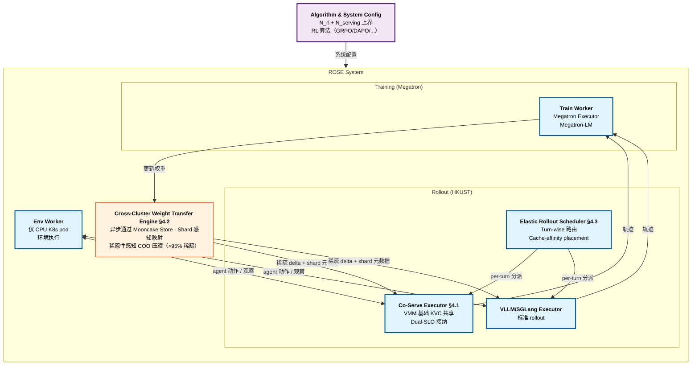

# ROSE: Rollout On Serving GPUs via Cooperative Elasticity for Agentic RL

> [!info] 论文元数据
> - **论文**：[arXiv:2605.06534](https://arxiv.org/abs/2605.06534) —— *ROSE: Rollout On Serving GPUs via Cooperative Elasticity for Agentic RL*，2026-05-07（v2: 2026-05-20）
> - **代码**：未发布
> - **作者**：Wei Gao\*†、Yuheng Zhao\*†、Dilxat Muhtar‡、Dakai An†、Xuchun Shang‡、Tianyuan Wu†、Lunxi Cao†、Shaopan Xiong‡、Weixun Wang‡、Ju Huang†、Teng Ma‡、Siran Yang‡、Jiamang Wang‡、Lin Qu‡、Bo Zheng‡、Wei Wang†（\*等贡献；†HKUST；‡阿里集团）
> - **实现**：~5k 行 Python 在 ROLL + vLLM 0.10.0 + Megatron-LM + Mooncake v0.3.8 + Ray 之上

> [!important] ROSE 跟 ProRL Agent / Polar / Agent Lightning 的定位
> ROSE 是本 wiki 第**四**个 agentic-RL 框架页，跟 [[agent-lightning]]（Microsoft，2025-08）、[[prorl-agent]]（NVIDIA，2026-03）、[[polar]]（NVIDIA，2026-05）并列。前三个针对 rollout-driver 层（trajectory 怎么收集）。ROSE 攻击 *互补* 问题：**训练和 serving 抢 GPU 时 rollout 计算从哪来**。答案 —— cooperative elasticity：从生产 serving 集群 harvest 空闲周期 —— 新颖且跟 ProRL/Polar 的设计选择正交。

---

## 摘要（2 分钟读完）

**它是什么。** ROSE 是 HKUST + 阿里的 agentic-RL post-training 框架，解决一个特定资源分配问题：**agentic RL rollout 占训练 wall-clock 时间 70%+，且它们的计算需求跨训练 step 变化 5.7×，所以任何静态 GPU 预算都是错的**。论文的观察是生产 serving 集群（跑你部署模型给用户的 GPU）在 24 小时 Microsoft trace 上平均 **18.9% 计算 / 14.3% 内存利用率** —— 剩下大量空闲 headroom。ROSE 通过 "cooperative elasticity" harvest 那些 serving GPU 做 rollout，用三个系统组件让这安全又快。

**核心 idea。** **用 serving 集群 GPU 作为 RL rollout 的弹性容量，不违反 serving SLO**。三个子部件：

1. **SLO-Safe Co-Serving Executor（§4.1）** —— 在同 GPU 上协同部署 serving 和 rollout 模型，通过 CUDA Virtual Memory Management（VMM）基础 remapping 共享 KV cache 内存。Serving 流量 burst 时 executor *抢占式 cut* rollout KVC 预算（2× 因子缩减），中止进行中 rollout，rerouted them。两个优先级轴：**serving-first 内存**（KVC 容量）+ **serving-first 计算**（rollout token 只在 TTFT/TPOT SLO slack 存在时接纳）。
2. **Cross-Cluster Weight Transfer Engine（§4.2）** —— RL 训练跟 serving 可能在不同数据中心由 10–200 Gbps Ethernet 连接，所以朴素 weight sync 会要几十秒到几分钟。ROSE 让它在 20 Gbps Ethernet 下也 ≤20 秒完成，通过三个技术：(a) **通过 Mooncake Store 异步传输** 作为 relay 层（解耦训练和 serving 成员关系）；(b) **Shard 感知映射** 让训练的异质并行（TP=4 × PP=2）自动映射到 serving 的 TP=4；(c) **稀疏性感知压缩** 利用 RL 权重 delta $\Delta W_t = W_t - W_{t-1}$ 中 >95% 稀疏性（无损 COO 编码）。
3. **Elastic Rollout Scheduler（§4.3）** —— 在专用 rollout GPU 和机会 serving GPU 之间分派 rollout，在 *turn 粒度*（不是整条 trajectory 粒度），带 cache-affinity placement（路由每轮回到持有 prefix KVC 的 GPU）。Serving 负载 spike 时进行中 rollout turn 迁移到专用 GPU。

去掉 co-serving executor，serving SLO 在 rollout burst 下崩；去掉 weight transfer engine，跨集群 sync 成为瓶颈；去掉 elastic scheduler，你不能安全路由 rollout 而不违反 cache 局部性。

**头号实验结果。**

| 对比 | Workload | 吞吐提升 | 备注 |
| --- | -------- | --------: | --- |
| vs. **ROLL-GRPO**（资源固定）| Qwen3-8B FrozenLake | **1.31×**（最多 2.16×）| 100 steps 平均 |
| vs. **ROLL-GRPO** | Qwen3-32B ALFWorld | **1.46×**（最多 1.76×）| |
| vs. **ROLL-DAPO** | Qwen3-8B | **1.42×**（最多 4.82×）| DAPO 冗余采样加剧资源争用 |
| vs. **ROLL-DAPO** | Qwen3-32B | **3.31×**（最多 4.39×）| |
| vs. **AReaL**（全异步）| Qwen3-8B | **1.44×** | Cooperative elasticity 击败 async-only |
| vs. **AReaL** | Qwen3-32B | **2.69×** | |
| vs. **RLBoost+**（弹性，spot GPU）| 两者 | **rollout 快 1.20–1.26×** | RLBoost+ 有 6.8–7.3% 分配 overhead |
| vs. **λRL**（弹性，serverless）| 两者 | 相当 rollout 但 **overhead 极低** | λRL 有 15.1–26.1% 分配 overhead；**ROSE ≤0.4%** |

**Serving SLO 合规**：跨所有实验 **零 P99 SLO 违反**。模型收敛保留（Figure 7d critic score 跟 baseline 几乎一致）。

**为什么重要。**

- **第一个系统化 harvest 生产 serving 容量给 RL 训练**。双向 autoscaling（流量低时缩 serving）有几十秒 reload overhead 且破坏 SLO；ROSE 让 serving 和 rollout 共驻 with 弹性资源共享。
- **大规模解决跨集群 weight sync 问题**。RL 权重 delta >95% 稀疏性是非显性属性，ROSE 是第一个在系统层利用的。
- **分配 overhead 比 spot/serverless 方法好 50-80×**（0.3-0.4% vs RLBoost+ 6.8-7.3% vs λRL 15.1-26.1%）。这对生产部署是决定性的。
- **2027 年预测。** Cooperative elasticity 成为同时运行训练和 serving 基础设施的组织（阿里、字节、OpenAI、Anthropic）的 agentic RL post-training 默认模式。Spot-only 和 serverless-only RL 框架输给 cooperative 模型。预期 Polar / NVIDIA NeMo-RL / OpenRLHF 在 12 个月内加 cooperative-elasticity 模式。

---

# 详细内容（深入阅读从这里开始）

## 背景：为什么静态 GPU 预算在 agentic RL 中失败

Agentic RL 交替 **rollout**（在环境里跑 agent 收集 trajectory）和 **训练**（在收集的 trajectory 上更新模型 + 同步 weight 回去）。论文的测量（§2.2，Figure 1a）：

| 阶段 | 总 wall-clock 占比 |
| ---- | -----------------: |
| **Rollout** | **>70%**（8B 模型 86.9%；32B 模型 70.5%）|
| 训练 | ~25% |
| Weight sync | <5% |

**Rollout 主导**。两个特性让它成自然优化目标：

1. **长尾 rollout**（Figure 1b）：P75 在 ≤30% E2E rollout 时间内完成；尾 trajectory 长 5-10×。跑快 trajectory 的 GPU 等 straggler 时闲。
2. **变化的资源需求**（Figure 1d）：Qwen3-8B + DAPO，每 step 生成 trajectory 数变化 **跨 step 多达 5.7×**。有时模型收敛快（少重采样）；有时发散（多重采样）。

### 为什么固定分配失败

按 *peak* 需求设 GPU 预算 → 75% steps 闲。按 *average* 设 → 重负载 steps 跟不上累积队列。两种都错。论文量化这点：

> "[Fixed allocation] sized for peak demand idles GPUs during light-load steps, while one sized for average demand creates contention during heavy-load steps. This variation calls for resource elasticity."

### 为什么现有弹性系统失败

两个先前弹性方法及其失败模式（Section 2.3）：

**(a) Spot-instance 弹性（如 RLBoost）**：按需租外部 GPU。问题：spot 容量稀缺，provider 频繁抢占。系统在重试分配上烧时间。ROSE 测 RLBoost+ 分配 overhead **总训练时间的 6.8-7.3%**。

**(b) Serverless GPU 弹性（如 λRL）**：用 AWS Lambda 风格按需 GPU 函数。问题：几十秒每冷启动 + 15 分钟函数超时 → 频繁重启周期。**15.1-26.1% 分配 overhead**。

> [!warning] 弹性的承诺没兑现
> 两个先前方法失败因为它们把 rollout 当 "需要采购的额外计算"，而不是 "组织内已存在但未用的计算"。ROSE 的重框架是空闲 serving GPU 是最便宜、最可用的弹性容量来源。

### 为什么 serving GPU 是对的来源

ROSE 的实证动机（§3.2，Figure 3a-b）：

- 24 小时 Microsoft serving trace：分钟级 peak 1.7× 平均，秒级 peak 4.22× 平均
- **平均 SM 利用率：18.9%**
- **平均 HBM 利用率：14.3%**

典型生产现场的 serving 集群对 peak 需求大量过 provision。未用的 80%+ headroom 就是 ROSE harvest 的。

> [!quote] 关键重框架
> "A more natural source of elastic capacity for rollouts is the organization's operational serving cluster. ... Reclaiming these GPUs for serving upon traffic bursts requires tens of seconds for model reloading and runtime initialization overhead that would violate serving SLOs. In this paper, we explore *cooperative elasticity*, where serving and rollout workloads cooperatively share *already-deployed* GPUs."

挑战：serving SLO（TTFT、TPOT）必须保留，同时 rollout workload 共享 GPU。这是核心贡献。

## 三个核心组件详解

### 组件 1 —— SLO-Safe Co-Serving Executor（§4.1）

最难的工程挑战。在同 GPU 上协同部署 serving 和 rollout LLM 要求共享两个稀缺资源：**GPU 内存**（KVC 主导）和 **GPU 计算**（直接影响 token 级延迟）。

#### 问题 1：KV cache layout 不兼容

Serving 模型（如 Qwen2.5-7B）和 rollout 模型（如 Qwen3-8B）有不同 head 数、head dim、层数 → KVC tensor layout 不兼容。每模型 KVC 池静态预留需要运行时重新初始化（10s+ 加容量）。

**ROSE 的修复 —— VMM-based 跨模型 KVC 内存共享：**

> "We leverage CUDA Virtual Memory Management (VMM) to enable fast, flexible KVC rebalancing across heterogeneous models. We **decouple virtual KV address spaces from physical GPU pages**: each model reserves a contiguous virtual KV address space that preserves its attention-kernel indexing, while all models share a global physical page allocator that maps and unmaps pages on demand."

Serving 负载增加时，ROSE unmap 物理 page 从 rollout 的虚拟地址空间 remap 到 serving 的虚拟地址空间，在 page 粒度（通常 2 MB）。**激活 Qwen3-32B 通过 PCIe/NVLink weight loading 在 5 秒内完成** —— 比几十秒的 add-capacity overhead 快几个数量级。

#### 问题 2：Rollout KVC 跟 serving KVC 竞争

如果 rollout in-progress 持有 30% GPU 内存而 serving 请求到达，那些请求被 evicted KV → SLO 违反。

**ROSE 的修复 —— 抢占式内存共享策略**（三状态）：

```
1. Burst trigger：
     Co-serving executor 监控 serving KVC 使用。
     当使用跨过预留 headroom H 内的 high-watermark
     （通常总 GPU 内存的 20%）时，进入 "pressure state"。

2. Emergency cut：
     按固定因子（2×）缩 rollout KVC 预算。
     回收释放的 page 给共享 allocator。
     按请求粒度中止受影响的 rollout 请求。
     通知 rollout scheduler reroute 受影响的 trajectory
     到其它 underutilized GPU（§4.3）。
     [一次性激进 cut —— 无 fine-grained churn]

3. Freeze：
     直到下一个 RL step 才让 rollout 预算长回来，
     那时 rollout scheduler 用更新的使用统计重新计算预算。
     [防止振荡]
```

这个三状态机器避免 rollout 跟 serving 反复争内存的死亡螺旋。

#### 问题 3：Rollout 计算干扰 serving 延迟

即使内存 OK，计算干扰（rollout decode 延迟 serving decode、rollout prefill chunk 阻塞 serving）也违反 TTFT/TPOT SLO。

**ROSE 的修复 —— Dual-SLO Admission Controller：**

每个调度 tick 算 SLO slack：

$$S_r^{\text{prf}} = (t_r^{\text{arr}} + B_{\text{TTFT}}) - t_{\text{now}} - \hat{T}_{\text{prf}}(L_r, m) \quad \text{(prefill slack)}$$

$$S_r^{\text{dec}} = (t_r^{\text{last}} + B_{\text{TPOT}}) - t_{\text{now}} - \hat{T}_{\text{dec}}(b) \quad \text{(decode slack)}$$

其中 $B_{\text{TTFT}}, B_{\text{TPOT}}$ 是配置的 SLO 预算（如 Qwen2.5-7B 是 150 ms / 500 ms），$\hat{T}_{\text{prf}}, \hat{T}_{\text{dec}}$ 是离线 profile 的 prefill/decode 时间。

**只在两个 slack 都正时接纳 rollout token**。这是 "serving-first 计算" —— serving 保证不滑，但 rollout 吸收剩余计算 slack。

附加 trick：尽管 serving stack 用 PD 解耦，**rollout 用 PD 协同部署**（单 GPU prefill + decode）最大化 serving GPU 资源利用。Chunked prefill 在 512 token 处 bound rollout step 运行时，避免 serving 的 head-of-line 阻塞。

### 组件 2 —— Cross-Cluster Weight Transfer Engine（§4.2）

训练跟 serving 集群常跨数据中心（200 Gbps Ethernet，有时 20 Gbps WAN），每 RL step 后 weight sync 必须快完成或瓶颈下一个 step。

**三个技术分层：**

#### 技术 1：通过 Mooncake Store 异步传输

建在 Mooncake Store（[[prfaas]] 也用的 Moonshot 解耦 KV cache 存储）。训练 worker push weight 到固定大小 bucket（64 MB）异步；serving worker pull 更大 batch（1 GB）按需。不要求固定 collective group → handle 动态 GPU 成员关系当 serving GPU 在 RL step 之间加入/离开。

跟 NCCL-based 内部集群同步 overlap 跨集群传输（rollout worker 可恢复不等跨集群传输完成）。

#### 技术 2：Shard 感知 weight transfer

训练集群有并行（TP=8 × PP=2）；serving 集群有不同并行（TP=4）。朴素传输要求 all-gather 完整模型先，然后重新 shard。

ROSE 从 module 类型 + 参数 shape 自动推每个参数的 shard 维度，算 per-rank slice 范围，把这个元数据编进 Mooncake object key。**每个设备异步 push 它的本地 shard 而不先 all-gather**。每个接收设备根据编码元数据 pull 它需要的 bucket。支持 tensor 并行和 pipeline 并行。

#### 技术 3：稀疏性感知 weight transfer

这是**最 novel 的观察**。RL post-training 产生高度稀疏 weight delta：

$$\Delta W_t = W_t - W_{t-1}$$

稀疏比（$\Delta W_t$ 中零元素分数）对 Qwen3-8B 和 Qwen3-32B 在第 10 个 RL step 是 **>95%**（Figure 6）。

> [!important] 为什么 RL weight delta 稀疏
> RL 算法用梯度稳定技术（reference model、KL penalty、保守更新规则）约束策略漂移。大多数参数 step 之间不变。这个稀疏性 **不在** 常规 LLM 训练里，那里每次更新修改大多数权重。

ROSE 在 **COO（坐标）格式** 压缩 $\Delta W_t$ 传输，保留 previous-step 权重 $W_{t-1}$ 本地驻留。每次更新，重构 $W_t = W_{t-1} + \Delta W_t$。这引入 ~1 秒计算 overhead —— 相比跨集群传输时间（多达分钟）小。

**结果**：端到端 weight 传输 **在 20 Gbps Ethernet 下也 ≤20 秒**。

### 组件 3 —— Elastic Rollout Scheduler（§4.3）

Scheduler 决定每 trajectory 在专用 rollout GPU 和机会 serving GPU 之间的 placement。

**两个关键策略：**

#### Turn 级并发感知路由

关键洞察：多轮 agentic RL 交替 LLM 生成和环境交互。在 *turn* 粒度（不是整 trajectory）路由意味着：

- Trajectory 可以从专用 rollout GPU 开始（高并发），争用时 spill 到 serving GPU，容量空时 migrate 回。
- Rollout 并发 cap 在 workload-依赖阈值（如 Qwen3 模型 32K context 长度时每 GPU 16 trajectory）避免 KVC 压力和过多调度 overhead。

#### Cache-affinity placement

Scheduler 记录哪个 rollout worker 服务每条 trajectory 上一轮（cache-affinity 表）。对每个新 turn：

1. 首先路由到 cache-affine worker 如果它有容量（prefix KVC 复用）。
2. 如果 rollout GPU 上不可用，检查不违反 serving SLO 的 serving GPU。
3. Fall back 到最少负载 rollout GPU 或合格 serving GPU。
4. 如果没有池有容量就排队等资源空闲。

#### 容错

Heartbeat 监控器从 co-serving executor 检测 rollout worker 失败或 stall。受影响 trajectory reroute 到其它可用 GPU。Heartbeat 每几秒；stall 超时 2 秒。

## 系统架构

完整系统总览（论文 Figure 5，我的 Mermaid 重构）：



生产部署中四个 GPU 集群：
- **CPU 集群**：env worker（K8s，无 GPU）
- **Serving 集群**：Qwen2.5-7B / Qwen2.5-32B serving 模型 + ROSE co-serve executor + rollout 空闲 slack
- **Rollout 集群**：专用 rollout GPU 跑 vLLM/SGLang
- **训练集群**：Megatron-LM 训练节点

## 头号实验证据

### 设置（§6）

- **模型**：Qwen3-8B（FrozenLake 任务）+ Qwen3-32B（ALFWorld 任务），用 GRPO + DAPO 训
- **集群**：H800 GPU，最多 48 专用训练 + 64 借的 serving
- **网络**：400 Gbps InfiniBand 内部集群；200 Gbps Ethernet 跨集群
- **Serving 负载**：24 小时 Microsoft trace 回放
- **Serving SLO**：P99 TTFT/TPOT（150 ms、500 ms）给 7B；（450 ms、1000 ms）给 32B
- **Baseline**：
  - **固定**：ROLL-GRPO、ROLL-DAPO、AReaL（全异步）
  - **弹性**：λRL（serverless）、RLBoost+（spot）

### 吞吐结果（Figure 7a-c）

摘要表里显示的数字。三个观察：

1. **DAPO 受益最多于 ROSE**（4.82×/4.39× 最大吞吐）：因为 DAPO 的冗余采样把 rollout 需求扩到 base batch 的 5.7×（Figure 1d），资源弹性更重要。
2. **32B 比 8B 受益多**：跨集群 weight transfer 对大模型更重；ROSE 的稀疏感知压缩关闭那个 gap。
3. **vs AReaL（全异步）**：ROSE 赢 1.44× / 2.69× 因为 async-only 消除等训练完成的 GPU 闲置但不加新 GPU 容量。ROSE 的 cooperative elasticity 两者都提供。

> [!success] 分配 overhead 是杀手对比
> ROSE 的 **0.3–0.4% 分配 overhead** vs λRL 的 **15.1–26.1%** 是决定生产可行性的对比。λRL 花训练时间 1/4 设置 Lambda 函数；ROSE 花 <0.5% 激活已运行的 serving GPU。即使 RLBoost+（为 spot instance 设计的高效）也在 6.8–7.3%。**Cooperative elasticity 比外部 GPU 采购决定性地更便宜**。

### 模型收敛保留（Figure 7d）

跨 100 训练 step 的 critic score：ROSE 跟 ROLL-GRPO 曲线几乎一致。Cooperative elasticity 不引入算法漂移 —— rollout-batch shape 和 weight-sync 语义保留。

> [!example]- 跟替代 serving 引擎对比（Table 1）
>
> 一个中训检查点（8B step 50、32B step 20），对比替代 co-serving 设置 rollout 时间和 SLO：
>
> | 模型 | 方法 | Rollout 时间 (s) | P99 TTFT (ms) | P99 TPOT (ms) |
> | --- | ---- | ---------------: | ------------: | ------------: |
> | 8B | **ROSE** | **496.3** | 338.1 | 136.1 |
> | 8B | ServerlessLLM | — | 314.8 | 117.8 |
> | 8B | ServerlessLLM+Rollout | 651.7 | 1166.1 | 135.6 |
> | 8B | Prism | 731.7 | 973.2 | 115.4 |
> | 32B | **ROSE** | **960.1** | 837.5 | 398.1 |
> | 32B | ServerlessLLM | — | 716.1 | 312.8 |
> | 32B | ServerlessLLM+Rollout | 1161.8 | 2426.2 | 565.3 |
> | 32B | Prism | 1301.2 | 1625.4 | 351.7 |
>
> ROSE 取得更短 rollout 时间 *和* 更好 serving TTFT 比 ServerlessLLM-带-rollout 和 Prism（两者都不达 SLO 预算）。ROSE 的 TTFT 高于纯 serving ServerlessLLM（后者无 rollout 负载），但这是提供 rollout 容量的代价 —— 且差异在 SLO 内。

> [!example]- 不同链路带宽下通信效率（§6.3）
>
> 跨集群链路 10/50/100/200 Gbps 测 8B 和 32B。ROSE 的稀疏感知传输让端到端 weight sync **20 Gbps 下也 ≤20 秒**，vs 朴素传输 32B 几分钟。

## 优势与局限

**优势。**

- **第一个 harvest 生产 serving 容量给 RL 训练的系统论文**。重框架本身是持久的。
- **RL weight delta >95% 稀疏性观察** 非显性可利用。可能 enable 其它下游优化。
- **VMM 基础 KVC 共享** 是其它协同部署系统能借的干净原语。
- **分配 overhead 比 spot/serverless 方法好 50-80×** —— 决定生产部署。
- **算法无关** —— work with GRPO、DAPO、AReaL 风格异步训练。不耦合特定 RL recipe。
- **跨所有实验无 serving SLO 违反** —— 证明 dual-SLO 接纳控制器真 work。

**局限。**

> [!warning] Cooperative elasticity 只在你同时运营训练和 serving 时 work
> ROSE 假设同一组织运行训练集群和 serving 集群，跨集群通信允许。**没生产 serving 部署的开源 RL 组（学术实验室、小公司）不能受益。** 这本质是阿里/字节/OpenAI 规模论文。

- **Spot-instance + serverless baseline 故意设置让它失败**：λRL 有 15 分钟函数超时（极度惩罚性）；RLBoost+ 在易变 spot 容量。真实 spot-instance ML 平台（如 AWS Capacity Blocks for ML，或 HPC 感知调度器）可能比较更有利。
- **跨集群 Ethernet 测量 at 200 Gbps** 慷慨。真实跨 DC 带宽常 10-100 Gbps；ROSE 测到 20 Gbps 但测试短。
- **两任务评估**（FrozenLake、ALFWorld）。不覆盖 SWE-Bench / 编程 agent 或更难的 web/计算机使用 workload，那里 rollout 动态不同。
- **没跟 [[polar|Polar]] 或 [[prorl-agent|ProRL Agent]] 对比** —— 这些是 ROSE 没 head-to-head 的姐妹 agentic-RL 框架。合理因为它们 target 不同层（rollout-driver vs 资源分配），但组合它们的系统会理想。
- **Mooncake Store 依赖** 把 ROSE 绑到 Moonshot 的存储系统。替代 relay 层（如 Ray 的 object store）可能 work 但没验证。
- **截至 2026-06 代码未发布**。

> [!bug] VMM-based KVC 共享有实现复杂度
> CUDA VMM 只在较新 driver/CUDA 版本支持，某些 GPU 架构上有限制。生产部署需要仔细验证 —— fallback 到静态 KVC 预留招致 10s+ 重初始化惩罚。

## 这意味着什么

ROSE 把 agentic-RL 资源问题从 "我们怎么采购更多 GPU" 重铸为 "我们怎么在训练和 serving 之间共享我们已有的 GPU"。对同时运营两者的组织决定性。对不运营的组织 ROSE 不直接适用 —— 但稀疏性观察单独（RL weight delta >95% 稀疏）可能泛化到任何跨集群设置。

2027 年的三个预测：

1. **Cooperative elasticity 成为默认 agentic-RL 框架架构**，在阿里、字节、Google、Meta、OpenAI、Anthropic —— 即所有运营训练和 serving 基础设施的组织。预期 Polar / NeMo-RL / OpenRLHF 加 cooperative-elasticity 模式。
2. **稀疏感知 weight transfer 成为 RL 框架标准**。$\Delta W_t$ 中 >95% 稀疏跨模型规模和任务可复现；COO 编码直接。现有 RL 框架（TRL、OpenRLHF、veRL）会采纳。
3. **VMM 基础跨模型 KVC 共享进入 vLLM / SGLang 作为一等原语**。当前每引擎有自己的 KVC 管理器；共享全局 allocator（ROSE 风格）enable 更灵活的多租户部署。

ROSE **不**解决：

- **协同 GPU 上 rollout 的质量** —— 假设借来 serving GPU 上的 rollout 跟专用 rollout GPU 上一样有用。如果 serving GPU 配置（内存、kernel 集）跟训练期望微妙不同可能不成立。
- **跨租户协同弹性** —— 假设两集群单租户所有权。多租户场景（如云提供商跨客户共享 serving 容量）out of scope。
- **Agentic rollout-driver 层**（[[prorl-agent|ProRL Agent]] / [[polar|Polar]] 解决）—— ROSE 提供计算；不定义 trajectory 怎么收集。

## 源代码与复现

```bash
# 截至 2026-06 代码未发布。
# 实现建立在：
git clone https://github.com/HumeAI/roll      # ROLL 训练框架
git clone https://github.com/vllm-project/vllm  # 0.10.0
git clone https://github.com/NVIDIA/Megatron-LM
git clone https://github.com/kvcache-ai/mooncake-store  # v0.3.8
```

**复现协议**（§6 + Appendix）：

| 组件 | 配置 |
| ---- | --- |
| RL 训练框架 | ROLL（选过 veRL 因为对 agentic 任务支持更好）|
| 推理引擎 | vLLM 0.10.0 |
| 训练框架 | Megatron-LM |
| 跨集群 relay | Mooncake Store v0.3.8 |
| 负载均衡器 | Ray-based |
| 硬件 | H800 GPU（最多 48 训练 + 64 借的 serving）|
| 网络 | 400 Gbps InfiniBand 内部集群，200 Gbps Ethernet 跨集群 |
| 测试模型 | Qwen3-8B（FrozenLake）+ Qwen3-32B（ALFWorld）|
| Serving 模型 | Qwen2.5-7B + Qwen2.5-32B（跟 rollout 模型兼容并行）|
| Serving 负载 | 24 小时 Microsoft trace 回放 |
| RL 算法 | GRPO + DAPO |
| Group size | 16 |
| Training batch sizes | 256（8B）、1024（32B）|
| Per-device rollout batch size | 16 |
| Training parallelism | (TP=4, PP=1, CP=1) 给 8B；(TP=4, PP=1, CP=1) 给 32B |
| Rollout parallelism | (TP=1) 给 8B；(TP=4) 给 32B |
| 总训练 step | 100（8B）、40（32B）给 GRPO；50/25 给 DAPO |

**估算实现模块**（§5）：

| 模块 | 角色 | 行数 |
| ---- | ---- | ---: |
| `rose/co_serve_executor.py` | SLO-Safe Co-Serving Executor §4.1 | ~1500 |
| `rose/weight_transfer.py` | Cross-Cluster Weight Transfer Engine §4.2 | ~1500 |
| `rose/elastic_scheduler.py` | Elastic Rollout Scheduler §4.3 | ~1000 |
| `rose/vmm_kvc.py` | CUDA VMM KVC 管理器 | ~500 |
| `rose/sparsity_compressor.py` | COO 稀疏编码器 | ~500 |
| 总计 | | ~5000 |

## 相关阅读

- [[prorl-agent]] —— ProRL Agent：NVIDIA 的 rollout-driver 层。ROSE 是 *资源分配* 层；ProRL Agent 可以跑在 ROSE 的 cooperative elasticity 上面同时获得计算和架构双赢。
- [[polar]] —— Polar：NVIDIA 带 LLM-API proxy 的 ProRL Agent 后继。跟 ProRL Agent 同层；跟 ROSE 正交。
- [[agent-lightning]] —— Agent Lightning：Microsoft 的 Training-Agent Disaggregation 论文。不同解耦轴（trainer vs agent 进程）跟 ROSE（训练 vs serving 集群）。
- [[continuum]] —— Continuum：多轮 agent *serving* 的 KV cache TTL。ROSE 的 co-serving executor 可以借 Continuum 的 per-turn queueing delay 模型做 bursty agent 流量下更好的接纳控制。
- [[aurora]] —— Aurora：在线投机解码训练做成异步 RL。互补方向（token 级 rollout 加速 vs 集群级资源弹性）。
- [[das-spec-rl]] —— DAS：分布感知投机解码给 RL rollout。栈：DAS 加速 rollout *推理*；ROSE 给那推理加 GPU 容量。
- [[grpo]]、[[ppo-for-llm]] —— ROSE 跑的 RL 算法（算法无关，但 GRPO/DAPO 已验证）。
- [[rl-training-frameworks]] —— ROSE 在 ROLL、OpenRLHF、veRL、AReaL 之中的位置。
- [[prfaas]] —— PrfaaS：共享 Mooncake Store 依赖。两论文（PrfaaS 给推理，ROSE 给训练）都把 relay 层当承重基础设施。
- [[sglang]]、[[vllm]] —— ROSE 给 rollout worker 用的推理引擎。

## 参考文献

- Wei Gao, Yuheng Zhao, et al. *ROSE: Rollout On Serving GPUs via Cooperative Elasticity for Agentic RL.* arXiv:2605.06534, 2026 年 5 月。 https://arxiv.org/abs/2605.06534
- ROLL（引用 [63]）：ROSE 建立在的 agentic RL 框架。
- Mooncake Store（[45]，v0.3.8）：跨集群 weight 传输的 relay 层。
- AReaL（[13]）：全异步 RL baseline。
- RLBoost+（强化的 RLBoost [69]）：spot-instance 弹性 baseline。
- λRL（[41, 61]）：serverless RL baseline。
- BurstGPT（[65]）：bursty workload 模型给合成流量生成。
- ServerlessLLM（[14]）和 Prism（[81]）：Table 1 对比的替代 serving 引擎。
- DAPO（[80]）—— 冗余采样最受益于 ROSE 弹性的 RL 算法。
