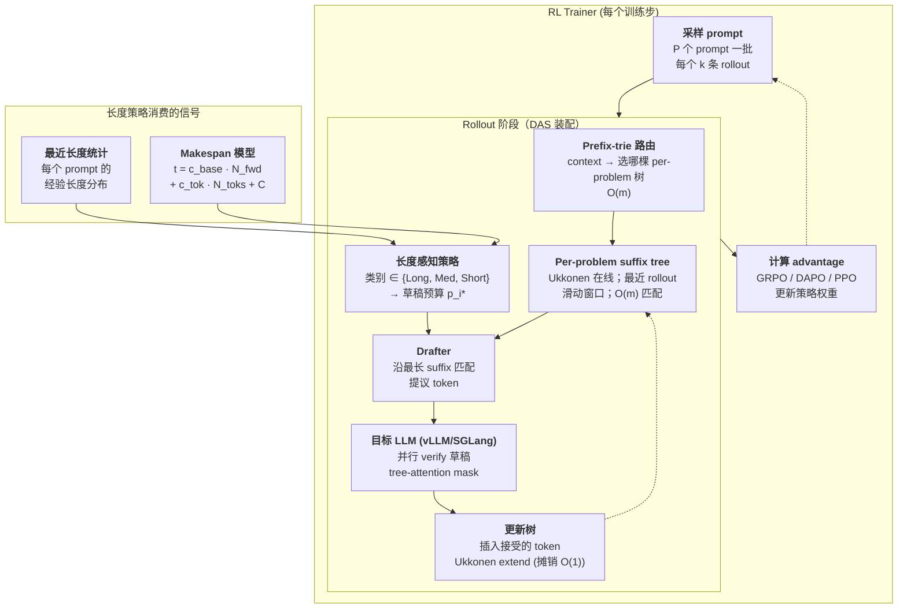

# DAS：面向 RL 训练的分布感知投机解码

> [!info] 论文元信息
> - **论文**：[arXiv:2511.13841](https://arxiv.org/abs/2511.13841) — *Beat the long tail: Distribution-Aware Speculative Decoding for RL Training*（2025-11-17 提交，MLSys 匿名投稿）
> - **代码**：尚未公开
> - **作者**：Zelei Shao, Vikranth Srivatsa, Sanjana Srivastava, Qingyang Wu, Alpay Ariyak, Xiaoxia Wu, Ameen Patel, Jue Wang, Percy Liang, Tri Dao, Ce Zhang, Yiying Zhang, Ben Athiwaratkun, Chenfeng Xu, Junxiong Wang

> [!abstract]+ TL;DR
> RL 后训练的大部分 wall-time 花在 **生成 rollout** 而不是梯度计算上 —— 而 rollout 长度分布 **长尾**，最长的几条样本决定整批的 makespan。DAS 用两个互相放大的想法攻击这个问题：**(1) 基于最近 rollout 在线构建的 suffix tree 草稿器**，每个迭代用 Ukkonen 算法 $O(m)$ 插入刷新，按 prompt 分桶 + prefix trie 路由 —— 不需要预训练 drafter、不占额外 GPU、草稿质量随策略漂移自动跟上；**(2) 长度感知的投机策略**：把 makespan 显式建模为 $t_{\text{total}} = c_{\text{base}} N_{\text{fwd}} + c_{\text{tok}} N_{\text{toks}} + C$，求解出 *预期 rollout 越长应分配越大的草稿预算，最短的样本应该完全关掉投机解码*，包装成 Long / Medium / Short 三分类启发式。结果：数学 RL **rollout 时间下降 > 50 %**（DeepSeek-R1-Distill-Qwen-7B，DSR-sub，1× 8×H100，batch 128，30 步）；代码 RL **下降约 25 %**（Qwen3-8B，DeepCoder，2× 8×H100）；reward 曲线与无投机基线完全一致。

---

## 背景：通用投机解码为什么在 RL rollout 上失灵

RLHF / RLVR 训练的主要开销已经不再是梯度计算 —— 而是 **rollout 阶段**：对训练批中的每个 prompt，当前策略要生成 $k$ 个样本（常见 8 或 16），最长序列长度通常 16 K。[[ppo-for-llm|PPO]]、[[grpo|GRPO]] 和 DAPO 都共享这个形状；ProRL-style 框架（[[prorl-agent]]）把它具象成"rollout 即服务"。在单台 8×H100 节点上，一个数学 RL 步通常 >80 % 的 wall-time 都耗在推理引擎里。

两个结构性事实让 rollout 痛苦 —— 也正是 DAS 利用的两点：

1. **长度分布长尾。** 大多数样本远没用满 16 K 上限就结束了，但少数样本会撞到上限。整批 wall-time 由 **最后一条** 样本决定，不是平均值。把中位 rollout 时间砍一半对 makespan 毫无帮助。
2. **策略非平稳。** 模型每个迭代都在更新。任何预训练的 drafter（EAGLE、Medusa、蒸馏小模型）会随策略漂移而衰退 —— 而每步重训 drafter 本身就是一条独立的训练循环。

[[speculative-decoding|通用投机解码]] 解决的是 serving 中的"每请求延迟"（用 draft 模型提议 $\gamma$ 个 token，target 模型并行 verify，理论上无损 2–6× 加速）。直接套到 RL rollout 上两点都崩：

- **预训练 drafter 会漂。** EAGLE / Medusa 针对固定 target 训练；target 一动它们 acceptance rate 就掉，verifier 反而每个被拒提议要多做 $\gamma + 1$ 次浪费的 forward。
- **统一草稿预算伤长尾。** 对 50-token 的 rollout 和 14 K-token 的 rollout 用同样的草稿预算两头都不对：短请求付的草稿开销永远收不回来；长请求把可压缩的加速白白扔掉。

于是问题变成：*对一个在变的策略，什么 drafter 合适？对一个 makespan 由最长几条决定的工作负载，什么预算策略合适？* DAS 对这两个问题都给了干净的答案。

> [!quote] 一句话重构问题
> RL 训练里的投机解码不是"每请求延迟"问题，是 **批 makespan** 问题；最合适的 drafter 是 **策略自己最近生成的输出**。

### 与同期工作的对比

DAS 出现在 2025 年末/2026 年初一波 RL 专用投机解码工作里：

| 方法              | Drafter                                  | 预算策略                  | 目标工作负载        |
| ----------------- | ---------------------------------------- | ------------------------ | ------------------- |
| EAGLE-2 / EAGLE-3 | 训练好的自回归特征头                     | 固定 γ（有时自适应）     | 通用 serving        |
| Medusa            | 多个并行头                               | 固定 γ                    | 通用 serving        |
| SuffixDecoding    | 全局 suffix tree（所有历史输出）         | 固定 γ                    | 通用 serving        |
| SPEC-RL           | RL 训练中周期性重训小模型                | 固定 γ                    | RL rollout          |
| FastGRPO          | GRPO 感知的样本复用                      | 不适用（样本而非 token） | GRPO rollout        |
| RhymeRL           | 跨样本的相似前缀匹配                     | 固定 γ                    | RL rollout          |
| **DAS（本文）**   | **Per-problem 在线 suffix tree + prefix trie** | **通过 makespan 优化的长度感知策略** | **RL rollout** |

> [!question]+ Shiki：为什么用 *suffix tree*，为什么 *按问题分桶*？（2026-05-13）
> 两个相互关联的设计选择，都承重。
>
> **为什么 suffix tree？** RL 训练中同一个 prompt 一步内被 rollout $k$ 次、跨步也会被反复 rollout。同一道题的多个样本会共享很长的子串 —— 同样的推理链、同样的 Lean tactic、同样的 Python 模板 —— 即使表面文本不同。前缀 trie 只能找从位置 0 开始的匹配；**suffix tree** 能找到 *当前 context* 在任意历史样本中作为任意子串的最长匹配。这才是正确的原语：解码时你问"我历史上有没有生成过以这个 context 结尾的东西？"，suffix tree 在 $O(m)$ 时间内回答（$m$ 是 context 长度）。drafter 然后提议历史上跟在那个匹配点之后的路径。
>
> **为什么按问题分桶？** 一棵全局 suffix tree 会把化学题、Lean 证明、Python 算法竞赛题的样本混在一起。Lean 证明里 "lemma " 后面跟的子串和化学论述里 "lemma " 后面跟的子串 *毫无关系*。混在一起会降低 acceptance rate 同时膨胀树。DAS 给每个 prompt（或每簇相关 prompt）一棵 suffix tree，再用一个小 prefix trie 作为路由 —— "我该查哪棵树" 本身也是 $O(m)$。"最近 rollout"的滑动窗口控制 bias-stability 折中：窗口太窄抓不到策略正在稳定下来的模式；太宽会带进早期策略的过期样本。

---

## 核心思想：两半构成一个系统

> [!quote] 一句话总结
> 从 **策略最近的 rollout** 在线构建 drafter（每个问题一棵 suffix tree，Ukkonen 算法），再把 **每请求草稿预算** 设成使 *批 makespan 最小* 的解（预期 rollout 越长预算越大，最短的直接关掉投机）。

两半是相互独立的贡献，缝在同一个系统里：

- **drafter 跟着策略走还不要钱。** 没有 GPU 显存占用，不用额外训练循环，不需要校准数据。Suffix tree 就长在你本来就要生成的 rollout 上，Ukkonen 在线算法让新样本以线性时间被吸收。整个训练过程 acceptance rate 保持高位 —— drafter *就是* 策略最近的行为。
- **预算策略从代价模型推导出来。** DAS 不是扫超参选 $\gamma$ —— 它写下代价方程，把 acceptance 建模成 budget 的函数，解出使批总时间最小的 budget。结果是一个干净的闭式表达，再用三桶启发式做实际部署。

下面把两半各自讲具体。

---

## 实现细节

### DAS 在 rollout 循环里的位置



图里两个点值得点出来：

- **DAS 是推理路径上的 drop-in。** 它完全不改 trainer 侧 —— 梯度、advantage、KL 项、reward shaping 都保留在原位。新增组件全部在 rollout 引擎内部：路由、树、预算策略、和一个薄薄的 draft-and-verify 包装。
- **drafter 自我增长。** 每个被接受的 token 都会回写到对应问题的 suffix tree 里（Ukkonen 在线扩展每字符摊销 $O(1)$），所以单个训练步内随着 rollout 完成 drafter 会变得更好 —— 这是 DAS 不付 warm-up 成本的结构性原因。

### Suffix tree drafter

字符串 $s$（长度 $n$）的 **suffix tree** 是它所有 $n$ 个后缀的压缩 trie。对长度 $m$ 的查询，它能在 $O(m)$ 时间内回答两个问题：

1. *我这个查询在 $s$ 里作为子串出现过吗？*（从根开始按查询字符往下走）
2. *历史上有什么字符串跟在这个子串之后？*（匹配到最深节点处的子树就是答案集合）

Ukkonen 算法（1995）能在总 $O(n)$ 时间内 **在线** 构建 suffix tree —— 一次处理一个字符，借 suffix-link 技巧每字符摊销 $O(1)$。这正是 DAS 需要的性质：每次 rollout 产生一个被接受的 token，树都能不重算地吸收它。

**drafter 在解码时做什么**，伪代码：

```python
def das_draft(context, prompt_id, budget_p):
    # 1. 路由到正确的树。prefix trie 用 prompt 嵌入 / 问题 id 作键，
    #    返回该问题的 suffix tree。
    tree = trees[prefix_router.route(prompt_id)]

    # 2. 找 context 的最长后缀在 tree 中出现的最深节点。O(m) top-down，
    #    Ukkonen 的 suffix link 让我们一次到位拿到最长匹配。
    node, match_len = tree.longest_suffix_match(context)
    if match_len == 0:
        return []                          # 这一步不出草稿

    # 3. 从最深匹配节点出发，沿出现次数最多的延续往下走，最多 budget_p
    #    个 token。频次由边上的计数维护（Ukkonen 扩展时一并更新）。
    return tree.most_frequent_continuation(node, max_len=budget_p)


def rollout_one_step(prompt, policy, max_len=16384):
    context = prompt
    while not done(context) and len(context) < max_len:
        # 1. 由长度感知策略决定预算（见下一小节）。
        p = budget_policy(prompt, len(context), recent_length_stats)

        # 2. 从 suffix tree 构建草稿。
        draft = das_draft(context, prompt.id, budget_p=p)

        # 3. target LLM 并行 verify。
        accepted, resampled = policy.verify(context, draft)

        # 4. 提交被接受的 token 和重采样 token。
        context += accepted + [resampled]

        # 5. Ukkonen 在线扩展更新树。
        trees[prompt.id].extend(accepted + [resampled])
    return context
```

这个设计里有三个结构性选择教科书 spec-decoding 文章不会强调：

- **drafter 就是 *输出本身*，不是另一个模型。** 草稿阶段没有第二次 forward —— 只是一次树遍历。即便树涨到上百万字符，自顶向下走的开销也是微秒级（Ukkonen-style suffix tree 指针密集，但 top-down 走非常 cache-friendly）。GPU 上只跑 verifier。
- **按 problem 分桶是 acceptance rate 的关键。** 一棵 *全局* suffix tree（参见 SuffixDecoding）会看到系统里所有 rollout，结果是草稿被"什么都见过"洗淡 —— 任何短 context 的最常见延续都被跨问题类型平均掉了。DAS 按 prompt 分桶 —— 化学题的 16 个样本共享一棵树，但不跟旁边的 Lean 证明共享 —— prefix trie 路由让"选哪棵树"以 $O(m)$ 完成，分桶本质上不要钱。
- **滑动窗口控制 bias-stability 折中。** 历史 rollout 太少树没见过足够模式；太多会带进策略已经移动过的过期草稿。论文做了扫描；实践答案是"这个问题最近几个迭代的 rollout"，正好对应策略当前在做什么。

### 长度感知的投机策略

这是论文把启发式变成推导的另一半。DAS 写下显式的 makespan 模型，求解最优草稿预算。

**Makespan 模型。** 把单条 rollout（请求 $i$，预期长度 $l_i$）拆成 $N_{\text{fwd}}$ 次 forward，共产出 $N_{\text{toks}}$ 个被接受的 token。每次 forward 有固定开销 $c_{\text{base}}$（kernel launch、KV cache I/O、RoPE 等）外加每 token 代价 $c_{\text{tok}}$（与 verify 的 token 数成比例的 attention + MLP 工作量）。再加一个 setup 常数 $C$：

$$
\boxed{\,t_{\text{fwd}} = c_{\text{base}} + c_{\text{tok}}\, n_{\text{toks}}, \qquad t_{\text{total}} = c_{\text{base}}\, N_{\text{fwd}} + c_{\text{tok}}\, N_{\text{toks}} + C\,}
$$

没有投机时 $N_{\text{fwd}} = N_{\text{toks}} = l_i$，所以 $t_{\text{total}} \approx (c_{\text{base}} + c_{\text{tok}}) l_i$ —— 这里 $c_{\text{base}}$ 占主导，因为每次 forward 只出一个 token。投机解码的 *根本动机* 就是 **缩 $N_{\text{fwd}}$ 换大 $N_{\text{toks}}$**（每次 forward 验更多 token，包含被拒的）。

**Acceptance 模型。** 请求 $i$ 在整条 rollout 上分配预算 $p_i$ 个 token，预期被接受的 token 数遵循饱和指数：

$$
A_i(p_i) = k_i\, l_i\, \bigl(1 - e^{-\alpha_i p_i / l_i}\bigr)
$$

其中 $\alpha_i$ 是 *acceptance 效率*（drafter 对这条请求多好；$\alpha_i$ 越大每个提议 token 平均产出更多接受 token），$k_i \in (0, 1]$ 是 *最大可达接受比例*（接受 token 数不能超过 rollout 本身长度，即便预算无穷大也总有一定比例会被拒）。这个函数形式来自经验观察（EAGLE-style 工作里也有），每位置 acceptance 随草稿链中位置近似指数衰减：

$$
a_{i,k} = a_{i,0}\, e^{-\beta_i (k-1)}
$$

即匹配点之后第 $k$ 个草稿 token 被接受的概率以 $\beta_i$ 速率指数衰减。把这个几何级数沿 rollout 长度积分就得到上面的饱和形式；$\alpha_i$ 是 $a_{i,0}$ 和 $\beta_i$ 的函数。

**最优预算。** 把这些拼起来，$N_{\text{fwd}}$ 变成（消耗 $l_i$ 个 token 所需的 forward 数，其中 $A_i(p_i)$ 来自草稿）：

$$
N_{\text{fwd}}(p_i) = l_i - A_i(p_i) + \frac{p_i}{l_i}\cdot l_i \;\;\Rightarrow\;\; t_i(p_i) = c_{\text{base}}\, N_{\text{fwd}}(p_i) + c_{\text{tok}}\,(l_i + p_i) + C
$$

对 $p_i$ 求 $t_i$ 的最小值并解出（论文 Eq. 7）得到闭式解：

$$
\boxed{\,p_i^{\,*} = -\frac{l_i}{\alpha_i}\, \ln\!\Bigl(1 - k_i\bigl(1 - \tfrac{N_{\text{fwd}}}{l_i}\bigr)\Bigr) \quad \text{若 } N_{\text{fwd}} < l_i,\quad \text{否则 } p_i^{\,*} = 0\,}
$$

公式有三层直觉读法：

1. **$p_i^* \propto l_i$。** 预期越长的 rollout 应分配越大的草稿预算 —— 投机带来的 makespan 收益与"能压缩掉多少次 forward"成比例。
2. **$p_i^* \propto 1/\alpha_i$。** drafter 越差（$\alpha_i$ 越小）需要 *更多* 提议 token 才能榨出同样加速 —— 但有一个临界。drafter 太差时（$N_{\text{fwd}} \geq l_i$），公式正确地返回 $p_i^* = 0$（干脆别投机了）。
3. **$-\ln(\cdot)$ 是饱和栅栏。** $p_i \to \infty$ 时 log 的自变量从上方逼近 0，$p_i^*$ 看起来要爆炸 —— 但 $k_i$ 把它压住。实际中 $k_i$ 远低于 1（典型 0.6–0.85），最优预算被卡在一个有限合理的数。

**三分类启发式。** 真正每条请求都解 $p_i^*$（要估 $l_i, \alpha_i, k_i$）开销太大。DAS 用离散三桶近似，依据请求的 *预测* 类别决定预算：

$$
\text{Init}_r = \arg\max_{c \in \{\text{Long}, \text{Med}, \text{Short}\}} \#\{r' \sim r : r' \in c\}
$$

即根据类似（相同）prompt 最近 rollout 的多数类别给请求 $r$ 分类。然后在运行时更新：

$$
\text{Class}_r \mid l, \text{Init}_r = \arg\max_c P(c \mid l, \text{Init}_r)
$$

即随着 rollout 长度逐步揭示真实长度，更新类别。类别映射到草稿预算：

| 类别       | 启发阈值（近似）                  | 草稿预算         | 为什么                                          |
| --------- | --------------------------------- | ---------------- | ---------------------------------------------- |
| **Long**  | 最近 rollout 长度顶部分位        | 激进（高 $p_i^*$） | 长 rollout 决定 makespan，高预算能赚到。       |
| **Med**   | 中间分位                          | 中等             | 有用但不是瓶颈。                                |
| **Short** | 底部分位（如 < 1K token）         | **0（关闭）**     | 草稿开销 > 预期节省；直接不投机。              |

> [!important] 最可操作的单点发现
> 让 **短尾样本完全关闭投机** 是让算术成立的关键一步。朴素地对每个请求一律启用投机会让原本几个 token 就能结束的样本付出 draft-tree-walk + verify-overhead 税；makespan 模型说正确做法是 *那些根本别投机*。这样 "Long" 桶就能拿到比统一 $\gamma$ 高得多的预算。

Long / Med / Short 的具体阈值论文里没有写死 —— 它们按当前工作负载的最近 rollout 长度经验分布定，每个迭代重估。可推广的是结构：三桶，最大那桶预算最大，最小那桶预算为 0。

---

## 实验

### 数学 RL —— DeepSeek-R1-Distill-Qwen-7B on DSR-sub

**设置。** DeepScaleR 的 1,209 题筛选子集（DSR-sub），1× 8×H100，训练 batch 128，每题 16 个样本，最大序列长度 16 K，30 个训练步。Trainer 是 GRPO-family（DAPO-style clipping）。

**结果。** 与原版 vLLM/SGLang rollout 相比，**rollout 总时间下降 > 50 %**。Reward 曲线完全一致：DAS 是 *无损的*（rejection sampling 严格保持 target 分布 —— 见 [[speculative-decoding]]），训练完模型的评估指标与无投机 baseline 在噪声以内相同。

>50 % 是在 30 步的整段训练上平均的，不是挑出来的一步。这点重要 —— drafter 质量会随策略漂移变化；整条训练轨迹上保持 50 %+ 才是真正难站住的声明，也正是 DAS 给出的。

### 代码 RL —— Qwen3-8B on DeepCoder

**设置。** 2× 8×H100 节点，每 GPU batch 32，每题 8 个样本，最大序列长度 16 K。Trainer 是 GRPO + 代码执行 reward（DeepCoder 流水线）。

**结果。** **rollout 时间下降约 25 %**。比数学 RL 小，但仍可观 —— 代码 rollout 同一道题的解多样性更高（多种合法解、控制流分支），suffix tree 草稿 acceptance rate 更低。drafter *变差* 的情况下 DAS 还能拿到 25 %，恰好验证整套框架：预算策略在低 acceptance 区域 *自动减投入*，拿到能拿到的加速而不付溢出开销。

### 消融

论文里两组 ablation 切片（Fig. 12, Fig. 13）：

- **分布感知 vs. 无限预算。** 给每条请求无限草稿预算的策略 *输给* 分布感知策略 **最多 15 %** 的 rollout 时间。这就是给短尾付投机开销的成本 —— "对短请求关掉投机" 这一条启发式本身值 ~15 %。
- **对序列长度的鲁棒性。** 最大序列长度降到 8 K，DAS 仍能拿 **> 30 % 加速**。加速随序列上限单调增长（长尾越长 makespan 越被它决定），与 makespan 模型一致：最优预算公式给出 $p_i^* \propto l_i$。

### 一个 wall-clock 直觉检验

按 makespan 模型，在 $c_{\text{base}} \gg c_{\text{tok}}$ 的内存带宽瓶颈解码下，一条长 $l$ 的 vanilla rollout 大约耗 $l \cdot c_{\text{base}}$。DAS 让同一条 rollout 耗 $\approx (l - A) c_{\text{base}} + (l + p) c_{\text{tok}}$，其中 $A$ 是被接受的草稿数。若 $A \approx 0.6 l$（中等预算下的现实接受比例）且 $c_{\text{tok}} \ll c_{\text{base}}$，rollout 总耗时降到 $\approx 0.4 l \cdot c_{\text{base}}$ —— 即 60 % 下降。这与数学 RL 上 >50 % 的实测对得上（suffix tree acceptance 在数学题上很高）；代码 RL 上 drafter 弱，$A$ 小，所以加速缩到 25 %。模型与实验吻合。

---

## 优势与限制

**优势：**

- **drafter 不占 GPU 显存。** 没有第二个模型权重，没有优化器状态膨胀。纯 CPU 侧的数据结构，靠 Ukkonen 吸收被接受的 token。对一台已经跑 7–8 B 策略 + 优化器状态的 8×H100 节点，"不要额外 GPU" 是真实约束，DAS 守住了。
- **drafter 自动跟上策略。** 没有重训循环、不要校准、没有调度决策。能做到这一点的结构本身就优雅 —— *策略最近的输出就是 drafter*。
- **预算策略是推导出来的。** 大多数 spec-decoding 论文扫超参选 $\gamma$；DAS 写下代价方程然后求解。闭式最优预算是那种 *会超越任何具体实现存活下去* 的方程。
- **无损。** 跟标准投机解码一样的 rejection sampling，reward 曲线和最终评估与无投机基线完全一致。没有质量-速度权衡需要管理。

**限制（论文坦诚但确实重要）：**

- **代码尚未公开。** 投稿时是 MLSys 匿名稿，没有配套 GitHub。复现需要在 vLLM 或 SGLang 上自己实现 Ukkonen + per-problem 分桶 + makespan-aware 预算。具体 kernel hook（drafter 调用在引擎里的位置、与 prefix-cache 的交互方式）没有公开。
- **只评估了数学和代码推理。** 通用 chat-style RL（开放偏好数据上的 RLHF）是另一种分布形状 —— 长尾仍然存在，但 suffix tree drafter 假设大量子串重复，这在数学/代码（Lean tactic、Python idiom）上成立，在自由散文上未必。论文没测。
- **两个模型规模（7 B、8 B）。** 都在 dense 小模型区间。加速是否平移到 70 B / 405 B 或 MoE 策略上是开问题。makespan 模型说加速 *应该* 随模型增大（$c_{\text{base}}$ 更大，压缩 forward 更值），但这条预测没被测试。
- **没分析与 prefix cache 的相互作用。** 现代服务引擎（[[vllm|vLLM]] V1、[[sglang|SGLang]] RadixAttention）能跨同 prompt 的多个 rollout 复用 KV cache。投机解码与 prefix cache 的交互非平凡 —— prefix 是共享的但投机延续是分叉的。论文没分析 DAS 与 prefix cache 是 *相加* 还是 *相争*。
- **三分类启发式是工作负载特定的。** Long/Med/Short 阈值从最近 rollout 估出来。流程自动，但意味着长度分布不同的工作负载（例如固定长度的 agentic loop）可能要换桶数或换连续策略。
- **没有与 EAGLE-2 / EAGLE-3 在 RL rollout 场景下的对比。** EAGLE 系列是最强的通用开源投机 drafter；DAS 主张它们在策略更新下会漂，但没量化"周期性重训" EAGLE 与"在线 suffix tree"两条路线的加速差。
- **与 SuffixDecoding / SPEC-RL / FastGRPO / RhymeRL 同期且部分重叠。** *论文上* DAS 的差异化干净（per-problem 树、长度感知策略），但同硬件 head-to-head 还没发表。

> [!note] 最可迁移的单点 lesson
> **makespan-aware 预算策略** 是这篇论文里最难想到、最容易抄走的贡献。即使你用 EAGLE / Medusa / RhymeRL drafter，"长尾 rollout 工作负载需要 *每请求* 预算（短请求 *零* 预算）" 这一个观察本身就值 ~15 %，且适用于任何 RL 框架下的任何 spec decoder。

---

## 这意味着什么

两条慢热但值得跟踪的影响：

1. **drafter 与 policy 会继续合并。** DAS 是一个趋势里的中间一步，趋势从 EAGLE（target 自己隐藏状态出特征级草稿）开始，经 SuffixDecoding（完全没模型，只用历史输出）继续。自然终点是 "policy *就是* drafter，没有第二个模型" —— DAS 通过用 policy 最近的 rollout 作为 drafter 逼近这个终点。2026 年这条线还会继续缩。
2. **投机解码进入训练阶段，不再只是服务阶段。** Serving 社区花了五年在每请求延迟上；RL 训练社区现在把同样的工具拿过来，发现假设变了 —— 策略非平稳、批 makespan、长尾。研究新表面是 *在工作负载模型下重新推导投机解码*，而不是复用服务式 $\gamma$ 扫描。DAS 的 makespan 方程就是那种会孵出一串 follow-up 的对象。

这 *不是*：通用 LLM serving 的答案（suffix tree drafter 利用的批内子串重复在互联网开放流量里不存在），也不是 [[prorl-agent|RaaS 式基础设施]] 的替代（正交：DAS 加速 rollout 服务的内部，ProRL Agent 加速 rollout 服务的编排）。两者叠加。

---

## 源码与复现

提交时尚无公开代码。复现需要：

| 组件                                   | 落在哪里                                                                       |
| ------------------------------------- | ----------------------------------------------------------------------------- |
| Per-problem suffix tree + Ukkonen 在线 | rollout worker 内部的 CPU 侧数据结构（例如 [[prorl-agent|ProRL Agent]] 的 `_worker` 里）。 |
| Prefix trie 路由                       | 同上；以 `prompt_id` 或 prompt 嵌入为 key。                                    |
| 长度分类器（Long/Med/Short）           | 各问题最近 rollout 上的小在线估计器。                                          |
| 预算策略                              | 一个标量，rollout 启动时设定，运行中可随长度增长更新。                          |
| Draft + verify 包装                    | 钩入 vLLM / SGLang 的投机解码流水线（`SpecConfig`、draft model 接口）。         |

最干净的工程路径：在已有的 [[speculative-decoding|spec-decoding-enabled]] 引擎（[[vllm|vLLM]] V1 spec-decoding stack 或 SGLang `SpecForward`）上加一个实现该引擎 drafter 接口的 suffix-tree drafter，再加一个 trainer 按 makespan 公式设置的 per-request `max_draft_tokens`。

---

## 相关阅读

- [[speculative-decoding]] —— Draft-verify 加速总览；DAS 所在的 EAGLE / Medusa / SuffixDecoding 谱系。
- [[prorl-agent]] —— Rollout-as-a-service 基础设施；与 DAS 正交，可叠加。
- [[grpo]] —— GRPO 与 DAPO 变体；DAS 目标工作负载的 trainer 一侧。
- [[continuous-batching]] —— Rollout 批用连续批处理；makespan 故事与调度器如何派发 forward 相互作用。
- [[kv-cache-optimization]] —— 同 prompt 多 rollout 共享前缀的 prefix cache；在引擎层与 DAS 互补（可能也相争）。
- [[vllm]] / [[sglang]] —— DAS 落地的推理引擎候选。
- [[long-context-serving]] —— 长尾问题最锐利的场景，也是 DAS 加速最大的场景。

## 参考文献

- Shao, Srivatsa, Srivastava et al. (2025). *Beat the long tail: Distribution-Aware Speculative Decoding for RL Training*. [arXiv:2511.13841](https://arxiv.org/abs/2511.13841).
- Ukkonen, E. (1995). *On-line construction of suffix trees*. Algorithmica 14(3): 249–260.（DAS drafter 使用的线性时间在线 suffix tree 算法。）
- Leviathan, Y., Kalman, M., Matias, Y. (2023). *Fast Inference from Transformers via Speculative Decoding*. ICML 2023.
- Li, Y., Wei, F., Zhang, C., Zhang, H. (2024–2025). *EAGLE / EAGLE-2 / EAGLE-3*.（DAS 对照的最强通用 spec-decoding drafter 系列。）
- *SuffixDecoding*、*SPEC-RL*、*FastGRPO*、*RhymeRL* —— 2025–2026 同期 RL 专用投机解码工作；DAS 以 per-problem 树 + 长度感知预算策略区分自己。
