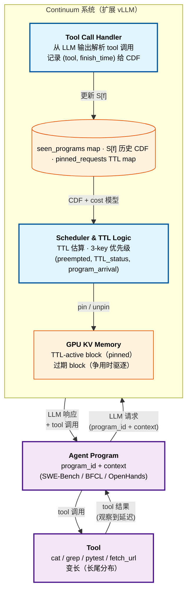

# Continuum：基于 KV Cache Time-to-Live 的高效鲁棒多轮 LLM Agent 调度

> [!info] 论文元数据
> - **论文**：[arXiv:2511.02230](https://arxiv.org/abs/2511.02230) —— *Continuum: Efficient and Robust Multi-Turn LLM Agent Scheduling with KV Cache Time-to-Live*，2025-11-04（v6: 2026-05-25）
> - **代码**：[Hanchenli/vllm-continuum](https://github.com/Hanchenli/vllm-continuum) —— 第一作者 Hanchen Li 已开源（vLLM fork）
> - **作者**：Hanchen Li\*（UC Berkeley）、Runyuan He\*（UC Berkeley）、Qiuyang Mang（UC Berkeley）、Qizheng Zhang（Stanford）、Huanzhi Mao（UC Berkeley）、Xiaokun Chen（Tensormesh）、Hangrui Zhou（清华）、Alvin Cheung（UC Berkeley）、Joseph Gonzalez（UC Berkeley）、Ion Stoica（UC Berkeley）
> - **机构**：UC Berkeley、Stanford、Tensormesh、清华
> - **实现**：vLLM 0.10.2 fork，~1k 行 Python

> [!important] Continuum 在 agent-serving 栈中的位置
> Continuum 是**第一个为 agentic 多轮模式专门设计的 KV cache 管理系统** —— 显式建模了之前 cache 保留工作（InferCept、Pie、Autellix）忽略的 per-turn queueing delay。对任何服务多轮编程 agent（SWE-Bench 风格）、函数调用 agent（BFCL 风格）或计算机使用 agent（OpenHands 风格）的部署都是承重的。本页在 agent-serving 类别中与 [[agent-serving-challenges]] 和 [[multi-turn-optimization]] 并列。

---

## 摘要（2 分钟读完）

**它是什么。** Continuum 是建在 [[vllm|vLLM]] 之上的 KV cache 保留 + 请求调度系统（~1k 行 Python），专门针对多轮 LLM agent 工作负载。引入 **TTL（time-to-live）机制**，在 tool 执行窗口期间选择性地把请求的 KV cache 钉在 GPU 内存里，TTL 值由 cost-benefit 模型计算 —— 同时考虑 *reload cost*（重算 prefill / CPU 卸载恢复）和 *per-turn queueing delay*（返回的请求要排队等新接纳的请求让出 GPU）。

**核心 idea。** **TTL 感知的 KV cache pinning + program 级 FCFS 调度**。三个子部件让它工作：

1. **TTL 效用模型** —— 形式化的 cost-benefit 框架，pinning 请求 `r` 维持 τ 秒的代价是 `MemUsage(r)/M × τ` 的阻塞队列时间，收益是 `CacheMissCost`（重新 prefill 或 CPU 重载）加 `OutOfOrderCost`（被驱逐再重入会产生的排队延迟）之和。最优 TTL 是 `τ* = argmax P(τ, f) · Benefit(r) − Cost(τ, r)`，其中 `P(τ, f)` 是工具 `f` 历史调用时长的经验 CDF。
2. **Program 级 FCFS** —— *program*（= 一个 agent 的生命周期，不是一次 LLM 请求）是 FCFS 的单位。program 内的请求保持 program 的到达顺序，所以更早开始的 agent 会更早完成，即使它的轮次散布在时间上。
3. **TTL 过期时的鲁棒驱逐** —— 如果 tool 调用比预测的长，pinned KV 自动过期被驱逐，避免一个长尾 tool 调用（如 `pytest` 20+ 秒超时）把内存挟持的病态情况。

去掉 TTL 上界，一个慢 tool 调用就可能死锁 GPU；去掉 program 级 FCFS，program 顺序会任意漂移；去掉 cost-benefit 模型就退回 InferCept 风格的"只在 reload cost 高时保留"，忽略了排队代价。

**头号实验结果。** 在 **SWE-Bench、BFCL v4、OpenHands** 上 trace 回放，在 **Llama-3.1-8B、Llama-3.1-70B、Gemma-3-12B** 上覆盖 **A100 / H100 / B200** 硬件：

| 指标 | Baseline 范围 | Continuum | 提升 |
| --- | ------------ | --------- | ---- |
| 平均 job 延迟 | vLLM / Autellix / InferCept | **低 1.12×–3.66×** | 最多 3.66× |
| 吞吐 | 同 baseline | **高 1.10×–3.22×** | 最多 3.22× |
| **真实 SWE-agent（分布式，H100）** | SGLang、NVIDIA Dynamo | **延迟低多达 8.18×** | 8.18× 头条数字 |
| OpenHands rollout（8×H100 上 GLM-4.5-fp8）| vLLM 93.4 步/分，ThunderAgent 114.8 | **144.9 步/分** | vs ThunderAgent +27%、vs vLLM +55% |

**为什么重要。**

- **关闭了 per-turn queueing-delay 缺口。** 之前的 agent 感知 caching（InferCept）只优化 reload cost，让 *等其它请求释放 GPU 内存* 的代价成为跨轮累积的隐形杀手。Continuum 是第一个建模并解决这点的。
- **对 tool 调用方差鲁棒。** 真实 tool 调用是长尾的（最慢 10% 的 `fetch_url` 调用 = 总延迟的 52.5%；最慢 10% 的 `cd` 调用 = 94.1%）。静态"永久保留"在这种情况下崩溃；带过期的 TTL 不会。
- **集成代价低。** vLLM 0.10.2 之上 ~1k 行 Python，无自定义 CUDA kernel，调度器开销 ~1ms。可立即生产部署。
- **2027 年预测。** TTL-vs-LRU 选择会成为 agent serving 中标准的 KV cache 驱逐问题，program_id 会成为 vLLM / SGLang / Dynamo `RequestMetadata` 里的一等字段。"agent program" 抽象比具体 TTL 公式更持久。

---

# 详细内容（深入阅读从这里开始）

## 背景：之前系统未解决的两种失败模式

论文 Fig. 1 命名了两种失败模式：


**vLLM / SGLang 默认策略**是 Continuum 论文叫的 *end-of-turn 驱逐* —— 这跟纯 LRU **不是一回事**，尽管听起来像。

> [!warning] "End-of-turn 驱逐" vs 纯 LRU —— 一个微妙但重要的区别
> 纯 LRU 按 *最近访问时间* 排序，驱逐最旧的。一个刚完成的请求 KV 实际上*最近被访问过*，在 LRU 排名里靠前，**不会**优先被驱逐。
>
> vLLM/SGLang 实际做的是 **release-on-completion**：请求 decoding 完成的瞬间，KV block 立刻被移到 "free pool"（标记为可被覆盖），隐式假设*请求结束了不会再回来*。新请求到达时优先从 free pool 取 —— 所以刚完成请求的 KV 在繁忙服务器上几毫秒内就被覆盖。
>
> 实际效果**跟 LRU 相反**：完成的 KV 是*第一个*被覆盖的候选，不是*最后一个*。Continuum 论文用 "end-of-turn 驱逐" 这个术语让区别明确。对聊天机器人 serving 这是对的 —— 下一个人类轮次要数秒到数分钟后才到，那时 KV 早没了。对下轮 ~1 秒内就到的 agent 是灾难性错误。

**但对 agent，这正好是错的。** 论文数据（Table 2）：

| 数据集 | 轮次/程序 | Tool 时间 (ms) | tokens/程序 |
| ----- | --------:| --------------:| ----------:|
| **SWE-Bench** | 10.9 ± 2.1 | 925 ± 3550 | 70,126 ± 19,732 |
| **BFCL v4** | 6.3 ± 2.3 | 1923 ± 2133 | 93,256 ± 68,687 |

平均 tool 延迟远低于 2 秒 —— 比人类打字短得多 —— 所以下一个 LLM 请求会在 KV 还热的时候到达。驱逐它强制每轮重新 prefill ~70K tokens。跨 10.9 轮，每个 SWE-Bench job 多 770K tokens 的 prefill。

具体 SWE-Agent 例子（论文 Fig. 2）展示一个 program 长什么样 —— 短 LLM reasoning 步交替 `grep` / `cat` / `sed` / `pytest` 等 tool 调用，每次 agent 都能受益于亚秒级跨 tool 调用的 KV 保留：


**InferCept**（Abhyankar et al., 2024）是第一个解决这点的：tool 调用期间，如果估计的 reload cost 超过 GPU 占用 cost 就 pin KV。但它**纯粹基于 reload cost** 做保留决定，忽略 per-turn queueing delay。有了 LMCache 风格的快 CPU offload，reload 变便宜 InferCept 就不 pin —— 但返回的请求仍要排队等 KV 卸出去时被接纳的其它请求。**论文测量（Fig. 4）显示 InferCept 跨轮累积的等待时间跟 vanilla vLLM 相当，尽管它有 reload 省下来的开销**。

| 方法 | 保留 KV cache | 包含 per-turn queueing delay | 限制保留时间 |
| --- | :----------: | :-------------------------: | :--------: |
| **vLLM** | ✗ | ✗ | ✗ |
| **Autellix**（Luo et al., 2025）| ✗ | ✗ | ✗ |
| **Pie**（SOSP 2025）| ✓（可编程）| ✗ | ✗ |
| **InferCept** | ✓ | ✗ | ✗ |
| **Continuum** | **✓** | **✓** | **✓** |

第三列重要，因为 **tool 调用长尾**（论文 Fig. 5）：最慢 10% 的 `BFCL/fetch_url` 调用 = 总延迟 52.5%；最慢 10% 的 `SWE-Bench/cd` 调用 = 94.1%。静态"永远保留"策略在稳定延迟下 work 但**当一个异常 tool 调用阻塞 GPU 内存几十秒时灾难性失败**。Continuum 的 TTL 上界让 pinning 安全。


## 三个核心组件详解

### 组件 1 —— TTL 效用模型

对每个请求 `r` 和 TTL 值 `τ`，Continuum 估算：

**Cost（以阻塞其它请求的延迟为单位）：**
$$
\text{Cost}(\tau, r) = \frac{\text{MemUsage}(r)}{\mathcal{M}} \times \tau
$$

其中 `MemUsage(r)` 是请求 `r` 的 KV cache 大小（字节），$\mathcal{M}$ 是当前活跃请求的平均 GPU 内存占用。比值 $\text{MemUsage}(r) / \mathcal{M}$ 近似 *会有多少平均大小请求被阻塞* 如果 `r` 被 pin 住 —— 所以 pin `r` τ 秒会给那么多其它请求各加 τ 秒等待。

**Benefit**（pinning `r` 到其程序下一轮返回的收益）：
$$
\text{Benefit}(r) = \text{CacheMissCost}(r) + \text{OutOfOrderCost}(r)
$$

两项：

- **CacheMissCost** —— 如果 `r` 的程序下一请求到时要重新加载/重新 prefill 的成本：
$$
\text{CacheMissCost}(r) = \frac{\text{MemUsage}(r) \times \text{Prefill-Reload}(r)}{\mathcal{M}}
$$
其中 `Prefill-Reload(r)` 是 prefill（无 CPU offload）或从 CPU DRAM 传输（有 offload）的时间。取决于硬件带宽 + 序列长度，离线 profile 每硬件-模型对 ~10 分钟。

- **OutOfOrderCost** —— `r` 的程序如果被驱逐再重新接纳会产生的 per-turn queueing delay：
$$
\text{OutOfOrderCost}(r) = \frac{\mathcal{T}}{\mathcal{M}} \times \text{MemUsage}(r) \times \eta
$$
其中 $\mathcal{T}$ 是工作负载中 per 单位上下文大小的平均等待时间，$\eta$ 是 **memoryfulness factor**，定义为 $\eta = -\text{Corr}(k, N - k)$，已完成轮次 $k$ 跟剩余轮次 $N - k$ 之间的负相关。

**Memoryfulness factor `η` 是这里承重的 novelty**。直觉：

- 如果所有程序发出**相同固定数**请求，那么 `Corr(k, N − k) = Corr(k, −k) = −1` → `η = 1`（完全 memoryful：知道完成了多少轮就精确知道剩多少）。
- 如果工作负载**完全 memoryless**（剩余请求几何分布），`η = 0` —— pinning 一个请求不会加速任何特定程序，因为没有"较早程序更早完成"的概念。
- 罕见极端长尾下，`η < 0`（"anti-memoryful"）—— 观察到的进度跟完成反相关。

直觉：`η` 测量 **程序进度的可预测性**，决定保留 program 顺序能买到多少。高 `η` 意味着 program 级 FCFS 近似 Shortest-Job-First（进度更靠后的程序最早完成），这对最小化平均 JCT 是可证最优的。低 `η` 意味着 program 顺序没帮助，TTL 收益退化到纯 reload-cost 节省。

**最优 TTL**（论文 Eq. 2）：
$$
\tau^* = \arg\max_\tau \; \mathcal{P}(\tau, f) \times \big(\mathcal{T} \cdot \eta + \text{Prefill-Reload}(r)\big) - \tau
$$
其中 $\mathcal{P}(\tau, f)$ 是 tool $f$ 历史调用时长的经验 CDF，从滑动窗口历史记录估算。

> [!tip] TTL 公式直观理解
> 假设一个 tool call 马上要开始，要决定**这个 program 的 KV 在 GPU 内存里 pin 多久（τ）**。
>
> - **Pin 太久** → 阻塞其他请求、浪费 GPU 内存
> - **Pin 太短** → KV 被驱逐，tool 返回时付昂贵的重新加载
>
> 对每个候选 τ：
>
> - **Benefit** = $\mathcal{P}(\tau, f)$ × (reload-cost + queueing-delay-saved)
>     - $\mathcal{P}(\tau, f)$ = tool 在 τ 秒内完成的概率（从历史 CDF）
>     - 如果在 τ 内完成，省下：`Prefill-Reload(r)`（重载成本） + $\mathcal{T} \cdot \eta$（排队延迟）
> - **Cost** = $\tau$（每秒 pin 阻塞其他请求）
>
> 选 Benefit − Cost 最大的 τ。算法在历史 tool 调用时长 $S[f]$ 里枚举 τ（包括 τ = 0 = 不 pin）选赢家。
>
> **举例**：tool `cat` 历史调用全部 50–200ms。则：
> - τ = 100ms → $\mathcal{P}$ ≈ 0.5（一半在内完成），收益中等、成本小 → 净中等
> - τ = 200ms → $\mathcal{P}$ ≈ 0.99（99% 在内），收益高、成本翻倍但仍小 → **净赢家**
> - τ = 1000ms → $\mathcal{P}$ = 1.0 但成本太大
>
> 最优 τ ≈ 200ms（命中率高、成本能接受）。

**冷启动处理**：当特定 tool $f$ 的历史记录稀疏（$|S[f]| \le K$，他们实现里 $K = 100$），Continuum 退到（1）所有 tool 的全局 tool 调用 CDF，或（2）从同一 cost 模型推出的指数分布默认。实现初始化 $\mathcal{T} = 0$ 然后从生产流量 bootstrap。

### 组件 2 —— Program 级 FCFS 调度

标准 vLLM 用**请求级 FCFS**：请求按到达顺序服务。对多轮 agent 不稳定 —— 如果一个 agent 的第 N 轮在新 agent 流量爆发期间到达，它的第 N 轮就被排在新到 agent 的洪水般 turn-1 请求*之后*，即使这个 agent 的程序到达时间早得多。

Continuum 的调度优先级是**3-key tuple**，按顺序排：

1. **抢占状态** —— 被抢占的请求（不得不在内存争用下释放）优先。跟 vLLM 一样。
2. **TTL 状态** —— 当前在 pin TTL 窗口内的请求排在未 pin 的之前。这保留 pin 决定的连续性收益：如果你决定 pin 一个程序的 KV，应该在它下一个请求到达时立刻调度，不要让它排在不相关流量后面。
3. **Program 级到达顺序** —— 在每个 TTL-状态 bucket 内，请求按**程序的**到达时间排序，不是单个请求的。这近似 Shortest-Job-First（高 `η` 工作负载）并跨 program FCFS 公平。

调度算法直接（论文 Algorithm 1）：

```python
def on_request_arrive(r):
    Q.add(r)                                # 加入等待队列
    if r.program_id not in seen_programs:
        seen_programs.add(r.program_id)
        for tool_call_f, finish_time in r.tool_call_info:
            S[f].append(finish_time)        # 更新历史 tool 调用记录

def on_request_finish(r):
    if r.is_last_in_program:
        free_kv(r)
    else:
        f = next_tool_after(r)
        P[r.program_id] = calc_ttl(r, S[f])  # 基于下一个 tool 的 CDF 设置 pin TTL

def schedule():
    while Q is not empty:
        unpin_expired(P)                    # 过期任何已过的 TTL
        r = argmax(calc_priority(Q, P))     # (preempted, TTL_status, program_arrival)
        if r cannot fit:
            break                            # 尊重内存压力
        Q.remove(r)
        run(r)
        if r.program_id in P.keys():
            P.pop(r.program_id)              # 调度后 unpin
```

### 组件 3 —— 死锁预防与鲁棒驱逐

Pinned 请求可能累积。如果所有 GPU 内存都成 pin 的，那些程序里任何一个的下一请求都可能还在路上（tool 调用还在跑），调度器接纳不了任何新请求 —— **死锁**。

Continuum 的缓解：调度器因内存压力调度新请求失败时，扫 `pinned_requests` 找牺牲品 —— 选 **program 到达时间最晚** 的优先 unpin（lose-the-most-recent-pin 策略）。这释放它们的 KV、重新入队，让争用解决。是启发式但在他们评估中证明够用。

> [!note]- 鲁棒性 vs 正确性 trade-off
> TTL 过期机制（τ\* 后自动驱逐）加死锁 unpin 策略一起让 Continuum 在任意长或卡住的 tool 调用下都*安全*。纯静态保留方法（InferCept 的 pin-while-tool-runs，无 timeout）在 tool hang 时灾难性失败。代价：合法地比预测长的 tool（长尾）会丢失 pin 在返回时付重新 prefill。论文论证这是正确 trade，因为重新 prefill 有界而死锁没有。

## 系统架构（vLLM 之上的 Continuum）

Continuum 系统总览（论文 Fig. 7）：


我的 Mermaid 重构带额外细节：



**三个 handler 函数** 加进 vLLM 调度器：

| 函数 | 触发时机 | 角色 |
| --- | ------- | ---- |
| `func_call_finish(tool, timestamp)` | 请求完成 + 解析出含 tool 调用 | 按 program_id 记录 tool 调用开始时间 |
| `update_tool_call_time(program_id, timestamp)` | 新请求到达 | 记录之前的 tool 调用花了多久 |
| `set_up_ttl(request, tool)` | 请求带 tool 调用完成 | 通过 cost 模型计算 τ\* 并 pin KV |

**离线 profile** 是每硬件-模型对一次（≤10 分钟）：

1. **GPU-CPU 带宽** 用于 CPU-offload 延迟模型（LMCache 激活时）
2. **Prefill cost vs 上下文长度曲线**，拟合二次曲线，用于 `Prefill-Reload(r)` 估算

### 调度器开销可忽略

| 系统 | 无 CPU offload | CPU offload（LMCache）|
| --- | -------------: | -------------------: |
| vLLM | 0.95 ms | 2.33 ms |
| Autellix | 0.82 ms | 2.18 ms |
| InferCept | N/A | 2.25 ms |
| **Continuum** | **0.96 ms** | **2.30 ms** |

单位数毫秒 vs LLM 推理秒级时间 —— overhead-to-benefit 比极佳。

## 头号实验证据

### 主 trace-replay 结果（论文 Fig. 8）

工作负载：SWE-Bench、BFCL v4 Web Search。模型：Llama-3.1-8B（1×B200 或 1×A100）、Llama-3.1-70B（4×B200）、Gemma-3-12B（1×A100）。Baseline：vLLM 0.10.2、Autellix（PLAS 算法）。

每张图形状一样：Continuum 的线在递增 job-per-second 到达率下保持低平，vLLM 和 Autellix 急剧退化。在击穿点（高 JPS），Continuum **延迟低 1.12×–3.66×**、**吞吐高 1.10×–3.22×**。最大 gap 在 Llama-70B / SWE-Bench（最长序列，最多 cache 要保留）。


> [!success] 头条 8.18× 数字
> 广为引用的 Continuum 8.18× 数字来自一个**分布式 setting 实验**（论文 §6.2，Fig. 12）：500 个 SWE-Bench-Verified 任务的真实 SWE-agent，在 Tensormesh H100 testbed 上用 Poisson 分布 job 分发器跑，对比 **SGLang 0.5.5.post3（原生 cache-aware 路由）** 和 **NVIDIA Dynamo 0.7.0.post1（1P1D PD 解耦）**。**Continuum 把 per-job 延迟降低多达 8.18×，同时取得更高 pass-rate**（因为更慢的 baseline 触发 SWE-Bench wall-clock 上限失败）。这是生产相关数字 —— baseline 包含 session-aware 路由，不只是朴素 vLLM。

### CPU offload 关不闭 gap（论文 Fig. 10）

启用 LMCache CPU DRAM offloading 时，你会期待 InferCept 的选择性保留追上 —— reload 变便宜，所以驱逐惩罚缩小。但 per-turn queueing delay **跟 offload 速度无关**：即使瞬间 reload，返回的请求仍要排队等无论 GPU 上有什么争用。跨同 4 个（model, hardware）配置，Continuum 仍以 ~1.5–2× 赢过 InferCept-with-offload。**这是承重实验，论证建模 queueing delay 而非只是 reload cost 的必要性**。

### 随轮次缩放（论文 Fig. 14）

通过重复 trace（1× 到 5×）模拟更多轮场景，同时反比缩放 token 长度（让总 token 数适配上下文窗口）。Baseline（vLLM、Autellix、InferCept）随轮次增加**线性退化**。Continuum 的 per-program 延迟从 1×（10.9 轮）到 5×（50.6 轮）**保持大致稳定**在 ~1000 秒。这是"agentic 工作负载 scaling"实践中的样子。


### OpenHands RL 训练 rollout（论文 Table 5）

一个本身有意思的旁路实验：Continuum 应用到 **RL 训练的 rollout 生成** —— Multi-SWE-Bench 上 GLM-4.5-fp8 的 OpenHands agent（8×H100）。对比同期 ThunderAgent（RL 专用 agent serving）：

| 系统 | 吞吐（步/分）|
| --- | -----------: |
| vLLM | 93.4 |
| ThunderAgent | 114.8 |
| **Continuum** | **144.9** |

vs vLLM +55%、vs ThunderAgent +27% —— 跟 [[prorl-agent]] / [[polar]] 的 agent-RL 基础设施工作直接相关。

> [!example]- Ablation：每个 Continuum 组件的贡献（论文 Fig. 16）
>
> 对比四个配置：
>
> - **vLLM** —— baseline
> - **+ Program FCFS** —— 唯一改动：请求级 FCFS → program 级 FCFS，无 TTL
> - **+ Static TTL** —— Program FCFS + 冷启动处理得到的固定阈值 TTL（无 per-tool CDF）
> - **+ Continuum（完整）** —— 自适应 per-tool TTL with cost-benefit 优化
>
> 每步加测量得到的 JCT 缩减；完整系统在 SWE-Bench 击穿点交付 ~3× over vLLM。没有单一组件主导 —— program-FCFS、static TTL、dynamic per-tool TTL 各贡献 ~30% 总 gap。

> [!example]- 推理引擎配置敏感度（论文 Fig. 13）
>
> Continuum 的提升对 vLLM 的 `max_batch_size`（测 16–256）和 `chunk_size`（测 256–4096）设置鲁棒。赢的形状和幅度本质不变 —— 收益来自 cache 管理，不是任何特定 vLLM 调度器调优。

## 优势与局限

**优势。**

- **第一个把 per-turn queueing delay 当一等代价**建模的 serving 系统，而不只是 reload cost。关闭 InferCept 风格系统留下的 gap。
- **数学严谨** —— cost-benefit 推导给出闭式最优 TTL，不是启发式阈值。
- **在 tool 调用长尾下鲁棒** —— TTL 过期 + 死锁 unpin 策略避免静态保留方法的灾难性失败模式。
- **vLLM 即插即用扩展** —— ~1k Python 行，无 kernel 改动，~1ms 开销。可生产部署。
- **跨硬件**（A100/H100/B200）、**模型规模**（8B/12B/70B）、**agent 类型**（编程 / 函数调用 / 计算机使用）**泛化**。

**局限。**

> [!warning] Continuum 优化的是顺序 reason → tool → reason 模式
> 论文 §7 原话：*"The current design of Continuum are optimized for ReAct-style, tool-interleaving agents... Some emerging agent frameworks, however, could involve non-linear control flows: speculative branches, asynchronous multi-agent coordination, and context branching... their inference pattern may violate the sequential flow and requires future change."* 具体说：并行 tool 调用 work（program 级别仍是顺序节奏），但 speculative branching（一个程序发出多个竞争 tool 调用并丢弃失败者）在当前设计中没有干净的 TTL 语义。

- **TTL 估算用简单滑窗均值 / 经验 CDF**，无学习预测器。突然工作负载变化（一个无历史记录的新 tool + `K = 100` 阈值）退到默认，可能过于保守。Future work 方向：基于程序上下文条件的 tool-call 时长神经预测模型。
- **单 program memoryfulness `η`** —— 假设每 serving 集群一种工作负载。混合工作负载（一些 program 长尾、一些短）会受益于 per-program `η` 估算；未处理。
- **跨 program 无 cache 共享** —— 不同 program 即使 prefix 重叠（如 system prompt）也不能共享 KV cache。跟 [[multi-turn-optimization|prefix caching / RadixAttention]] 正交但可分别解决。
- **分布式 setting 只简短验证** —— 8.18× 数字来自一个工作负载（真实 SWE-agent / SWE-Bench-Verified / Tensormesh testbed）。多租户云部署带多样 agent 群体的泛化未测。
- **代码已发布** at [Hanchenli/vllm-continuum](https://github.com/Hanchenli/vllm-continuum)（第一作者 Hanchen Li 的 GitHub），是 vLLM fork。可公开复现。

> [!bug] 死锁 unpin 策略是启发式
> 内存压力阻止调度新请求时，Continuum unpin **到达时间最晚** 的 program。这是 FCFS-fairness 的反面（最新 program 先丢），在 shortest-job-first 直觉下合理但不是硬保证。一个长跑的新 program 需要它早期 KV 的对抗工作负载可能遭殃。

## 这意味着什么

Continuum 把 agent-serving KV cache 管理的标准问题从*"LRU 应该多激进"*改成*"这个程序下一轮的 TTL 是多少，给定 tool 历史时长"*。这种重新框架 —— 从瞬时决策到带有限保留的预测性 —— 比任何具体公式都是更持久的贡献。

2027 年的三个预测：

1. **`program_id` 成为每个主流推理引擎的一等请求字段**（vLLM、SGLang、TensorRT-LLM、Dynamo）。Continuum 的 program 级 FCFS 太明显正确*不会不*被采纳；更难的问题是谁维护 program_id ↔ session 映射（serving 引擎？gateway？client？）。
2. **TTL 在 agent 导向驱逐中替代 LRU**，但 TTL 公式演化。Continuum 论文的经验 CDF 估算器是自然起点；基于（程序类型、tool 名、上下文大小）条件的学习模型会超越它。Cost-benefit 框架（cost = 阻塞队列时间，benefit = reload cost + queueing delay）是留下来的部分。
3. **Cache 保留 vs 跨 program 共享二分法**成为下一研究前沿。Continuum 优化 per-program 保留；[[multi-turn-optimization|RadixAttention]] 优化跨 program prefix 共享。同时做两者的统一 KV cache 管理器 —— TTL 感知的 per-program pinning + radix 基础的跨 program 共享 —— 是明显的下一个系统。论文 future work 暗示这点。

Continuum **不**解决：

- **Tool 执行速度本身** —— 只是它周围的调度。长 tool 仍长时间跑；Continuum 只是不再用重新 prefill 和 queueing delay 为它付钱。来自 [[#相关阅读|PASTE / Speculative Tool Calls / Conveyor]] 的加速正交且可组合。
- **非顺序 agent 工作流**（分支、speculation）—— 显式 out of scope。
- **跨租户公平** —— 全程单租户或单工作负载假设。

## 源代码与复现

**已发布** at [Hanchenli/vllm-continuum](https://github.com/Hanchenli/vllm-continuum) —— 第一作者 Hanchen Li 的 GitHub。实现是 vLLM 0.10.2 fork。

```bash
git clone https://github.com/Hanchenli/vllm-continuum
cd vllm-continuum
pip install -e .   # 扩展 vLLM 0.10.2
```

**论文承诺发布的工作负载 trace**：

- 100 个 mini-swe-agent trace on SWE-Bench（跑 GPT-5）
- 100 个 BFCL v4 Web Search trace
- Multi-SWE-Bench OpenHands trace（GLM-4.5-fp8）

**复现协议**（来自 §6.1）：

| 组件 | 配置 |
| ---- | --- |
| vLLM 版本 | 0.10.2（chunk_size = 2048）|
| LMCache 版本 | 0.3.7（CPU offload）|
| 测试硬件 | 1×A100-SXM（Runpod）、1×H100（AWS）、1×B200（自建）、4×B200（多 GPU）|
| 测试模型 | Llama-3.1-8B、Llama-3.1-70B、Gemma-3-12B、GLM-4.5-355B-fp8 |
| Baseline | Vanilla vLLM、LMCache CPU-offload vLLM、Autellix、Autellix+LMCache、InferCept、SGLang 0.5.5.post3、NVIDIA Dynamo 0.7.0.post1 |
| 离线 profile | 每硬件-模型对 ~10 分钟（GPU-CPU 带宽 + prefill 二次拟合）|

**估算实现文件**（来自 §5.3）：

| 文件 / 模块 | 角色 |
| ---------- | --- |
| `continuum/scheduler.py` | 扩展 vLLM `Scheduler`，带 TTL pinning + 3-key 优先级 |
| `continuum/tool_handler.py` | 解析 LLM 输出的 tool 调用，记录时间戳 |
| `continuum/ttl_model.py` | Cost-benefit 效用模型 + 冷启动 fallback |
| `continuum/profile.py` | 离线 GPU-CPU 带宽 + prefill 曲线 profile |
| `continuum/program_tracker.py` | 维护 `program_id → state` map（S[f] CDF、pinned_requests）|

## 相关阅读

- [[agent-serving-challenges]] —— 为什么 agent serving 跟聊天机器人 serving 不同的更广调研；Continuum 是该页最相关的具名系统。
- [[multi-turn-optimization]] —— 跨轮 KV 复用 landscape；Continuum 是多轮问题的 agent 特化深化，跟 [[sglang|SGLang]] RadixAttention（跨 program prefix 共享）和 LMCache（CPU/磁盘 offload）互补。
- [[prefill-decode-disaggregation]] —— 解耦 serving；Continuum 8.18× 分布式结果对比 NVIDIA Dynamo 的 1P1D PD-disagg。
- [[vllm]] —— Continuum 扩展的 base 引擎；Continuum 作为 ~1k 行 plugin 活在 vLLM 0.10.2 之上。
- [[sglang]] —— 分布式实验里的原生 cache-aware 路由 baseline。
- [[paged-attention]] —— Continuum 和它的 baseline 共用的底层 KV cache 原语。
- [[prorl-agent]] —— Continuum 的 OpenHands rollout 结果（+27% over ThunderAgent）对 ProRL Agent / Polar 占据的 agentic-RL rollout-driver 层直接相关。
- [[polar]] —— 同 agentic-RL 家族；Polar 的 prefix_merging 是*训练侧*轨迹表示的互补优化，而 Continuum 在*serving 侧*内存保留上操作。
- [[search-r1]] —— Continuum 的 TTL 会受益的搜索 agent（搜索 tool 调用是 BFCL 工作负载）。
- [[continuous-batching]] —— Continuum 扩展到 program 级的调度原语（请求级 FCFS）。
- [[kv-cache-optimization]] —— Continuum 的基于 TTL 驱逐在更广 KV 管理分类（H2O / SnapKV / StreamingLLM 旁）的位置。

## 参考文献

- Hanchen Li, Runyuan He, Qiuyang Mang, Qizheng Zhang, Huanzhi Mao, Xiaokun Chen, Hangrui Zhou, Alvin Cheung, Joseph Gonzalez, Ion Stoica. *Continuum: Efficient and Robust Multi-Turn LLM Agent Scheduling with KV Cache Time-to-Live.* arXiv:2511.02230, 2025 年 11 月（v6 2026 年 5 月）. https://arxiv.org/abs/2511.02230
- InferCept（Abhyankar et al., 2024）—— 直接前作；只-当-reload-cost-高-才-保留的 baseline。
- Autellix（Luo et al., 2025, [arXiv:2502.13965](https://arxiv.org/abs/2502.13965)）—— PLAS（Program-Level Attained Service）baseline；按累积服务时间优先排序。
- Pie（SOSP 2025）—— 可编程 agent serving；被引用为相关但需要用户写调度逻辑。
- LMCache —— CPU DRAM offload 集成；Continuum 的 CPU-offload 实验用 LMCache 0.3.7。
- ThunderAgent —— 同期 RL 专用 agent serving，在 OpenHands rollout 实验中对比。
- mini-swe-agent（截至 2026 年 4 月 SWE-Bench 排行榜第 5）—— 工作负载 trace 用的 SWE-Bench agent。
- BFCL v4 Web Search —— Berkeley Function Calling Leaderboard，作为函数调用工作负载。
- OpenHands（Multi-SWE-Bench，Go 语言例子）—— 第三个工作负载用的 OpenHands 变种。
