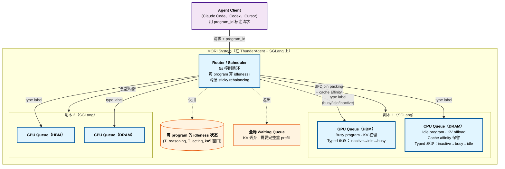

# MORI: Idleness is Relative —— Exploiting Tool-Call Idle Windows for Offloading in Agentic Systems

> [!info] 论文元数据
> - **论文**：[arXiv:2606.00866v1](https://arxiv.org/abs/2606.00866) —— *Idleness is Relative: Exploiting Tool-Call Idle Windows for Offloading in Agentic Systems with MORI*，2026-05-30
> - **代码**：截至 2026-06 未发布
> - **作者**：Tian Xia¹、Hanchen Li¹、Zhifei Li²、Xiaokun Chen³、Hao Kang⁴、Yifan Qiao¹、Yi Xu¹、Ion Stoica¹
> - **机构**：¹UC Berkeley、²中国人民大学、³斯坦福大学、⁴Georgia Institute of Technology
> - **实现**：~3,300 行 Python 在 [[thunderagent|ThunderAgent]] + 500 行在 SGLang v0.5.10 HiCache 上

> [!important] [[continuum|Continuum]] 的直接后继
> 同一第一作者（Hanchen Li, UC Berkeley）同一问题域（program-aware agent serving）。**Continuum** 是单层（仅 GPU HBM）带 TTL pinning，**MORI** 是**两层（GPU + CPU DRAM）**带连续 *idleness* metric 排所有 program 跨内存层动态分区。进化是：Continuum 决定"pin 还是不 pin"，MORI 沿相对空闲度谱决定"哪一层"。**MORI 是未来 12 个月 agent serving 系统应该收敛到的目标** —— 把这当 Continuum 之上的新 state of the art 读。

---

## 摘要（2 分钟读完）

**它是什么。** MORI（**M**emory **O**ffloader with **R**elative **I**dleness）是 program-aware agent serving 调度器，根据每个 program 的当前 *idleness 比* 把它的 KV cache 放在**两个内存层 —— GPU HBM（快、小）和 CPU DRAM（慢、大）** —— 之间。Program 主动 reasoning 时留 GPU；blocked on 长 tool call（subagent spawn、`pytest` 运行、人类输入）的 program 被 offload 到 CPU DRAM。连续 idleness score 排 program，调度器动态移分区边界匹配硬件容量。在真实 Claude Code SWE-bench Pro trace 上评估，MORI 取得 **20–71% 更高吞吐、18–43% 更低 TTFT、多达 2.8× TTFT 降低** 超过最佳 baseline。

**核心 idea。** **空闲度是连续谱，不是二元 label**。三个子部件：

1. **两阶段 agent program 结构** —— program 交替 *busy* 阶段（数百 ms 的短 tool 调用，如 `cat`、`grep`、`Edit`）和 *idle* 阶段（数十秒到分钟的长 tool 调用，如测试套件、编译、人类输入、subagent spawn）。Tool 调用 duration 方差是 **三个数量级**（Claude Code trace 上 P50=1.1s、P99=20s、P99.95=83s）。
2. **Idleness metric**：$\iota = T_{acting}^{(k)} / (T_{reasoning}^{(k)} + T_{acting}^{(k)})$ over $k=5$ 近期 inference/tool-call 周期滑窗。接近 1 = idle 阶段（大部分时间在 tool call）；接近 0 = busy 阶段（大部分时间 reasoning）。**滑窗平均同时对阶段变化*响应*又对异常值*鲁棒*** —— 单个慢 shell 命令不触发误分类。
3. **跨三层的 sticky rebalancing** —— GPU queue（HBM 驻留）、CPU queue（DRAM offload）、Waiting queue（KV 完全驱逐，必须重算）。Program 留在当前层直到 **idleness 不匹配 + 容量边界跨越**；强制时才转。避免会主导转移成本的 per-tick reshuffling churn。

去掉连续 idleness 就退回 InferCept/Continuum 风格二元分类，在 busy:idle program 比不匹配 GPU:CPU 容量比时失败；去掉 sticky rebalancing，每 tick 付 offload-reload 代价；去掉 typed eviction（GPU 上 busy 最后被驱逐，CPU 上 idle 最后被驱逐），引擎的 LRU 会撤销调度器的决定。

**头号实验结果**（SWE-bench Pro 的 Claude Code trace，真实编程 agent at 80 并发 program）：

| 硬件 | 模型 | 最佳 baseline (TA+O) | **MORI** | 改善 |
| ---- | --- | --------------------: | -------: | ---: |
| H200 80GB | Qwen-2.5 7B | 667 tokens/s | **853 tokens/s** | **+28%** |
| B200 | Llama-3.1 70B | 124 tokens/s | **213 tokens/s** | **+71%** |
| H200 | Qwen-3 30B-A3B (MoE) | （类似趋势）| **+显著** | — |
| H200 DP=3（多副本）| 各种 | baseline | **高 54-79%** | — |
| TTFT 降低（平均）| — | — | **低 18-43%** | — |
| TTFT 降低（峰值）| — | — | **低多达 2.8×** | — |
| 80 并发 GPU 利用率 | phase-oblivious 59-76% | **99%+** | — |

**为什么重要。**

- **第一个两层 program-aware offloading 调度器** 显式处理动态 agent workload（Claude Code、Codex、Cursor）—— 先前工作（Parrot、Teola、Ayo）假设固定 workflow。
- **解决限制 Continuum 类系统的二元分类脆弱性**。连续 idleness metric 适应*任何* GPU:CPU 容量比，无需 per-hardware tuning，而 Continuum 风格 "preserve 阈值" 要求 per-deployment 重调。
- **第一个 GPU:CPU 容量比问题的定量答案** —— H100 DGX = 1:1.6 比，同节点带 2TB DRAM = 1:3.1。MORI 表明二元 policy 在此谱上崩；连续 policy 在所有上 work。
- **2027 年预测。** 两层 idleness 排序 KV offloading 成为标准 agent serving 内存架构。Continuum 的 TTL pinning 成为 MORI 风格系统内的*组件*（pin-while-busy 步骤）。预期 vLLM/SGLang 12 个月内 ship `--enable-idleness-offloading` flag。Continuum 第一作者发 MORI 本身是信号：这是 UC Berkeley agent serving 组在收敛的方向。

---

# 详细内容（深入阅读从这里开始）

## 背景：Continuum 撞到的天花板

[[continuum|Continuum]]（同第一作者，2025-11）引入 **TTL-based KV pinning** —— 把 program 的 KV pin 在 GPU HBM 一段从 tool-call duration 推出的 TTL，TTL 过期就驱逐。它在单层（仅 GPU HBM）内做这。GPU 内存满时 Continuum 完全丢弃 KV（强制重 prefill）。

MORI 论文识别这设计的三个失败模式（Section 3）：

**(1) Tool 调用 duration 方差巨大**（Figure 3，Claude Code trace 上 n=16,886）：

| 百分位 | Tool 调用 duration |
| -----: | -----------------: |
| P50 | 1,096 ms |
| P90 | 2,034 ms |
| P99 | 19,980 ms |
| **P99.95** | **83,626 ms** |

**跨三个数量级**。对 P50（1s）合适的 TTL 对 P99（20s）狂错 —— pinned KV 占 GPU 内存数十秒等 `pytest` 跑。处理 P99 的 TTL 在多数调用上浪费内存。

**(2) 二元 busy/idle 分类崩** 当 busy:idle program 比不匹配 GPU:CPU 容量比时。例子：
- 80 并发 program：50 busy、30 idle（62.5%:37.5% 比）
- H100 DGX 节点：1:1.6 GPU:CPU 容量比（38%:62%）
- 30 个 idle program 装进 CPU... 但有些 busy 也能装，留 GPU underutilize
- 反之：70 busy、10 idle → GPU 过订阅

固定阶段边界跟不上动态比。

**(3) 两个内存层都有限** —— CPU DRAM 大但也有界。朴素 "offload everything idle" 在 program 回来时引起 CPU 争用和 reload thrashing。

## 三个核心组件详解

### 组件 1 —— Idleness metric（Section 4.2）

驱动所有 placement 决定的连续谱。对每个 program 维护：
- 当前状态：Reasoning（在 GPU 执行）或 Acting（等 tool 调用）
- 估计 KV cache 大小（token）
- 近 $k$ 步窗口的 Reasoning 和 Acting 区间 duration

**Idleness 比**（Equation 1）：
$$\iota = \frac{T^{(k)}_{acting}}{T^{(k)}_{reasoning} + T^{(k)}_{acting}}$$

所有实验 $k = 5$。

> [!quote] 为什么滑窗平均，不是瞬时
> "Since programs are non-stationary and switch between phases, a recent-windowed signal provides a better estimate of the current phase than a global average over the program's entire history. ... It is *responsive*: when a busy-phase program enters an idle phase, the ongoing tool call's elapsed time keeps increasing and soon dominates the other terms in the window, causing the idleness score to rise quickly. ... It is *robust against outliers*: if a busy-phase program encounters a single unexpectedly long tool call, the window of recent short tool calls dilutes this outlier."

关键：program 在调度器上等的时间（在 CPU 或 Waiting 层排队）从 $T_{reasoning}$ 和 $T_{acting}$ 都**排除** —— metric 只反映 program 的固有行为，不是调度器强加的延迟。

### 组件 2 —— 三层队列架构（Section 4.1）

每个推理引擎副本维护：

| 层 | 容量 | 行为 |
| -- | --- | --- |
| **GPU queue（HBM）** | 受 GPU 内存限 | 持有分类 busy 的 program。KV 在 HBM，请求直接转发到引擎。 |
| **CPU queue（DRAM）** | 受 CPU 内存限 | 持有分类 idle 的 program。KV offload 到 CPU DRAM，推理进行前必须 reload 到 HBM。提供 **cache affinity** —— offloaded KV 留在算它的副本，enable 快 PCIe reload。 |
| **Waiting queue** | 全局（跨副本共享）| KV 完全丢弃。Promotion 要求完整重 prefill。 |

并发 program 数超过组合 GPU+CPU 容量时，多余进 Waiting queue。

### 组件 3 —— Sticky rebalancing 调度策略（Section 4.3）

调度器跑**周期控制循环**（默认 5s tick）调整 placement：

**从 GPU demotion**（容量溢出）：
- 按 idleness $\iota$ 排 program（高 = 最 idle）
- 先 demote 最高 idleness
- 同 idleness 中：偏好 **Acting status**（当前在 tool call）超过 **Reasoning status**（当前 doing inference）—— Reasoning program 在做有用工作，别打断
- **Lazy demotion** 如果只剩 Reasoning：受害者完成当前推理步再被移
- Demoted program 在 CPU 容量允许时去 CPU queue，否则 Waiting queue

**到 GPU promotion**（容量可用）：
- 优先顺序：
  1. Tool call 完成等推理的 CPU-queue program
  2. Waiting-queue program（返回 program 优先于新到，最小上下文先）
- 优先级内：选 **最低 idleness** $\iota$ 的 program 先 —— 最可能使用 GPU 驻留
- 多副本：跨副本 Best-Fit-Decreasing bin packing，保留 cache affinity

**Sticky 属性**：program 留在当前层直到 idleness 不匹配 *且* 容量边界跨越。避免会主导转移成本的急切 reshuffle thrashing（PCIe Gen5 ~32 GB/s per 方向；转 5GB KV 要 ~150ms）。

### 组件 4 —— 推理引擎上的 typed offloading（Section 4.3.2）

调度器决定哪些 program *属于* GPU vs CPU，但引擎在层内内存压力时仍做自己的 block 级驱逐。MORI 把 **type label**（busy / idle / inactive）传到引擎的 KV block。引擎的驱逐用 type 作更高优先级排序 key，LRU 作 tiebreaker：

| 层 | 驱逐优先级（先驱 → 后驱）|
| -- | ----------------------- |
| **GPU HBM** | inactive → idle → **busy（最后驱逐）** |
| **CPU DRAM** | inactive → busy → **idle（最后驱逐）** |

优先级**两层反过来** 让分配到各层的 program 优先在该层保留。分给 GPU 的 busy program block 在 GPU 上被保护；如果意外在 CPU 上（过渡状态），CPU 先驱逐它把它带回来。

> [!note]- Type label 是调度器跟引擎间的桥
> 无 typed offloading 引擎的 LRU 会撤销调度器决定 —— 它可能驱逐 busy program 的 GPU block 仅因它过去几 ms 没被访问（因 tool call 在进行）。Type label 让调度器驱动的 placement 真正穿越引擎的本地决定持续。

## 系统架构



## 头号实验证据

### 设置（Section 6.1）

| 组件 | 配置 |
| ---- | --- |
| 推理引擎 | SGLang v0.5.10 with HiCache CPU offload |
| 硬件（3 个 GPU 层）| H200（80GB 上限）、H200（完整 141GB）、B200 |
| 模型（3 个大小）| Qwen-2.5 7B、Qwen-3 30B-A3B（MoE）、Llama-3.1 70B |
| TP × DP 配置 | (1,1)、(2,1)、(1,3) |
| CPU:GPU 内存比 | 1×（紧）和 2×（宽松）|
| Workload | SWE-bench Pro test split 的 Claude Code（claude-sonnet-4-6，高 effort）|
| Trace 收集 | 186 个完整（尝试 200；14 失败）|
| 并发测试 | 每 DP 副本 20、50、80 program |
| 实验时长 | 每个 1 小时 |

**Baseline**：
- **SGLang Model Gateway (SMG)**：prefix-aware 请求调度器，无 offload
- **[[thunderagent|ThunderAgent]] (TA)**：program-aware，无 CPU offload
- **[[thunderagent|ThunderAgent]] + Offloading (TA+O)**：program-aware + HiCache CPU offload，但**驱逐是 context-length 基础的，不 phase-aware**（这是最强可比 baseline）

### 单副本吞吐（Figure 7-9，Section 6.2.1）

低并发（20 program）时 MORI 跟 TA+O 类似（KV cache 舒适装进 CPU；阶段感知给边际优势）。高并发时 gap 显著扩大。

**H200 80GB、Qwen-2.5 7B、80 并发 program**：
- SMG：plateau 在 447 tokens/s
- TA：峰值 557 tokens/s
- **TA+O：667 tokens/s**（最佳非 MORI baseline）
- **MORI：853 tokens/s**（比 TA+O +28%，比 SMG +91%）

**B200、Llama-3.1 70B、80 并发 program**（最内存约束）：
- SMG：stalls at 96 tokens/s（MORI 一半）
- **TA+O：124 tokens/s**
- **MORI：213 tokens/s**（+71%，最大 gap）

**为什么 gap 随模型大小扩大**：大模型 = 大 per-program KV footprint = 聚合 KV 超过组合 GPU+CPU 容量时驱逐策略关键。Phase-aware placement 给 MORI 超过 phase-oblivious TA+O 的根本优势。

> [!success] B200/70B 上 71% 改善是承重数字
> 这是真生产 agentic serving 会命中的 regime —— 旗舰大小模型（70B+）高并发 stress 内存。Continuum 类单层 policy 不能帮这里因为 GPU HBM 单独太小；phase-oblivious CPU offload thrash 因它不能告诉哪些 program 要回来。MORI 在正是这 regime 上 71% 收益是其设计最强论据。

### TTFT 降低（Section 6.2）

- 比最佳带 offload 的 baseline **平均 TTFT 低 18-43%**
- vs 无 offload 系统 **峰值 TTFT 降低多达 2.8×**

### 多副本 DP=3 部署（Section 6.2.2，从头号推断）

- 比 offload baseline **吞吐高 54-79%**
- 80 并发 program 时 **99%+ GPU 利用率**
- 对比 phase-oblivious 调度器 59-76% 利用率

多副本收益来自 MORI 的负载均衡器尊重 cache affinity（offloaded KV 留在算它的副本）同时路由 capacity。

> [!example]- 为什么 phase-oblivious 调度器在高并发崩
>
> 论文的 TA+O baseline 做 program-aware *驱逐顺序* 但用 **context-length-based** 驱逐（长上下文先驱）。80 并发 program 时：
> - 多 program 在 busy 阶段 with 中长上下文被驱给新到让位
> - 那些 busy program 从短 tool call 回来时它们的 KV 没了，要完整重 prefill
> - 重 prefill 是最贵操作（GPU-bound、阻塞其它工作）
> - 驱逐级联 → 重 prefill 级联 → GPU 利用崩
>
> MORI 的 typed 驱逐在 GPU 上保护 busy program、在 CPU 上保护 idle program，打破级联。

## 优势与局限

**优势。**

- **第一个连续谱 idleness metric** 给 agent serving；在任何 GPU:CPU 容量比上 work，无需 per-deployment tuning。
- **三层队列架构** 泛化超过两层 —— 能简单扩展到 NVMe SSD 作第三层。
- **Sticky placement 是对的工程选择** —— 避免会主导 PCIe 带宽的 per-tick reshuffling 成本。
- **Typed offloading 是干净原语** —— 调度器决定"什么层"，引擎决定"层内哪些 block"；type label 桥它们而不耦合两层。
- **真实 workload** —— 回放实际 Claude Code SWE-bench Pro trace，不是合成 Poisson 到达。
- **跨真硬件多样性测试**（H200 80GB / H200 / B200 + 7B / 30B MoE / 70B）。
- **直接定量对比 ThunderAgent + offloading** —— 最强现有 baseline。
- **多副本评估** —— 多数 agent serving 论文只测单副本；MORI 显示 54-79% 多副本收益。

**局限。**

> [!warning] Continuum 轨迹延续 —— 局限看起来类似
> 两篇论文来自同组。像 Continuum：无代码发布；限于顺序 ReAct 风格流（并行 tool 调用、speculative branching 不在 scope）；只测编程 agent workload（Claude Code + SWE-bench Pro），无 GAIA/web/multimodal；LRU + typed 驱逐是启发式 —— 无学习 policy；单推理引擎（SGLang）；单 client/orchestrator（ThunderAgent）。

- **没跟 Continuum 对比**，尽管 Continuum 是同组明显可比系统。这是最明显 gap。论文隐含定位 MORI 作 Continuum 后继但没 ablate "MORI 没 CPU offload vs Continuum"。
- **Idleness 比假设同步 reasoning↔acting 交替**。对并行 tool 调用（agent 做）公式需扩展；论文未 address。
- **内存模型假设 per-node CPU DRAM** —— 分布式 CPU 内存（如跨节点共享）未 address。
- **k=5 窗口大小实证选** —— 无敏感性分析或理论 justification。
- **无冷启动 ramp 分析** —— 头 80 program 到时 idleness 比未定义；论文不描述 bootstrap 行为。
- **测试至多 80 并发 program** —— 生产部署可能服务数百或数千。超过 80 的 scaling 行为未测。
- **无公平性讨论** —— 应该抢占低优先级的高优先级 program；MORI 是贪婪吞吐优化器。

> [!bug] "Type label 传播" 在引擎重启下脆弱
> SGLang 引擎重启（生产因 OOM 或权重更新发生）调度器在 KV block 的 type label 丢。论文不描述恢复怎么 work —— 大概所有 program 从头重排。长跑部署这可能是隐藏悬崖。

## 这意味着什么

MORI 是 Continuum 的直接后继和 agent serving 内存管理新 state of the art。架构进化干净：

| 代 | Paper | 层数 | 决策粒度 | 驱逐 policy |
| -- | ----- | --: | -------- | ----------- |
| 1 | vLLM、SGLang baseline | 1（仅 GPU）| Per-request | LRU |
| 2 | [[continuum|Continuum]] | 1（仅 GPU）| Per-program with TTL | TTL 过期 |
| **3** | **MORI** | **2（GPU + CPU）** | **Per-program with 连续 idleness** | **Typed（busy/idle/inactive）+ LRU tiebreaker** |
| 4（未来）| — | 3+（GPU + CPU + SSD/NVMe）| 同上 + 跨集群 | 同上 + WAN 感知 |

2027 年的三个预测：

1. **两层 idleness 排序 offloading 成为标准 agent serving 内存架构**。预期 vLLM/SGLang 12 个月内 ship `--enable-idleness-offloading` flag。ThunderAgent 作 MORI 编排层的角色让它合法化作前端首选。
2. **三层扩展（NVMe SSD 作第三层）是下一篇论文**。Tool 调用 duration 跨 3 个数量级；MORI 处理 ~100s（CPU DRAM 还行），但 10+ 分钟 subagent spawn 用 SSD 合理。框架简单扩展 —— 同 idleness 排序，第三层带适当驱逐。
3. **MORI + SpecCache 组合好**。[[speccache|SpecCache]] address *web 环境* observation caching（extra-LLM）；MORI address *intra-LLM KV* placement。组合 MORI 的分层 KV 跟 SpecCache 的 action-observation prefetch 的系统到 2027 应该是标杆 agent serving cache。

MORI **不**解决：

- **旗舰规模根本 KV cache 大小问题** —— 70B 类模型 80+ 并发 agent 仍超任何单节点内存层次。分布式 KV（跨节点，PrfaaS 风格）是下一维度。
- **投机 tool 执行** —— 跟 MORI 正交；[[speculative-actions|Speculative Actions]] / [[speceyes|SpecEyes]] / [[speccache|SpecCache]] 可组合。
- **非 ReAct agent 流** —— 并行 tool 调用、speculative branching、多 agent 协调。跟 Continuum 同 scope 限制。

## 源代码与复现

```bash
# 截至 2026-06 未发布。
# 实现建立在：
git clone https://github.com/sgl-project/sglang   # v0.5.10
# 加 ThunderAgent router（引用 [24]；可能来自同组）
# HiCache（引用 [59]）给 CPU offload backend
```

**复现协议**（Section 6.1）：

| 组件 | 配置 |
| ---- | --- |
| 推理引擎 | SGLang v0.5.10 |
| Offload backend | HiCache（SGLang 的 CPU offloading）|
| Router/scheduler | ThunderAgent + 3,300 行 MORI scheduler 添加 |
| Scheduler tick | 5 秒（默认）|
| Idleness 窗口 | k = 5 inference/tool-call 周期 |
| 硬件 | H200（80GB 限制模拟 H100）、H200、B200 |
| 模型 | Qwen-2.5 7B（DP=1, TP=1）、Qwen-3 30B-A3B MoE（DP=1, TP=1）、Qwen-3 30B-A3B MoE（DP=3, TP=1）、Llama-3.1 70B（DP=1, TP=2）|
| Workload | SWE-bench Pro test split 的 Claude Code，claude-sonnet-4-6（高 effort）|
| Trace 收集 | 200 task → 186 完整（14 因 rate-limit/timeout 失败）|
| 并发级别 | 每 DP 副本 20、50、80 program |
| 内存比测试 | 1×（CPU:GPU=紧）和 2×（宽松）|

**估算实现文件**（§5）：

| 模块 | 角色 | 行数 |
| ---- | ---- | ---: |
| `mori/scheduler.py` | 异步 5s 控制循环、sticky rebalancing | ~1000 |
| `mori/idleness.py` | 窗口 idleness metric 计算 | ~300 |
| `mori/tier_manager.py` | GPU/CPU/Waiting 队列管理 | ~800 |
| `mori/admission.py` | Demotion/promotion 逻辑 | ~600 |
| `mori/load_balancer.py` | 跨副本带 cache affinity 的 BFD bin-packing | ~600 |
| `sglang/hicache/typed_eviction.py` | Type-label 感知驱逐（busy/idle/inactive）| ~500 |
| 总计 | | ~3,800 |

## 相关阅读

- [[continuum]] —— **同第一作者的直接前作**。Continuum：单层（仅 GPU）带 TTL pinning。MORI：两层（GPU + CPU）带连续 idleness 排序。先读 Continuum 拿 program-aware framing，然后 MORI 拿多层泛化。
- [[speccache]] —— SpecCache：正交 cache 机制（action-observation 环境 cache）；跟 MORI（address LLM KV cache）组合。
- [[speculative-actions]] / [[speceyes]] —— 投机 tool 执行；跟 MORI offloading 正交。
- [[agentic-ai-workload-characteristics]] —— Workload Characteristics paper 实证 motivate 为什么 agent serving 需要 program 感知（84.6-99.5% cache 命中率 = KV 复用是承重的）。
- [[cpu-centric-agentic-ai]] —— CPU-Centric Perspective：CPU 侧 compute 调度。不同层（compute vs memory）；跟 MORI 组合。
- [[prfaas]] —— 跨 DC PD disaggregation；MORI 的 NVMe 层扩展会遇见的 *分布式内存* 泛化。
- [[multi-turn-optimization]] —— 跨轮 KV 复用 landscape；MORI 是那 landscape 的多层扩展。
- [[paged-attention]] —— 底层 KV cache 原语；MORI 的 typed 驱逐扩展 PagedAttention 的 block 级驱逐。
- [[continuous-batching]] —— MORI 的 typed 调度顺序插入的底层 batching。
- [[vllm]]、[[sglang]] —— 推理引擎；MORI 具体建在 SGLang v0.5.10 的 HiCache 上。

## 参考文献

- Tian Xia, Hanchen Li, Zhifei Li, Xiaokun Chen, Hao Kang, Yifan Qiao, Yi Xu, Ion Stoica. *Idleness is Relative: Exploiting Tool-Call Idle Windows for Offloading in Agentic Systems with MORI.* arXiv:2606.00866, 2026 年 5 月。 https://arxiv.org/abs/2606.00866
- [[thunderagent|ThunderAgent]] [24]：MORI 建立其上的 program-aware 调度器（ICML 2026 Spotlight，top 2.2%）。
- SGLang v0.5.10 [68]：推理引擎。
- HiCache [59]：CPU offload backend。
- Continuum [7]：直接前作系统（同第一作者）。
- Parrot [30]、Teola [51]、Ayo [52]：先前固定 workflow 调度工作。
- KVFlow [38]、Helium [54]：先前 workflow 结构感知 caching。
- Intercept [1]、Pie [13]：先前 pin-during-tool-call 工作。
- SAGA [16]：workflow-atomic 调度。
- PASTE [48]：投机 tool 执行。
- Claude Code [5]：评估 workload 用的 agent 框架。
- SWE-bench Pro [10]：评估 benchmark。
