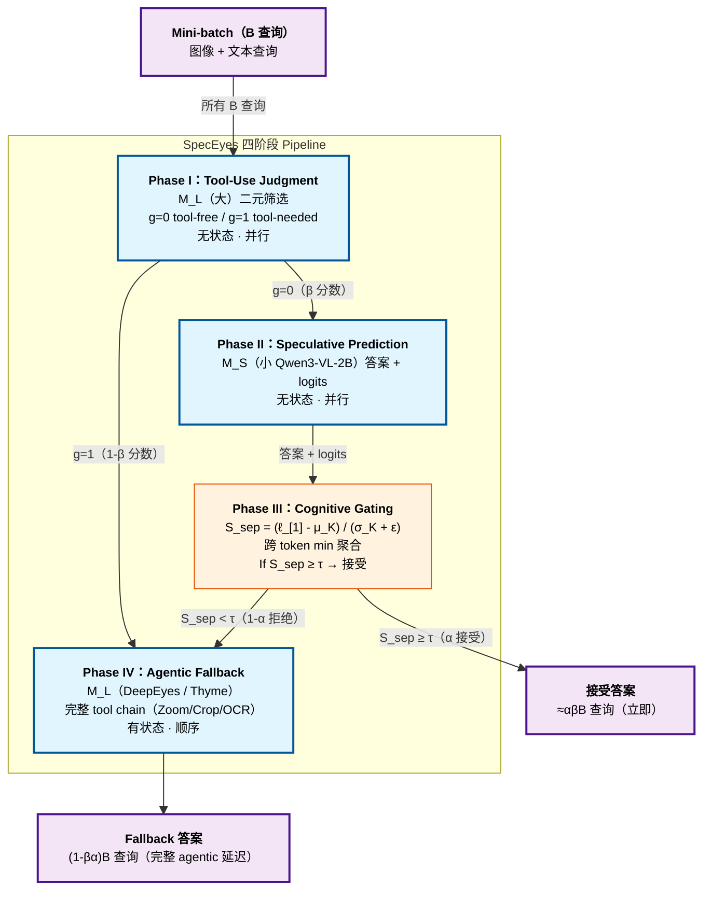

# SpecEyes: Accelerating Agentic Multimodal LLMs via Speculative Perception and Planning

> [!info] 论文元数据
> - **论文**：[arXiv:2603.23483v1](https://arxiv.org/abs/2603.23483) —— *SpecEyes: Accelerating Agentic Multimodal LLMs via Speculative Perception and Planning*，2026-03-24
> - **代码**：[MAC-AutoML/SpecEyes](https://github.com/MAC-AutoML/SpecEyes) —— 已发布
> - **作者**：Haoyu Huang\*（厦门大学）、Jinfa Huang\*（罗切斯特大学）、Zhongwei Wan（俄亥俄州立大学）、Xiawu Zheng（厦大）、Rongrong Ji（厦大）、Jiebo Luo（罗切斯特）—— \*等贡献
> - **联系**：jhuang90@ur.rochester.edu、huanghaoyu@stu.xmu.edu.cn
> - **实现**：单 1× NVIDIA A100 40GB，greedy decoding

> [!important] [[speculative-actions|Speculative Actions]] 的多模态 LLM 对应
> [[speculative-actions|Speculative Actions]]（哥伦比亚，2025-10）把 speculation 从 token 级提升到 API-call 级 for 一般文本 agent，而 SpecEyes（厦大 + 罗切斯特 + OSU，2026-03）把它专门提升给 **invoke vision tool（Zoom-in、Crop、OCR）in tool-use chain 的 agentic 多模态 LLM**。关键 novelty：*非 agentic* 小 MLLM 作 speculator 直接答 tool-free 查询，绕过整个 tool chain。由信息论 **answer separability score** 测量 top-K logits 间 decision margin（不是 raw softmax 概率）gate。

---

## 摘要（2 分钟读完）

**它是什么。** 一个推理时加速框架给 **agentic 多模态 LLM**（OpenAI o3、Gemini Agentic Vision、DeepEyes、Thyme）—— 迭代调用 vision tool（Zoom-in、Crop、OCR）refine 视觉理解的模型。SpecEyes 路由每个输入查询通过四阶段 pipeline：(1) 大 agentic 模型决定是否需要 tool，(2) 小 *非 agentic* MLLM（Qwen3-VL-2B）speculatively 答 tool-free 查询，(3) 信息论 cognitive gate 决定是否信小模型答案，(4) 只有低信心查询 fall back 到完整 tool-using agentic pipeline。结果：在三个多模态 benchmark（V*、HR-Bench、POPE）上 **1.42-1.73× 平均加速** 同时 **提升准确率多达 +6.7%**。

**核心 idea。** **把 speculation 从 token 提升到 agentic loop，由 answer separability gate**。三个子部件：

1. **四阶段 pipeline** —— Phase I（大 MLLM 筛选 "tool-free vs tool-required"）、Phase II（小 MLLM speculatively 答 tool-free 查询 with logits）、Phase III（cognitive gating 决定接受 vs fallback）、Phase IV（被拒则完整 agentic fallback）。
2. **Answer Separability Score $S_{sep}$** —— 无校准、scale 不变的 gating metric 定义为 $(\ell_{[1]} - \mu_K) / (\sigma_K + \epsilon)$，其中 $\ell_{[1]}$ 是 top logit，$(\mu_K, \sigma_K)$ 是 top-K logits 均值/标准差。测竞争者间 decision margin，不是 raw softmax 信心（后者受温度误校准和 token-wise 虚假高信心 at deterministic 位置如标点 折磨）。
3. **异质并行 funnel** —— Phase I + II 无状态（单前向），可批；只 Phase IV 有状态顺序。Batch B 查询时，batch 时间由 residual set $(1-\beta\alpha)B$ fall back 到 agentic 执行主导，吞吐加速 $\Theta_{\text{SpecEyes}} / \Theta_{\text{agent}} \approx 1/(1-\beta\alpha)$。

去掉 cognitive gate 接受所有小模型答案（准确率崩）；用 raw softmax 代替 $S_{sep}$ gate 太噪（误接受飙升）；去掉 funnel batching 每查询加速不翻译成吞吐。

**头号实验结果**（Table 1，3 个 benchmark × 2 个 agentic backbone）：

| Backbone | SpecEyes 变体 | 平均准确率 | 平均加速 |
| -------- | ------------ | ---------: | -------: |
| DeepEyes（baseline）| — | 81.39% | 1.00× |
| **DeepEyes + SpecEyes (min)** | min 聚合 | **84.26%**（+2.87）| **1.73×** |
| Thyme（baseline）| — | 82.29% | 1.00× |
| **Thyme + SpecEyes (min)** | min 聚合 | **83.99%**（+1.70）| **1.42×** |
| SpecReason（baseline，有损 token 级）| — | 66.85%（DeepEyes）| 0.43×（减速！）|

具体 cell：SpecEyes (min) on DeepEyes/V*-Pos 取得 **89.47% 准确率 at 1.90× 加速**（vs baseline 82.89%，1.00×）；POPE/Adversarial 达 **85.13% at 2.13×**（vs baseline 78.43%）。

**为什么重要。**

- **第一个专门给 agentic 多模态 LLM 的 speculative 框架**。Token 级 spec decoding 帮每次前向但不改 tool-chain 长度；SpecEyes 对不需要的查询完全绕过 tool chain。
- **Answer separability 比 softmax 更好的 gating 信号**。无校准 + scale 不变 + 竞争感知。$S_{sep}^{\min}$ 在正确 vs 错误样本间的 KDE 峰距 Δ 比 raw softmax 大 6× （Figure 3）。
- **提升准确率，不只是速度**。POPE Adversarial：baseline 78.43% → SpecEyes (min) 85.13%。小模型 "直觉" 有时打败大模型 tool chain（可能因为 tool chain 在 hallucination-trap 查询上引入错误累积）。
- **2027 年预测。** Agentic 级 speculative bypass 成为任何生产 agentic-MLLM 部署标准。预期 Anthropic、OpenAI、Google 给视觉 agent 默认 ship "fast-path vs slow-path" 路由。

---

# 详细内容（深入阅读从这里开始）

## 背景：agentic MLLM 的有状态瓶颈

现代 agentic 多模态 LLM（DeepEyes、Thyme、OpenAI o3、Gemini Agentic Vision）执行成 tool-call 步骤的 Markov 链。论文形式化（Section 3.1）：

查询 $q$ + 图像 $I$ 生成 state 轨迹 $\{s_0, s_1, \ldots, s_D\}$ over $D$ reasoning 步。初始 state $s_0 = (q, I)$。每步 policy 产生动作 $a_d = \pi(\cdot|s_d)$ —— 调用 tool $t_d \in \mathcal{T}$（如 Zoom-in、Crop、OCR）或发最终答案。Tool 被调用时：
$$s_{d+1} = f(s_d, t_d(s_d))$$
其中 $t_d$ 把选的 tool 应用到当前视觉上下文。

**双灾难**（Section 1）：

1. **延迟爆炸**：per-query 响应时间跟 agentic 深度 $D$ **线性** scale：
$$L_{\text{agent}}(q) = \sum_{d=0}^{D(q)} (c_{\text{llm}} + c_{\text{tool}}(t_d))$$
2. **并发崩溃**：因为每查询改 per-query state，GPU batching "实际上无效化" —— agentic 模型每查询只能每次推进一个 tool-use 步，留硬件并行 idle。

这是论文命名的 **stateful bottleneck**。现有投机解码（Leviathan、EAGLE）加速单个生成步但不改 loop 长度。Token pruning 和 KV 压缩减 per-step 计算但留 tool chain 串行。

> [!quote] SpecEyes 的概念跳跃
> "We lift the speculative paradigm from the token/semantic level to the **agentic level**. Our key observation is that a large fraction of queries directed at agentic MLLMs do *not* actually require deep tool-assisted reasoning. Instead, a lightweight, tool-free vision model can answer them correctly from the original image alone, provided we can reliably identify which queries fall into this category."

这 motivate **"think fast, think slow" 架构**：小非 agentic 模型快速生成 speculative 答案（"fast thinking"），大 agentic 模型保留给真需要多步 tool 交互的查询（"slow thinking"）。

## 三个核心组件详解

### 组件 1 —— 四阶段 speculative pipeline（Section 3.2）

Pipeline 路由每查询通过四阶段：

**Phase I：Heuristic Tool-Use Judgment**。大 agentic 模型 $\mathcal{M}_L$ 首先决定是否需要 tool 调用：
$$g(q, I) = \mathcal{M}_L(q, I; \mathcal{P}_{\text{judge}}) \in \{0, 1\}$$
- $g = 0$：查询从全局图像独自可答 → 转发到 Phase II
- $g = 1$：需要 tool 辅助 perception → 立即转发到 Phase IV（agentic fallback）

为什么用 $\mathcal{M}_L$ 做这个二元筛选而不是 $\mathcal{M}_S$？**因为大模型的 tool-calling 能力让它成为 tool 必要性更可靠的法官**。Phase I 只发单一二元 token 无 tool 调用 —— 可忽略 overhead。

**Phase II：Speculative Prediction**。对 tool-free 查询，小 $\mathcal{M}_S$ 生成答案加完整 logit 分布：
$$\hat{y}_S, \{\ell^{(n)}\}_{n=1}^{|\hat{y}_S|} = \mathcal{M}_S(q, I)$$

关键这个推理是 **无状态** —— 无 tool 执行，跨 batch 中所有查询完全并发。

**Phase III：Cognitive Gating**（见组件 2）。Phase II 的 logits 传到 separability 函数 $S_{sep}$。如果 $S_{sep} \geq \tau$（校准阈值），接受 $\hat{y}_S$；否则 fallback to Phase IV。

**Phase IV：Agentic Fallback**。Cognitive gate 失败的查询路由到 $\mathcal{M}_L$，它执行完整 stateful perception-reasoning loop：
$$\hat{y}_L = \mathcal{M}_L(q, I) = \pi(s_0 \xrightarrow{t_0} s_1 \xrightarrow{t_1} \cdots \xrightarrow{t_{D-1}} s_D)$$

**端到端延迟公式**（Eq. 9）：
$$\mathbb{E}[L_{\text{SpecEyes}}] = c_J + \beta c_S + (1 - \beta\alpha) L_{\text{agent}}$$
其中 $\beta$ = Phase I tool-free 筛选比，$\alpha$ = Phase III 接受率，$c_J$/$c_S$ = 判断/speculation 成本。当 $\beta\alpha > 0.6$ 时，期望延迟由轻量前端成本主导。

### 组件 2 —— Cognitive Gating via Answer Separability（Section 3.3）

最有特色的贡献。信心的标准方法 —— max-softmax 概率的几何均值 —— 有已知失败模式：

> "$S_{\text{log}}$ remains unreliable for gating: (1) it inherits the well-known miscalibration of softmax, where large logit magnitudes can yield overconfident probabilities; (2) token-wise $p_{\max}^{(n)}$ can be spuriously high for low-entropy or nearly-deterministic positions (e.g., punctuation, formatting tokens), and the geometric aggregation does not explicitly measure how well the top prediction is separated from strong competitors."

**Answer Separability Score**（Eq. 12）。对第 $n$ 个 token with logit 向量 $\ell^{(n)}$，让 $\ell_{[1]}^{(n)} \geq \ell_{[2]}^{(n)} \geq \cdots \geq \ell_{[|V|]}^{(n)}$ 是排序 logits。定义 token 级 separability：
$$S_{\text{sep}}^{(n)} = \frac{\ell_{[1]}^{(n)} - \mu_K^{(n)}}{\sigma_K^{(n)} + \epsilon}$$
其中 $\mu_K^{(n)}, \sigma_K^{(n)}$ 是 top-$K$ logits $\{\ell_{[1]}^{(n)}, \ldots, \ell_{[K]}^{(n)}\}$ 均值和标准差。把 leading logit 标准化跟其最近竞争者。

**比 softmax 两个优势**：
1. **Scale 不变** —— 分子分母都随 logit 大小线性 scale，中和 softmax 校准伪影。
2. **建模竞争 landscape** via $\sigma_K^{(n)}$ —— 大值表示清晰 decision boundary，小值信号 ambiguity。

**Token-to-answer 聚合**（Eq. 13）。三个策略测：
$$S_{\text{sep}}^{\text{mean}} = \frac{1}{|\hat{y}_S|}\sum_n S_{\text{sep}}^{(n)}, \quad S_{\text{sep}}^{\min} = \min_n S_{\text{sep}}^{(n)}, \quad S_{\text{sep}}^{\text{bottom}} = \frac{1}{|\mathcal{B}|}\sum_{n \in \mathcal{B}} S_{\text{sep}}^{(n)}$$
其中 $\mathcal{B}$ 是 bottom $r$ 分数 tokens（最差 $r |\hat{y}_S|$）。

**Proposition 1** justify min 聚合（最坏情况守卫）：如果每个 $P(\mathcal{E}_n)$ —— token $n$ 错的概率 —— 跟 $S_{\text{sep}}^{(n)}$ 单调递减，那么阈值 on $\min_n S_{\text{sep}}^{(n)}$ 确保 *每个* token 超过信心阈值，最紧地 bound 联合概率 $P(\mathcal{E})$。

> [!success] KDE 证据（Figure 3）
> 信心分数的 kernel density estimation on V*，with $\Delta$ = 正确跟错误样本峰距（discriminability 度量）：
>
> - $S_{\text{log}}$（softmax）：$\Delta = 0.004$
> - $S_{\text{sep}}^{\text{mean}}$：$\Delta = 0.001$
> - $S_{\text{sep}}^{\text{bottom}}$：$\Delta = 0.030$
> - $S_{\text{sep}}^{\min}$：$\Delta = 0.058$ —— **比 mean 大 14×，比 bottom 大 6×**
>
> 错误样本塌到低分数峰；正确样本形成锐高分模式 —— 清晰双峰分离 enable 最优 accuracy-speed trade-off。

### 组件 3 —— 异质并行 Funnel（Section 3.4）

吞吐 multiplier。Phase I + II 是无状态单 pass forward —— 跨 $B$ 查询完全可批。Phase IV 是有状态顺序。

**Funnel 数学**（Eq. 15）：
```
B → M_L 筛选（并行）→ βB（g=0）+ (1-β)B（g=1）
βB（g=0）→ M_S speculate（并行）→ αβB（接受）+ (1-α)βB（拒绝）
Residual R = (1-β)B + (1-α)βB = (1-βα)B
R → M_L agentic（顺序）→ (1-βα)B fallback
```

因为实用 batch size 下 $c_J + c_S \ll B \bar{L}_{\text{agent}}$，batch 时间由 residual set fall back 到 agentic 执行主导。**吞吐加速**：
$$\Theta_{\text{SpecEyes}} / \Theta_{\text{agent}} \approx \frac{1}{1 - \beta\alpha}$$

跨所有 benchmark，$\beta \approx 80\%$（筛选比）、$\alpha \approx 71\%$（gate 接受率）。所以 $\beta\alpha \approx 0.57$，理论加速 $\approx 1/0.43 = 2.32$× —— 匹配实证 1.42-2.19× 范围。

## 系统架构



## 头号实验证据

### 主结果（Table 1）

3 个 benchmark × 2 个 agentic backbone（DeepEyes、Thyme）× Qwen3-VL-2B 作 speculator。在单 1× A100 40GB 测，greedy decoding，$K=64$ for top-K separability。

**SpecEyes (min 聚合) on DeepEyes backbone**：

| Benchmark | Baseline acc | SpecEyes acc | Baseline spd | SpecEyes spd |
| --------- | -----------: | -----------: | -----------: | -----------: |
| V*/Attr | 90.43% | 90.43% | 1.00× | **1.53×** |
| V*/Pos | 82.89% | **89.47%** | 1.00× | **1.90×** |
| HR-Bench/4K | 75.85% | 75.85% | 1.00× | 1.13× |
| HR-Bench/8K | 71.43% | **71.80%** | 1.00× | 1.08× |
| POPE/Adv | 78.43% | **85.13%** | 1.00× | **2.13×** |
| POPE/Pop | 81.90% | **87.00%** | 1.00× | **2.15×** |
| POPE/Rand | 88.83% | **90.13%** | 1.00× | **2.19×** |
| **平均** | **81.39%** | **84.26%**（+2.87）| **1.00×** | **1.73×** |

**SpecEyes (min 聚合) on Thyme backbone**（平均）：**83.99% acc（+1.70）、1.42× 加速**。

### 为什么 HR-Bench 是瓶颈

HR-Bench（4K 和 8K）在 DeepEyes 上只给 1.08-1.13× 加速，Thyme 上甚至 0.95-1.01×。论文解释：

> "The marginal sub-1× speedup on HR-Bench 8K arises because high-resolution inputs suppress both β and α, keeping βα small. In this regime, fixed cost of running $\mathcal{M}_S$ slightly exceeds any savings, consistent with Eq. (9)."

高分辨率图像真需要 2B 小模型无法替代的 tool 辅助 fine-grained inspection。

### 为什么 POPE 最受益（且准确率提升）

POPE Adversarial 78.43% → 85.13%（+6.7%）at 2.13× 加速。POPE 是 hallucination 探测（关于对象存在的是/否问题）。论文解释：

> "POPE benefits most (2.13–2.19×) with accuracy consistently above baseline (e.g., Adversarial: 78.43% → 85.13%), suggesting that bypassing unnecessary tool trajectories can also reduce hallucination errors."

换言之，agentic tool chain 可能通过过度复杂化简单查询*引入* hallucination。Fast path 对这些查询更可靠。

### SpecReason 减速 —— 跟错的 baseline 对比

论文最 instructive 对比：SpecReason（Cao et al., 2025），让小模型在 agentic loop 内提议 token 给大模型验证，**在 DeepEyes 上减速推理 0.37-0.61×，Thyme 上 0.43-0.53×**，因为小模型缺 tool-calling 能力招致 substantial token + turn overhead。SpecReason on POPE 具体准确率急剧降到 49.10%。

> [!warning] 朴素 token 级 spec 在 agentic loop 内适得其反
> "SpecReason consistently *decelerates* inference (0.37–0.61× with DeepEyes; 0.43–0.53× with Thyme), as the small model lacks structured tool-calling capability and incurs substantial token and turn overhead (414 tokens and 3.48 rounds on average). ... By contrast, SpecEyes lets accepted queries bypass the tool-use chain entirely, avoiding this overhead."

### Ablation（Section 4.4）

> [!example]- 阈值敏感性（Figure 4）
>
> 跨 V*/HR-Bench/POPE with 两个 backbone，降阈值 $\tau$ 单调增加加速，准确率优雅下降。V* 和 POPE 上有 **宽 operating 区域（0.94-0.99）** SpecEyes 同时改善 baseline 在准确率和速度。HR-Bench 更敏感 —— 0.97 以下阈值加速开始降。

> [!example]- Batch size scaling（Figure 5）
>
> Batch size 从 1 到 6 增加时：
> - V*（Attr）：1.0× → 3.0× 加速
> - HR-Bench：1.0× → 1.2× 加速（更早饱和，因更高 fallback 率）
> - POPE：1.0× → 2.2× 加速
>
> 加速 gain 随 agentic fallback 成为瓶颈递减 —— 跟 funnel 架构一致：speculative 阶段完全可批，agentic 阶段 per-query 依赖主导。

> [!example]- Top-K 参数（Figure 6）
>
> Separability 计算的更大 $K$ 单调增加加速但可能减准确率。$K=32$ 到 $K=96$ 测跨 V* 和 HR-Bench。**默认 $K=64$ 匹配 V*/Attr 上 baseline 准确率（90.43%，1.53×）** 同时取得 V*/Pos 1.94×（89.47%）。更大 $K$ 过优化速度以准确率代价。

## 优势与局限

**优势。**

- **第一个把 speculation 提升到 multimodal LLM 的 agentic 级框架**。同 idea 在文本域（[[speculative-actions|Speculative Actions]]）的概念祖先但带数学更丰富的 gating 机制。
- **Answer separability score 理论扎实**（Proposition 1）实证主导（Δ 比 softmax 大 14× in Figure 3）。
- **准确率在多数 benchmark 上 *提升***，反直觉但真，特别在 hallucination-trap POPE 上。
- **发布代码** at https://github.com/MAC-AutoML/SpecEyes；单 A100 可复现。
- **异质并行 funnel** 泛化 —— 同吞吐数学适用任何 speculator/agentic-model 对。

**局限。**

> [!warning] 小模型操作在 agentic 深度 D=0
> "Our speculative model currently operates at agentic depth D=0 (fully tool-free), limiting speedups on benchmarks (e.g., HR-Bench) where most queries genuinely require tool assistance." 多深度 speculation（D=1,2,...,n）被点名为 future work —— 允许 speculative 模型 gating 前做 bounded 数量的 lightweight tool 调用。

- **HR-Bench 是瓶颈 workload** —— 加速 0.95-1.13% 表明框架不帮多数查询真需要 tool 时。真生产流量可能更像 HR-Bench 而不是 POPE。
- **只三个 benchmark** —— V*、HR-Bench、POPE。无编程、GUI agent、文档理解、video benchmark。泛化到那些未测。
- **特定于测过的 backbone** —— DeepEyes、Thyme、Qwen3-VL-2B。其它 backbone（Claude、GPT-4o、Gemini Vision agentic mode）可能有不同 $\alpha$/$\beta$ profile。
- **阈值 $\tau$ 需要 per-benchmark 校准** —— "selected by running $\mathcal{M}_S$ once per benchmark to collect the empirical confidence distribution (~5-10 min offline)"。Per-deployment 校准 overhead。
- **没跟 PASTE、IdleSpec、AsyncLM 对比**（投机 tool 执行谱系）。对比仅 vs SpecReason 和标准 agentic baseline。
- **Lossless 保证近似** —— 接受答案绕过 agentic pipeline，无 rollback。论文依赖 $\tau$ 校准让误接受率低。

## 这意味着什么

SpecEyes 是 [[speculative-actions|Speculative Actions]] 给一般文本 agent 形式化的同 "agentic 级 speculate-then-verify" 模式的多模态 LLM 特定实现。一起它们在三层建立 speculative 模式：

| 层 | 例子 | 粒度 |
| -- | --- | ---- |
| Token | EAGLE、Medusa、[[aurora|Aurora]] | Per-token |
| Reasoning | SpecReason | Per-reasoning-step |
| **Agentic loop** | **SpecEyes / [[speculative-actions|Speculative Actions]]** | **Per-query（多模态）/ Per-API-call（文本）** |

2027 年的三个预测：

1. **Cognitive gating 成为 serving 系统 "我应该信这个答案吗" 决定的 softmax 标准替代**。预期 $S_{\text{sep}}$ 或类似 separability metric 在 router/cascade 系统取代 raw 信心。
2. **多深度 speculative MLLM** —— 把 SpecEyes 的 $D=0$ speculator 扩展到 $D=1, 2, \ldots$ bounded 深度。当前工作在最早足够深度截。
3. **"Think fast, think slow" 双模型 serving** 成为生产 agentic-MLLM 部署默认。Anthropic Claude Vision、OpenAI o4-mini-vision、Google Gemini Agentic Vision 可能 6 个月内内部 ship 这个。

这篇论文 **不** 解决：

- **Token 级加速** —— 焦点 agentic-loop 旁路；token 级 spec decoding（[[speculative-decoding]]、[[aurora|Aurora]]）可组合。
- **真需要 tool 的查询** —— HR-Bench 表明 tool 真需要时框架帮少。
- **纯文本 agent** —— [[speculative-actions|Speculative Actions]] 是文本 agent 对应。
- **训练侧加速** —— 仅推理优化；[[rose|ROSE]] / [[polar|Polar]] 覆盖训练。

## 源代码与复现

```bash
git clone https://github.com/MAC-AutoML/SpecEyes
cd SpecEyes
# 实现建立在 DeepEyes + Thyme + Qwen3-VL-2B
# 所有实验单 1× A100 40GB
```

**复现协议**（Section 4.1）：

| 组件 | 配置 |
| ---- | --- |
| 硬件 | 单 1× NVIDIA A100 40GB |
| 解码 | Greedy（temperature = 0）|
| 小模型 $\mathcal{M}_S$ | Qwen3-VL-2B |
| 大 agentic 模型 $\mathcal{M}_L$ | DeepEyes、Thyme（每查询限 5 个 tool-use 步）|
| Separability 的 Top-K | $K = 64$ |
| Bottom 聚合比 | $r = 0.2$ |
| 数值稳定 $\epsilon$ | $10^{-6}$ |
| 阈值 $\tau$ | 通过 ~5-10 min 离线跑 per benchmark 校准 |
| Benchmark | V*（Direct Attributes 115 q、Relative Position 76 q）、HR-Bench（4K + 8K，每 800 q）、POPE（Adversarial + Popular + Random，每 3000 q）|

**关键实现文件**（来自 GitHub repo）：

| 文件 / 模块 | 角色 |
| ---------- | --- |
| `speceyes/pipeline.py` | 四阶段 pipeline 编排 |
| `speceyes/cognitive_gate.py` | Answer separability score 计算 + 阈值 gating |
| `speceyes/funnel.py` | 异质并行批处理 |
| `speceyes/calibration/` | Per-benchmark 阈值校准脚本 |
| `speceyes/backbones/` | DeepEyes + Thyme + Qwen3-VL-2B 集成 |

## 相关阅读

- [[speculative-actions]] —— Speculative Actions：**文本 agent 对应**。同 speculate-verify-at-agentic-level 模式；不同应用领域（一般 API 调用 vs MLLM tool chain）和 gating 机制（k-way breadth vs separability score）。原则上可组合。
- [[aurora]] —— Aurora：token 级投机解码训练在线。可组合：Aurora 加速每个前向 pass，SpecEyes 旁路整个前向 chain。
- [[das-spec-rl]] —— DAS：分布感知 spec decoding 给 RL rollout。不同层。
- [[speculative-decoding]] —— Token 级 spec decoding 总览（EAGLE、Medusa 等）。概念祖先。
- [[continuum]] —— Agent serving 的 KV cache TTL。正交 serving 优化；SpecEyes 路由减少需要 long-lived agent state 的查询比例。
- [[cpu-centric-agentic-ai]] —— CPU-Centric Perspective：CPU 侧加速。正交 —— SpecEyes 是 GPU 侧 LLM 加速。
- [[agentic-ai-workload-characteristics]] —— Workload characterization：SpecEyes 的 β（tool-needed 分数）正是那论文在其 tool-call 分解中测的。
- [[continuous-batching]] —— SpecEyes 的并行 funnel 依赖的 batching 原语；speculative 阶段完全可批。
- [[ai-agent-overview]] —— 更高层 agent 范式描述。

## 参考文献

- Haoyu Huang, Jinfa Huang, Zhongwei Wan, Xiawu Zheng, Rongrong Ji, Jiebo Luo. *SpecEyes: Accelerating Agentic Multimodal LLMs via Speculative Perception and Planning.* arXiv:2603.23483, 2026 年 3 月。 https://arxiv.org/abs/2603.23483
- DeepEyes [67]：测过的 backbone。
- Thyme [63]：测过的 backbone。
- Qwen3-VL-2B [45]：小 speculator。
- SpecReason [37]：token 级 spec baseline（这里减速）。
- V* Bench [52]、HR-Bench [50]、POPE [26]：评估 benchmark。
- OpenAI o3 [36]、Gemini Agentic Vision [9]：agentic MLLM 的 motivating 例子。
- Leviathan、Chen、Zhang [4, 5, 23 等]：token 级投机解码文献。
