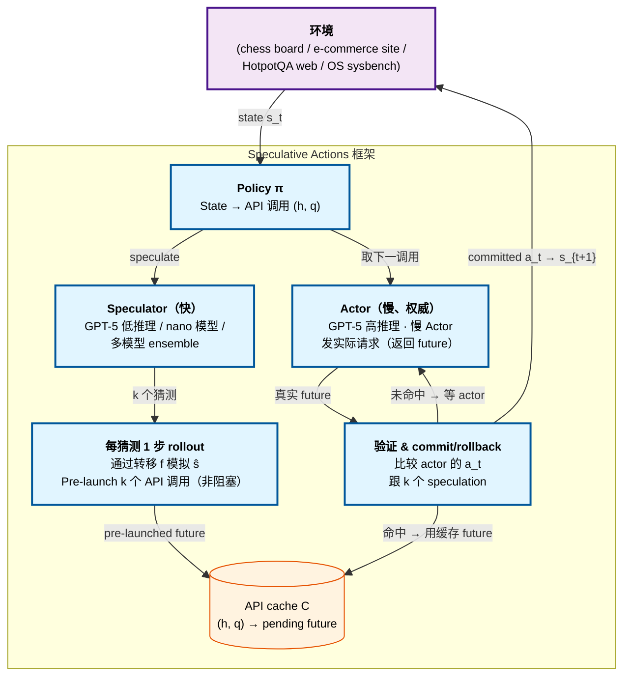

# Speculative Actions: A Lossless Framework for Faster Agentic Systems

> [!info] 论文元数据
> - **论文**：[arXiv:2510.04371](https://arxiv.org/abs/2510.04371) —— *Speculative Actions: A Lossless Framework for Faster Agentic Systems*，2025-10-05（v2: 2026-04-23）
> - **代码**：[naimengye/speculative-action](https://github.com/naimengye/speculative-action) —— 已发布
> - **作者**：Naimeng Ye\*、Arnav Ahuja\*、Georgios Liargkovas\*、Yunan Lu\*、Kostis Kaffes、Tianyi Peng
> - **机构**：哥伦比亚大学，纽约
> - **联系**：`{ny2336, aa5790, gl2902, yl4021, kk3664, tp2845}@columbia.edu`

> [!important] 这论文泛化的是什么
> 投机解码（Leviathan 2023）在 **token 级别** 操作；投机规划（Hua 2024）在单 agent 内的 **plan 级别** 操作。Speculative Actions **把同样的 speculate-verify 模式提升到 API 调用级别跨整个 agentic 环境** —— LLM 调用、tool/MCP 服务器、甚至 human-as-API。这是跟新兴的 "环境" + MCP agentic 系统视角最一致的泛化，框架同时支持 *无损*（rollback 验证）和 *有损*（last-write-wins）模式。

---

## 摘要（2 分钟读完）

**它是什么。** Speculative Actions（SA）是一个框架，把慢的权威 **Actor**（如 GPT-5 with 高推理 effort）跟快的 **Speculator**（更小/便宜的 LLM with 低推理 effort）配对，让 Speculator 预测的下一个 API 调用跟 Actor 的 deliberation 并行跑。Actor 实际决定匹配 speculation 时系统 commit 跳过等待；否则 rollback 到实际决定。跨四个环境（chess、e-commerce、multi-hop web search、OS tuning）用单步 k-way breadth speculation，SA 取得多达 **20% 端到端延迟降低** at 多达 **55% next-action prediction accuracy**，前三个 setting 带正式 lossless 保证。

**核心 idea。** **把 speculate-verify 从 token 泛化到 API 调用**。三个子部件：

1. **两角色分解** —— *Actor*（慢、权威：SOTA LLMs、tool、甚至人类，其输出物化 ground truth）和 *Speculator*（便宜、低延迟：更小 LLM、同 LLM 带缩减 prompt/reasoning、或 domain 启发式）。Speculator 预测下一个动作、它的参数、和预期 observation 或 state delta。
2. **Algorithm 1（k-way 并行 next calls）** —— 每步 Actor 发实际请求；Speculator 并行生成 $k$ 个候选 next actions，框架通过转移函数模拟每个，pre-launch 全部 $k$ 个 speculative next-step API 调用。Actor 实际 action 返回时，框架检查 $k$ 个 speculation 之一是否匹配 —— 匹配的话，pending pre-launched 调用的响应已经（或马上）就绪。
3. **通过三原语 losslessness** —— (a) **语义守卫**（Actor commit 前验证 state-transition 等价性）、(b) **安全包**（只 speculate over 幂等/可逆/沙盒副作用）、(c) **修复路径**（猜测被拒时 rollback 或补偿动作）。在难做这点的领域（如 OS tuning），论文提出 *有损* 扩展 with last-write-wins 语义。

去掉两角色 split 就退回单一 agent 执行；去掉 k-way breadth 你只抓最 confident 猜测；去掉安全原语 speculation 在有状态环境破坏正确性。

**跨四个环境的头号实验结果。**

| 环境 | Speculator/Actor | k | 准确率 | 加速 |
| --- | ---------------- | -: | ----: | ---: |
| **Chess（TextArena）** | GPT-5 (low) / GPT-5 (high) | 3 | **54.7%** | **节省 19.5% 时间** |
| **E-commerce（τ-bench）** | Multi-model（gpt-5-nano+gemini-flash）/ GPT-5 | varies | 22-38% | "~1/3 轮立即响应" |
| **Multi-hop web search（HotpotQA）** | gpt-4.1-nano / gemini-2.5-flash | 3 | **46.25%**（top-3）| 显著快于顺序 |
| **OS tuning（有损）** | 快 speculator / 慢 Actor（10-15s）| 持续 | — | **P95 延迟 37.93ms vs 54.00ms actor-only vs 102.97ms 未调** |

**Theorem 1** 建立形式化加速上界：$\mathbb{E}[T_s]/\mathbb{E}[T_{\text{seq}}] \to 1 - \frac{p(k)}{1+p(k)} \cdot \frac{\alpha}{\alpha+\beta}$，其中 $p(k)$ 是 $k$ 个 speculation 至少一个命中的概率，$\alpha$ 是 speculator 延迟，$\beta$ 是 actor 延迟。**最多 50% 降低** 当 $p=1$、$\alpha \to \infty$。

**为什么重要。**

- **第一个为 agent 动作正式化并证明 lossless 加速的框架**，带显式 cost-latency tradeoff 定理（Theorem 1、3、4）。Breadth-vs-depth tradeoff 有闭式表达式可调。
- **通用性是重点**：同一框架适用于 LLM 调用、MCP 服务器调用、browser-use API 调用、甚至 human-response 模拟。每个环境实例化同 Algorithm 1。
- **实证表明胜任 speculation 可达** —— 22-55% next-action 准确率在多样领域可信，结合并行 pre-launch 足够净加速。
- **2027 年预测。** Action-level speculation 成为 agent serving 框架标准，with `--enable-speculative-actions k=3` flag in vLLM/SGLang/Polar。Speculator 可以是在生产 trace 上 fine-tune 的 7B 模型，很像今天 token 级 spec decoding 的 draft model。

---

# 详细内容（深入阅读从这里开始）

## 背景：API 调用顺序性是 agent 瓶颈

论文开头（Section 1）Table 1 —— 当前 agent 任务时长：

| 任务 | 估计 duration |
| --- | ------------ |
| OS Tasks（Abhyankar 2025）| 10-20 分钟 |
| Deep Research（OpenAI 2025）| 5-30 分钟 |
| Data Pipeline（Jin 2025）| 30-45 分钟 |
| Kaggle Chess Game（Kaggle 2025）| **1 小时** |

这低效来自 "API 调用固有的顺序性质"。Agent 执行每步是 API 调用 —— LLM 调用、tool 调用、MCP 服务器请求、甚至人类输入 —— 每个都阻塞到响应。论文问：

> "Must an agent interact with its environment in a strictly sequential manner?"

答案否：在许多环境里 API 意图可以以合理准确性猜测，其余工作（下一步计算、并行 pre-launch）可以跟 Actor deliberation 并行进行。

### 形式化框架（Section 2）

Agentic 系统建模为 MDP $(s_t, a_t)$。每步 policy $\pi$ 映射当前 state $s_t$ 到 API 调用：
$$(h_t, q_t) \leftarrow \pi(s_t)$$
其中 $h_t$ 指定 target API，$q_t$ 是参数。写
$$\bar{a}_t \leftsquigarrow h_t(q_t), \quad a_t \leftarrow \text{await}(\bar{a}_t)$$
表示异步 API 调用返回 *future* 和实际到达的 await。Cache $C: (h, q) \mapsto \bar{a}$ 把 API 调用 specifier 映射到 pending 响应。

State 通过 $s_{t+1} \leftarrow f(s_t, a_t)$ 转移。

**框架涵盖**：
- **LLM 调用** —— agent 内每个 LLM 调用是 action
- **Tool/MCP 服务器调用** —— 每个外部/内部 tool 调用是 action
- **Human-as-API 调用** —— 人类响应是 action 带比 tool 更长延迟

这个抽象匹配近期 MCP agentic 系统视角。

## 三个核心组件详解

### 组件 1 —— Algorithm 1：k-way 并行 next calls

核心算法（论文 Algorithm 1，page 5）：

```
Require: 初始 state s_0、horizon T、转移 f、policy π、predictor ĝ、cache C
1: for t = 0 to T-1 do
2:   Policy: (h_t, q_t) ← π(s_t)
3:   if (h_t, q_t) ∈ C then
4:     ā_t ← C[(h_t, q_t)]                   ▷ Cache hit
5:     a_t ← await(ā_t)                       ▷ Await pending action 如果还没返回
6:     s_{t+1} ← f(s_t, a_t)
7:     continue
8:   end if
9:   Actor: 发实际请求（返回 future）: ā_t ⇆ h_t(q_t)
10:  Speculator: {â_t^(i)}_{i=1}^k ← await(ĝ(s_t, (h_t, q_t)))   ▷ Actor 跟 speculator 并行
11:  for i = 1 to k do                         ▷ 每个猜测一步 speculative rollout
12:    ŝ_{t+1}^(i) ← f(s_t, â_t^(i))
13:    (ĥ_{t+1}^(i), q̂_{t+1}^(i)) ← π(ŝ_{t+1}^(i))
14:    Pre-launch: ā_{t+1}^(i) ⇆ ĥ_{t+1}^(i)(q̂_{t+1}^(i))   ▷ 返回 future，非阻塞
15:    C[(ĥ_{t+1}^(i), q̂_{t+1}^(i))] ← ā_{t+1}^(i)            ▷ 缓存 speculative pending actions
16:  end for
17:  等待 Actor 解析 a_t: a_t ← await(ā_t)
18:  s_{t+1} ← f(s_t, a_t)
19: end for
```

**两个关键角色形式定义**（Section 2）：

- **Actor(s)**："authoritative but slow executors — SOTA LLMs, external APIs, environment's own responses, or humans — whose outputs materialize the ground truth for correctness and side effects."
- **Speculator(s)**："inexpensive, low-latency models that predict the next environment step, i.e., the action, its arguments, and the expected observation or state delta. Examples include smaller LLMs, same LLM with reduced prompts and reasoning steps, and domain heuristics."

### 组件 2 —— Theorem 1：加速界

**Proposition 1（论文 page 5）**：在 Assumption 1（speculation accuracy $p$）和 2（concurrent reversible pre-launch）下，Actor 延迟 $\sim \text{Exp}(\beta)$，Speculator 延迟 $\sim \text{Exp}(\alpha)$ 其中 $\beta < \alpha$，期望 runtime 比是：

$$\frac{\mathbb{E}[T_s]}{\mathbb{E}[T_{\text{seq}}]} = 1 - \frac{1}{T} \cdot \frac{\alpha}{\alpha + \beta} \left[ \frac{(T-1)p(k)}{1+p(k)} + \frac{p(k)^2}{(1+p(k))^2} - \frac{p(k)^2}{(1+p(k))^2}(-p(k))^{T-1} \right]$$

当 $T \to \infty$：
$$\to 1 - \frac{p(k)}{1+p(k)} \cdot \frac{\alpha}{\alpha+\beta}$$

其中 $p(k) = 1 - (1-p)^k$ 是 $k$ 个 speculation 至少一个命中的概率。

> [!important] k-way breadth 最多 50% 加速
> Proposition 1 表明端到端延迟降低 **上界 50%**，发生在 $p=1$（完美 speculation）和 $\alpha \to \infty$（免费 speculator）。这是单步 k-way breadth speculation 的根本天花板，无论 $k$ 多大；论文说这"可以通过下面的 multi-step extension 进一步改善"。多步 speculation 预测 $s$ 步前面，产生树结构带更深节省。

### 组件 3 —— Losslessness 原语

论文通过三个设计原语强制 losslessness（Section 2）：

**(a) 语义守卫** —— Actor commit 前验证 state-transition 等价性。如果 $f(s_t, \hat{a}_t^{(i)}) = f(s_t, a_t)$，speculation 被 commit。

**(b) 安全包** —— 只 speculate over 可逆或 sandboxed 副作用的 action。论文列 web search、pre-checkout 购物车、OS 级 sandbox 操作作自然 fit；警告反对 speculate 不可逆操作（删除记录、下单），rollback 不免费。

**(c) 修复路径** —— 猜测被拒时框架 rollback（chess、OS tuning）或应用补偿动作（refund/replace）。

> [!quote] 框架的设计哲学
> "Speculative actions should not degrade final outcomes compared to a strictly sequential agent. ... A key design goal is losslessness relative to the environment's baseline semantics: speculative actions ... result in an *as-if-sequential, lossless interface with parallel, opportunistic internals*."

### 辅助机制

> [!note]- Theorem 3：Breadth speculation 成本
>
> 让 $\bar{k}$ 表示 $k$ 个 speculative 分支中 *distinct* action 数（duplicates 被 kill）。成本比（Section 5.1 形式化）：
>
> $$\frac{\mathbb{E}[M_{\text{spec}} - M_{\text{seq}}]}{\mathbb{E}[M_{\text{seq}}]} = \bar{k} - \frac{1}{T}\left( \bar{k} + \frac{\alpha}{\alpha+\beta} \right)\left[\frac{(T-1)p(k)}{1+p(k)} + \frac{p(k)^2}{(1+p(k))^2} - \frac{p(k)^2}{(1+p(k))^2}(-p(k))^{T-1}\right]$$
>
> 当 $T \to \infty$：$\bar{k} - (\bar{k} + \alpha/(α+\beta)) \cdot p(k)/(1+p(k))$。
>
> 结合 Proposition 1，这给出闭式 **cost-latency tradeoff** 让用户基于他们的相对 cost-vs-latency 偏好离线调 $k$。

> [!note]- Theorem 4：Confidence-aware 选择性 speculation
>
> 当 per-speculation 信心估计可得（从 logits 或辅助 predictor），论文推每窗口启动最优分支数。分支按降信心顺序贪婪添加 while $\Delta^* \cdot \delta q(m; p) \geq c$，其中 $\delta q$ 是再加一个分支的 marginal gain。Stationary case 中 continuation value 塌为常数 $\Delta^*$。
>
> 实证验证（Figure 6）：confidence-based 启发式在跟固定 3 分支 speculation 相当的延迟达到最低成本，超过固定 1 或 2 分支策略。

## 系统架构

Algorithm 1 的四环境实例化，每个把快 Speculator 跟慢 Actor 配对：



## 头号实验证据

### Chess（Section 3.1，TextArena）

最干净的 demonstration。两个 GPT-5 agent 下棋；Actor 用高推理 effort，Speculator 用低 effort with "快速预测对手 move" system prompt。

| k（预测数）| 节省时间 | Speculative 准确率 |
| ---------: | -------: | ----------------: |
| 1 | 11.8% | 31.3% |
| 2 | 15.0% | 41.3% |
| **3** | **19.5%** | **54.7%** |

Lossless：最终游戏轨迹跟非 speculative 玩相同。时间节省随 $k$ scale 但递减（跟 Theorem 3 一致）。

### E-commerce（Section 3.2，τ-bench）

零售客户-agent 交互，Speculator 预测用户下一查询和 target API 调用（如 `get_user_details`、`get_order_details`）。

| 推理能力 | Speculator API 预测准确率 |
| ------- | ----------------------: |
| Low | 22.8-24.1%（单模型）、32.5%（multi-agent）|
| Medium | 23.4-27.2%（单）、34.9%（multi）|
| High | 23.3%（单）、**38.5%**（multi）|

Speculative 预算：1024/2048/4096 tokens。**低预算 speculator 在 2-3 秒内跑** vs 用户平均打字 ~30 秒，意味 ~1/3 轮可立即响应不等 API 执行。

> [!example]- 多模型 speculation 超过单模型
>
> 受异质 LLM ensemble 超过单模型启发（Jiang 2023、Chen 2025），论文测两个配置：
>
> - **单模型 speculator**（如 gpt-5-nano 单独）
> - **多模型 speculator**（gpt-5-nano with 低预算 + Gemini-2.5-Flash with 中预算，输出聚合）
>
> Multi-agent 持续胜出（Figure 3：low 32.5% vs 22.8%；high 38.5% vs 23.3%）。不同模型命中不同预测模式。

### Multi-hop web search（Section 3.3，HotpotQA）

Agent 通过顺序 Wikipedia API 调用答 multi-hop 问题。Speculator 在实际 API 调用执行时预测可能 Wikipedia 内容。

| Speculator | Top-1 准确率 | Top-3 准确率 |
| ---------- | ----------: | ----------: |
| gpt-5-nano | 15.08% | 31.67% |
| gpt-4.1-nano | 18.75% | **46.25%** |
| gemini-2.5-flash | 19.58% | 38.33% |

Speculator 成功预测 ground-truth API 调用 **多达 46% 时间** with top-3。Speculation 通过在 idle API 等待时预计算 reasoning 路径提供价值。

### OS 超参数 tuning（Section 4，有损扩展）

这是 *有损* 扩展 —— last-write-wins 语义、无 rollback。Tune Linux Completely Fair Scheduler `min_granularity` 参数 under `sysbench cpu` workload。

| 配置 | p95 延迟 (ms) |
| ---- | ------------: |
| 未调 | 102.97 |
| 仅 Actor（10-15s 间隔）| 54.00 |
| **Actor + Speculator**（1s speculator，10-15s actor）| **37.93** |

Speculator 每秒用最新性能指标提议参数更新；Actor 每 10-15 秒带更深分析响应。**仅 Speculator 次优**（0.55 ms min_granularity，36.24 ms 延迟 —— 局部最小值）。**联合 Actor+Speculator 10-15 s 收敛到最优 0.2 ms vs Actor-only 的 ~200 s**，成本 0.17 cents vs 2.18 cents。

> [!success] 当 losslessness 放宽：成本和延迟都降
> Section 4 结论："Despite additional speculative calls, **total cost is lower due to faster convergence**." 不寻常 —— speculation 通常用额外成本换延迟。OS-tuning 场景显示当 speculation 把系统驱动到好状态更快，actor 需要更少（或更短）deliberation，总成本也降。

## 优势与局限

**优势。**

- **理论扎实** —— Theorem 1、3、4 提供加速、成本、confidence-based 选择性分支的闭式界。
- **实证多样** —— 四个真不同环境（游戏 / 对话 / 检索 / OS）实例化同算法。
- **Lossless 保证真** —— chess/e-commerce/HotpotQA 最终轨迹精确匹配非 speculative baseline。
- **有损扩展展示框架触达** —— losslessness 不要求时（OS），加速更大，成本可降。
- **开源代码** at https://github.com/naimengye/speculative-action。

**局限。**

> [!warning] 50% 加速是形式化天花板
> Proposition 1 显式表明单步 k-way speculation 加速上界 50%，无论 $k$ 大小。超过这要 multi-step（s-step lookahead）speculation，论文 sketch 但没深入评估。多步有快速生长的树搜索复杂度。

- **所有实验用 frontier LLM 作 Actor**（GPT-5、Gemini-2.5-Flash）。Speculator 常是同家族更小变体，不是独立训练的 draft model。专门训练的 7B speculator（类比 EAGLE 的 draft model）可信能做更好。
- **领域特定成功率差别巨大** —— 跨四环境 22-55%。泛化到完全新 agent 领域未测。
- **副作用分类法非正式** —— 论文说 "limited to cases where mispredictions are reversible, via forking, snapshot restoration, or roll-forward repair" 但没提供分类 tool 的算法。
- **Theorem 1 假设指数延迟分布**。真实 LLM API 延迟是双峰（cached vs uncached）长尾。
- **没在同 workload 上跟 PASTE 或 Conveyor 对比** —— Related Work 引用但没 head-to-head 测量。
- **Speculator 成本真实** —— 多模型 ensemble 翻倍 token 成本；cost-latency tradeoff（Section 5）characterize 这点但最优 tuning 要 per-deployment 校准。

## 这意味着什么

Speculative Actions 是 speculative-decoding/speculative-planning 文献正在朝向的概念**泛化**。加速 token 生成（Leviathan）、reasoning chain（SpecReason、Lookahead）、单 agent plan（Hua、Guan）的同样 predict-then-verify 模式现在正式化在任意 API 调用级别 —— 覆盖 LLM 调用、tool/MCP 服务器请求、browser-use API、甚至人类输入。

2027 年的三个预测：

1. **Action-level speculation 成为 agent serving 框架标准**。预期 vLLM、SGLang、Polar 在 12 个月内加 `--enable-speculative-actions k=3 --speculator <model>` flag。
2. **生产 "draft model for action" 出现**。Speculator 被特化 —— 在生产 trace 上 fine-tune、带结构化 action vocabulary、从 Actor 蒸馏。这是 action 的 EAGLE 等价物。
3. **Breadth-vs-depth 问题实证解决**。本文做 breadth（k-way 单步）；后续工作做 depth（多步树）；最优组合环境依赖，会成为可调超参数。

这篇论文**不**解决：

- **Tool 执行速度本身** —— 只 tool 周围的 *等待*。慢 tool（计算密集 CPU 工作）由 [[cpu-centric-agentic-ai|CPU-Centric Perspective]] 的 COMB/MAS address。
- **多轮 agentic-RL 训练** —— 焦点推理；[[polar|Polar]] / [[prorl-agent|ProRL Agent]] / [[rose|ROSE]] 覆盖训练侧。
- **Multimodal speculation** —— 仅文本；[[speceyes|SpecEyes]] 专门 address multimodal agentic LLM 加速。

## 源代码与复现

```bash
git clone https://github.com/naimengye/speculative-action
cd speculative-action
# 实现建立在 TextArena（chess）、τ-bench（e-commerce）、HotpotQA + Wikipedia API、sysbench（OS tuning）
```

**复现协议**（Section 3）：

| 组件 | 配置 |
| ---- | --- |
| Chess 平台 | TextArena（Guertler et al., 2025）—— 标准化 LLM 玩接口 |
| E-commerce 平台 | τ-bench（Yao et al., 2024）—— 零售客户-agent benchmark |
| Web 搜索 | HotpotQA（Yang et al., 2018）with Wikipedia API |
| OS tuning | `sysbench cpu` benchmark（Kopytov, 2020），Linux CFS `min_granularity` |
| Actor 模型 | GPT-5（高推理）、Gemini-2.5-Flash |
| Speculator 模型 | GPT-5（低推理）、gpt-5-nano、gpt-5-mini、gpt-4.1-nano、Gemini-2.5-Flash |
| Speculative 分支 k | 1、2、3（chess）；varies（其它）|
| Speculative 预算 | 1024 / 2048 / 4096 tokens |
| Trial | 每配置 5 次跑 over 30 步（chess）；其它每 benchmark 100+ 次 trial |

## 相关阅读

- [[speceyes]] —— SpecEyes：专门给 **multimodal** LLM 的 agentic 级 speculative 加速（Xiamen U + Rochester + OSU，2026-03）。两者都把 speculation 从 token 提升到 agent loop；SA 覆盖一般文本 agent，SpecEyes 覆盖带 vision tool 的 MLLM。
- [[aurora]] —— Aurora：token 级投机解码训练成异步 RL。不同层（token vs action）但同 speculate-verify 家族。
- [[das-spec-rl]] —— DAS：分布感知 token 级 spec decoding 给 RL rollout。跟 Speculative Actions 可组合（DAS 加速每个 Actor 调用；SA 跨调用并行化）。
- [[speculative-decoding]] —— Token 级投机解码总览；概念祖先。
- [[continuum]] —— 多轮 agent 的 KV cache TTL；正交 serving 优化。
- [[cpu-centric-agentic-ai]] —— CPU-Centric Perspective：address CPU 侧 tool 延迟；SA address LLM 侧等待延迟。可组合。
- [[agentic-ai-workload-characteristics]] —— Workload characterization 表明为什么 agent 延迟重要（LLM=E2E 71-98% 时间意味 SA 的 wait-elimination 有意义影响）。
- [[continuous-batching]] —— Batching 原语跟多分支 speculation 交互（多个 speculative 调用共享推理引擎）。
- [[ai-agent-overview]] —— 更高层 ReAct 范式描述。

## 参考文献

- Naimeng Ye, Arnav Ahuja, Georgios Liargkovas, Yunan Lu, Kostis Kaffes, Tianyi Peng. *Speculative Actions: A Lossless Framework for Faster Agentic Systems.* arXiv:2510.04371, 2025 年 10 月（v2 2026 年 4 月）. https://arxiv.org/abs/2510.04371
- Leviathan et al. 2023 —— token 级投机解码基础。
- Hua et al. 2024 —— agent 的交互式投机规划（深度导向、单规划分支）。
- Guan et al. 2025 —— 动态 speculation 深度的在线 RL。
- TextArena（Guertler 2025）；τ-bench（Yao 2024）；HotpotQA（Yang 2018）；sysbench（Kopytov 2020）。
- Tomasulo 1967 —— 原始微架构投机执行；Lam & Wilson 1992 —— rollback 语义。
- Mambretti et al. 2019 —— Speculator（CPU speculation 分析）。
- MCP（Anthropic, 2024）—— 本框架的 "万物都是 API 调用" 视角对齐的 Model Context Protocol。
