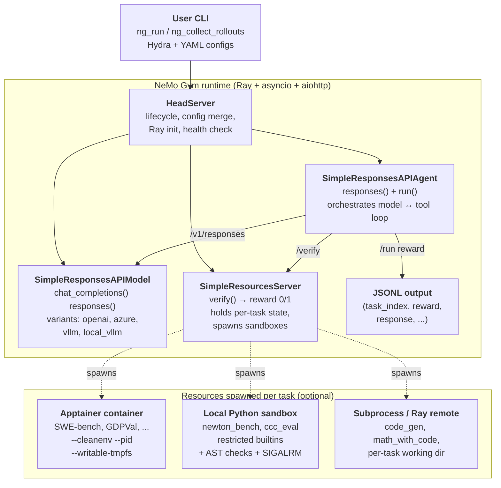
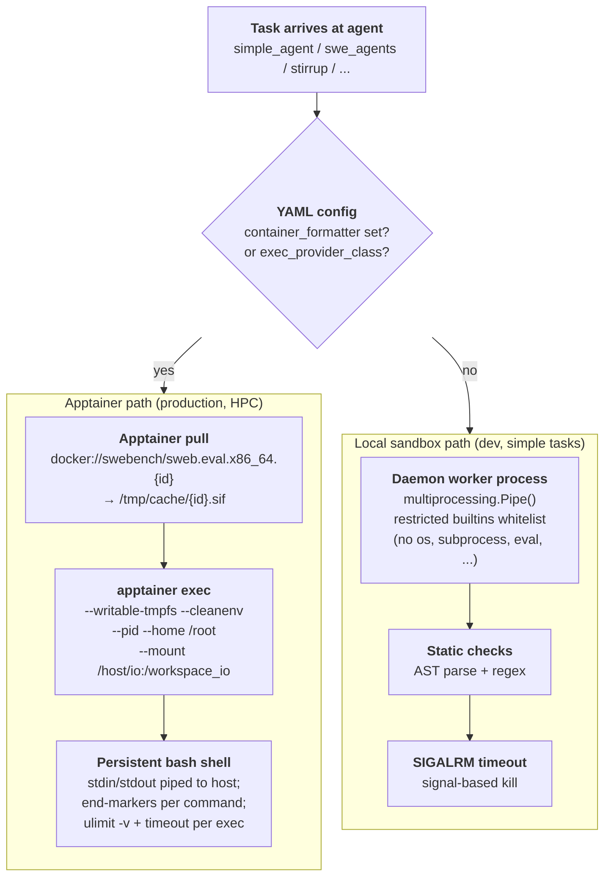

# NeMo Gym: NVIDIA's RL Environment Framework for LLMs

> [!info] Project metadata
> - **Repo**: [github.com/NVIDIA-NeMo/Gym](https://github.com/NVIDIA-NeMo/Gym) — Apache-2.0
> - **Docs**: [docs.nvidia.com/nemo/gym/latest](https://docs.nvidia.com/nemo/gym/latest/)
> - **Part of**: NVIDIA NeMo platform (training side: NeMo RL; inference side: Nemotron)
> - **Status**: Early development (APIs evolving). Battle-tested inside NVIDIA on Nemotron training.

---

## Summary (read this if you have 2 minutes)

**What it is.** NeMo Gym is the **environment / rollout side** of NVIDIA's RL training stack — the counterpart to trainer libraries like [[rl-training-frameworks|NeMo RL, VeRL, Unsloth]]. You hand it a dataset of tasks + an agent harness + a verifier; it spins up three FastAPI microservices and runs your agent against the tasks at arbitrary concurrency, scoring each rollout and handing `(input, output, reward)` tuples back to your trainer.

**The one idea.** An **environment = dataset + harness + verifier + state**, packaged as **three independent FastAPI services with a stable HTTP contract**. Three sub-pieces hold this up:

1. **Four-component decomposition** — anything you'd call an RL post-training environment maps cleanly to dataset (the tasks) + harness (how the model acts) + verifier (how completion is scored) + state (per-task execution context).
2. **Three-server split** (resources / model / agent) — verifier + state in *resources*, LLM inference in *model*, orchestration in *agent*. Each scales independently and can be swapped via YAML.
3. **HTTP + Hydra config contract** — trainer talks to a HeadServer over HTTP with versioned Pydantic schemas; everything (Ray, sandbox lifecycle, container choice) is hidden behind the contract.

Remove any one and verifier code mixes with harness code, model inference can't scale independently of verification, or the trainer is coupled to the rollout implementation.

**Concrete systems / production deployments.** Battle-tested in **Nemotron** training (the framework README says so explicitly); [[on-policy-distillation#Production deployments|Nemotron-Cascade 2]] (Mar 2026, IMO / IOI / ICPC gold medals) used NeMo Gym for its multi-domain GRPO + MOPD pipeline. The library ships **84 built-in benchmarks**, **19 agent harnesses**, and **6 model-server backends** out of the box — first-party tutorials for [[rl-training-frameworks|NeMo RL]] (GRPO/DAPO), VeRL, and Unsloth. The agent-side rollout driver [[prorl-agent]] is the natural counterpart on the agent loop side.

**Why it matters.**

- **Rollout-as-a-service decouples trainers from environments.** A new benchmark, new tool, or new sandbox change doesn't touch the RL framework. Switching trainers (VeRL ↔ NeMo RL ↔ Unsloth) is a config edit, not a porting effort.
- **The 84-benchmark catalog is the moat.** Anyone can build the architecture in a week; building 84 production-grade integrations takes years. The strategic value is the catalog, not the FastAPI design.
- **Engineering opinions save weeks of debugging.** aiohttp not httpx (httpcore's O(n²) pooling hangs at 16K+ concurrency), Apptainer not Docker (training nodes already nested in enroot), `RAY_TMPDIR=/tmp` on Lustre (107-byte AF_UNIX limit). The kind of details that come from running this at scale.

---

# Depth (drill-down starts here)

The summary above is the executive layer. Everything below is for the careful reader who wants the full architecture and engineering detail.

## Background: why RL environments are their own infrastructure problem

RL post-training of LLMs requires rolling out tasks against the current policy at high concurrency, scoring each rollout to produce a reward, and feeding the rewards back to the trainer. The naive way — call a model API, run a verifier script in the same process, repeat — falls over in three ways at production scale:

| Problem | Why it shows up | What it costs |
| ------- | --------------- | ------------- |
| **Concurrency** | Modern RL needs **thousands of concurrent rollouts per step** to saturate the GPU | A single Python script can't drive 16 K+ concurrent model calls without serious infra |
| **Statefulness** | Code tasks need a working directory + test harness; SWE-bench needs a full git repo; tool-use tasks need cross-turn session state | Verifiers must *observe* execution state, not just text — cannot be pure functions |
| **Reuse** | Same environment must serve evaluation, agent optimization, and RL training across teams | Bespoke per-use-case integrations don't accumulate; environments must be self-contained services |

The standard "trainer library bundles environments" approach (TRL `make_env`, OpenRLHF runners) couples environment code into the trainer process — making (a) reuse across trainers hard, (b) concurrency bounded by the trainer's event loop, (c) state management dangerous in shared memory. NeMo Gym's design move is to **separate concerns into independent FastAPI services with a stable HTTP contract** — the same architectural argument that produced microservices in 2014, applied to RL rollouts.

| Aspect | Trainer-bundled (TRL, OpenRLHF) | NeMo Gym (microservice) |
| ------ | ------------------------------- | ----------------------- |
| Coupling | Environment code lives in trainer process | Three FastAPI services connected via aiohttp |
| Concurrency scaling | Bounded by trainer event loop | Scale by adding replicas |
| Reuse across trainers | Re-implement per trainer | Same HTTP contract serves any trainer |
| State isolation | Shared process state | Per-server state, independently restart-able |
| Failure recovery | Crash kills the trainer | Independent server crashes isolated |

## System architecture

> [!quote] The contribution in one sentence
> An **environment** is the complete system an agent interacts with to complete a task — dataset (the tasks), harness (how the model interacts), verifier (how completion is scored), state (per-task execution context) — and the right packaging for it is **three independent FastAPI services with a stable HTTP contract**.

The end-to-end loop:

```
data/example.jsonl  ─►  agent server  ─►  model server  ─►  agent server  ─►  resources server  ─►  reward
   (one task per line)    (run harness)   (LLM forward)    (parse output)    (verify in sandbox)
```



Three structural choices visible in the picture:

- **All three server types are FastAPI apps**, not Python-imported libraries — communicate over HTTP (aiohttp). Same architecture serves evaluation (one shot, one process) and training (thousands of concurrent rollouts across nodes). Scale by replicas, not threading.
- **HeadServer is the conductor** — merges configs, brings up Ray, starts sub-servers, exposes unified health. Your CLI talks only to HeadServer.
- **Containers / sandboxes are spawned inside the resources server**, only when a task needs isolated execution. Most benchmarks (MCQA, judge-based) don't need any sandbox; SWE-bench / GDPVal / Newton Bench do.

## The three server types

### Resources servers — the verifier side

Each implements `verify()`:

```python
class MyBenchmarkServer(SimpleResourcesServer):
    async def verify(self, request: VerifyRequest) -> VerifyResponse:
        output_text = request.output_text
        metadata = request.verifier_metadata  # opaque dict
        score = check_answer(output_text, metadata)
        return VerifyResponse(reward=1.0 if score else 0.0)
```

The `verifier_metadata` dict is **opaque to the framework** — define whatever fields your benchmark needs (test cases, expected answers, task IDs, gold patches, hidden test inputs) and the framework pipes them through from the JSONL line to your `verify()`. The repo ships **84 resources servers**.

> [!note]- The 84 benchmarks by category (reference — skip unless surveying)
>
> | Category | Examples |
> | -------- | -------- |
> | Code generation | `code_gen`, `bigcodebench`, `evalplus`, `competitive_coding_challenges`, `code_fim` |
> | SWE / repo-level | `swerl_gen`, `swerl_llm_judge` |
> | Math & formal reasoning | `math_with_code`, `math_with_judge`, `math_formal_lean`, `imo_proofbench_judge`, `polymath` |
> | Science Q&A | `gpqa_diamond`, `mcqa`, `ugphysics_judge`, `frontierscience_judge` |
> | Long-context / retrieval | `ruler`, `mrcr`, `hotpotqa_qa`, `aalcr` |
> | Tool use & agents | `tavily_search`, `google_search`, `xlam_fc`, `ns_tools` |
> | Safety / alignment | `jailbreak_detection`, `indirect_prompt_injection`, `over_refusal_detection`, `xstest`, `abstention` |
> | Structured output | `format_verification`, `structured_outputs`, `structeval`, `ifbench` |
> | Vision / multimodal | `labbench2_vlm`, `vlm_eval_kit`, `gdpval` |
> | SQL & data | `bird_sql`, `spider2_lite`, `text_to_sql` |
> | Domain | `rdkit_chemistry`, `ether0`, `finance_sec_search`, `cvdp` |
> | RL environments (Gym-style) | `gymnasium`, `grl_sokoban`, `grl_tetris`, `blackjack` |
> | External-library bridges | `aviary`, `openenv`, `reasoning_gym`, `arc_agi` |

### Response API models — the LLM side

Thin wrappers exposing OpenAI-compatible endpoints. Six variants:

| Server | Backend |
| ------ | ------- |
| `openai_model` | OpenAI public API or compatible endpoint |
| `azure_openai_model` | Azure OpenAI deployments |
| `vllm_model` | Remote vLLM server with `/v1/chat/completions` |
| `local_vllm_model` | Spawns vLLM locally as part of HeadServer startup |
| `local_vllm_model_proxy` | Proxy / round-robin across local vLLM replicas |
| `genrm_model` | Generative reward model variant |

Why a separate model layer: agent code stays backend-agnostic. The same SWE-Agent harness runs against GPT-5 (`openai_model`), a Nemotron checkpoint (`vllm_model`), or in-process vLLM (`local_vllm_model`) with no agent code changes — only YAML.

### Response API agents — the harness side

The 19 shipped harnesses cover from one-shot QA to OpenHands-style SWE-bench:

> [!note]- The 19 agent harnesses (reference — skip unless picking one)
>
> | Harness | What it does |
> | ------- | ------------ |
> | `simple_agent` | One model call, no tools. Default for QA-style benchmarks. |
> | `proof_refinement_agent` | Multi-turn correction loop: model sees verifier error and retries. |
> | `swe_agents` | OpenHands-style SWE-bench harness (bash + file-edit tools, container per task). |
> | `mini_swe_agent` | Lighter-weight SWE harness. |
> | `stirrup_agent` | Generic code-execution harness with pluggable executor (local sandbox / Apptainer). |
> | `langgraph_agent` | Bridges LangGraph-defined agents into the Gym schema. |
> | `verifiers_agent` | Bridges the `Verifiers` library. |
> | `aviary_agent` | Bridges FutureHouse's Aviary environments. |
> | `harbor_agent` | HPC-cluster Singularity environment with FastAPI-in-container. |
> | `gymnasium_agent` | Classic Gym/Gymnasium environments (Sokoban, Tetris, Blackjack). |
> | `browsecomp_agent` | Web browsing tasks. |
> | `tool_simulation_agent` | Tool-use evaluation with simulated tool responses. |

> [!important] Multi-turn agent contract
> Multi-turn agents must propagate **cookies** through every downstream call (`cookies=request.cookies` — stateful environments key on this) AND **token IDs + log-probs** (`prompt_token_ids`, `generation_token_ids`, `generation_log_probs`) from each model response into the next turn. These are what the trainer uses to compute advantages downstream — drop them and gradients break.

## The container & sandbox story

The part most often misread. Two independent paths.

> [!warning] NeMo Gym does not use Docker directly
> Production isolation goes through **Apptainer**. The training cluster nodes themselves run inside enroot containers — Docker daemon can't nest inside enroot — so Apptainer is the only nesting-friendly option. Apptainer *does* consume Docker images (`docker://...` URIs) but it's Apptainer running them, not Docker. Reference: `docs/infrastructure/engineering-notes/swe-rl-case-study.md`: *"Apptainer was the only containerization framework that we could run from within an enroot container."*



**Apptainer path** (production HPC) — used by `swe_agents`, `stirrup_agent` (configured), `harbor_agent`. YAML:

```yaml
container_formatter: "docker://swebench/sweb.eval.x86_64.{instance_id}"
apptainer_memory_limit_mb: 32768
swebench_tests_timeout: 900
swebench_agent_timeout: 1800
command_exec_timeout: 300
```

A long-lived `bash` runs inside the container; the agent sends commands via stdin with unique end-marker echoes to delimit output. `ulimit -v` bounds memory, `timeout` bounds per-command time. Orchestration is in `responses_api_agents/stirrup_agent/apptainer_provider.py` (~700 lines) and `responses_api_agents/swe_agents/app.py` (~2000 lines).

**Local sandbox path** (dev / simple tasks) — used by `newton_bench`, `competitive_coding_challenges`, `stirrup_agent` (default with no container configured). Implementation in `resources_servers/newton_bench/newton_bench_utils/sandbox.py`: daemon worker via `multiprocessing.Pipe()`, restricted `__builtins__` whitelist (no `os`, `sys`, `subprocess`, `eval`, `exec`, `open`), AST + regex pre-check, `signal.SIGALRM` wall-clock timeout. Not real isolation — "restrict what Python can do, hope the model doesn't escape." Fine for pure-function correctness checks, not for arbitrary shell.

**What's NOT containerized**: the three NeMo Gym servers themselves run on the host (or Ray worker) as plain Python processes; most resources servers don't spawn containers at all; CI doesn't build images — `.github/workflows/_build_container.yml` delegates to a shared NVIDIA FW-CI template; NeMo Gym CI only runs `pytest`.

> [!warning] Don't confuse "uses Docker images" with "uses Docker"
> NeMo Gym configs contain `docker://...` URIs everywhere. This is **Apptainer pulling from Docker Hub**, not Docker daemon execution. There is no `docker` process anywhere in a NeMo Gym deployment. Get this wrong and you'll waste an afternoon trying to install Docker on an HPC node where it can't possibly run.

## Distributed execution and engineering opinions

### Ray

```python
@ray.remote(
    scheduling_strategy="SPREAD",
    runtime_env={"py_executable": sys.executable},
)
def run_agent_remote(params: dict[str, Any]) -> Any:
    ...
```

Two patterns: **agent-level Ray remote** (each task → Ray task, possibly different node, may further spawn Apptainer); **subprocess-level Ray remote** (resources server's `verify()` delegates code execution to Ray remote, `await future`). In async code: **always** `await future` directly. Never `ray.get()` in async context — blocks the event loop.

> [!warning] Lustre Ray socket-path gotcha
> On filesystems with long working-directory paths (Lustre on NVIDIA clusters), Ray AF_UNIX socket paths exceed Linux's 107-byte limit and `ray.init()` fails cryptically. Workaround: `RAY_TMPDIR=/tmp` before running. `ng_test` spawns isolated venvs so Python `os.environ` writes don't propagate — set this externally (`RAY_TMPDIR=/tmp ng_test ...`).

### Non-obvious engineering rules that have already burned someone

| Rule | Why |
| ---- | --- |
| **Use aiohttp, not httpx** | At 16 K+ concurrency, httpx/httpcore has O(n²) connection pooling that hangs. All async HTTP must go through `nemo_gym.server_utils.request()`. See `docs/infrastructure/engineering-notes/aiohttp-vs-httpx.md`. |
| **Every `/run` endpoint must be async** | Synchronous endpoints serialize the trainer's rollout collection. |
| **`asyncio.Semaphore` to bound concurrent subprocess** | Otherwise 4 K–65 K concurrent rollouts exhaust file descriptors. |
| **Decode subprocess output with `errors="replace"`** | Model output is rarely clean UTF-8. |
| **Guard nested optional fields**: `(body.field or {}).get("key", default)` | Agents receive partial responses regularly. |
| **Config via Hydra, not env vars** | Reproducibility, multi-instance support, audit trail. Only legitimate env var is `RAY_TMPDIR` (per the Lustre gotcha). |
| **Pin `openai<=2.6.1`** | Schema compatibility. Don't bring in LiteLLM / Anthropic SDK / other clients. Use `nemo_gym/openai_utils.py`. |
| **External-tool auto-install** | `setup_<tool>.py` with `ensure_<tool>()` called from `model_post_init()`; add `pytest_configure` hook in `conftest.py` so `skipif` markers see installed tools. |

## Configuration and data

### Hydra + YAML

Each server instance is a top-level key:

```yaml
my_benchmark_server:
  resources_servers:
    my_benchmark:
      entrypoint: app.py
      domain: coding
      verified: false

my_agent_instance:
  responses_api_agents:
    simple_agent:
      entrypoint: app.py
      resources_server:
        type: resources_servers
        name: my_benchmark
      model_server:
        type: responses_api_models
        name: policy_model
      datasets:
      - name: my_dataset
        type: train
        jsonl_fpath: path/to/data.jsonl
        gitlab_identifier:
          dataset_name: my_benchmark
          version: 0.0.1
        license: MIT
```

Model endpoint credentials in `env.yaml` at project root (per-user, kept out of server configs).

### JSONL schema + dataset tiers

```json
{
  "responses_create_params": {
    "input": [
      {"role": "system", "content": "..."},
      {"role": "user", "content": "..."}
    ]
  },
  "verifier_metadata": {"task_id": "...", "test_cases": [...]}
}
```

| Tier | Where it lives | When to use |
| ---- | -------------- | ----------- |
| `example` | `data/example.jsonl` — 5 entries, in git | Smoke testing, CI, demos |
| `train` | GitLab MLflow registry (NOT in git) | RL training rollouts |
| `validation` | GitLab MLflow registry (NOT in git) | Held-out evaluation |

## Concrete systems and production deployments

The "Experiments" slot for a framework page — verified deployments and integrations.

### Inside NVIDIA

**Battle-tested in Nemotron training.** The framework's README says so explicitly; [[on-policy-distillation#Production deployments|Nemotron-Cascade 2]] uses NeMo Gym for its multi-domain GRPO + MOPD pipeline (Mar 2026, IMO / IOI / ICPC gold medals).

### Integrated trainers (consumers of Gym rollouts)

| Trainer | Integration | Source |
| ------- | ----------- | ------ |
| [[rl-training-frameworks\|NeMo RL]] | First-party — GRPO / DAPO via Gym rollouts | [Tutorial](https://docs.nvidia.com/nemo/gym/latest/training-tutorials/nemo-rl-grpo/index.html) |
| veRL | First-party | [Tutorial](https://docs.nvidia.com/nemo/gym/latest/training-tutorials/verl.html) |
| Unsloth | First-party | [Tutorial](https://docs.nvidia.com/nemo/gym/latest/training-tutorials/unsloth-training.html) |

### Integrated environment libraries and harnesses

| Library / harness | Lives at |
| ----------------- | -------- |
| Aviary (FutureHouse) | `resources_servers/aviary` |
| Harbor | `responses_api_agents/harbor_agent` |
| OpenEnv | `resources_servers/openenv` |
| Reasoning Gym | `resources_servers/reasoning_gym` |
| Verifiers | `responses_api_agents/verifiers_agent` |
| OpenHands | `responses_api_agents/swe_agents` |
| Mini SWE Agent | `responses_api_agents/mini_swe_agent` |
| LangGraph | `responses_api_agents/langgraph_agent` |

### Position in the broader stack

```
┌──────────────────────────────────────────────────────────────────────┐
│  Trainer side                                                        │
│   • NeMo RL (GRPO / DAPO)        ─┐                                  │
│   • VeRL                          ├─► rollout requests ─► NeMo Gym   │
│   • Unsloth                       │                                  │
│   • TRL                          ─┘   rewards + token IDs ◄──        │
└──────────────────────────────────────────────────────────────────────┘
                                       │
                                       ▼
┌──────────────────────────────────────────────────────────────────────┐
│  NeMo Gym (this page)                                                │
│   • 84 benchmarks / 19 harnesses / 6 model server backends           │
│   • Hydra config, Ray distribution, aiohttp HTTP                     │
│   • Apptainer for dangerous code, local sandbox for safe code        │
└──────────────────────────────────────────────────────────────────────┘
                                       │
                                       ▼
┌──────────────────────────────────────────────────────────────────────┐
│  Model side                                                          │
│   • vLLM / SGLang / TensorRT-LLM (local, multi-node)                 │
│   • Hosted: OpenAI, Azure, Fireworks, OpenRouter, …                  │
└──────────────────────────────────────────────────────────────────────┘
```

## Strengths and limitations

The two strongest points: (1) **breadth** — 84 benchmarks + 19 harnesses + 6 model backends out of the box is unusual for an academic-style RL library; (2) **architectural fit for scale** — FastAPI + aiohttp + Ray + Apptainer is the right stack for "thousands of concurrent rollouts on a Slurm cluster," and the engineering opinions (`aiohttp-vs-httpx`, the Lustre gotcha) are the kind that save weeks of debugging.

Where the work is honest about scope but the limits matter:

- **Early development.** APIs evolve; pin a commit if integrating downstream.
- **Linux-only for many benchmarks.** macOS / Windows are dev-only.
- **GitLab dataset registry is NVIDIA-internal.** Public users can fall back to HuggingFace, but the primary registry assumes NVIDIA's GitLab + MLflow.
- **Pre-commit hooks auto-modify files.** First-time contributors hit "hook modified files, commit failed" — `add-verified-flag` and `update-readme-table` rewrite YAML and README; stage again and re-commit.
- **Apptainer dependency for SWE-style work.** Platforms without Apptainer need to install it (`apt-get install -y apptainer` on recent Ubuntu) or fall back to the local sandbox (which can't run real SWE-bench).
- **Test isolation is heavyweight.** `ng_test` creates a fresh venv per server — correct for dependency isolation but slow on first run. `skip_venv_if_present` exists for iteration.
- **Documentation lags code.** ~84 benchmarks ship; the public docs explain a small handful in depth. For the others, the source README + tests are the contract.

## What this means

Two predictions worth tracking:

1. **The "rollout as a service" pattern will spread.** Once you decouple rollout from training over a stable HTTP contract, swapping trainers becomes a configuration change instead of a porting effort. Expect open-source RL frameworks (OpenRLHF, TRL) to add similar service-layer integrations — possibly directly consuming Gym's HTTP API.
2. **The 84-benchmark surface is the moat.** Anyone can build a 3-server FastAPI architecture in a week; building 84 production-grade benchmark integrations takes years. NeMo Gym's strategic position is *not* the architecture, it's the catalog.

What this is *not*: a general-purpose agent platform (the harness contract is RL-rollout-shaped, not chat-shaped), nor a replacement for trainer libraries (Gym does rollouts, not gradients), nor a hosted service (run it yourself).

## Source code & reproduction

```bash
# 1. Clone, set up venv (uv required).
git clone git@github.com:NVIDIA-NeMo/Gym.git && cd Gym
uv venv --python 3.12 && source .venv/bin/activate
uv sync

# 2. Configure a model endpoint.
cat > env.yaml <<'EOF'
policy_base_url: https://api.openai.com/v1
policy_api_key: sk-...
policy_model_name: gpt-4.1-2025-04-14
EOF

# 3. Bring up servers for built-in MCQA environment.
ng_run "+config_paths=[resources_servers/mcqa/configs/mcqa.yaml,
                       responses_api_models/openai_model/configs/openai_model.yaml]"

# 4. In another terminal: collect 5 rollouts per task on example data.
ng_collect_rollouts +agent_name=simple_agent \
                    +input_jsonl_fpath=resources_servers/mcqa/data/example.jsonl \
                    +output_jsonl_fpath=results/rollouts.jsonl \
                    +num_repeats=5

# 5. Score them (per-task pass rates).
ng_reward_profile +input_jsonl_fpath=resources_servers/mcqa/data/example.jsonl \
                  +rollouts_jsonl_fpath=results/rollouts.jsonl \
                  +output_jsonl_fpath=results/profiled.jsonl \
                  +pass_threshold=1.0
```

For SWE-bench: swap `mcqa` for the `swe_agents` config and supply real instance IDs in the JSONL — and make sure `apptainer` is on `PATH`.

Files worth reading first:

| File | Role |
| ---- | ---- |
| `CLAUDE.md` | The architecture summary in canonical form. |
| `nemo_gym/cli.py` | All `ng_*` CLI commands; how Hydra composition works. |
| `nemo_gym/base_resources_server.py` + `base_responses_api_model.py` + `base_responses_api_agent.py` | The three base classes. Anything you write extends one of these. |
| `resources_servers/example_single_tool_call/` | Simplest end-to-end example. Use as template. |
| `responses_api_agents/stirrup_agent/apptainer_provider.py` | Most sophisticated container orchestration in the repo. |
| `responses_api_agents/swe_agents/app.py` | Real-world SWE-bench harness; multi-dataset support, Apptainer + Ray composition. |
| `docs/infrastructure/engineering-notes/aiohttp-vs-httpx.md` | The HTTP stack choice rationale. Saves a debugging weekend. |
| `docs/infrastructure/engineering-notes/swe-rl-case-study.md` | Why Apptainer, deployment topology, CPU sizing. |

## Related reading

- [[polar]] — Polar (NVIDIA, May 2026) is **registered as a NeMo Gym environment** — it's the rollout-driver layer NeMo Gym now consumes. LLM-API proxy + token-faithful prefix merging; trains unmodified Codex / Claude Code / Qwen Code / Pi harnesses. *The bridge that closes the ProRL-vs-NeMo-Gym gap.*
- [[prorl-agent]] — Rollout-driver counterpart on the agent-loop side, also from NVIDIA. **Superseded by [[polar]] in May 2026** but the architectural arguments (rollout-as-a-service, async pipeline, rootless HPC sandbox) carry forward. See [[prorl-agent#ProRL Agent vs NeMo Gym — same family, different layer]] for historical comparison.
- [[environment-design]] — What makes a good RL environment for LLMs.
- [[rl-training-frameworks]] — The trainer side that consumes NeMo Gym's rollouts.
- [[grpo]] / [[ppo-for-llm]] / [[rlhf-overview]] — The RL algorithms driving demand for environments like NeMo Gym.
- [[on-policy-distillation]] / [[deepseek-v4-opd]] — OPD pipelines also rollout-heavy; NeMo Gym hosts them.
- [[das-spec-rl]] — Speculative-decoding speedup for the rollout phase; complementary at the model-server layer.
- [[vllm]] / [[sglang]] — The inference engines NeMo Gym's model servers wrap.
- [[multi-step-reasoning-rl]] — The training shape NeMo Gym's multi-turn agent harnesses enable.

## References

- **Repo**: [NVIDIA-NeMo/Gym](https://github.com/NVIDIA-NeMo/Gym)
- **Public docs**: [docs.nvidia.com/nemo/gym/latest](https://docs.nvidia.com/nemo/gym/latest/)
- **Ecosystem page**: [docs.nvidia.com/nemo/gym/latest/about/ecosystem.html](https://docs.nvidia.com/nemo/gym/latest/about/ecosystem.html)
- **Internal engineering notes**: `docs/infrastructure/engineering-notes/` (aiohttp vs httpx; SWE-RL case study)
- **Nemotron-Cascade 2** (production deployment): [research.nvidia.com/labs/nemotron/nemotron-cascade-2](https://research.nvidia.com/labs/nemotron/nemotron-cascade-2/)
