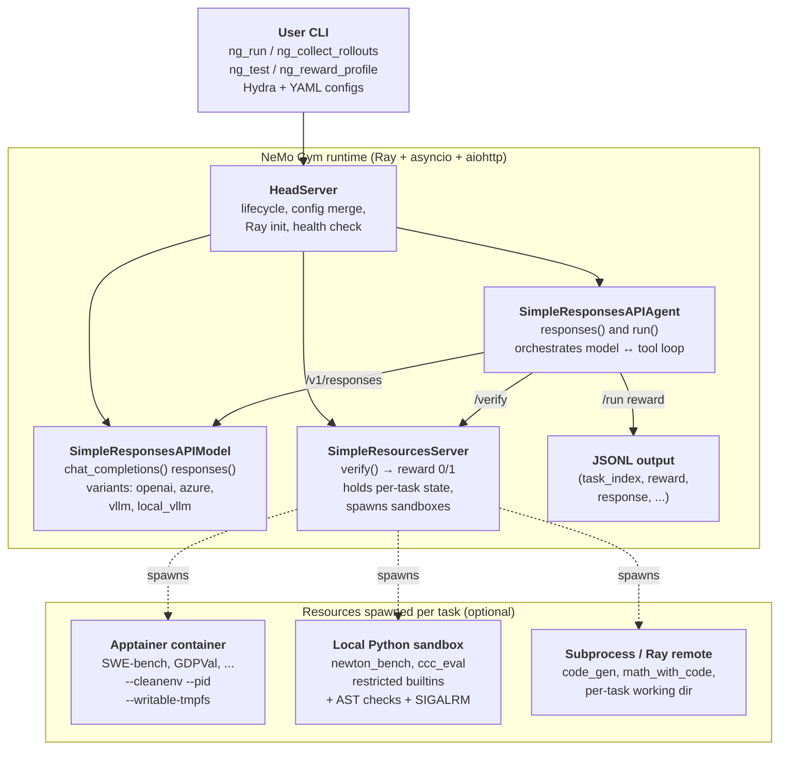
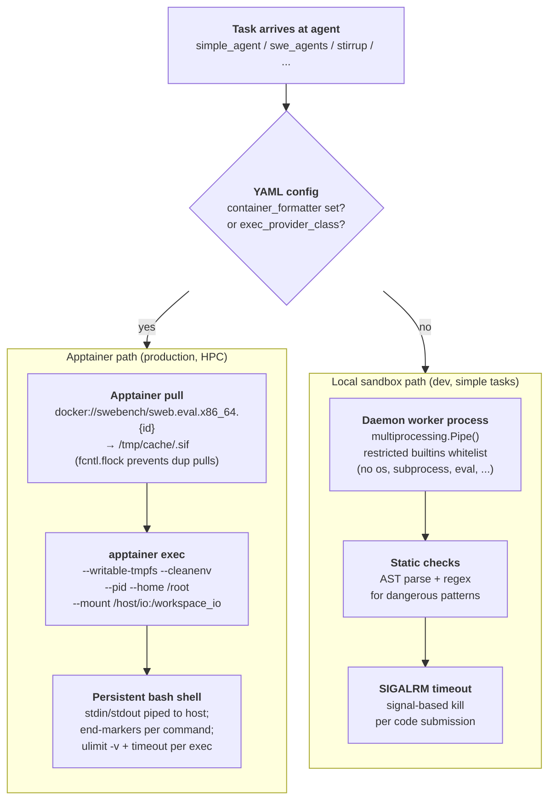

# NeMo Gym: NVIDIA's RL Environment Framework for LLMs

> [!info] Project metadata
> - **Repo**: [github.com/NVIDIA-NeMo/Gym](https://github.com/NVIDIA-NeMo/Gym)
> - **Docs**: [docs.nvidia.com/nemo/gym/latest](https://docs.nvidia.com/nemo/gym/latest/)
> - **Part of**: NVIDIA NeMo platform (training side: NeMo RL; inference side: Nemotron)
> - **Status**: Early development (APIs evolving). Battle-tested inside NVIDIA on Nemotron training.

> [!abstract]+ TL;DR
> NeMo Gym is the **environment / rollout side** of NVIDIA's RL training stack — the counterpart to the trainer libraries ([[rl-training-frameworks|NeMo RL, VeRL, Unsloth]]). You hand it a dataset of tasks + an agent harness + a verifier; it spins up three FastAPI microservices (resources / model / agent), runs your agent against the tasks at arbitrary concurrency, scores each rollout, and hands the `(input, output, reward)` tuples to your trainer. The library ships **84 built-in benchmarks** (SWE-bench, GPQA, BigCodeBench, MATH, IFBench, GDPVal, Newton Bench, …), **19 agent harnesses** (simple, OpenHands-style SWE, LangGraph, Mini-SWE, Verifiers, …), and **6 model-server backends** (OpenAI, Azure OpenAI, vLLM, local vLLM, …). For dangerous code execution (SWE-bench, code-gen) it uses **Apptainer** (not Docker — the training cluster nodes themselves already live inside enroot containers, so Apptainer is the only nested option that works). For simpler tasks it uses a Python-level process sandbox. Configuration is Hydra/OmegaConf YAML; coordination is Ray; HTTP is aiohttp (not httpx — see [[#Engineering opinions worth noting|why]]).

---

## What problem it solves

For RL post-training of LLMs you need to roll out tasks against the current policy at high concurrency, score each rollout to produce a reward, and feed the rewards back to the trainer. The naive way — call a model API, run a verifier script in the same process, repeat — falls over in three ways:

1. **Scale.** Modern RL runs need **thousands of concurrent rollouts per training step** to keep the GPU saturated. A single Python script can't drive thousands of model calls + verifier executions in parallel without serious engineering.
2. **Statefulness.** Many real tasks need **persistent execution context** — a code-gen task needs a working directory with the test harness; a SWE-bench task needs an entire git repo at a specific commit; a tool-use task needs a session with state across turns. Verifiers need to *observe* that state, not just inspect the final text.
3. **Reuse.** The same environment (dataset + harness + verifier) needs to plug into **evaluation today, agent optimization next week, and RL training next month**. If each use-case has its own bespoke integration, environments don't accumulate.

NeMo Gym's answer is a three-server microservice architecture (resources / model / agent), all FastAPI apps talking over async HTTP, coordinated by Ray, configured by Hydra YAML. Each environment is a **self-contained server package** that any trainer or evaluator can call.

> [!quote] The framing in one line
> An **environment** is the complete system an agent interacts with to complete a task: dataset (the tasks), harness (how the model interacts), verifier (how completion is scored), and state (per-task execution context).

---

## The mental model: environment = dataset + harness + verifier + state

This is the single concept the rest of NeMo Gym hangs off:

- **Dataset.** A JSONL file. One line per task. Each line carries the model-facing prompt (`responses_create_params.input`) and verifier-facing metadata (`verifier_metadata`).
- **Harness.** How the model interacts with the world. For a static QA task the harness is just "send prompt → take output." For SWE-bench it's a multi-turn loop that gives the model bash + file-edit tools, runs them inside a container, feeds error messages back. The harness is an **agent server**.
- **Verifier.** A function that takes the final output (plus any task metadata) and returns a reward, typically 0.0 or 1.0. The verifier lives in a **resources server** and is the one component that *can't* be the same across tasks — it encodes "what does success look like" for this benchmark.
- **State.** Per-task execution context. A code task needs a writable directory. A SWE-bench task needs the patched repo. A tool-use task needs a session ID. State lives inside the resources server (or inside a container it spawns).

Concretely:

```
data/example.jsonl  ─►  agent server  ─►  model server  ─►  agent server  ─►  resources server  ─►  reward
   (one task per line)    (run harness)   (LLM forward)    (parse output)    (verify in sandbox)
```

That's the whole loop. The clever part is how each arrow is implemented.

---

## System architecture



Three things to notice in the picture:

- **All three server types are FastAPI apps**, not Python-imported libraries. They communicate over HTTP (aiohttp). The reason: same architecture serves *evaluation* (one shot, one process) and *training* (thousands of concurrent rollouts across nodes). You scale by running more replicas, not by threading.
- **HeadServer** is the conductor — it merges configs, brings up Ray, starts the three sub-servers, exposes a unified health endpoint. You only ever talk to HeadServer from your CLI.
- **Containers / sandboxes are spawned *inside* the resources server**, only when a task needs isolated execution. Most benchmarks (MCQA, format checks, judge-based) don't need any sandbox at all. SWE-bench / GDPVal / Newton Bench do.

---

## The three server types

### Resources servers (`resources_servers/`)

The verifier side. Each resources server is a subdirectory that implements `verify()`:

```python
# resources_servers/my_benchmark/app.py
class MyBenchmarkServer(SimpleResourcesServer):
    async def verify(self, request: VerifyRequest) -> VerifyResponse:
        output_text = request.output_text
        metadata = request.verifier_metadata  # task-specific

        # task-specific scoring logic here
        score = check_answer(output_text, metadata)

        return VerifyResponse(reward=1.0 if score else 0.0)
```

Required structure:

```
resources_servers/my_benchmark/
├── app.py              # MyBenchmarkServer extending SimpleResourcesServer
├── configs/my_benchmark.yaml
├── data/example.jsonl  # 5 examples (committed to git)
├── tests/test_app.py
├── requirements.txt    # -e nemo-gym[dev] @ ../../
└── README.md
```

The `verifier_metadata` dict is **opaque to the framework** — define whatever fields your benchmark needs (test cases, expected answers, task IDs, gold patches, hidden test inputs, …) and the framework will pipe them through from the JSONL line to your `verify()`.

The repo ships **84 resources servers** out of the box. A non-exhaustive sample by category:

| Category                 | Examples                                                                                           |
| ------------------------ | -------------------------------------------------------------------------------------------------- |
| Code generation          | `code_gen`, `bigcodebench`, `evalplus`, `competitive_coding_challenges`, `code_fim`               |
| SWE / repo-level coding  | `swerl_gen`, `swerl_llm_judge` (the SWE-Agents harness is on the agent side)                       |
| Math & formal reasoning  | `math_with_code`, `math_with_judge`, `math_formal_lean`, `math_proof_judgement`, `imo_proofbench_judge`, `polymath` |
| Science Q&A              | `gpqa_diamond`, `mcqa`, `ugphysics_judge`, `frontierscience_judge`, `physics_judge`               |
| Long-context / retrieval | `ruler`, `mrcr`, `hotpotqa_qa`, `aalcr`                                                            |
| Tool use & agents        | `tavily_search`, `google_search`, `xlam_fc`, `single_step_tool_use_with_argument_comparison`, `ns_tools` |
| Safety / alignment       | `jailbreak_detection`, `indirect_prompt_injection`, `over_refusal_detection`, `xstest`, `abstention` |
| Structured output        | `format_verification`, `structured_outputs`, `structeval`, `instruction_following`, `ifbench`     |
| Vision / multimodal      | `labbench2_vlm`, `vlm_eval_kit`, `gdpval` (PDF/doc tasks)                                          |
| SQL & data               | `bird_sql`, `spider2_lite`, `text_to_sql`                                                          |
| Domain (chem / fin / …)  | `rdkit_chemistry`, `ether0`, `finance_sec_search`, `cvdp`                                          |
| RL environments (Gym-style) | `gymnasium`, `grl_sokoban`, `grl_tetris`, `blackjack`, `circle_click`, `circle_count`           |
| Plumbing examples        | `example_single_tool_call`, `example_multi_step`, `example_session_state_mgmt`                    |

External-library bridges (the framework hosts third-party environments): `aviary` (FutureHouse), `openenv` (OpenEnv suite), `reasoning_gym`, `arc_agi`, `terminus_judge`, …

### Response API models (`responses_api_models/`)

The model side. Thin wrappers that expose OpenAI-compatible endpoints (`/v1/responses`, `/v1/chat/completions`) to the agent. Six variants ship:

| Server                   | Backend                                                                |
| ------------------------ | ---------------------------------------------------------------------- |
| `openai_model`           | OpenAI public API (or any compatible endpoint).                        |
| `azure_openai_model`     | Azure OpenAI deployments.                                              |
| `vllm_model`             | Remote vLLM server with `/v1/chat/completions`.                        |
| `local_vllm_model`       | Spawns a vLLM server locally as part of HeadServer startup.            |
| `local_vllm_model_proxy` | Same as above but acts as a proxy (round-robin across local replicas). |
| `genrm_model`            | Generative reward model variant.                                       |

Why a separate "model server" layer when OpenAI client libraries exist: it lets the agent code be **backend-agnostic**. The same SWE-Agent harness runs against GPT-5 (via `openai_model`), against a Nemotron checkpoint (via `vllm_model`), or against an in-process vLLM for training (via `local_vllm_model`), with no agent code changes — only YAML.

### Response API agents (`responses_api_agents/`)

The harness side. Implements `responses()` and `run()`. The harness decides how the model interacts with the task — single-turn, multi-turn, with tools, with retry-on-error, with chain-of-thought refinement, etc. **19 agent harnesses** ship, including:

| Harness                   | What it does                                                                                  |
| ------------------------- | --------------------------------------------------------------------------------------------- |
| `simple_agent`            | One model call, no tools. The default; works for most QA-style benchmarks.                    |
| `proof_refinement_agent`  | Multi-turn correction loop: model sees the verifier's error and retries.                      |
| `swe_agents`              | OpenHands-style SWE-bench harness (bash + file-edit tools, container per task).               |
| `mini_swe_agent`          | Lighter-weight SWE harness.                                                                   |
| `stirrup_agent`           | Generic code-execution harness with pluggable executor (local sandbox / Apptainer).           |
| `langgraph_agent`         | Bridges LangGraph-defined agents into the Gym schema.                                         |
| `verifiers_agent`         | Bridges the `Verifiers` library.                                                              |
| `aviary_agent`            | Bridges FutureHouse's Aviary environments.                                                    |
| `harbor_agent`            | HPC-cluster Singularity environment with FastAPI-in-container.                                |
| `gymnasium_agent`         | Classic Gym/Gymnasium environments (Sokoban, Tetris, Blackjack, …).                           |
| `browsecomp_agent`        | Web browsing tasks.                                                                           |
| `tool_simulation_agent`   | Tool-use evaluation with simulated tool responses.                                            |

**Important contract for training**: a multi-turn agent must propagate (a) **cookies** through every downstream call (`cookies=request.cookies` — stateful environments key on this), and (b) **token IDs and log-probs** (`prompt_token_ids`, `generation_token_ids`, `generation_log_probs`) from each model response into the next turn's input. These are what the trainer uses to compute advantages downstream.

---

## Configuration: Hydra + YAML

All configuration is Hydra/OmegaConf YAML. Each server instance is a top-level key:

```yaml
my_benchmark_server:
  resources_servers:
    my_benchmark:
      entrypoint: app.py
      domain: coding
      verified: false
      # ... server-specific fields
```

Agents reference the resources and model servers by name:

```yaml
my_agent_instance:
  responses_api_agents:
    simple_agent:
      entrypoint: app.py
      resources_server:
        type: resources_servers
        name: my_benchmark
      model_server:
        type: responses_api_models
        name: policy_model
      datasets:
      - name: my_dataset
        type: train
        jsonl_fpath: path/to/data.jsonl
        gitlab_identifier:                  # optional, see Dataset section
          dataset_name: my_benchmark
          version: 0.0.1
          artifact_fpath: my_dataset.jsonl
        license: MIT
```

Model endpoint credentials go in `env.yaml` at the project root (kept out of the server configs because they're per-user):

```yaml
policy_base_url: http://localhost:8000/v1
policy_api_key: your-key
policy_model_name: your-model
mlflow_tracking_uri: https://<gitlab-host>/api/v4/projects/<PID>/ml/mlflow
mlflow_tracking_token: your-gitlab-token
```

CLI overrides use Hydra's `+key=value` syntax. The most common entry points:

```bash
# Bring up all servers defined in a set of YAML files.
ng_run "+config_paths=[resources_servers/mcqa/configs/mcqa.yaml,
                       responses_api_models/openai_model/configs/openai_model.yaml]"

# Run rollouts against the live servers.
ng_collect_rollouts +agent_name=simple_agent \
                    +input_jsonl_fpath=data.jsonl \
                    +output_jsonl_fpath=rollouts.jsonl \
                    +num_repeats=5 \
                    "+responses_create_params={max_output_tokens: 16384, temperature: 1.0}"

# Compute per-task pass rates (pass@k).
ng_reward_profile +input_jsonl_fpath=data.jsonl \
                  +rollouts_jsonl_fpath=rollouts.jsonl \
                  +output_jsonl_fpath=profiled.jsonl \
                  +pass_threshold=1.0

# Per-server tests, in isolated venvs.
ng_test +entrypoint=resources_servers/my_benchmark

# Health check across all running servers.
ng_status
```

---

## Data: JSONL schema and the GitLab dataset registry

### Schema

Every benchmark uses the same JSONL line shape:

```json
{
  "responses_create_params": {
    "input": [
      {"role": "system", "content": "..."},
      {"role": "user", "content": "..."}
    ]
  },
  "verifier_metadata": {
    "task_id": "...",
    "test_cases": [...],
    "expected_answer": "..."
  }
}
```

- `responses_create_params.input` is the OpenAI message format the agent will pass to the model.
- `verifier_metadata` is **opaque to the framework** — it's an arbitrary dict the resources server's `verify()` will receive. Test cases, gold answers, repo state, anything.

Rollout output JSONL adds the model's response and the verifier's reward (plus any custom fields from the `VerifyResponse` class):

```json
{
  "task_index": 0,
  "reward": 1.0,
  "response": {"output_text": "..."},
  // plus any custom verifier output fields
}
```

### Three dataset tiers

NeMo Gym distinguishes three roles for data:

| Tier         | Where it lives                              | When to use                                              |
| ------------ | ------------------------------------------- | -------------------------------------------------------- |
| `example`    | `data/example.jsonl` — 5 entries, in git    | Smoke testing, CI, demoing the server                    |
| `train`      | GitLab dataset registry (NOT in git)        | RL training rollouts                                     |
| `validation` | GitLab dataset registry (NOT in git)        | Held-out evaluation                                      |

`train` and `validation` datasets are kept out of git for size, licensing, and refresh-cadence reasons. Each resources server has a `data/.gitignore` that blocks `*train.jsonl`, `*validation.jsonl`, etc.

### Upload / download

The dataset registry runs on GitLab's MLflow integration:

```bash
ng_upload_dataset_to_gitlab \
    +dataset_name=my_benchmark \
    +version=0.0.1 \
    +input_jsonl_fpath=resources_servers/my_benchmark/data/my_dataset.jsonl

ng_prepare_data "+config_paths=[...]" +output_dirpath=data/my_benchmark \
                +mode=train_preparation +should_download=true +data_source=gitlab
```

The tracking URI follows `https://<gitlab-host>/api/v4/projects/<PROJECT_ID>/ml/mlflow`.

There's also a HuggingFace path (`ng_upload_dataset_to_hf` / `ng_download_dataset_from_hf`) for datasets you can share publicly.

---

## The container & sandbox story

This is the part of NeMo Gym people most often misread. The short version:

> [!important] NeMo Gym does not use Docker directly.
> Production isolation goes through **Apptainer** (because the training cluster nodes themselves run inside enroot containers, and Apptainer is the only nesting-friendly option). Apptainer *does* consume Docker images — you'll see `docker://...` URIs in configs — but it's Apptainer running them, not Docker. There's also a separate, much lighter Python-level sandbox path for simpler benchmarks.

### Two independent paths



### Apptainer path (production)

Used by: `swe_agents`, `stirrup_agent` (when configured), `harbor_agent`.

Concretely, what happens when a SWE-bench task hits `swe_agents`:

1. **Config tells the harness which image to use.** YAML field:
   ```yaml
   container_formatter: "docker://swebench/sweb.eval.x86_64.{instance_id}"
   apptainer_memory_limit_mb: 32768
   swebench_tests_timeout: 900
   swebench_agent_timeout: 1800
   command_exec_timeout: 300
   ```
   Task `instance_id=django__django-12345` produces image URI `docker://swebench/sweb.eval.x86_64.django__django-12345`.
2. **Apptainer pulls it as a `.sif`** (cached to local disk; `fcntl.flock` prevents two Ray workers from pulling the same image simultaneously).
3. **A long-lived bash shell starts inside the container:**
   ```bash
   apptainer exec \
     --writable-tmpfs \
     --cleanenv --pid \
     --home /root \
     --mount type=bind,src=/host/io,dst=/workspace_io \
     /tmp/cache/django__django-12345.sif \
     bash
   ```
   `--cleanenv --pid` provides namespace isolation; `--writable-tmpfs` lets the container write but discards changes at exit; `/workspace_io` is the only host directory the container can see.
4. **Agent sends commands to the shell over stdin**, one at a time, each followed by a uniquely-generated end-marker echo:
   ```bash
   pytest tests/test_models.py; echo ___END_a7b3___
   ```
   The harness reads stdout until it sees the marker — that's how it knows where this command's output ended.
5. **Per-command isolation:** every command is wrapped in `timeout 300 ...`; the whole shell starts with `ulimit -v 33554432` (32 GB). Hung commands return exit code 124; OOM returns 137.

The whole orchestration lives in `responses_api_agents/stirrup_agent/apptainer_provider.py` (~700 lines) and `responses_api_agents/swe_agents/app.py` (~2000 lines).

### Local sandbox path (dev / simple tasks)

Used by: `newton_bench`, `competitive_coding_challenges`, `stirrup_agent` (default when no container configured).

Mechanism (concretely in `resources_servers/newton_bench/newton_bench_utils/sandbox.py`):

- **Daemon worker process** spawned via `multiprocessing.Pipe()` — the parent feeds it code over the pipe.
- **Restricted builtins.** The worker overrides `__builtins__` to a whitelist (no `os`, `sys`, `subprocess`, `eval`, `exec`, `open`, `__import__`).
- **AST + regex pre-check.** Incoming code is parsed and scanned for dangerous nodes before being eval'd.
- **`signal.SIGALRM` timeout.** A hung sandbox gets killed with a wall-clock alarm.

This is **not real isolation** — it's "restrict what Python can do, hope the model doesn't escape." Fine for "implement this pure function and we check its output," not fine for "let the model run arbitrary shell."

### Why Apptainer, not Docker

```
training cluster node
└── enroot container (the trainer process)
    └── ??? (need another isolation layer for SWE tasks)
        ├── Docker?     × — needs Docker daemon, can't run from inside enroot
        ├── nsjail?     × — overlapping namespaces, awkward filesystem story
        └── Apptainer?  ✓ — designed for HPC, single-binary, daemon-less,
                              and *can* consume Docker images directly via
                              `docker://...` URIs (Apptainer-converts to .sif)
```

Documented in `docs/infrastructure/engineering-notes/swe-rl-case-study.md`:

> *"Apptainer was the only containerization framework that we could run from within an enroot container."*

So when you see `docker://...` in a NeMo Gym config, read it as "**Apptainer, please grab this image from Docker Hub.**" There is no Docker daemon involved at any point.

### What's NOT containerized

To preempt the obvious confusion:

- **The three NeMo Gym servers themselves don't run in containers.** They're plain Python processes on the host (or Ray worker), with the FastAPI stack and the venv.
- **Most resources servers don't spawn containers either.** MCQA, format checks, judge-based eval, math-with-judge, structured-output checks — all run inside the resources server's own process. Containers come into play only when the *task* requires running untrusted code or a heavy build (SWE-bench, code-gen, GDPVal document conversion, etc.).
- **CI doesn't build images either.** `.github/workflows/_build_container.yml` delegates to a shared NVIDIA FW-CI template; NeMo Gym itself only runs `pytest` in CI.

---

## Distributed execution: Ray

For training-scale rollouts (thousands concurrent), NeMo Gym uses Ray with `SPREAD` scheduling:

```python
@ray.remote(
    scheduling_strategy="SPREAD",
    runtime_env={"py_executable": sys.executable},
)
def run_agent_remote(params: dict[str, Any]) -> Any:
    ...
```

Two patterns appear:

1. **Agent-level Ray remote** (`stirrup_agent`, `swe_agents`): each task gets a Ray task, possibly on a different node, and that task may further spawn an Apptainer container. Spread scheduling keeps memory-heavy tasks from piling up on one node.
2. **Subprocess-level Ray remote** (`code_gen`): the resources server's `verify()` delegates the actual code execution to a Ray remote, awaited as `await future`.

In async code: **always** `await future` directly (Ray futures are awaitable). Never `ray.get()` in an async context — it blocks the event loop and you'll hang at high concurrency.

> [!warning] Ray socket-path gotcha on Lustre
> On filesystems with long working-directory paths (Lustre mounts on NVIDIA's clusters), Ray's AF_UNIX socket paths can exceed the 107-byte Linux limit and `ray.init()` fails with a cryptic error. Workaround: `RAY_TMPDIR=/tmp` before running tests or starting servers. `ng_test` spawns isolated venvs so `os.environ` writes inside Python don't propagate — set this **externally** (`RAY_TMPDIR=/tmp ng_test ...`).

---

## Engineering opinions worth noting

These are non-obvious choices that have already burned someone:

### Use aiohttp, not httpx

All async HTTP **must** go through NeMo Gym's global aiohttp client (`nemo_gym.server_utils.request()`). Reason: at high concurrency (16 K+ requests), httpx / httpcore has **O(n²) connection pooling** that causes hangs. When wrapping a third-party library that uses httpx internally, replace its transport with an aiohttp adapter — `resources_servers/tavily_search/app.py:TavilySearchAIOHTTPClient` is the reference. Full writeup in `docs/infrastructure/engineering-notes/aiohttp-vs-httpx.md`.

### Async-first

- Every `/run` endpoint **must** be async.
- Use `asyncio.Semaphore` to bound concurrent subprocess / external calls (otherwise 4 K-65 K concurrent rollouts will exhaust file descriptors).
- Decode subprocess output with `errors="replace"` (model output is rarely clean UTF-8).
- Guard nested optional fields: `(body.field or {}).get("key", default)` — agents receive partial responses regularly.

### Config, not env vars

Pass model URLs, API keys, parameters through the Hydra config tree — not through `os.environ`. Reasons: reproducibility, multi-instance support on one node, audit trail. The only env-var that legitimately matters is `RAY_TMPDIR` (per the Lustre gotcha above).

### One OpenAI client version

NeMo Gym pins `openai<=2.6.1` for schema compatibility. Don't bring in LiteLLM, Anthropic SDK, or other clients in your resources/agent server code — use `nemo_gym/openai_utils.py`.

### External tool auto-install

If your benchmark needs a non-Python tool (compiler, JRE, libreoffice, …), don't ask users to install it manually. Add a `setup_<tool>.py` module with an `ensure_<tool>()` function that:

1. Returns early if `shutil.which("tool")` finds it.
2. Forks on `sys.platform` (brew on macOS, apt-get / build-from-source on Linux).
3. Updates `os.environ["PATH"]` (and `LD_LIBRARY_PATH` if needed) for the current process.
4. Verifies the tool runs after install.

Call it from `model_post_init()` (runs at server startup). For tests, add a `pytest_configure` hook in `conftest.py` so `pytest.mark.skipif(shutil.which("tool") is None, ...)` markers see the installed tool. Build-from-source scripts must be idempotent and install into a local prefix (`.<tool>/`, gitignored).

---

## How it fits the broader stack

```
┌──────────────────────────────────────────────────────────────────────┐
│  Trainer side                                                        │
│   • NeMo RL (GRPO / DAPO)        ─┐                                  │
│   • VeRL                          ├─► rollout requests ─► NeMo Gym   │
│   • Unsloth                       │                                  │
│   • TRL                          ─┘   rewards + token IDs ◄──        │
└──────────────────────────────────────────────────────────────────────┘
                                       │
                                       ▼
┌──────────────────────────────────────────────────────────────────────┐
│  NeMo Gym (this page)                                                │
│   • 84 benchmarks (resources_servers/)                               │
│   • 19 agent harnesses (responses_api_agents/)                       │
│   • 6 model server backends (responses_api_models/)                  │
│   • Hydra config, Ray distribution, aiohttp HTTP                     │
│   • Apptainer for dangerous code, local sandbox for safe code        │
└──────────────────────────────────────────────────────────────────────┘
                                       │
                                       ▼
┌──────────────────────────────────────────────────────────────────────┐
│  Model side                                                          │
│   • vLLM / SGLang / TensorRT-LLM (local, multi-node)                 │
│   • Hosted: OpenAI, Azure, Fireworks, OpenRouter, …                  │
└──────────────────────────────────────────────────────────────────────┘
```

Related to but distinct from:

- [[prorl-agent|ProRL Agent]] — a *different* NVIDIA project, also rollout infrastructure but specifically rollout-as-a-service for multi-turn LLM agents. Stackable with NeMo Gym (you could imagine NeMo Gym's `swe_agents` running on a ProRL backend).
- [[rl-training-frameworks|RL training frameworks]] — the trainer side (OpenRLHF, TRL, VeRL, NeMo RL). NeMo Gym does *not* do gradients; it does rollouts and verification.
- [[environment-design]] — the conceptual ground: what makes a good RL environment for LLMs. NeMo Gym is one concrete answer.
- [[das-spec-rl|DAS: Distribution-Aware Speculative Decoding]] — orthogonal speedup for the rollout phase that could plug into any of the model servers. NeMo Gym would benefit from it because its long-tailed rollouts are exactly the workload DAS targets.

---

## Strengths

- **Breadth.** 84 benchmarks + 19 harnesses + 6 model backends out of the box is unusual for an academic-style RL library. Most of the standard SWE / code / math / safety / tool-use benchmarks are already wired.
- **Architectural fit for scale.** FastAPI + aiohttp + Ray + Apptainer is exactly the right stack for "thousands of concurrent rollouts on a Slurm cluster." It's the kind of decision that's invisible until you try to do this with another framework.
- **Environment / trainer separation is genuinely useful.** The same environment server serves evaluation, agent optimization, and RL training. You don't rewrite the verifier three times.
- **Documented engineering opinions.** The `aiohttp-vs-httpx` note alone has probably saved someone weeks. There's a real engineering culture around what works at high concurrency.
- **External library bridges.** Aviary, OpenEnv, Reasoning Gym, Verifiers, LangGraph, OpenHands, Mini-SWE — all plug in. NeMo Gym isn't trying to replace these, it's trying to host them.

## Limitations

- **Early development.** README says it explicitly. APIs evolve; you should pin a commit if you're integrating downstream.
- **Linux-only for many benchmarks.** Executables must run on Linux per `CLAUDE.md`. macOS / Windows are dev-only.
- **GitLab dataset registry is NVIDIA-internal.** Public users can fall back to HuggingFace, but the primary registry assumes NVIDIA's GitLab + MLflow.
- **Pre-commit hooks auto-modify files.** First-time contributors often hit "hook modified files, commit failed" — `add-verified-flag` and `update-readme-table` rewrite YAML and README, you stage again and re-commit.
- **Apptainer dependency for SWE-style work.** If you're on a platform without Apptainer (e.g. an arbitrary cloud VM), you'll need to install it (`apt-get install -y apptainer` on recent Ubuntu) or fall back to the local sandbox, which can't run real SWE-bench tasks.
- **Test isolation is heavyweight.** `ng_test` creates a fresh venv per server, which is correct for dependency isolation but slow on the first run; the `skip_venv_if_present` flag exists for iteration.
- **Documentation lags code.** The repo ships ~84 benchmarks; the public docs explain a small handful in depth. For the others, the source README + tests are the contract.

---

## Quick start (running it on your machine)

The minimum path from nothing to a scored rollout:

```bash
# 1. Clone, set up venv (uv required).
git clone git@github.com:NVIDIA-NeMo/Gym.git && cd Gym
uv venv --python 3.12 && source .venv/bin/activate
uv sync

# 2. Configure a model endpoint.
cat > env.yaml <<'EOF'
policy_base_url: https://api.openai.com/v1
policy_api_key: sk-...
policy_model_name: gpt-4.1-2025-04-14
EOF

# 3. Bring up servers for a built-in MCQA environment.
ng_run "+config_paths=[resources_servers/mcqa/configs/mcqa.yaml,
                       responses_api_models/openai_model/configs/openai_model.yaml]"

# 4. In another terminal: collect 5 rollouts per task on the example data.
ng_collect_rollouts +agent_name=simple_agent \
                    +input_jsonl_fpath=resources_servers/mcqa/data/example.jsonl \
                    +output_jsonl_fpath=results/rollouts.jsonl \
                    +num_repeats=5

# 5. Score them (per-task pass rates).
ng_reward_profile +input_jsonl_fpath=resources_servers/mcqa/data/example.jsonl \
                  +rollouts_jsonl_fpath=results/rollouts.jsonl \
                  +output_jsonl_fpath=results/profiled.jsonl \
                  +pass_threshold=1.0
```

That's the whole loop. For SWE-bench, swap `mcqa` for the `swe_agents` config and supply real instance IDs in the JSONL — and make sure `apptainer` is on `PATH`.

---

## Files worth reading first

When you actually dive into the code, in this order:

| File                                                                     | Why                                                                                                    |
| ------------------------------------------------------------------------ | ------------------------------------------------------------------------------------------------------ |
| `CLAUDE.md`                                                              | The architecture summary you're reading paraphrases this. Definitive for command names + contracts.    |
| `nemo_gym/cli.py`                                                        | The `ng_*` CLI commands. Read to learn what flags exist and how Hydra composition works.               |
| `nemo_gym/base_resources_server.py` + `base_responses_api_model.py` + `base_responses_api_agent.py` | The three base classes. Whatever benchmark you write extends one of these.   |
| `resources_servers/example_single_tool_call/`                            | The simplest end-to-end example. Use as a template.                                                    |
| `responses_api_agents/stirrup_agent/apptainer_provider.py`               | The most sophisticated container orchestration in the repo. Read once even if you don't need it now.   |
| `responses_api_agents/swe_agents/app.py`                                 | Real-world SWE-bench harness; shows multi-dataset support, Apptainer + Ray composition.                |
| `docs/infrastructure/engineering-notes/aiohttp-vs-httpx.md`              | The why behind the HTTP stack choice. Will save you a debugging weekend.                               |
| `docs/infrastructure/engineering-notes/swe-rl-case-study.md`             | Why Apptainer, deployment topology, CPU sizing.                                                        |

---

## Related reading

- [[prorl-agent]] — Rollout-as-a-service infrastructure (different but conceptually adjacent NVIDIA project).
- [[environment-design]] — What makes a good RL environment for LLMs.
- [[rl-training-frameworks]] — The trainer side that consumes NeMo Gym's rollouts.
- [[grpo]] / [[ppo-for-llm]] / [[rlhf-overview]] — The RL algorithms that drive demand for environments like NeMo Gym.
- [[das-spec-rl]] — Speculative-decoding speedup for the rollout phase; complementary at the model-server layer.
- [[vllm]] / [[sglang]] — The inference engines NeMo Gym's model servers wrap.
- [[multi-step-reasoning-rl]] — The kind of training NeMo Gym's multi-turn agent harnesses enable.

## References

- Repo: [NVIDIA-NeMo/Gym](https://github.com/NVIDIA-NeMo/Gym)
- Public docs: [docs.nvidia.com/nemo/gym/latest](https://docs.nvidia.com/nemo/gym/latest/)
- Ecosystem page: [docs.nvidia.com/nemo/gym/latest/about/ecosystem.html](https://docs.nvidia.com/nemo/gym/latest/about/ecosystem.html)
- Internal engineering notes: `docs/infrastructure/engineering-notes/` (aiohttp vs httpx, SWE-RL case study).
