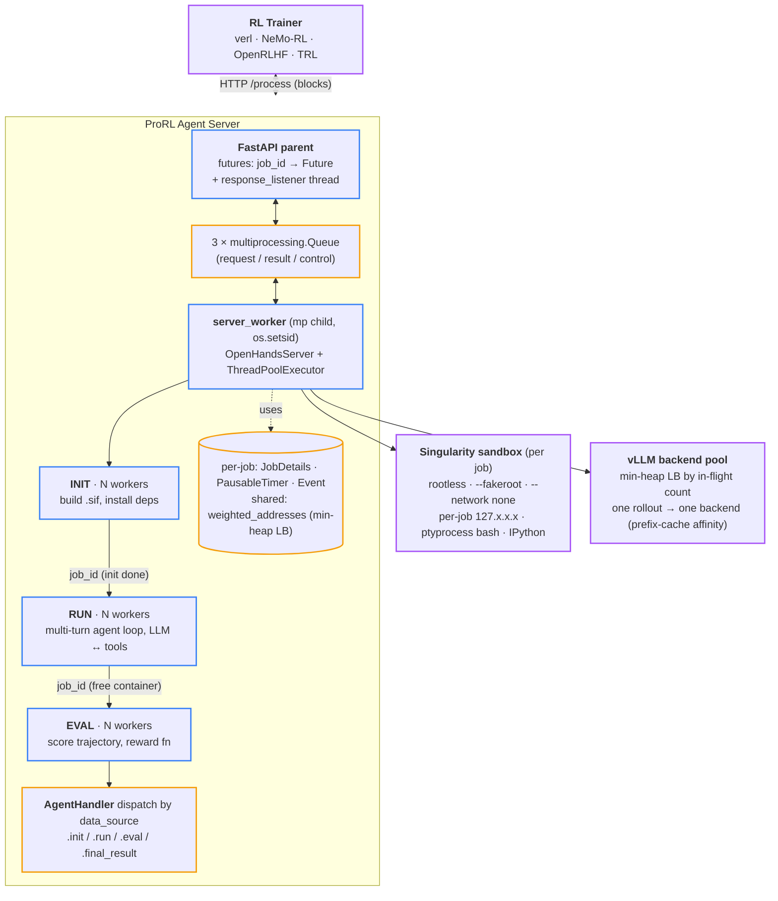

# ProRL Agent — Sample Hybrid (C base + A supporting/experiments)

> [!warning] Format sample for review, not the canonical page
> Final candidate per Shiki's request: **base structure from [[prorl-agent-sample-c|Sample C]]** (Summary + Depth two-layer), **with A's collapsible Supporting machinery + A's compressed Experiments**. All Shiki Q&A callouts restored verbatim from the canonical [[prorl-agent]] page. Compare side-by-side with [[prorl-agent-sample-a]] and [[prorl-agent-sample-c]]; the canonical page is still [[prorl-agent]].

> [!info] Paper metadata
> - **Paper**: [arXiv:2603.18815](https://arxiv.org/abs/2603.18815) — NVIDIA, March 2026
> - **Code**: [NVIDIA-NeMo/ProRL-Agent-Server](https://github.com/NVIDIA-NeMo/ProRL-Agent-Server) (branch `stable`, Apache-2.0)
> - **Authors**: Hao Zhang, Mingjie Liu, Shaokun Zhang, Songyang Han, Jian Hu, Zhenghui Jin, Yuchi Zhang, Shizhe Diao, Ximing Lu, Binfeng Xu, Zhiding Yu, Jan Kautz, Yi Dong
> - **Figures**: TODO — extract Fig. 1 (system architecture) and Fig. 3 (Pass@1 vs steps) from PDF into `sources/papers/prorl-agent/figs/` once the template is locked. Until then, Mermaid + table reproductions stand in.

---

## Summary (read this if you have 2 minutes)

**What it is.** ProRL Agent (NVIDIA, March 2026) is an HTTP server that runs multi-turn agentic rollouts and returns `(token_ids, logprobs, reward)` tuples to any RL trainer that can `POST /process`. It separates the rollout workload (I/O-bound, container-spinning, slow) from the training workload (GPU-bound, fast) so they can be scaled, debugged, and iterated on independently.

**The one idea.** Make rollout a *service*, not a coroutine. Three pieces hold it up:

1. **Token-in / token-out wire protocol** — trainer and server share the canonical token sequence; no re-tokenization drift across turns.
2. **Three-stage async pipeline** (INIT → RUN → EVAL) with independent worker pools — different jobs at different stages don't block each other.
3. **Rootless HPC sandbox** built on Singularity / Apptainer with `--fakeroot` and per-job loopback IPs — runs on Slurm clusters where Docker can't.

Remove any one and the system becomes off-policy unstable, throughput-bound, or undeployable.

**Headline result.** SWE-Bench Verified Pass@1:

| Model           | Baseline | After RL    | Δ           |
| --------------- | -------- | ----------- | ----------- |
| Qwen3-4B        | 14.8 %   | **21.2 %**  | **+6.4 pp** |
| Qwen3-8B        | 9.6 %    | **18.0 %**  | **+8.4 pp** |
| Qwen3-14B       | 15.4 %   | **23.6 %**  | **+8.2 pp** |

The 8B number (18.0 %) is roughly **2× SkyRL-Agent-8B-v0** (9.4 %) — the result the paper leads with. The critical ablation: removing async refilling drops GPU utilization 78 % → 31 % and SWE-Bench Pass@1 18.0 % → 13.4 %. The decoupled-services architecture isn't just for code cleanliness — it's load-bearing for the headline number.

**Why it matters.** Trainer swap (veRL ↔ NeMo-RL) stops requiring agent-loop and sandbox re-porting; agent and trainer can iterate independently; and the whole thing deploys on the same shared HPC clusters where training already lives — no Docker-daemon dependency. By 2027 expect this "rollout-as-a-service" pattern to be the default agentic-RL architecture.

---

# Depth (drill-down starts here)

The summary above is the executive layer. Everything below is for the careful reader who wants the full architecture and code-level detail.

## Background: why agentic-RL infrastructure is its own problem

Training an LLM agent with RL involves two workloads with fundamentally different shapes:

|                | Rollout                                                                  | Training                                       |
| -------------- | ------------------------------------------------------------------------ | ---------------------------------------------- |
| Resource       | I/O-bound: sandbox spin-up, multi-turn loops, async tool execution        | GPU-bound: forward/backward, gradient sync     |
| Time scale     | Seconds to minutes per episode (variance dominated by tool I/O)            | ~10s of ms per step                            |
| Failure mode   | Container crashes, network timeouts, tool errors                          | OOM, NaN, NCCL hangs                           |
| Right hardware | Many CPU + sandbox nodes                                                 | Few large 8×GPU nodes                          |

Existing agentic-RL frameworks — SkyRL-Agent, VeRL-Tool, Agent Lightning, rLLM, GEM — keep both workloads inside the **trainer's process**: rollout coroutines, in-memory environments, or an embedded agent loop with offloaded tools. That tight coupling causes three failures: (1) bursty rollouts disrupt training cache locality and starve inference time slots; (2) switching trainers (e.g. veRL → NeMo-RL) forces re-porting agent loops and sandboxes; (3) any improvement to the agent — a new tool, a new memory module — must be pushed through the trainer.

ProRL Agent's response is the obvious move from web-systems land: **separate concerns into independent services with a stable HTTP contract.** That is the same argument that produced microservices in 2014. The non-trivial claim is that this pattern works even for the latency-sensitive RL inner loop.

| Framework         | Decoupled train/rollout | Rootless sandbox | Scaffold-independent |
| ----------------- | ----------------------- | ---------------- | -------------------- |
| SkyRL-Agent       | ✗                       | ✗                | ✓                    |
| VeRL-Tool         | ✗                       | ✗                | ✓                    |
| Agent Lightning   | ✗                       | ✗                | ✗                    |
| rLLM              | ✗                       | ✗                | ✓                    |
| GEM               | ✗                       | ✗                | ✓                    |
| **ProRL Agent**   | **✓**                   | **✓**            | **✓**                |

The "rootless sandbox" column is the deployment-realism contribution that lets the first column actually run on shared HPC clusters where research happens.

> [!question]+ Shiki — Glossary: scaffold, stable HTTP contract, rootless sandbox (2026-05-08)
>
> Three terms in this Background section that show up across agentic-RL literature and warrant precise definitions, since the paper's claims rest on them.
>
> **Scaffold** — In agentic-RL terminology, the *scaffold* is everything between the user's task and the LLM's `model.generate()` call: the agent loop (ReAct, plan-and-execute), tool definitions, prompt templates, memory management, parsing of tool calls, retry logic. It's the application layer that turns text-out into actions-in-environment. ProRL's "scaffold-independent" column means the rollout server's HTTP API doesn't bake in any specific scaffold — you can plug in OpenHands's CodeAct, an in-house ReAct loop, or anything else, as long as it implements `AgentHandler`. Other agentic-RL frameworks bake a specific scaffold into the trainer process; switching scaffolds means refactoring the trainer.
>
> **Stable HTTP contract** — A versioned, well-defined HTTP API where the request/response schemas are fixed and documented (here via Pydantic models like `ProcessRequest`). "Stable" means: (1) the schema doesn't break in incompatible ways without version negotiation, (2) different versions of trainer and server can interop. It's the only coupling between the two processes — at any moment one team can rewrite the server, switch its language, or move it across machines, and the trainer doesn't care, as long as `POST /process` still accepts a `ProcessRequest` and returns `(token_ids, logprobs, reward)`. Same pattern that makes microservices work in 2014 web stacks; ProRL's claim is that it also works for the latency-sensitive RL inner loop.
>
> **Rootless sandbox** — A container/sandbox that runs entirely as an unprivileged user — no root anywhere in the chain. Docker is famously *not* rootless: it requires a daemon running as root (or `docker`-group membership, which is root-equivalent on Linux). On HPC clusters managed by Slurm you don't have root and there's no Docker daemon, so Docker simply can't run. **Singularity** (now called **Apptainer**) was designed for this: containers execute in user space using user namespaces, and `--fakeroot` gives the *appearance* of root *inside* the container without actually escalating privileges *outside*. ProRL Agent uses Singularity Image Files (`.sif`) so it can deploy on the same shared HPC clusters the rest of training infrastructure already lives on. "Rootless" is what unlocks "actually deployable in production research clusters" — a serving framework that requires Docker daemons can't run there.

## Three components in detail

The trainer's API contract is `① POST /add_llm_server → ② POST /start → ③ POST /process { instance, sampling_params }` (blocks) `→ ④ ← (token_ids, logprobs, reward, timing)`.



### Component 1 — `POST /process` and the token wire protocol

The wire surface is a handful of Pydantic-validated endpoints (`openhands/nvidia/utils.py`):

```python
class ProcessRequest(BaseModel):
    instance: dict[str, Any]
    sampling_params: dict[str, Any]
    job_id: str | None = None

class CancelRequest(BaseModel):
    job_id: str

class LLMServerRequest(BaseModel):
    address: str
```

| Endpoint                | Body                | Purpose                                                                            |
| ----------------------- | ------------------- | ---------------------------------------------------------------------------------- |
| `POST /process`         | `ProcessRequest`    | Submit a rollout; blocks until `(token_ids, logprobs, reward, timing)` is ready    |
| `POST /cancel`          | `CancelRequest`     | Abort an in-flight job by id                                                        |
| `POST /add_llm_server`  | `LLMServerRequest`  | Register a vLLM endpoint into the load-balancer min-heap                            |
| `POST /clear_llm_server`| —                   | Flush all backends (used at checkpoint update)                                      |
| `GET /status`           | —                   | Queue depths, server-running flag                                                   |
| `POST /start /stop`     | —                   | Lifecycle control of the child server worker                                        |

**The silent killer this avoids.** Multi-turn RL has re-tokenization drift. At turn $t$ the LLM samples reply IDs using its chat template. If the client logs only the decoded text and rebuilds the full history for turn $t + 1$, tiny format changes — system/tool prefixes, spaces, XML wrappers — re-tokenize the entire conversation differently. Actor and reference no longer share the same token boundaries; per-token logprobs misalign; KL/entropy spike to NaN; PPO/GRPO updates collapse.

ProRL fixes this by making token IDs the canonical representation throughout training. Each message in the trajectory carries four extra fields the trainer consumes directly:

```python
new_message['token_ids']          = output_ids
new_message['repetition_penalty'] = ngram_repetition_reward(output_ids).tolist()
new_message['input_ids']          = input_ids
new_message['logprobs']           = logprobs
```

A practical detail: `ngram_repetition_reward(output_ids, ngram_size=64, penalty=-0.001)` applies a per-token penalty at the start position of every repeated 64-gram. This rides along with `token_ids` so the trainer can apply an off-policy-safe penalty against degenerate looping without a separate evaluation pass.

There's also a corner case: when a Qwen3 model emits `<think>\n` followed immediately by tool calls but never closes with `</think>`, the HuggingFace tokenizer breaks. The agent post-processes this by compressing the tool-call content back into the `content` string and appending a synthetic `</think>` so the canonical token IDs stay parseable. This is the kind of detail that tells you the authors actually trained models — the same bug shows up in other [[grpo|GRPO]] divergence reports as a reason for instability.

> [!question]+ Shiki — What is token-in/token-out, and why does removing it cause off-policy instability? (2026-05-08)
>
> The token-in/token-out wire format makes `token_ids` (along with `logprobs`, `input_ids`) the canonical representation throughout training, never decoded text. When the server samples a reply at turn $t$, it returns the *exact* token IDs vLLM produced plus per-token logprobs at sample time; turn $t+1$'s prompt reuses those same IDs without ever re-encoding through a tokenizer. The four extra fields (`token_ids`, `input_ids`, `logprobs`, `repetition_penalty`) on every message are how the trainer consumes this stream directly.
>
> If you go text-in/text-out instead — which many early agentic-RL frameworks did — you face **re-tokenization drift**. The server logs the decoded text of turn $t$. At turn $t+1$ the trainer rebuilds the conversation history by tokenizing the decoded text again, but the chat template (system/tool prefixes, spaces, XML wrappers) makes the resulting token sequence *different* from what the model originally produced. Two textually-identical strings can tokenize to different IDs depending on what came before them.
>
> The consequence is brutal for off-policy methods. Actor and reference now disagree about where token boundaries fall; per-token logprobs misalign; the importance ratio $\pi_\theta(y_t \mid s_t) / \pi_\text{old}(y_t \mid s_t)$ is computed over *different tokenizations of "the same" text*. KL between actor and reference becomes meaningless or spikes to NaN. PPO's clipped surrogate and GRPO's advantage normalization both rely on a well-defined importance ratio, so the gradient becomes garbage and training diverges within a few iterations.
>
> Token-in/out makes this impossible by construction. The canonical state throughout training is the original sampled token IDs — there is no decode-then-reencode step, so there is no opportunity for drift. Off-policy methods stay valid because every turn's tokens are exactly the tokens the previous-policy model produced. This is why the SGLang fork's `openhands/llm/nvidia/qwen3.py` deliberately operates on `prompt_ids`/`response_ids` rather than `messages` of decoded strings — and why the kernel docstring warns *"KL/entropy can spike to NaN"* if you bypass it.

### Component 2 — INIT → RUN → EVAL async pipeline

`OpenHandsServer.__init__` wires three queues, one per stage, with independent locks:

```python
self.init_queue: queue.Queue[str] = queue.Queue()
self.run_queue:  queue.Queue[str] = queue.Queue()
self.evaluate_queue: queue.Queue[str] = queue.Queue()

# Three independent locks, not one — coarse locking would serialize stages.
self._state_lock        = threading.RLock()
self._job_details_lock  = threading.RLock()
self._address_lock      = threading.RLock()
```

`start()` submits three pools of workers, all backed by **one** `ThreadPoolExecutor`:

```python
self._executor = ThreadPoolExecutor(
    max_workers=self.max_init_workers + self.max_run_workers + self.max_eval_workers
)
for i in range(self.max_init_workers):
    self._executor.submit(self._run_worker_in_thread, i, JobType.INIT)
# ... RUN, EVAL pools similarly
```

Each worker pops from its assigned queue and advances the job to the next stage:

```python
with phase_context(job_details.timer, function_type):
    if job_type == JobType.INIT:
        runtime, metadata, config = await run_with_timeout_awareness(timer, init_coro, job_details)
        job_details.runtime = runtime
        self.run_queue.put(job_id)
    elif job_type == JobType.RUN:
        run_results = await run_with_timeout_awareness(timer, run_coro, job_details)
        job_details.run_results = run_results
        self._cleanup_job_runtime(job_details.runtime, job_id)  # free container before EVAL
        self.evaluate_queue.put(job_id)
    elif job_type == JobType.EVAL:
        eval_report = await run_with_timeout_awareness(timer, eval_coro, job_details)
        job_details.eval_results = eval_report.get('report', eval_report)
        job_details.event.set()
```

> [!note] Two design choices visible only in code
> - **Container is freed at the end of RUN, not EVAL.** EVAL often runs against the produced patch in a separate test sandbox; keeping the rollout container alive through EVAL would waste memory.
> - **Inter-stage time is "others" phase.** `phase_context` switches the timer between active phases; queue waiting between phases is automatically counted as `others` and excluded from the timeout budget. Without this, a worker shortage during a load spike would silently fire false-negative timeouts and corrupt the training signal.

**The two-process layer outside the pipeline.** The "server" is actually a FastAPI parent process that forks a child `server_worker` process holding the `OpenHandsServer` instance. They communicate via three `multiprocessing.Queue`s — `request_queue`, `job_result_queue`, `control_response_queue`.

- **Crash isolation** — a runaway rollout (container daemon hang, `apptainer` zombie) can be killed without taking down FastAPI.
- **Two-level concurrency** — the child runs both `multiprocessing` (for clean process trees per job; `os.setsid()` on entry, so SIGTERM to the child reliably kills its descendants) and a `ThreadPoolExecutor` sized as `max_init + max_run + max_eval + 30`.
- **Backpressure is implicit in the queue** — the parent never blocks on the child; cancellation propagates because `cancel_job` flips a flag and sets the per-job `threading.Event`, which any worker checks at the next phase boundary.

**Async DAPO refilling.** [[grpo|DAPO]] filters out "Zero-Variance Prompts" (uniform reward → zero gradient). Naive batch-by-batch is synchronous waste. ProRL replaces this with continuous replenishment (refill on depletion), early termination (`POST /cancel` once enough informative jobs complete), and cross-iteration persistence (unfinished jobs carry over). This is a genuine systems-level extension to a published RL algorithm, not just deployment plumbing.

### Component 3 — Rootless HPC sandbox

The hard constraint: run as an unprivileged Slurm user — no Docker daemon, no root. Solutions:

- **Singularity Image Files (`.sif`)** — single-file, portable container images, friendly to shared filesystems.
- `--fakeroot` for in-container package install; `--network none` for external isolation.
- **Per-job loopback IP** in `127.x.x.x` via a thread-safe allocator → eliminates port conflicts at scale.
- Each container is a child process in its own session; SIGTERM → SIGKILL escalation for cleanup.
- `SingularityRuntimeBuilder` constructs images from Jinja2 templates with three caching tiers: *Scratch* (full rebuild), *Versioned* (reuse if base image/framework unchanged), *Lock* (reuse if dependency lockfile identical).

The runtime is selected by config (`example.config.toml`):

```toml
[core]
runtime          = "singularity"
run_as_openhands = false             # don't expect an "openhands" user

[sandbox]
run_as_fakeroot       = true          # simulate root inside the .sif
base_container_image  = "ubuntu:24.04"
```

**Tool latency: where the wall clock goes.** At high concurrency, tool latency dominates over LLM inference:

| Tool    | Default approach              | ProRL approach                  | Why                                |
| ------- | ----------------------------- | ------------------------------- | ---------------------------------- |
| Bash    | tmux session routing          | `ptyprocess` direct PTY         | ~6× faster shell round-trip        |
| IPython | Jupyter gateway over network  | Direct in-process kernel API    | No network hop                     |
| IPC     | TCP loopback                  | Unix domain sockets             | Lower latency, no port management  |

Not novel research — just the right engineering. The ablation later shows action time dropping from 0.78 s to 0.42 s when efficient bash is enabled.

### Supporting machinery (skim or skip)

> [!note]- AgentHandler plugin interface — open if you're integrating with ProRL
> Task-specific logic plugs in via an abstract base class (`openhands/nvidia/registry.py`):
>
> ```python
> class AgentHandler(ABC):
>     @property
>     @abstractmethod
>     def name(self) -> str: ...
>
>     @abstractmethod
>     async def init(self, job_details: JobDetails, sid: str | None = None
>                   ) -> tuple[Runtime, EvalMetadata, OpenHandsConfig]: ...
>     @abstractmethod
>     async def run(self, job_details: JobDetails, sid: str | None = None
>                  ) -> dict[str, object]: ...
>     @abstractmethod
>     async def eval(self, job_details: JobDetails, sid: str | None = None,
>                    allow_skip: bool = True, reward: Optional[Reward] = None
>                   ) -> dict[str, Any]: ...
>     @abstractmethod
>     def final_result(self, job_details: JobDetails) -> dict[str, Any]: ...
> ```
>
> The shared mutable state for one rollout is `JobDetails` — every handler method takes it and mutates it in place (`job_id`, `instance`, `agent_config`, `llm_config`, `runtime`, `event`, `timer`, etc.).
>
> Registration is a flat dict keyed by handler `.name`, with seven entries per handler (one per abstract method). A `_registries_reasoning` registry exists for reasoning-style tasks (math, STEM), so a single deployment can serve both code-agent and reasoning-agent workloads. Repository ships with handlers for SWE-Gym, R2E-Gym, SWE-Bench, math, STEM, and code.

> [!note]- LLM backend load balancing — open if you're tuning prefix-cache hit rate
> The min-heap is two lines plus the lock:
>
> ```python
> def create_llm_config(self, sampling_params):
>     with self._address_lock:
>         address = self.weighted_addresses[0][1]
>         self.weighted_addresses[0][0] += 1
>         heapq.heapreplace(self.weighted_addresses, self.weighted_addresses[0])
>     return LLMConfig(base_url=address, **sampling_params)
> ```
>
> A whole rollout's call sequence sticks to the same backend (because `LLMConfig` is built once per `/process` and reused throughout the multi-turn loop) so prefix-cache hits stay high. Simpler than power-of-two-choices, and works because per-call cost variance is dominated by sequence length, not server-side slowdown. `add_llm_server_address` and `clear_llm_server_addresses` hot-rotate backends — useful when the trainer publishes a new checkpoint to vLLM and wants to drain the old one.

## Headline evidence

**Setup.** 32× NVIDIA H100. RL algorithm: DAPO ([[grpo|GRPO]] variant with Zero-Variance-Prompt filtering). Batch 32, mini-batch 8, 8 rollouts per instance, KL = $10^{-4}$, lr = $10^{-6}$.

**SWE-Bench Verified, Pass@1** (293-instance SWE-Gym training subset):

| Model                       | Baseline           | After RL    | Δ           |
| --------------------------- | -----------------: | ----------: | ----------: |
| Qwen3-4B-Instruct-2507      | 14.8 %             | **21.2 %**  | **+6.4 pp** |
| Qwen3-8B                    | 9.6 %              | **18.0 %**  | **+8.4 pp** |
| Qwen3-14B                   | 15.4 %             | **23.6 %**  | **+8.2 pp** |

> [!success] The 8B headline number
> ProRL Agent's 18.0 % is roughly **2× SkyRL-Agent-8B-v0's 9.4 %** — the largest delta among the three sizes and the result the paper leads with.

**The critical ablation: removing async refilling.** With synchronous rollout-then-train, GPU utilization drops from 78 % → 31 % on the 8B run; SWE-Bench Pass@1 drops from 18.0 % → 13.4 %. The decoupled-services architecture isn't just for code cleanliness — it's load-bearing for the headline number.

> [!example]- All experimental results (drill-down)
> **Generality.** Three additional agents trained on the same infrastructure:
>
> | Agent                                   | Train data         | Benchmark    | Reward / Pass@1                |
> | --------------------------------------- | ------------------ | ------------ | ------------------------------ |
> | STEM (web search + tools)               | SCP-116K           | mean reward  | 0.20 → 0.65 in 60 steps        |
> | Math (IPython + NumPy/SciPy/SymPy)      | DeepScaleR         | AMC          | 0.40 → 0.90                    |
> | Code (str_replace_editor)               | Eurus-2-RL-Data    | Codeforces   | 0.23 → 0.42                    |
>
> **Scalability.** Near-linear throughput scaling with rollout-node count for SWE tasks.
>
> **Full ablations** (Qwen3-14B, 8 H100):
>
> | Config                 | Action time (s) | GPU util | Throughput (inst/s) |
> | ---------------------- | --------------: | -------: | ------------------: |
> | Full                   | 0.42            | 78 %     | 0.37                |
> | − load balancing       | 0.42            | 42 %     | 0.25                |
> | − efficient bash       | 0.78            | 68 %     | 0.29                |
> | − stale-job cleanup    | 0.42            | 65 %     | 0.30                |
>
> Reading: load balancing and stale-job cleanup recover GPU utilization (failed rollouts → stale KV → wasted inference); efficient bash recovers wall-clock per action.

## Strengths and limitations

The standout strengths are the three sub-ideas that make the architecture work — token-in/token-out, three-stage pipelining, and the rootless sandbox — each addresses a real failure mode in prior systems and each is implemented with care visible in the code.

Where the paper is less convincing:

- **HTTP overhead is never quantified.** Decoupling implicitly costs network round-trips. Throughput scaling is shown, but end-to-end *training-step latency* is never compared against a coupled baseline like SkyRL-Agent on identical workloads. For long rollouts the cost is negligible; for short single-turn math problems it might matter.
- **Sandbox story is Singularity-only.** Many groups use Docker, podman, or microVM (Firecracker). The HPC-rootless framing is genuine but not as portable as the paper implies.
- **Only one RL algorithm is validated.** Every experiment uses DAPO. PPO, GRPO, RLOO, REINFORCE++ may exercise different rollout-batch shapes and KV-cache reuse patterns.
- **293-instance training set is small.** The +6–8 pp Pass@1 lifts are real, but the ceiling isn't characterized.
- **No comparison vs. distributed prefix-cache strategies.** Sticking a rollout to one vLLM backend maximizes its cache hits, but if multiple rollouts share a system prompt, distributing across backends might be better. The trade-off is unanalyzed.
- **Open-sourced, but partially.** The `stable` branch is public, but paper experiments used internal extensions to ProRL/veRL/NeMo-RL.

> [!warning] The reward-server abstraction is underexplained
> The code references a `reward_server_ip` config and a `Reward` class, but the paper text doesn't fully document the contract or how it interacts with `AgentHandler.eval`. A footnote in `OpenHandsServer.__init__` warns: *"No reward server IP provided. Evaluations would only work for swebench problems."* That is a load-bearing limitation deserving more than a warning.

## What this means

The system itself is solid, but the more interesting claim is the architectural one: **service-oriented design beats embedded design for agentic RL, even when latency budgets are tight.** That claim generalizes. Expect comparable services to emerge over the next 12 months for **environment-as-a-service** (cf. OpenReward in [[environment-design]]), **reward-as-a-service**, and **trajectory-store-as-a-service**. The eventual shape of an "agentic RL platform" looks more like a control plane connecting interchangeable services than a monolithic trainer.

Two specific lessons worth internalizing whether or not you adopt this exact stack:

- **Token-in / token-out is the only safe wire format for multi-turn RL.** If you build any agentic-RL stack, design this in from day one. Re-tokenization drift is a silent killer.
- **Job-level pipeline parallelism is undervalued.** ProRL's three-stage queue gives near-linear scaling without changing any RL algorithm. Most teams leave this throughput on the table.

## Source code & reproduction

Quick start (from the README):

```bash
poetry install --with dev,test,runtime,evaluation
pip install git+https://github.com/SWE-Gym/SWE-Bench-Package.git
pip install git+https://github.com/R2E-Gym/R2E-Gym.git
sudo apt-get install -y apptainer

python scripts/pull_swe_images.py
python scripts/start_server.py --port 8006 \
  --max-init-workers 8 --max-run-workers 8 --max-eval-workers 4
# POST /add_llm_server, then /start, then /process
```

Files worth reading next:

| File                                                  | Role                                                                                                       |
| ----------------------------------------------------- | ---------------------------------------------------------------------------------------------------------- |
| `openhands/nvidia/registry.py`                        | `AgentHandler` ABC, `JobDetails` dataclass, registration tables.                                          |
| `openhands/nvidia/async_server.py`                    | `OpenHandsServer`, three-queue pipeline, unified `_worker`, min-heap load balancer.                       |
| `openhands/nvidia/utils.py`                           | Pydantic schemas, `process_with_timeout`, `process_messages_from_agent_state`, `ngram_repetition_reward`. |
| `openhands/nvidia/timer.py`                           | `PausableTimer`, `phase_context`, `run_with_timeout_awareness`.                                            |
| `openhands/llm/nvidia/qwen3.py`                       | `convert_messages_to_tokens`, custom Qwen3 chat template.                                                  |
| `openhands/runtime/impl/singularity/singularity_runtime.py` | sandbox lifecycle, loopback IP allocator.                                                            |
| `scripts/start_server.py`                             | FastAPI parent + multiprocessing child wiring.                                                            |
| `trainer_integration/verl/`                           | how the rollout server plugs into a verl trainer.                                                          |

## Related reading

- [[agentic-rl-overview]] — broader landscape of agentic RL frameworks.
- [[environment-design]] — sandbox infrastructure (OpenReward, ARES, Daytona).
- [[rl-training-frameworks]] — veRL, OpenRLHF, TRL — the trainers ProRL talks to.
- [[grpo]] — DAPO is a GRPO variant; see GRPO for algorithm context.
- [[tool-use-rl]] — how tool-using rollouts are trained.
- [[kv-cache-optimization]] — why per-task vLLM affinity matters for prefix caching.
- [[multi-turn-optimization]] — multi-turn KV cache reuse, relevant to LLM backend efficiency.
- [[nemo-gym]] — NVIDIA's environment / dataset layer; ProRL Agent is the rollout-driver counterpart on the agent side.
- [[das-spec-rl]] — addresses the *other* rollout bottleneck (per-rollout decoding speed).
