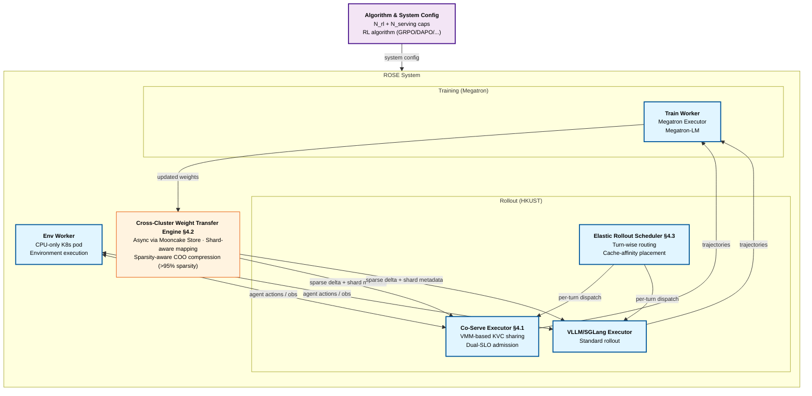

# ROSE: Rollout On Serving GPUs via Cooperative Elasticity for Agentic RL

> [!info] Paper metadata
> - **Paper**: [arXiv:2605.06534](https://arxiv.org/abs/2605.06534) — *ROSE: Rollout On Serving GPUs via Cooperative Elasticity for Agentic RL*, 2026-05-07 (v2: 2026-05-20)
> - **Code**: Not yet released
> - **Authors**: Wei Gao\*†, Yuheng Zhao\*†, Dilxat Muhtar‡, Dakai An†, Xuchun Shang‡, Tianyuan Wu†, Lunxi Cao†, Shaopan Xiong‡, Weixun Wang‡, Ju Huang†, Teng Ma‡, Siran Yang‡, Jiamang Wang‡, Lin Qu‡, Bo Zheng‡, Wei Wang† (\*equal contribution; †HKUST; ‡Alibaba Group)
> - **Implementation**: ~5k lines of Python atop ROLL + vLLM 0.10.0 + Megatron-LM + Mooncake v0.3.8 + Ray

> [!important] ROSE positions against ProRL Agent / Polar / Agent Lightning
> ROSE is the **fourth** agentic-RL framework page in this wiki, alongside [[agent-lightning]] (Microsoft, Aug 2025), [[prorl-agent]] (NVIDIA, March 2026), and [[polar]] (NVIDIA, May 2026). The other three target the rollout-driver layer (how trajectories are collected). ROSE attacks a *complementary* problem: **where does the rollout compute come from when training and serving fight over GPUs**. The answer — cooperative elasticity: harvest idle cycles from your production serving cluster — is novel and orthogonal to ProRL/Polar's design choices.

---

## Summary (read this if you have 2 minutes)

**What it is.** ROSE is an agentic-RL post-training framework from HKUST + Alibaba that solves a specific resource-allocation problem: **agentic RL rollouts demand 70%+ of training wall-clock time, and their compute demand varies 5.7× across training steps, so any static GPU budget is wrong**. The paper's observation is that production serving clusters (the GPUs running your deployed models for users) sit at **18.9% compute / 14.3% memory utilization** on average across a 24-hour Microsoft trace — leaving massive idle headroom. ROSE harvests those serving GPUs for rollouts via "cooperative elasticity", with three system components that make this safe and fast.

**The one idea.** **Use serving cluster GPUs as elastic capacity for RL rollouts, without violating serving SLOs.** Three sub-pieces:

1. **SLO-Safe Co-Serving Executor** (§4.1) — co-locates serving and rollout models on the same GPU, sharing KV cache memory via CUDA Virtual Memory Management (VMM)–based remapping. When serving traffic bursts, the executor *preemptively cuts* the rollout KVC budget (2× factor reduction), aborts in-progress rollouts, and reroutes them. Two priority axes: **serving-first memory** (KVC capacity) + **serving-first compute** (only rollout tokens admitted when TTFT/TPOT SLO slack exists).
2. **Cross-Cluster Weight Transfer Engine** (§4.2) — RL training and serving may live in separate datacenters connected by 10–200 Gbps Ethernet, so weight sync would naively take tens of seconds to minutes. ROSE makes it complete in ≤20 seconds even on 20 Gbps Ethernet via three techniques: (a) **Asynchronous transfer via Mooncake Store** as a relay layer (decouples training and serving membership); (b) **Shard-aware mapping** so training's heterogeneous parallelism (TP=4 × PP=2) auto-maps to serving's TP=4; (c) **Sparsity-aware compression** exploiting >95% sparsity in RL weight deltas $\Delta W_t = W_t - W_{t-1}$ (lossless COO encoding).
3. **Elastic Rollout Scheduler** (§4.3) — dispatches rollouts across dedicated rollout GPUs and opportunistic serving GPUs at *turn granularity* (not whole-trajectory granularity), with cache-affinity placement (route each turn back to the GPU holding its prefix KVC). When serving load spikes, in-flight rollout turns migrate to dedicated GPUs.

Remove the co-serving executor and serving SLOs break under rollout bursts; remove the weight transfer engine and cross-cluster sync becomes the bottleneck; remove the elastic scheduler and you can't safely route rollouts without violating cache locality.

**Headline results.**

| Comparison | Workload | Throughput improvement | Notes |
| ---------- | -------- | ----------------------: | ----- |
| vs. **ROLL-GRPO** (resource-fixed) | Qwen3-8B FrozenLake | **1.31×** (max 2.16×) | Average over 100 steps |
| vs. **ROLL-GRPO** | Qwen3-32B ALFWorld | **1.46×** (max 1.76×) | |
| vs. **ROLL-DAPO** | Qwen3-8B | **1.42×** (max 4.82×) | DAPO's redundant sampling exacerbates resource contention |
| vs. **ROLL-DAPO** | Qwen3-32B | **3.31×** (max 4.39×) | |
| vs. **AReaL** (fully-async) | Qwen3-8B | **1.44×** | Cooperative elasticity beats async-only |
| vs. **AReaL** | Qwen3-32B | **2.69×** | |
| vs. **RLBoost+** (elastic, spot GPUs) | Both | **1.20–1.26× faster rollout** | RLBoost+ has 6.8–7.3% allocation overhead |
| vs. **λRL** (elastic, serverless) | Both | Comparable rollout but **vastly lower overhead** | λRL has 15.1–26.1% allocation overhead; **ROSE has ≤0.4%** |

**Serving SLO compliance**: **zero P99 SLO violations** across all experiments. Model convergence preserved (Figure 7d critic scores nearly identical to baselines).

**Why it matters.**

- **First systematic harvest of production serving capacity for RL training**. Bidirectional autoscaling (shrink serving when traffic is low) has tens of seconds of reload overhead and breaks SLOs; ROSE keeps serving and rollout co-resident with elastic resource sharing.
- **Solves the cross-cluster weight sync problem at scale**. The >95% sparsity in RL weight deltas is a non-obvious property that ROSE is first to exploit at the systems level.
- **Allocation overhead 50–80× better than spot/serverless approaches** (0.3–0.4% vs RLBoost+ 6.8–7.3% vs λRL 15.1–26.1%). This is decisive for production deployment.
- **2027 prediction.** Cooperative elasticity becomes the default mode for agentic RL post-training at organizations that operate both training and serving infrastructure (Alibaba, ByteDance, OpenAI, Anthropic). Spot-only and serverless-only RL frameworks lose to cooperative models. Expect Polar / NVIDIA NeMo-RL / OpenRLHF to add cooperative-elasticity modes within 12 months.

---

# Depth (drill-down starts here)

## Background: why static GPU budgets break agentic RL

Agentic RL alternates **rollout** (running the agent in environments to collect trajectories) and **training** (updating the model on collected rollouts + syncing weights back). The paper's measurement (§2.2, Figure 1a):

| Stage | % of total wall-clock |
| ----- | ---------------------: |
| **Rollout** | **>70%** (8B model 86.9%; 32B model 70.5%) |
| Training | ~25% |
| Weight sync | <5% |

**Rollout dominates.** Two characteristics make it the natural target for optimization:

1. **Long-tail rollouts** (Figure 1b): P75 finishes in ≤30% of E2E rollout time; tail trajectories take 5–10× longer. GPUs running fast trajectories sit idle waiting for stragglers.
2. **Variable resource demand** (Figure 1d): for Qwen3-8B + DAPO, the number of generated trajectories per step varies up to **5.7× across steps**. Sometimes the model converges fast (few resamples needed); sometimes it diverges (many resamples).

### Why fixed allocation fails

Set the GPU budget for *peak* demand → idle during 75% of steps. Set for *average* demand → fall behind during heavy steps and accumulate queue. Either way you're wrong. The paper quantifies this:

> "[Fixed allocation] sized for peak demand idles GPUs during light-load steps, while one sized for average demand creates contention during heavy-load steps. This variation calls for resource elasticity."

### Why existing elastic systems fail

Two prior elastic approaches and their failure modes (Section 2.3):

**(a) Spot-instance elastic (e.g., RLBoost):** Lease external GPUs on-demand. Problem: spot capacity is scarce, providers preempt frequently. The system burns time re-trying allocation. ROSE measures RLBoost+ allocation overhead at **6.8–7.3% of total training time**.

**(b) Serverless GPU elastic (e.g., λRL):** Use AWS Lambda-style on-demand GPU functions. Problem: tens of seconds per cold start + 15-minute function timeout → frequent restart cycles. **15.1–26.1% allocation overhead**.

> [!warning] The promise of elasticity has been undelivered
> Both prior approaches fail because they treat rollout as "additional compute to procure" rather than "compute that already exists in the same organization, just unused." ROSE's reframing is that idle serving GPUs are the cheapest, most-available source of elastic capacity.

### Why serving GPUs are the right source

ROSE's empirical motivation (§3.2, Figure 3a-b):

- 24-hour Microsoft serving trace: per-minute peak 1.7× average, per-second peak 4.22× average
- **Average SM utilization: 18.9%**
- **Average HBM utilization: 14.3%**

Serving clusters at typical production sites are massively over-provisioned for peak demand. The unused 80%+ headroom is what ROSE harvests.

> [!quote] The key reframing
> "A more natural source of elastic capacity for rollouts is the organization's operational serving cluster. ... Reclaiming these GPUs for serving upon traffic bursts requires tens of seconds for model reloading and runtime initialization overhead that would violate serving SLOs. In this paper, we explore *cooperative elasticity*, where serving and rollout workloads cooperatively share *already-deployed* GPUs."

The challenge: serving SLOs (TTFT, TPOT) must be preserved while rollout workloads share the GPU. This is the central contribution.

## Three components in detail

### Component 1 — SLO-Safe Co-Serving Executor (§4.1)

The hardest engineering challenge. Co-locating serving and rollout LLMs on the same GPU requires sharing two scarce resources: **GPU memory** (dominated by KVC) and **GPU compute** (which directly affects token-level latency).

#### Problem 1: KV cache layouts are incompatible

Serving model (e.g., Qwen2.5-7B) and rollout model (e.g., Qwen3-8B) have different head counts, head dims, layer counts → incompatible KVC tensor layouts. Static reservation of per-model KVC pools requires runtime reinitialization (10s+ to add capacity).

**ROSE's fix — VMM-based Cross-Model KVC Memory Sharing:**

> "We leverage CUDA Virtual Memory Management (VMM) to enable fast, flexible KVC rebalancing across heterogeneous models. We **decouple virtual KV address spaces from physical GPU pages**: each model reserves a contiguous virtual KV address space that preserves its attention-kernel indexing, while all models share a global physical page allocator that maps and unmaps pages on demand."

When serving load increases, ROSE unmaps physical pages from rollout's virtual address space and remaps them into serving's virtual address space, at page granularity (typically 2 MB). **Activating Qwen3-32B completes within 5 s** via PCIe/NVLink weight loading — orders of magnitude faster than the tens-of-seconds add-capacity overhead.

#### Problem 2: Rollout KVC competes with serving KVC

If a rollout in-progress holds 30% of GPU memory and serving requests arrive, those requests get evicted KV → SLO violation.

**ROSE's fix — Preemptive Memory Sharing Policy** (three states):

```
1. Burst trigger:
     Co-serving executor monitors serving KVC usage.
     When usage crosses high-watermark within reserved headroom H
     (typically 20% of total GPU memory),
     enter "pressure state".

2. Emergency cut:
     Shrink rollout KVC budget by fixed factor (2×).
     Reclaim freed pages to shared allocator.
     Abort affected rollout requests at request granularity.
     Notify elastic scheduler to reroute aborted trajectories
     to other underutilized GPUs (§4.3).
     [ONE-TIME AGGRESSIVE CUT — no fine-grained churn]

3. Freeze:
     Don't grow rollout budget back until the next RL step.
     Shift subsequent rollout trajectories to underutilized GPUs.
     [PREVENTS OSCILLATION]
```

This three-state machine prevents the death spiral where rollout and serving fight repeatedly for memory.

#### Problem 3: Rollout compute interferes with serving latency

Even if memory is fine, compute interference (rollout decode delays serving decodes, rollout prefill chunks block serving) violates TTFT/TPOT SLOs.

**ROSE's fix — Dual-SLO Admission Controller:**

For each scheduling tick, compute the SLO slack:

$$S_r^{\text{prf}} = (t_r^{\text{arr}} + B_{\text{TTFT}}) - t_{\text{now}} - \hat{T}_{\text{prf}}(L_r, m) \quad \text{(prefill slack)}$$

$$S_r^{\text{dec}} = (t_r^{\text{last}} + B_{\text{TPOT}}) - t_{\text{now}} - \hat{T}_{\text{dec}}(b) \quad \text{(decode slack)}$$

where $B_{\text{TTFT}}, B_{\text{TPOT}}$ are configured SLO budgets (e.g., 150 ms / 500 ms for Qwen2.5-7B), $\hat{T}_{\text{prf}}, \hat{T}_{\text{dec}}$ are offline-profiled prefill/decode times.

**Admit rollout tokens only when both slacks are positive.** This is "serving-first compute" — serving is guaranteed not to slip, but rollout absorbs whatever compute slack remains.

Additional trick: even though serving uses PD-disaggregation, **rollouts use PD-colocation** (single-GPU prefill + decode) to maximize serving GPU resource utilization. Chunked prefill at 512 tokens bounds rollout step runtime and avoids head-of-line blocking for serving.

### Component 2 — Cross-Cluster Weight Transfer Engine (§4.2)

Training and serving clusters often span datacenters (200 Gbps Ethernet, sometimes 20 Gbps WAN), and weight sync after each RL step must complete fast or it bottlenecks the next step.

**Three techniques layered together:**

#### Technique 1: Asynchronous transfer via Mooncake Store

Built on Mooncake Store (the disaggregated KV cache store from Moonshot, also used by [[prfaas]]). Training workers push weights into fixed-size buckets (64 MB) asynchronously; serving workers pull larger batches (1 GB) on demand. No fixed collective groups required → handles dynamic GPU membership when serving GPUs join/leave between RL steps.

Overlaps cross-cluster transfer with NCCL-based intra-cluster synchronization (rollout workers can resume without waiting for cross-cluster transfer to finish).

#### Technique 2: Shard-aware weight transfer

Training cluster has parallelism (TP=8 × PP=2); serving cluster has different parallelism (TP=4). Naive transfer would require all-gather full model first, then re-shard.

ROSE auto-infers each parameter's sharding dimension from module type + parameter shape, computes per-rank slice ranges, encodes this metadata into Mooncake object key. **Each device pushes its local shard asynchronously without first all-gathering**. Each receiving device pulls the buckets it needs based on encoded metadata. Supports both tensor parallelism and pipeline parallelism.

#### Technique 3: Sparsity-aware weight transfer

This is the **most novel observation**. RL post-training produces highly sparse weight deltas:

$$\Delta W_t = W_t - W_{t-1}$$

The sparsity ratio (fraction of zero elements in $\Delta W_t$) is **>95%** for Qwen3-8B and Qwen3-32B at the 10th RL step (Figure 6).

> [!important] Why RL weight deltas are sparse
> RL algorithms employ gradient-stabilization techniques (reference models, KL penalties, conservative update rules) that constrain policy drift. Most parameters don't change between steps. This sparsity is **not** present in conventional LLM training where every update modifies most weights.

ROSE compresses $\Delta W_t$ in **COO (coordinate) format** for transfer and keeps the previous-step weights $W_{t-1}$ resident on local devices. At each update, reconstruct $W_t = W_{t-1} + \Delta W_t$. This introduces ~1 s of compute overhead — small relative to cross-cluster transfer time (up to minutes).

**Result**: end-to-end weight transfer **within 20 seconds even on 20 Gbps Ethernet**.

### Component 3 — Elastic Rollout Scheduler (§4.3)

The scheduler decides per-trajectory placement across dedicated rollout GPUs and opportunistic serving GPUs.

**Two key policies:**

#### Turn-wise concurrency-aware routing

Critical insight: multi-turn agentic RL alternates LLM generation and environment interaction. Routing at *turn* granularity (not whole-trajectory) means:

- A trajectory can start on dedicated rollout GPU (high concurrency), spill to serving GPU when contention arises, migrate back when capacity frees up.
- Rollout concurrency is capped at a workload-dependent threshold (e.g., 16 trajectories per GPU for Qwen3 models with 32K context length) to avoid KVC pressure and excessive scheduling overhead.

#### Cache-affinity placement

The scheduler records which rollout worker served each trajectory's previous turn (cache-affinity table). For each new turn:

1. First, route to the cache-affine worker if it has capacity (prefix KVC reuse).
2. If unavailable on a rollout GPU, check serving GPUs that would not violate serving SLO.
3. Fall back to least-loaded rollout GPU or eligible serving GPU.
4. Queue until resources free up if no pool has capacity.

#### Fault tolerance

Heartbeat monitors detect rollout worker failures or stalls from the co-serving executor. Affected trajectories reroute to other available GPUs. Heartbeats every few seconds; stall timeout 2 seconds.

## System architecture

The full system overview (paper Figure 5, my Mermaid reconstruction):



The four GPU clusters in production deployment:
- **CPU Cluster**: env workers (K8s, no GPU)
- **Serving Cluster**: Qwen2.5-7B / Qwen2.5-32B serving model + ROSE co-serve executor + idle slack for rollouts
- **Rollout Cluster**: dedicated rollout GPUs running vLLM/SGLang
- **Training Cluster**: Megatron-LM training nodes

## Headline evidence

### Setup (§6)

- **Models**: Qwen3-8B (FrozenLake task) + Qwen3-32B (ALFWorld task), trained with GRPO + DAPO
- **Cluster**: H800 GPUs, up to 48 dedicated training + 64 borrowed serving
- **Network**: 400 Gbps InfiniBand intra-cluster; 200 Gbps Ethernet cross-cluster
- **Serving load**: 24-hour Microsoft trace replayed
- **Serving SLOs**: P99 TTFT/TPOT (150 ms, 500 ms) for 7B; (450 ms, 1000 ms) for 32B
- **Baselines**:
  - **Fixed**: ROLL-GRPO, ROLL-DAPO, AReaL (fully-async)
  - **Elastic**: λRL (serverless), RLBoost+ (spot)

### Throughput results (Figure 7a-c)

The numbers shown in the summary table. Three observations:

1. **DAPO benefits most from ROSE** (4.82×/4.39× max throughput): because DAPO's redundant sampling expands rollout demand up to 5.7× over base batch (Figure 1d), the resource elasticity matters more.
2. **32B benefits more than 8B**: cross-cluster weight transfer is heavier for larger models; ROSE's sparsity-aware compression closes that gap.
3. **vs AReaL (fully-async)**: ROSE wins 1.44× / 2.69× because async-only eliminates GPU idle from waiting but doesn't add new GPU capacity. ROSE's cooperative elasticity provides both.

> [!success] Allocation overhead is the killer comparison
> ROSE's **0.3–0.4% allocation overhead** vs λRL's **15.1–26.1%** is the comparison that decides production viability. λRL spends 1/4 of its training time setting up Lambda functions; ROSE spends <0.5% activating already-running serving GPUs. Even RLBoost+ (designed to be efficient with spot instances) sits at 6.8–7.3%. **Cooperative elasticity is decisively cheaper than external GPU procurement.**

### Model convergence preserved (Figure 7d)

Critic scores across 100 training steps: ROSE matches ROLL-GRPO's curve nearly identically. Cooperative elasticity does not introduce algorithmic drift — the rollout-batch shape and weight-sync semantics are preserved.

> [!example]- Comparison with alternative serving engines (Table 1)
>
> At one mid-training checkpoint (step 50 for 8B, step 20 for 32B), compare alternative co-serving setups for rollout time and SLO:
>
> | Model | Method | Rollout Time (s) | P99 TTFT (ms) | P99 TPOT (ms) |
> | ----- | ------ | ---------------: | ------------: | ------------: |
> | 8B | **ROSE** | **496.3** | 338.1 | 136.1 |
> | 8B | ServerlessLLM | — | 314.8 | 117.8 |
> | 8B | ServerlessLLM+Rollout | 651.7 | 1166.1 | 135.6 |
> | 8B | Prism | 731.7 | 973.2 | 115.4 |
> | 32B | **ROSE** | **960.1** | 837.5 | 398.1 |
> | 32B | ServerlessLLM | — | 716.1 | 312.8 |
> | 32B | ServerlessLLM+Rollout | 1161.8 | 2426.2 | 565.3 |
> | 32B | Prism | 1301.2 | 1625.4 | 351.7 |
>
> ROSE achieves shorter rollout time *and* better serving TTFT than ServerlessLLM-with-rollout and Prism (both fail SLO budgets). ROSE's TTFT is higher than serving-only ServerlessLLM (which has no rollout load), but that's the cost of providing rollout capacity — and the difference is within SLO.

> [!example]- Communication efficiency under different link bandwidths (§6.3)
>
> Tested 8B and 32B at 10/50/100/200 Gbps cross-cluster links. ROSE's sparsity-aware transfer keeps end-to-end weight sync **under 20 s even at 20 Gbps**, vs naive transfer at minutes for 32B.

## Strengths and limitations

**Strengths.**

- **First systems paper to harvest production serving capacity for RL training**. The reframing alone is durable.
- **The >95% sparsity observation for RL weight deltas** is non-obvious and exploitable. May enable other downstream optimizations.
- **VMM-based KVC sharing** is a clean primitive that other co-location systems can borrow.
- **Allocation overhead 50-80× better than spot/serverless approaches** — decisive for production.
- **Algorithm-agnostic** — works with GRPO, DAPO, AReaL-style async training. Not coupled to a specific RL recipe.
- **No serving SLO violations** across all experiments — proves the dual-SLO admission controller actually works.

**Limitations.**

> [!warning] Cooperative elasticity only works if you operate both training and serving
> ROSE assumes the same organization runs both training cluster and serving cluster, with cross-cluster communication permitted. **Open-source RL groups without production serving deployments (academic labs, small companies) can't benefit.** This is fundamentally an Alibaba/ByteDance/OpenAI-scale paper.

- **Spot-instance + serverless baselines deliberately set up to fail**: λRL has 15-minute function timeout (extremely punishing); RLBoost+ on volatile spot capacity. A real spot-instance ML platform (e.g., AWS Capacity Blocks for ML, or HPC-aware schedulers) might compare more favorably.
- **Cross-cluster Ethernet measurement at 200 Gbps** is generous. Real inter-DC bandwidth is often 10-100 Gbps; ROSE measures down to 20 Gbps but tests are short.
- **Two-task evaluation** (FrozenLake, ALFWorld). Doesn't cover SWE-Bench / coding agents or harder web/computer-use workloads where rollout dynamics differ.
- **No comparison with [[polar|Polar]] or [[prorl-agent|ProRL Agent]]** — these are sibling agentic-RL frameworks that ROSE doesn't head-to-head. Reasonable because they target different layers (rollout-driver vs resource-allocation), but a system that composes them would be ideal.
- **Mooncake Store dependency** ties ROSE to Moonshot's storage system. Alternative relay layers (e.g., Ray's object store) might work but aren't validated.
- **Code not yet released** as of June 2026.

> [!bug] VMM-based KVC sharing has implementation complexity
> CUDA VMM is supported only on newer driver/CUDA versions and has limitations on certain GPU architectures. Production deployments need to validate this carefully — falling back to static KVC reservation incurs the 10s+ reinitialization penalty.

## What this means

ROSE recasts the agentic-RL resource problem from "how do we procure more GPUs" to "how do we share GPUs we already have between training and serving". For organizations that operate both, this is decisive. For organizations that don't, ROSE doesn't apply directly — but the sparsity observation alone (RL weight deltas >95% sparse) likely generalizes to any cross-cluster setup.

Three predictions for 2027:

1. **Cooperative elasticity becomes the default agentic-RL framework architecture** at Alibaba, ByteDance, Google, Meta, OpenAI, Anthropic — i.e., everyone who operates both training and serving infrastructure. Expect Polar / NeMo-RL / OpenRLHF to add cooperative-elasticity modes.
2. **The sparsity-aware weight transfer becomes standard** across RL frameworks. >95% sparsity in $\Delta W_t$ is reproducible across model sizes and tasks; the COO encoding is straightforward. Existing RL frameworks (TRL, OpenRLHF, veRL) will adopt this.
3. **VMM-based cross-model KVC sharing enters vLLM / SGLang as a first-class primitive.** Currently each engine has its own KVC manager; a shared global allocator (ROSE-style) enables much more flexible multi-tenant deployments.

ROSE does **not** solve:

- **Quality of rollouts on cooperative GPUs** — assumes rollouts on borrowed serving GPUs are as useful as on dedicated rollout GPUs. May not hold if serving-GPU configurations (memory, kernel set) differ subtly from training expectations.
- **Cross-tenant cooperative elasticity** — assumes single-tenant ownership of both clusters. Multi-tenant scenarios (e.g., cloud provider sharing serving capacity across customers) are out of scope.
- **The agentic rollout-driver layer** ([[prorl-agent|ProRL Agent]] / [[polar|Polar]] solve this) — ROSE provides compute; doesn't define how trajectories are collected.

## Source code & reproduction

```bash
# Code not yet released as of June 2026.
# Implementation built atop:
git clone https://github.com/HumeAI/roll      # ROLL training framework
git clone https://github.com/vllm-project/vllm  # 0.10.0
git clone https://github.com/NVIDIA/Megatron-LM
git clone https://github.com/kvcache-ai/mooncake-store  # v0.3.8
```

**Reproduction protocol** (from §6 + Appendix):

| Component | Configuration |
| --------- | ------------- |
| RL training framework | ROLL (chosen over veRL for better agentic task support) |
| Inference engine | vLLM 0.10.0 |
| Training framework | Megatron-LM |
| Cross-cluster relay | Mooncake Store v0.3.8 |
| Load balancer | Ray-based |
| Hardware | H800 GPUs (up to 48 training + 64 borrowed serving) |
| Networking | 400 Gbps InfiniBand intra-cluster, 200 Gbps Ethernet cross-cluster |
| Models tested | Qwen3-8B (FrozenLake) + Qwen3-32B (ALFWorld) |
| Serving models | Qwen2.5-7B + Qwen2.5-32B (compatible parallelism with rollout models) |
| Serving load | 24-hour Microsoft trace replay |
| RL algorithms | GRPO + DAPO |
| Group size | 16 |
| Training batch sizes | 256 (8B), 1024 (32B) |
| Per-device rollout batch size | 16 |
| Training parallelism | (TP=4, PP=1, CP=1) for 8B; (TP=4, PP=1, CP=1) for 32B |
| Rollout parallelism | (TP=1) for 8B; (TP=4) for 32B |
| Total training steps | 100 (8B), 40 (32B) for GRPO; 50/25 for DAPO |

**Estimated implementation modules** (from §5):

| Module | Role | Lines |
| ------ | ---- | ----: |
| `rose/co_serve_executor.py` | SLO-Safe Co-Serving Executor §4.1 | ~1500 |
| `rose/weight_transfer.py` | Cross-Cluster Weight Transfer Engine §4.2 | ~1500 |
| `rose/elastic_scheduler.py` | Elastic Rollout Scheduler §4.3 | ~1000 |
| `rose/vmm_kvc.py` | CUDA VMM KVC manager | ~500 |
| `rose/sparsity_compressor.py` | COO sparsity encoder | ~500 |
| Total | | ~5000 |

## Related reading

- [[prorl-agent]] — ProRL Agent: NVIDIA's rollout-driver layer. ROSE is the *resource-allocation* layer; ProRL Agent could run on top of ROSE's cooperative elasticity for both compute and architecture wins.
- [[polar]] — Polar: NVIDIA's successor to ProRL Agent with LLM-API proxy. Same layer as ProRL Agent; orthogonal to ROSE.
- [[agent-lightning]] — Agent Lightning: Microsoft's Training-Agent Disaggregation paper. Different decoupling axis (trainer vs agent process) than ROSE (training vs serving clusters).
- [[continuum]] — Continuum: KV-cache TTL for multi-turn agent *serving*. ROSE's co-serving executor could borrow Continuum's per-turn queueing delay model for better admission control under bursty agent traffic.
- [[aurora]] — Aurora: online speculative-decoding training as async RL. Complementary direction (token-level rollout speedup vs cluster-level resource elasticity).
- [[das-spec-rl]] — DAS: distribution-aware spec decoding for RL rollouts. Stack: DAS speeds up the rollout *inference*; ROSE adds GPU capacity for that inference.
- [[grpo]], [[ppo-for-llm]] — RL algorithms ROSE runs on (algorithm-agnostic, but GRPO/DAPO are validated).
- [[rl-training-frameworks]] — Where ROSE sits among ROLL, OpenRLHF, veRL, AReaL.
- [[prfaas]] — PrfaaS: shares Mooncake Store dependency. Both papers (PrfaaS for inference, ROSE for training) treat the relay layer as load-bearing infrastructure.
- [[sglang]], [[vllm]] — Inference engines ROSE uses for rollout workers.

## References

- Wei Gao, Yuheng Zhao, et al. *ROSE: Rollout On Serving GPUs via Cooperative Elasticity for Agentic RL.* arXiv:2605.06534, May 2026. https://arxiv.org/abs/2605.06534
- ROLL (cited as [63]): the agentic RL framework ROSE builds atop.
- Mooncake Store ([45], v0.3.8): relay layer for cross-cluster weight transfer.
- AReaL ([13]): fully-async RL baseline.
- RLBoost+ (strengthened RLBoost [69]): spot-instance elastic baseline.
- λRL ([41, 61]): serverless RL baseline.
- BurstGPT ([65]): bursty workload model for synthetic traffic generation.
- ServerlessLLM ([14]) and Prism ([81]): alternative serving engines compared in Table 1.
- DAPO ([80]) — the RL algorithm whose redundant sampling most benefits from ROSE's elasticity.
