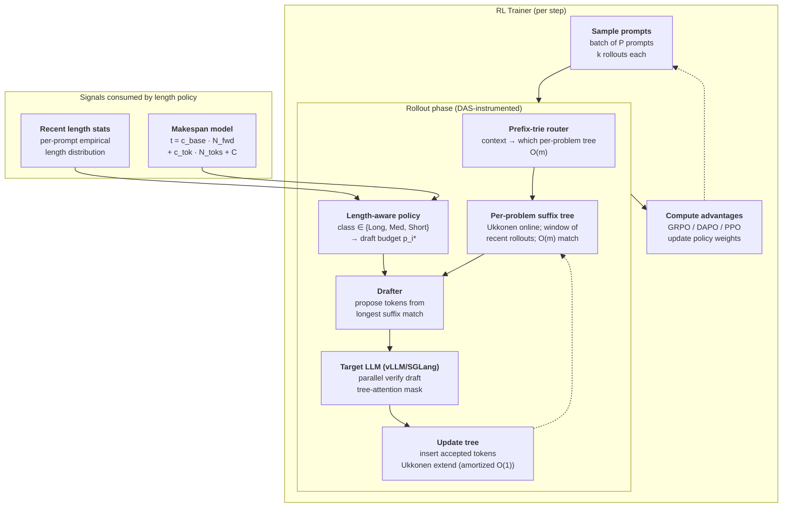

# DAS: Distribution-Aware Speculative Decoding for RL Training

> [!info] Paper metadata
> - **Paper**: [arXiv:2511.13841](https://arxiv.org/abs/2511.13841) — *Beat the long tail: Distribution-Aware Speculative Decoding for RL Training* (Nov 17, 2025; anonymous MLSys submission)
> - **Code**: not yet released
> - **Authors**: Zelei Shao, Vikranth Srivatsa, Sanjana Srivastava, Qingyang Wu, Alpay Ariyak, Xiaoxia Wu, Ameen Patel, Jue Wang, Percy Liang, Tri Dao, Ce Zhang, Yiying Zhang, Ben Athiwaratkun, Chenfeng Xu, Junxiong Wang

> [!abstract]+ TL;DR
> RL post-training spends most of its wall time *generating rollouts*, not computing gradients — and the rollout distribution is **long-tailed**, so the longest few samples set the batch's makespan. DAS attacks this with two ideas that compound. **(1) A suffix-tree drafter built online from recent rollouts**, refreshed every iteration via Ukkonen's algorithm in $O(m)$ per insert, with per-problem trees + a prefix trie router — no pre-trained drafter, no extra GPU, draft proposals match the policy as it drifts during training. **(2) A length-aware speculation policy** that solves an explicit makespan-minimization problem ($t_{\text{total}} = c_{\text{base}} N_{\text{fwd}} + c_{\text{tok}} N_{\text{toks}} + C$) and concludes that *longer-expected rollouts should get more aggressive draft budgets and short ones should turn speculation off entirely*, packaged as a three-class Long/Medium/Short heuristic. Results: **>50 % rollout-time reduction** on math RL (DeepSeek-R1-Distill-Qwen-7B on DSR-sub, 1× 8×H100, batch 128, 30 steps) and **~25 %** on code RL (Qwen3-8B on DeepCoder, 2× 8×H100), reward curves identical to vanilla.

---

## Background: why generic speculative decoding doesn't work in RL rollouts

The headline cost of RLHF / RLVR training is no longer the gradient step — it's the **rollout phase**: for every prompt in a training batch, the current policy generates $k$ samples (often 8 or 16) up to a long maximum sequence length (often 16 K). [[ppo-for-llm|PPO]], [[grpo|GRPO]] and DAPO all share this shape; ProRL-style frameworks ([[prorl-agent]]) make it concrete by exposing rollout-as-a-service. On a single 8×H100 node a math-RL step typically spends >80 % of wall time inside the inference engine.

Two structural facts make rollouts painful — and they're exactly what DAS exploits:

1. **The length distribution is long-tailed.** Most samples finish well before the cap, but a few hit the 16 K limit or come close. Batch wall time is set by the **last** sample, not the average. Cutting the median rollout time in half does nothing for the step's makespan.
2. **The policy is non-stationary.** The model is being updated every iteration. Any drafter you train ahead of time (EAGLE, Medusa, a small distilled model) decays as the policy drifts — and re-training the drafter every step is its own training loop.

[[speculative-decoding|Generic speculative decoding]] solves the per-request latency problem in serving (lossless 2–6× speedup using a draft model that proposes tokens for the target to verify in parallel). Naively applied to RL rollouts it breaks on both points:

- **Pre-trained drafters drift.** EAGLE / Medusa drafters are trained against a fixed target; once the target starts moving they lose acceptance rate, and the verifier ends up doing $\gamma + 1$ wasted forwards per rejected proposal.
- **Uniform draft budgets hurt the tail.** Spending the same draft budget on a 50-token rollout and a 14 K-token rollout is wrong on both ends: the short request pays draft overhead it can never recover; the long request leaves speedup on the table.

So the question becomes: *what drafter is right for a policy that is changing, and what budget policy is right for a workload whose makespan is dominated by the longest few requests?* DAS gives a clean answer to both.

> [!quote] The reframing in one sentence
> Speculative decoding for RL training is not a latency-per-request problem; it's a **batch makespan** problem, and the right drafter is one that learns from the policy's own recent output.

### Comparison to concurrent work

DAS arrives in a wave of RL-specific speculative-decoding papers in late 2025 / early 2026:

| Method            | Drafter                                  | Budget policy                  | Target workload          |
| ----------------- | ---------------------------------------- | ------------------------------ | ------------------------ |
| EAGLE-2 / EAGLE-3 | Trained autoregressive feature head      | Fixed γ (sometimes adaptive)   | Generic serving          |
| Medusa            | Multiple parallel heads                  | Fixed γ                        | Generic serving          |
| SuffixDecoding    | Global suffix tree of past outputs       | Fixed γ                        | Generic serving          |
| SPEC-RL           | Lightweight model retrained mid-RL       | Fixed γ                        | RL rollouts              |
| FastGRPO          | GRPO-aware sample reuse                  | N/A (samples, not tokens)      | GRPO rollouts            |
| RhymeRL           | Similar prefix matching across samples   | Fixed γ                        | RL rollouts              |
| **DAS (this)**    | **Per-problem online suffix tree + prefix trie** | **Length-aware via makespan optimization** | **RL rollouts** |

> [!question]+ Shiki — Why a *suffix* tree, and why *per problem*? (2026-05-13)
> Two related design choices, both load-bearing.
>
> **Why suffix tree?** During RL training the same prompt is rolled out $k$ times in one step and across many steps. The samples for one problem share long substrings — the same reasoning chain, the same Lean tactic, the same Python boilerplate — even though the surface text differs. A trie keyed on prefixes only finds matches anchored at position zero; a **suffix tree** finds the longest match of the *current context* against any substring of any past sample. That's the right primitive: at decode time you ask "have I ever generated something that ends in this exact context?" and the tree answers in $O(m)$ for context length $m$. The drafter then proposes the path that historically followed that suffix.
>
> **Why per-problem?** A single global tree would mix together samples from chemistry questions, Lean proofs, and Python competitive-programming problems. The substrings that follow "lemma " in a Lean proof have *nothing* to do with the substrings that follow "lemma " in a chemistry essay. Mixing them lowers acceptance rate and inflates the tree. DAS keeps one suffix tree per prompt (or per cluster of related prompts) and uses a small prefix trie as a router so "which tree should I query" is itself $O(m)$. The window of "recent rollouts" controls a bias–stability tradeoff: too narrow and you miss patterns the policy is settling into; too wide and you carry stale samples from an older policy.

---

## The key idea, in two halves

> [!quote] The contribution in one sentence
> Build the drafter from the **policy's own recent rollouts** (online, per-problem suffix tree via Ukkonen) and pick the **per-request draft budget** to minimize the *batch* makespan (longer expected rollouts get bigger budgets, short ones get speculation turned off).

The two halves are independent contributions stitched into one system:

- **A drafter that follows the policy for free.** No GPU memory, no extra training loop, no calibration data. The tree is built from the rollouts you already have to materialize, and Ukkonen's online algorithm means each new sample is incorporated in linear time. Acceptance rate stays high through training because the drafter *is* the policy's recent behaviour.
- **A budget policy derived from the actual cost model.** DAS doesn't pick $\gamma$ by sweep; it writes down the cost equation, models acceptance as a function of budget, and solves for the budget that minimizes total batch time given the expected per-request rollout length. The result is a clean closed-form expression and a practical three-bucket heuristic.

The rest of the page makes each half concrete.

---

## How it works

### Where DAS sits in the rollout loop



Two things to call out from the picture:

- **DAS is a drop-in for the inference path.** It does not change the trainer side at all — gradients, advantages, KL terms, reward shaping all stay where they were. The only new components are inside the rollout engine: the router, the trees, the budget policy, and a thin draft-and-verify wrapper.
- **The drafter feeds itself.** Every accepted token gets inserted back into its problem's suffix tree (Ukkonen's online extension is amortized $O(1)$ per character), so the drafter improves *within* a single training step as more rollouts complete. This is the structural reason DAS doesn't pay a warm-up cost.

### The suffix tree drafter

A **suffix tree** for a string $s$ of length $n$ is a compressed trie over all $n$ suffixes of $s$. It answers two questions in $O(m)$ for a query of length $m$:

1. *Does my query appear as a substring of $s$?* (walk down from the root following the query characters)
2. *What strings have historically followed this substring?* (the subtree rooted at the deepest matched node enumerates them)

Ukkonen's algorithm (1995) builds a suffix tree **online** in total $O(n)$ time, processing one character at a time with amortized $O(1)$ work per character via the suffix-link trick. That's exactly the property DAS needs: every time a rollout produces an accepted token, the tree absorbs it without recomputing anything.

**What the drafter does at decode time**, in pseudocode:

```python
def das_draft(context, prompt_id, budget_p):
    # 1. Route to the right tree. The prefix trie keys on the prompt
    #    embedding / problem id and returns the per-problem suffix tree.
    tree = trees[prefix_router.route(prompt_id)]

    # 2. Find the longest suffix of `context` that appears anywhere in
    #    the tree's string. O(m) top-down walk; the tree's suffix links
    #    let us pick up at the longest match in one pass.
    node, match_len = tree.longest_suffix_match(context)
    if match_len == 0:
        return []                          # no draft this step

    # 3. From the deepest matched node, propose the most-frequent
    #    continuation of length up to budget_p. Frequency is encoded
    #    by counts on the edges (set during Ukkonen extensions).
    return tree.most_frequent_continuation(node, max_len=budget_p)


def rollout_one_step(prompt, policy, max_len=16384):
    context = prompt
    while not done(context) and len(context) < max_len:
        # 1. Decide budget from length-aware policy (next subsection).
        p = budget_policy(prompt, len(context), recent_length_stats)

        # 2. Build draft from suffix tree.
        draft = das_draft(context, prompt.id, budget_p=p)

        # 3. Parallel verify via the target LLM.
        accepted, resampled = policy.verify(context, draft)

        # 4. Commit accepted tokens, optionally add the resample.
        context += accepted + [resampled]

        # 5. Update the per-prompt suffix tree online (Ukkonen extend).
        trees[prompt.id].extend(accepted + [resampled])
    return context
```

Three structural choices in this design are worth surfacing because they're not what a textbook spec-decoding write-up would say:

- **The drafter is the *output*, not a separate model.** There's no second forward pass at draft time — just a tree walk. Cost is microseconds even for million-character trees because Ukkonen-style suffix trees are pointer-heavy but very cache-friendly for top-down walks. The verifier is the only thing on the GPU.
- **Per-problem partitioning is what saves acceptance rate.** A *global* suffix tree (cf. SuffixDecoding) sees every rollout in the system and produces blander drafts because the most-common continuation of any short context is mixed across problem types. DAS partitions by prompt — same chemistry question shares a tree across its 16 samples but not with the Lean proof prompt three slots away — and the prefix trie router resolves "which tree" in $O(m)$ so the partition is essentially free.
- **The sliding window controls a bias–stability tradeoff.** Too few past rollouts and the tree hasn't seen enough patterns; too many and it carries stale drafts from a policy that has since moved. The paper sweeps this; the practical answer is "the last few iterations of rollouts for this problem," which lines up with what the policy is currently doing.

### The length-aware speculation policy

This is the half of the paper that turns a heuristic into a derivation. DAS writes down an explicit makespan model and solves for the optimal draft budget per request.

**Makespan model.** Let a single rollout of expected length $l_i$ tokens (request $i$) be decomposed into $N_{\text{fwd}}$ forward passes producing $N_{\text{toks}}$ accepted tokens. Each forward pass has a fixed overhead $c_{\text{base}}$ (kernel launch, KV-cache I/O, RoPE, etc.) plus a per-token cost $c_{\text{tok}}$ (the attention + MLP work proportional to verified tokens). With an extra setup constant $C$:

$$
\boxed{\,t_{\text{fwd}} = c_{\text{base}} + c_{\text{tok}}\, n_{\text{toks}}, \qquad t_{\text{total}} = c_{\text{base}}\, N_{\text{fwd}} + c_{\text{tok}}\, N_{\text{toks}} + C\,}
$$

Without speculation, $N_{\text{fwd}} = N_{\text{toks}} = l_i$, so $t_{\text{total}} \approx (c_{\text{base}} + c_{\text{tok}}) l_i$ — the $c_{\text{base}}$ term dominates because each forward only produces one token. The whole *point* of speculation is to **shrink $N_{\text{fwd}}$ at the cost of inflating $N_{\text{toks}}$** (you verify more tokens per forward, including the rejected ones).

**Acceptance model.** For request $i$ with proposed-token budget $p_i$ across the whole rollout, the expected number of accepted tokens follows a saturating exponential:

$$
A_i(p_i) = k_i\, l_i\, \bigl(1 - e^{-\alpha_i p_i / l_i}\bigr)
$$

where $\alpha_i$ is a per-request *acceptance efficiency* (how good the drafter is for this request — high $\alpha_i$ means more accepted tokens per proposed token) and $k_i \in (0, 1]$ is the *maximum achievable acceptance fraction* (you can't accept more tokens than the rollout has, and even with infinite draft tokens some fraction will always reject). This functional form falls out of an empirical observation, mirrored in EAGLE-style work, that per-position acceptance decays roughly exponentially with position in the draft chain:

$$
a_{i,k} = a_{i,0}\, e^{-\beta_i (k-1)}
$$

i.e. the $k$-th draft token after a match-point is exponentially less likely to be accepted than the first. Summing this geometric series and integrating over the rollout length gives the saturating form above; $\alpha_i$ is a function of $a_{i,0}$ and $\beta_i$.

**Optimal budget.** With those pieces, $N_{\text{fwd}}$ becomes (forwards needed to consume $l_i$ tokens given that $A_i(p_i)$ tokens come from drafts):

$$
N_{\text{fwd}}(p_i) = l_i - A_i(p_i) + \frac{p_i}{l_i}\cdot l_i \;\;\Rightarrow\;\; t_i(p_i) = c_{\text{base}}\, N_{\text{fwd}}(p_i) + c_{\text{tok}}\,(l_i + p_i) + C
$$

Minimizing $t_i$ in $p_i$ and solving (paper's Eq. 7) gives the closed form:

$$
\boxed{\,p_i^{\,*} = -\frac{l_i}{\alpha_i}\, \ln\!\Bigl(1 - k_i\bigl(1 - \tfrac{N_{\text{fwd}}}{l_i}\bigr)\Bigr) \quad \text{if } N_{\text{fwd}} < l_i,\quad \text{else } p_i^{\,*} = 0\,}
$$

Three readings of this formula are useful intuition:

1. **$p_i^* \propto l_i$.** Longer expected rollouts deserve proportionally larger draft budgets. The makespan win from speculation scales with how many forwards you can collapse.
2. **$p_i^* \propto 1/\alpha_i$.** Worse drafters (lower acceptance efficiency) need *more* proposed tokens to extract the same speedup — to a point. Once the drafter is too weak ($N_{\text{fwd}} \geq l_i$), the formula correctly returns $p_i^* = 0$ (don't speculate at all).
3. **The $-\ln(\cdot)$ is the saturation barrier.** As $p_i \to \infty$ the argument of the log approaches zero from above, and $p_i^*$ explodes — but bounded above by $k_i$. In practice $k_i$ is well below 1 (typically 0.6–0.85 from acceptance-rate measurements), which caps the optimal budget at a finite sane number.

**The three-class hierarchical heuristic.** Solving the optimal-budget formula per request requires estimating $l_i, \alpha_i, k_i$ per request, which is expensive. DAS approximates with a **discrete three-bucket policy** keyed on the *predicted* class of each request:

$$
\text{Init}_r = \arg\max_{c \in \{\text{Long}, \text{Med}, \text{Short}\}} \#\{r' \sim r : r' \in c\}
$$

i.e. classify request $r$ by majority class of recent rollouts on similar (same) prompts. Then update at runtime:

$$
\text{Class}_r \mid l, \text{Init}_r = \arg\max_c P(c \mid l, \text{Init}_r)
$$

i.e. update the class as the rollout grows and reveals its actual length. The class maps to a draft budget:

| Class    | Heuristic threshold (approx.)      | Draft budget         | Why                                          |
| -------- | ---------------------------------- | -------------------- | -------------------------------------------- |
| **Long** | Top quantile of recent rollouts    | Aggressive (high $p_i^*$) | Long rollouts dominate batch makespan; high budget pays off. |
| **Med**  | Middle quantile                    | Moderate             | Useful but not the bottleneck.               |
| **Short** | Bottom quantile (e.g. < 1K tok)   | **0 (off)**          | Draft overhead > expected savings; skip speculation. |

> [!important] The most actionable single finding
> Turning **speculation off** for the short-tail of rollouts is what makes the math work. Naive per-request speculation pays the draft-tree-walk + verify-overhead tax on samples that would have finished in a few tokens anyway; the makespan model says the right answer is *don't speculate at all* on those. The "Long" bucket then gets a much higher budget than uniform-$\gamma$ would have allowed.

The thresholds for Long/Medium/Short aren't published as fixed numbers in the paper — they're set per-workload from the recent rollout-length empirical distribution and re-estimated each iteration. The structure is what generalizes: three buckets, the largest gets the biggest budget, the smallest gets zero.

---

## Experiments

### Math RL — DeepSeek-R1-Distill-Qwen-7B on DSR-sub

**Setup.** 1,209 examples from DeepScaleR (filtered subset called DSR-sub), 1× 8×H100 node, training batch size 128, 16 samples per question, max sequence length 16 K, 30 training steps. The trainer is GRPO-family (DAPO-style clipping).

**Headline.** **> 50 % reduction in total rollout time** vs. the vanilla vLLM/SGLang rollout path. Reward curves are identical: DAS is *lossless* (rejection sampling preserves the target distribution exactly — see [[speculative-decoding]]), so trained-model evaluation matches the no-spec-decoding run within noise.

The >50 % is averaged across the whole 30-step run, not a cherry-picked step. Important because the drafter quality changes as the policy drifts: a flat 50 %+ across the entire training trajectory is the harder claim, and it's the one DAS makes.

### Code RL — Qwen3-8B on DeepCoder

**Setup.** 2× 8×H100 nodes, per-GPU batch size 32, 8 samples per question, max sequence length 16 K. Trainer is GRPO with code-execution reward signal (DeepCoder pipeline).

**Headline.** **~25 % reduction in rollout time**. Smaller than math RL, but still meaningful — code rollouts have more variety per question than math rollouts (multiple valid solutions, branching control flow), so suffix-tree drafting acceptance rates run lower. The fact that DAS still extracts 25 % when the drafter is *worse* validates the framing: the budget policy correctly under-invests in low-acceptance regimes, capturing whatever speedup is available without paying overhead.

### Ablations

The paper includes two ablation cuts (Fig. 12, Fig. 13 in the manuscript):

- **Distribution-aware vs. unlimited budget.** Giving every request an unlimited draft budget *underperforms* the distribution-aware budget by **up to 15 %** in rollout time. This is the cost of paying speculative overhead on the short tail — the heuristic that *turns speculation off* for short requests is worth ~15 % in itself.
- **Robustness vs. sequence length.** At 8 K maximum sequence length, DAS still delivers **> 30 % speedup**. Speedup grows monotonically with max sequence length (longer cap → more tail → more makespan to attack), which is consistent with the makespan model: the optimal budget formula has $p_i^* \propto l_i$.

### A quick wall-clock sanity check

Per the makespan model with $c_{\text{base}} \gg c_{\text{tok}}$ (memory-bandwidth-bound decode), a vanilla rollout of length $l$ costs roughly $l \cdot c_{\text{base}}$. With DAS the same rollout costs roughly $(l - A) c_{\text{base}} + (l + p) c_{\text{tok}}$ where $A$ is the accepted draft count. If $A \approx 0.6 l$ (a realistic acceptance fraction at modest $p$) and $c_{\text{tok}} \ll c_{\text{base}}$, the rollout cost drops to $\approx 0.4 l \cdot c_{\text{base}}$ — a 60 % reduction. That matches the >50 % observed on math RL where suffix-tree acceptance is high; on code RL the drafter is weaker, $A$ is lower, the reduction shrinks to ~25 %. The model and the experiments line up.

---

## Strengths and limitations

What's strong about the work:

- **The drafter has no GPU footprint.** No second model loaded, no extra parameters in the optimizer state. A pure CPU-side data structure that absorbs accepted tokens via Ukkonen. For an 8×H100 node already running a 7–8 B-parameter policy plus its optimizer states, "no extra GPU memory" is a real constraint and DAS respects it.
- **The drafter is automatically up-to-date with the policy.** No retraining loop, no calibration, no scheduling decision. The structure that delivers this — *the policy's own recent output is the drafter* — is the elegant move.
- **The budget policy is principled.** Most spec-decoding papers pick $\gamma$ by sweep; DAS writes the cost equation and solves it. The closed-form optimal-budget result is the kind of equation that should outlive any specific implementation.
- **Lossless.** Same rejection sampling as standard speculative decoding, so reward curves and final eval numbers match the no-spec baseline exactly. There's no quality-vs-speed tradeoff to manage.

Where the work is honest about scope but the limits matter:

- **No public code yet.** As of submission the paper is an anonymous MLSys submission with no associated GitHub. Reproducing requires reimplementing Ukkonen + per-problem partitioning + makespan-aware budgeting on top of vLLM or SGLang. Concrete kernel hooks (where the drafter call lives in the engine, how the prefix-cache interacts) are not exposed.
- **Only math and code reasoning are evaluated.** General chat-style RL (RLHF on open-ended preference data) is a different distribution shape — long-tail still applies, but the suffix-tree drafter assumes a lot of substring repetition that holds for math/code (Lean tactics, Python idioms) and may hold less for free-form prose. The paper doesn't test this.
- **Two model sizes (7 B, 8 B).** Both are in the dense small-model regime. Whether the speedup translates to 70 B / 405 B models or to MoE policies is open. The makespan model says the speedup should *grow* with model size (bigger $c_{\text{base}}$, same $c_{\text{tok}}/c_{\text{base}}$ ratio is unfavourable, so collapsing forwards pays more), but that prediction isn't tested.
- **No interaction analysis with prefix caching.** Modern serving engines ([[vllm|vLLM]] V1, [[sglang|SGLang]] RadixAttention) reuse KV cache across rollouts of the same prompt. Speculative decoding interacts non-trivially with prefix caches because the prefix is shared but the speculated continuations diverge. The paper doesn't analyse whether DAS *adds* to prefix-cache speedup or *competes* with it.
- **The three-class heuristic is workload-specific.** Long/Med/Short thresholds are estimated from recent rollouts. The procedure is automatic, but it does mean a workload with a different length distribution (e.g. RL on a fixed-length agentic loop) might want a different bucket count or a continuous policy instead.
- **No comparison to EAGLE-2 / EAGLE-3 on the RL-rollout setting.** EAGLE-class drafters are the strongest open generic speculative-decoding methods; DAS argues they drift under policy update but doesn't measure how much speedup they retain when retrained periodically vs. DAS's online suffix-tree alternative.
- **Concurrent and overlapping with SuffixDecoding / SPEC-RL / FastGRPO / RhymeRL.** The contributions distinguish themselves cleanly *on paper* — per-problem trees, length-aware policy — but a head-to-head on the same hardware is not yet published.

> [!note] What's the single most transferable lesson?
> The **makespan-aware budget policy** is the contribution that's hardest to invent and easiest to lift. Even with an EAGLE / Medusa / RhymeRL drafter, the observation that long-tail rollout workloads need *per-request* budgets (and *zero* budget for short requests) is worth ~15 % by itself and applies to any speculative decoder under any RL framework.

---

## What this means

Two slow-burn implications worth tracking:

1. **The drafter and the policy will keep merging.** DAS is one step in a trend that started with EAGLE (feature-level draft from the target's own hidden states) and continues through SuffixDecoding (no model at all, just past outputs). The natural endpoint is "the policy *is* the drafter, and there is no second model" — which DAS approaches by using the policy's recent rollouts as the drafter. Expect 2026 to keep narrowing the gap.
2. **Speculative decoding for training, not just for serving.** The serving community has spent five years on per-request latency; the RL-training community is now picking up the same tools and finding that the assumptions are different — non-stationary policy, batch makespan, long tail. The interesting research surface is *re-deriving speculative decoding under a workload model* rather than reusing the serving-style $\gamma$-sweep. DAS's makespan equations are the kind of object that will spawn follow-ups.

What this is *not*: an answer for general LLM serving (the suffix-tree drafter exploits within-batch substring repetition that doesn't exist in open-internet traffic), nor a replacement for [[prorl-agent|RaaS-style infrastructure]] (orthogonal: DAS speeds up the inside of a rollout server, ProRL Agent speeds up the orchestration around it). The two stack.

---

## Source code & reproduction

No public code release at submission. Reproduction would need:

| Component                                | Where it goes                                                                  |
| ---------------------------------------- | ------------------------------------------------------------------------------ |
| Per-problem suffix tree + Ukkonen online | CPU-side data structure inside the rollout worker (e.g. inside [[prorl-agent|ProRL Agent]]'s `_worker`). |
| Prefix trie router                       | Same place; keyed on `prompt_id` or a prompt embedding.                        |
| Length classifier (Long/Med/Short)       | Small online estimator over recent rollouts per problem.                       |
| Budget policy                            | One scalar per request set at rollout start, mutable as length grows.          |
| Draft + verify wrapper                   | Hooks into vLLM / SGLang's speculative-decoding pipeline (`SpecConfig`, draft model interface). |

The cleanest engineering path: extend an existing [[speculative-decoding|spec-decoding-enabled]] engine ([[vllm|vLLM]] V1's spec-decoding stack or SGLang's `SpecForward`) with a suffix-tree drafter that implements the engine's drafter interface, plus a request-level `max_draft_tokens` parameter that the trainer sets according to the makespan formula.

---

## Related reading

- [[speculative-decoding]] — Draft-verify acceleration overview; EAGLE / Medusa / SuffixDecoding lineage that DAS sits in.
- [[prorl-agent]] — Rollout-as-a-service infrastructure; orthogonal speedup that stacks with DAS.
- [[grpo]] — GRPO and its DAPO variant; the trainer side of the workload DAS targets.
- [[continuous-batching]] — Rollout batches use continuous batching; the makespan story interacts with how the scheduler launches forwards.
- [[kv-cache-optimization]] — Prefix caching for shared prompts within a rollout batch; complementary to (and possibly competing with) DAS at the engine level.
- [[vllm]] / [[sglang]] — The inference engines DAS would plug into.
- [[long-context-serving]] — Where the long-tail problem is sharpest and where DAS's speedup grows.

## References

- Shao, Srivatsa, Srivastava et al. (2025). *Beat the long tail: Distribution-Aware Speculative Decoding for RL Training*. [arXiv:2511.13841](https://arxiv.org/abs/2511.13841).
- Ukkonen, E. (1995). *On-line construction of suffix trees*. Algorithmica 14(3): 249–260. (The linear-time online suffix-tree algorithm DAS uses for the drafter.)
- Leviathan, Y., Kalman, M., Matias, Y. (2023). *Fast Inference from Transformers via Speculative Decoding*. ICML 2023.
- Li, Y., Wei, F., Zhang, C., Zhang, H. (2024–2025). *EAGLE / EAGLE-2 / EAGLE-3*. (The strongest generic spec-decoding drafter line DAS contrasts itself with.)
- *SuffixDecoding*, *SPEC-RL*, *FastGRPO*, *RhymeRL* — concurrent 2025–2026 work on RL-specific speculative decoding; DAS distinguishes itself by per-problem trees + length-aware budget policy.
