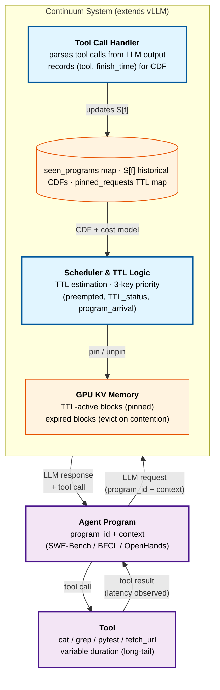

# Continuum: Efficient and Robust Multi-Turn LLM Agent Scheduling with KV Cache Time-to-Live

> [!info] Paper metadata
> - **Paper**: [arXiv:2511.02230](https://arxiv.org/abs/2511.02230) — *Continuum: Efficient and Robust Multi-Turn LLM Agent Scheduling with KV Cache Time-to-Live*, 2025-11-04 (v6: 2026-05-25)
> - **Code**: [Hanchenli/vllm-continuum](https://github.com/Hanchenli/vllm-continuum) — released by first author Hanchen Li (vLLM fork)
> - **Authors**: Hanchen Li\* (UC Berkeley), Runyuan He\* (UC Berkeley), Qiuyang Mang (UC Berkeley), Qizheng Zhang (Stanford), Huanzhi Mao (UC Berkeley), Xiaokun Chen (Tensormesh), Hangrui Zhou (Tsinghua), Alvin Cheung (UC Berkeley), Joseph Gonzalez (UC Berkeley), Ion Stoica (UC Berkeley)
> - **Affiliations**: UC Berkeley, Stanford, Tensormesh, Tsinghua University
> - **Implementation**: vLLM 0.10.2 fork, ~1k lines Python

> [!important] Where Continuum fits in the agent-serving stack
> Continuum is the **first KV-cache management system designed specifically for the agentic multi-turn pattern** — explicitly modeling the per-turn queueing delay that prior cache-retention work (InferCept, Pie, Autellix) ignored. It's load-bearing for any deployment that serves multi-turn coding agents (SWE-Bench-style), function-calling agents (BFCL-style), or computer-use agents (OpenHands-style). The page sits alongside [[agent-serving-challenges]] and [[multi-turn-optimization]] in the agent-serving category.

---

## Summary (read this if you have 2 minutes)

**What it is.** Continuum is a KV-cache retention + request-scheduling system layered on top of [[vllm|vLLM]] (~1k lines of Python) that specifically targets the multi-turn LLM agent workload. It introduces a **time-to-live (TTL) mechanism** that selectively pins a request's KV cache in GPU memory during tool execution windows, with TTL values computed from a cost-benefit model that accounts for both the *reload cost* (prefill / CPU-offload restore) and the *per-turn queueing delay* (returning request waiting behind freshly admitted ones).

**The one idea.** **TTL-aware KV cache pinning + program-level FCFS scheduling.** Three sub-pieces make it work:

1. **TTL utility model** — formal cost-benefit framing where pinning a request's KV for duration τ costs `MemUsage(r)/M × τ` worth of blocked queue time, and the benefit is the sum of `CacheMissCost` (re-prefill or CPU reload) plus `OutOfOrderCost` (queueing delay if evicted). The optimal TTL is `τ* = argmax P(τ, f) · Benefit(r) − Cost(τ, r)`, where `P(τ, f)` is the empirical CDF of historical tool-call durations for tool `f`.
2. **Program-level FCFS** — *programs* (= one agent's lifetime, not one LLM request) are the FCFS unit. Requests within a program preserve the program's arrival order, so an agent that started earlier finishes earlier even when its turns are scattered in time.
3. **Robust eviction on TTL expiry** — if a tool call takes longer than predicted, the pinned KV automatically expires and gets evicted, preventing pathological cases where one long-tailed tool call (e.g., `pytest` timing out at 20+ s) holds memory hostage.

Remove the TTL bound and one slow tool call can deadlock the GPU; remove the program-level FCFS and program ordering drifts arbitrarily; remove the cost-benefit model and you're back to InferCept-style "preserve only when reload cost is high," which ignores the queueing penalty.

**Headline result.** Trace-replay across **SWE-Bench, BFCL v4, OpenHands** on **Llama-3.1-8B, Llama-3.1-70B, Gemma-3-12B** spanning **A100 / H100 / B200** hardware:

| Metric | Baseline range | Continuum | Improvement |
| ------ | -------------- | --------- | ----------- |
| Average job delay | vLLM / Autellix / InferCept | **1.12×–3.66× lower** | up to 3.66× |
| Throughput | Same baselines | **1.10×–3.22× higher** | up to 3.22× |
| **Real SWE-agent (distributed, H100)** | SGLang, NVIDIA Dynamo | **Up to 8.18× lower delay** | the 8.18× headline number |
| OpenHands rollout (GLM-4.5-fp8 on 8×H100) | vLLM 93.4 steps/min, ThunderAgent 114.8 | **144.9 steps/min** | +27% vs ThunderAgent, +55% vs vLLM |

**Why it matters.**

- **Closes the per-turn queueing-delay gap.** Prior agent-aware caching (InferCept) optimized for reload cost only, leaving the *waiting for other requests to free GPU memory* cost as a silent killer that accumulates across turns. Continuum is the first to model and solve it.
- **Robust to tool-call variance.** Real tool calls are long-tailed (slowest 10% of `fetch_url` calls = 52.5% of total delay; slowest 10% of `cd` calls = 94.1%). Static "preserve forever" pins break under this; TTL with expiry doesn't.
- **Minimal integration cost.** ~1k lines of Python on top of vLLM 0.10.2, no custom CUDA kernels, ~1ms scheduler overhead. Production-deployable today.
- **2027 prediction.** The TTL-vs-LRU choice will become the canonical KV-cache eviction question in agent serving, and program-id will become a first-class field in `RequestMetadata` across vLLM / SGLang / Dynamo. The "agent program" abstraction is more durable than the specific TTL formula.

---

# Depth (drill-down starts here)

## Background: two failure modes prior systems leave unsolved

The paper's Figure 1 names the two failure modes:


**vLLM / SGLang default policy** is what Continuum calls *end-of-turn eviction* — and this is **not the same as pure LRU**, despite what the name might suggest.

> [!warning] "End-of-turn eviction" vs. pure LRU — a subtle but important distinction
> Pure LRU would rank cache blocks by *last access time* and evict the oldest. A request that just finished would actually be *near the top* of the LRU list (recently accessed), so it wouldn't be the first to be evicted.
>
> What vLLM/SGLang actually do is **release-on-completion**: as soon as a request finishes decoding, its KV blocks are immediately moved to a "free pool" (marked available for reuse), implicitly assuming the request is *complete and won't return*. When new requests arrive, they consume the free pool first — so the just-completed request's KV gets overwritten within milliseconds in a busy server.
>
> So the practical effect is **the opposite of LRU** for completed requests: completed KV is the *first* candidate for overwriting, not the *last*. The Continuum paper names this pattern "end-of-turn eviction" to make the distinction sharp. For chatbot serving this is correct — the next human turn arrives seconds-to-minutes later, by which time the KV would be gone anyway. For agents whose next turn arrives in ~1 second, it's catastrophically wrong.

**For agents, this is exactly wrong.** Per the paper's data (Table 2):

| Dataset | Turns / program | Tool time (ms) | Tokens / program |
| ------- | ---------------:| --------------:| ----------------:|
| **SWE-Bench** | 10.9 ± 2.1 | 925 ± 3550 | 70,126 ± 19,732 |
| **BFCL v4** | 6.3 ± 2.3 | 1923 ± 2133 | 93,256 ± 68,687 |

Mean tool latency is well under 2 seconds — far shorter than human typing — so the next LLM request arrives while the KV is still warm. Evicting it forces a full re-prefill of ~70K tokens at every turn. Across 10.9 turns, that's the order of 770K extra tokens of prefill per SWE-Bench job.

A concrete SWE-Agent example (paper Fig. 2) shows what one program looks like — alternating short LLM reasoning steps with `grep` / `cat` / `sed` / `pytest` tool calls, each of which the agent would benefit from sub-second KV retention across:


**InferCept (Abhyankar et al., 2024)** was the first to address this: pin the KV during a tool call if the estimated reload cost exceeds the GPU-occupancy cost. But it makes the preserve decision based **purely on reload cost**, ignoring per-turn queueing delay. With LMCache-style fast CPU offload, reload becomes cheap and InferCept stops pinning — but the returning request still has to wait in queue behind whatever was admitted while the KV was offloaded. **Per the paper's measurements (Fig. 4), InferCept's accumulated waiting time across turns is comparable to vanilla vLLM despite its reload savings**.

| Method | Retains KV cache | Includes per-turn queueing delay | Bounds retention time |
| ------ | :--------------: | :------------------------------: | :-------------------: |
| **vLLM** | ✗ | ✗ | ✗ |
| **Autellix** (Luo et al., 2025) | ✗ | ✗ | ✗ |
| **Pie** (SOSP 2025) | ✓ (programmable) | ✗ | ✗ |
| **InferCept** | ✓ | ✗ | ✗ |
| **Continuum** | **✓** | **✓** | **✓** |

The third column matters because of the **tool-call long tail** (paper Fig. 5): slowest 10% of `BFCL/fetch_url` calls account for 52.5% of total delay; slowest 10% of `SWE-Bench/cd` calls account for 94.1%. A static "preserve forever" policy works under stable latencies but **fails catastrophically when one outlier tool call blocks GPU memory for tens of seconds**. Continuum's TTL bound is what makes the pinning safe.


## Three components in detail

### Component 1 — The TTL utility model

For each request `r` and TTL value `τ`, Continuum estimates:

**Cost (in units of latency for other waiting requests):**
$$
\text{Cost}(\tau, r) = \frac{\text{MemUsage}(r)}{\mathcal{M}} \times \tau
$$

where `MemUsage(r)` is the KV cache size of request `r` (bytes) and $\mathcal{M}$ is the average GPU memory footprint of currently-active requests. The ratio $\text{MemUsage}(r) / \mathcal{M}$ approximates *how many average-sized requests get blocked* if `r` is pinned — so pinning `r` for τ seconds adds about τ seconds of waiting to that many other requests.

**Benefit** of pinning `r` until its next turn returns:
$$
\text{Benefit}(r) = \text{CacheMissCost}(r) + \text{OutOfOrderCost}(r)
$$

The two terms:

- **CacheMissCost** — what you'd pay re-loading or re-prefilling `r`'s KV when its program's next request arrives:
$$
\text{CacheMissCost}(r) = \frac{\text{MemUsage}(r) \times \text{Prefill-Reload}(r)}{\mathcal{M}}
$$
where `Prefill-Reload(r)` is the time to either re-prefill (no CPU offload) or transfer from CPU DRAM (with offload). This depends on hardware bandwidth + sequence length, profiled offline in ~10 minutes per hardware-model pair.

- **OutOfOrderCost** — the per-turn queueing delay that `r`'s program would incur if evicted and re-admitted later:
$$
\text{OutOfOrderCost}(r) = \frac{\mathcal{T}}{\mathcal{M}} \times \text{MemUsage}(r) \times \eta
$$
where $\mathcal{T}$ is the average waiting time per unit context size in the workload, and $\eta$ is the **memoryfulness factor**, defined as $\eta = -\text{Corr}(k, N - k)$, the negative correlation between the number of completed turns $k$ and the number of remaining turns $N - k$.

**The memoryfulness factor `η` is the load-bearing novelty here.** Intuition:

- If all programs issue **the same fixed number** of requests, then `Corr(k, N − k) = Corr(k, −k) = −1` → `η = 1` (fully memoryful: knowing how many turns have happened tells you exactly how many remain).
- If the workload is **fully memoryless** (geometric distribution of remaining requests), `η = 0` — pinning a request doesn't accelerate any particular program because there's no notion of "earlier programs finish sooner."
- In rare extreme long-tail cases, `η < 0` ("anti-memoryful") — observed progress is anti-correlated with finishing.

The intuition: `η` measures **how predictable program progress is**, which determines how much retaining program ordering buys you. High `η` means program-level FCFS is approximately Shortest-Job-First (programs further along finish soonest), which is provably optimal for minimizing average JCT. Low `η` means program ordering doesn't help and the TTL benefit collapses to pure reload-cost savings.

**The optimal TTL** (Eq. 2 in the paper):
$$
\tau^* = \arg\max_\tau \; \mathcal{P}(\tau, f) \times \big(\mathcal{T} \cdot \eta + \text{Prefill-Reload}(r)\big) - \tau
$$
where $\mathcal{P}(\tau, f)$ is the empirical CDF of historical tool-call durations for tool $f$, estimated from sliding-window historical records.

> [!tip] What the TTL formula means in plain language
> Imagine a tool call is about to start. We need to decide **how many seconds (τ) to pin this program's KV in GPU memory**.
>
> - **Pin too long** → block other requests, waste GPU memory
> - **Pin too short** → KV evicted, pay heavy reload when tool returns
>
> For each candidate τ:
>
> - **Benefit** = $\mathcal{P}(\tau, f)$ × (reload-cost + queueing-delay-saved)
>     - $\mathcal{P}(\tau, f)$ = probability the tool finishes within τ (from historical CDF)
>     - If it does finish in time, we save: `Prefill-Reload(r)` (the reload cost) + $\mathcal{T} \cdot \eta$ (the queueing delay we'd otherwise pay)
> - **Cost** = $\tau$ (each second of pinning blocks other requests)
>
> Pick the τ where Benefit − Cost is largest. The algorithm enumerates τ over historical tool-call durations $S[f]$ (including τ = 0 = no pin) and picks the winner.
>
> **Worked example**: tool `cat` historical durations all 50–200ms. Then:
> - τ = 100ms → $\mathcal{P}$ ≈ 0.5 (half finish in time), benefit moderate, cost small → net moderate
> - τ = 200ms → $\mathcal{P}$ ≈ 0.99 (99% finish), benefit high, cost 2× bigger but still small → **net winner**
> - τ = 1000ms → $\mathcal{P}$ = 1.0 but cost too high
>
> Optimal τ ≈ 200ms (high hit probability, acceptable cost).

**Cold-start handling**: when historical records for a specific tool $f$ are sparse ($|S[f]| \le K$, with $K = 100$ in their implementation), Continuum falls back to (1) a global tool-call CDF across all tools, or (2) an exponentially-distributed default with mean derived from the same cost model. The implementation initializes $\mathcal{T} = 0$ and bootstraps from production traffic.

### Component 2 — Program-level FCFS scheduling

Standard vLLM uses **request-level FCFS**: requests are served in arrival order. For multi-turn agents this is unstable — if an agent's turn N arrives during a burst of new-agent traffic, its turn N gets ordered *after* a flood of turn-1 requests for newly-arrived agents, even though the agent's program-arrival time was much earlier.

Continuum's scheduling priority is a **3-key tuple**, ranked in order:

1. **Preempted status** — preempted requests (those that had to release memory under contention) come first. Same as vLLM.
2. **TTL status** — requests currently within their pin TTL come before unpinned ones. This preserves the continuity benefit of the pin decision: if you've decided to pin a program's KV, you should schedule that program's next request as soon as it arrives, not let it sit behind unrelated traffic.
3. **Program-level arrival order** — within each TTL-status bucket, requests are ordered by their **program's** arrival time, not the individual request's. This approximates Shortest-Job-First (high-`η` workloads) and is FCFS-fair across programs.

The scheduling algorithm is straightforward (Algorithm 1 in the paper):

```python
def on_request_arrive(r):
    Q.add(r)                                # add to waiting queue
    if r.program_id not in seen_programs:
        seen_programs.add(r.program_id)
        for tool_call_f, finish_time in r.tool_call_info:
            S[f].append(finish_time)        # update historical tool-call records

def on_request_finish(r):
    if r.is_last_in_program:
        free_kv(r)
    else:
        f = next_tool_after(r)
        P[r.program_id] = calc_ttl(r, S[f])  # set pin TTL based on next tool's CDF

def schedule():
    while Q is not empty:
        unpin_expired(P)                    # expire any TTLs that have passed
        r = argmax(calc_priority(Q, P))     # (preempted, TTL_status, program_arrival)
        if r cannot fit:
            break                            # respect memory pressure
        Q.remove(r)
        run(r)
        if r.program_id in P.keys():
            P.pop(r.program_id)              # unpin after dispatch
```

### Component 3 — Deadlock prevention and robust eviction

Pinned requests can accumulate. If all GPU memory becomes pinned, the next request from any of those programs may be still in transit (tool call still running), and the scheduler can't admit any new request — **deadlock**.

Continuum's mitigation: when the scheduler fails to schedule a new request due to memory pressure, it scans `pinned_requests` for victims — selecting those with the **latest program arrival time** to unpin first (lose-the-most-recent-pin policy). This frees their KV, re-queues them, and lets contention resolve. It's a heuristic but proven sufficient in their evaluation.

> [!note]- The robustness vs. correctness trade-off
> The TTL-expiry mechanism (auto-evict after τ\*) plus the deadlock unpin policy together make Continuum *safe* under arbitrarily long or stuck tool calls. Pure static-preserve approaches (InferCept's pin-while-tool-runs, no timeout) fail catastrophically when a tool hangs. The cost: a tool that legitimately takes longer than predicted (the long-tail) will lose its pin and pay re-prefill on return. The paper argues this is the right trade because re-prefill is bounded while deadlock is not.

## System architecture (Continuum on top of vLLM)

Continuum's system overview (paper Figure 7):


My Mermaid reconstruction with extra detail:



**Three handler functions** added to vLLM's scheduler:

| Function | Trigger | Role |
| -------- | ------- | ---- |
| `func_call_finish(tool, timestamp)` | Request finishes + parsed to contain tool call | Records tool-call start time per program_id |
| `update_tool_call_time(program_id, timestamp)` | New request arrives | Records the duration the previous tool call took |
| `set_up_ttl(request, tool)` | Request finishes with tool call | Computes τ\* via the cost model and pins the KV |

**Offline profile** is one-time per hardware-model pair (≤10 minutes):

1. **GPU-CPU bandwidth** for CPU-offload latency model (when LMCache is active)
2. **Prefill cost vs. context-length curve**, fitted as a quadratic, for `Prefill-Reload(r)` estimation

### Scheduler overhead is negligible

| System | No CPU offload | CPU offload (LMCache) |
| ------ | -------------: | --------------------: |
| vLLM | 0.95 ms | 2.33 ms |
| Autellix | 0.82 ms | 2.18 ms |
| InferCept | N/A | 2.25 ms |
| **Continuum** | **0.96 ms** | **2.30 ms** |

Single-digit milliseconds vs. LLM inference time in the seconds — overhead-to-benefit ratio is excellent.

## Headline evidence

### Main trace-replay results (paper Figure 8)

Workloads: SWE-Bench, BFCL v4 Web Search. Models: Llama-3.1-8B (1×B200 or 1×A100), Llama-3.1-70B (4×B200), Gemma-3-12B (1×A100). Baselines: vLLM 0.10.2, Autellix (PLAS algorithm).

The shape of every plot is the same: Continuum's line stays flat-and-low while vLLM and Autellix degrade rapidly under increasing job-per-second arrival rate. At the breakdown point (high JPS), Continuum is **1.12×–3.66× lower delay** with **1.10×–3.22× higher throughput**. The biggest gaps are on Llama-70B / SWE-Bench (longest sequences, most cache to retain).


> [!success] The headline 8.18× number
> The 8.18× figure widely cited for Continuum comes from a **distributed-setting experiment** (paper §6.2, Figure 12): real SWE-agent on 500 SWE-Bench-Verified tasks, run on Tensormesh's H100 testbed with a Poisson-distributed job distributor, compared against **SGLang 0.5.5.post3 (native cache-aware routing)** and **NVIDIA Dynamo 0.7.0.post1 (1P1D PD-disaggregation)**. **Continuum reduces per-job delay by up to 8.18× while also achieving higher pass-rate** (because slower baselines hit SWE-Bench's wall-clock limit and fail tasks). This is the production-relevant number — it includes session-aware routing in baselines, not just naïve vLLM.

### CPU offload doesn't close the gap (paper Figure 10)

When LMCache CPU DRAM offloading is enabled, you'd expect InferCept's selective-preserve to catch up — reload becomes cheap, so the eviction penalty shrinks. But the per-turn queueing delay is **independent of offload speed**: even with instant reload, the returning request must wait in queue behind whatever GPU contention exists. Across the same 4 (model, hardware) configurations, Continuum still wins by ~1.5–2× over InferCept-with-offload. **This is the load-bearing experiment that justifies modeling queueing delay, not just reload cost.**

### Scales with turn count (paper Figure 14)

Simulated more-turn scenarios on SWE-Bench by repeating the trace (1× to 5×) while inversely scaling token lengths (so total token count fits the context window). Baselines (vLLM, Autellix, InferCept) **degrade linearly** as turns increase. Continuum's per-program delay stays roughly **stable** at ~1000 s across 1× (10.9 turns) to 5× (50.6 turns). This is what "agentic workload scaling" looks like in practice.


### OpenHands rollout for RL training (paper Table 5)

A side-experiment that's interesting in its own right: Continuum applied to **rollout generation for RL training** of an OpenHands agent on Multi-SWE-Bench with GLM-4.5-fp8 (8×H100). Compared to the concurrent [[thunderagent|ThunderAgent]] (program-aware agent serving):

| System | Throughput (steps / min) |
| ------ | -----------------------: |
| vLLM | 93.4 |
| ThunderAgent | 114.8 |
| **Continuum** | **144.9** |

+55% over vLLM, +27% over ThunderAgent — relevant to the [[prorl-agent]] / [[polar]] line of agent-RL infrastructure work.

> [!example]- Ablation: contribution of each Continuum component (paper Figure 16)
>
> Comparing four configurations:
>
> - **vLLM** — baseline
> - **+ Program FCFS** — only change is request-level FCFS → program-level FCFS, no TTL
> - **+ Static TTL** — Program FCFS + fixed-threshold TTL from cold-start handling (no per-tool CDF)
> - **+ Continuum (full)** — adaptive per-tool TTL with cost-benefit optimization
>
> Each step adds measurable JCT reduction; the full system delivers ~3× over vLLM on SWE-Bench at the breakdown point. No single component dominates — program-FCFS, static TTL, and dynamic per-tool TTL each contribute ~30% of the total gap.

> [!example]- Inference-engine configuration sensitivity (paper Figure 13)
>
> Continuum's improvement is robust to vLLM's `max_batch_size` (tested 16–256) and `chunk_size` (tested 256–4096) settings. The shape and magnitude of the win are essentially invariant — the gain is from cache management, not from any specific vLLM scheduler tuning.

## Strengths and limitations

**Strengths.**

- **First serving system to model per-turn queueing delay** as a first-class cost, not just reload cost. Closes the gap that InferCept-style systems leave open.
- **Mathematically principled** — the cost-benefit derivation gives a closed-form optimal TTL, not a heuristic threshold.
- **Robust under tool-call long tail** — TTL expiry + deadlock unpin policy prevent the catastrophic failure modes of static-preserve approaches.
- **Drop-in vLLM extension** — ~1k Python lines, no kernel changes, ~1ms overhead. Production-deployable.
- **Generalizes across hardware** (A100/H100/B200), **model sizes** (8B/12B/70B), and **agent types** (coding / function-calling / computer-use).

**Limitations.**

> [!warning] Continuum optimizes the sequential reason → tool → reason pattern
> Per the paper §7 (verbatim): *"The current design of Continuum are optimized for ReAct-style, tool-interleaving agents... Some emerging agent frameworks, however, could involve non-linear control flows: speculative branches, asynchronous multi-agent coordination, and context branching... their inference pattern may violate the sequential flow and requires future change."* Concretely: parallel tool calls work (still sequential rhythm at the program level), but speculative branching (one program issuing multiple competing tool calls and discarding losers) does not have a clean TTL semantics in the current design.

- **TTL estimation uses simple moving-average / empirical CDF**, no learned predictor. Sudden workload shifts (a new tool with no historical record + a `K = 100` threshold) fall back to defaults, which may be conservative. Future work direction: learned neural model of tool-call durations conditioned on program context.
- **Single-program memoryfulness `η`** — assumes one workload type per serving cluster. Mixed workloads (some programs long-tailed, some short) would benefit from per-program `η` estimation; not addressed.
- **No cross-program cache sharing** — different programs can't share KV cache even if their prefixes overlap (e.g., system prompts). Orthogonal to but separately addressable by [[multi-turn-optimization|prefix caching / RadixAttention]].
- **Distributed setting only briefly validated** — the 8.18× number comes from one workload (real SWE-agent / SWE-Bench-Verified / Tensormesh testbed). Generalization to multi-tenant cloud deployment with diverse agent populations isn't measured.
- **Code released** at [Hanchenli/vllm-continuum](https://github.com/Hanchenli/vllm-continuum) (first author Hanchen Li's GitHub) as a vLLM fork. Public reproduction is feasible.

> [!bug] Deadlock unpin policy is a heuristic
> When memory pressure prevents scheduling a new request and pinned KV needs eviction, Continuum unpins programs with the *latest* arrival time. This is the opposite of FCFS-fairness (newest programs lose first), which is sensible under shortest-job-first intuition but isn't a hard guarantee. Adversarial workloads where a long-running new program needs its early KV might suffer.

## What this means

Continuum changes the canonical question in agent-serving KV cache management from *"how aggressive should LRU be"* to *"what's the TTL for this program's next turn, given the tool's historical duration"*. This reframing — from instantaneous decisions to predictive ones with bounded retention — is the more durable contribution than any specific formula.

Three predictions for 2027:

1. **`program_id` becomes a first-class request field** in every major inference engine (vLLM, SGLang, TensorRT-LLM, Dynamo). Continuum's program-level FCFS is too obviously correct to *not* adopt; the harder question is who maintains the program_id ↔ session mapping (serving engine? gateway? client?).
2. **TTL replaces LRU in agent-oriented eviction**, but the TTL formula evolves. The Continuum paper's empirical-CDF estimator is the natural starting point; learned models conditioned on (program type, tool name, context size) will outperform it. The cost-benefit framework (cost = blocked-queue-time, benefit = reload-cost + queueing-delay) is the part that stays.
3. **The cache-retention vs. cross-program-sharing dichotomy** becomes the next research frontier. Continuum optimizes per-program retention; [[multi-turn-optimization|RadixAttention]] optimizes cross-program prefix sharing. A unified KV cache manager that does both — TTL-aware pinning per program + radix-based sharing across programs — is the obvious next system. The paper hints at this in future work.

Continuum does **not** solve:

- **Tool execution speed itself** — only the scheduling around it. Long tools still take a long time; Continuum just stops paying for them with re-prefill and queueing delay. Speedups from [[#Related reading|PASTE / Speculative Tool Calls / Conveyor]] are orthogonal and compose.
- **Non-sequential agent workflows** (branching, speculation) — explicitly out of scope.
- **Cross-tenant fairness** — single-tenant or single-workload assumption throughout.

## Source code & reproduction

**Released** at [Hanchenli/vllm-continuum](https://github.com/Hanchenli/vllm-continuum) — first author Hanchen Li's GitHub. The implementation is a vLLM 0.10.2 fork.

```bash
git clone https://github.com/Hanchenli/vllm-continuum
cd vllm-continuum
pip install -e .   # extends vLLM 0.10.2
```

**Workload traces** the paper promises to release:

- 100 mini-swe-agent traces on SWE-Bench (running GPT-5)
- 100 BFCL v4 Web Search traces
- Multi-SWE-Bench OpenHands traces (GLM-4.5-fp8)

**Reproduction protocol** (from §6.1):

| Component | Configuration |
| --------- | ------------- |
| vLLM version | 0.10.2 (chunk_size = 2048) |
| LMCache version | 0.3.7 (CPU offload) |
| Hardware tested | 1×A100-SXM (Runpod), 1×H100 (AWS), 1×B200 (on-prem), 4×B200 (multi-GPU) |
| Models tested | Llama-3.1-8B, Llama-3.1-70B, Gemma-3-12B, GLM-4.5-355B-fp8 |
| Baselines | Vanilla vLLM, LMCache CPU-offload vLLM, Autellix, Autellix+LMCache, InferCept, SGLang 0.5.5.post3, NVIDIA Dynamo 0.7.0.post1 |
| Offline profile | ~10 min per hardware-model pair (GPU-CPU bandwidth + prefill quadratic fit) |

**Estimated implementation files** (from §5.3):

| File / module | Role |
| ------------- | ---- |
| `continuum/scheduler.py` | Extends vLLM `Scheduler` with TTL pinning + 3-key priority |
| `continuum/tool_handler.py` | Parses tool calls from LLM output, records timestamps |
| `continuum/ttl_model.py` | Cost-benefit utility model + cold-start fallback |
| `continuum/profile.py` | Offline GPU-CPU bandwidth + prefill curve profiling |
| `continuum/program_tracker.py` | Maintains `program_id → state` map (S[f] CDFs, pinned_requests) |

## Related reading

- [[agent-serving-challenges]] — Broader survey of why agent serving differs from chatbot serving; Continuum is the most relevant single system named there.
- [[multi-turn-optimization]] — Cross-turn KV reuse landscape; Continuum is the agent-specific deepening of the multi-turn problem, complementary to [[sglang|SGLang]] RadixAttention (cross-program prefix sharing) and LMCache (CPU/disk offload).
- [[prefill-decode-disaggregation]] — Disaggregated serving; Continuum's 8.18× distributed result is compared against NVIDIA Dynamo's 1P1D PD-disagg.
- [[vllm]] — The base engine Continuum extends; Continuum lives as ~1k-line plugin on top of vLLM 0.10.2.
- [[sglang]] — Native cache-aware routing baseline in the distributed experiments.
- [[paged-attention]] — Underlying KV cache primitive both Continuum and its baselines use.
- [[prorl-agent]] — Continuum's OpenHands rollout result (+27% over ThunderAgent) is directly relevant to the agentic-RL rollout-driver layer ProRL Agent / Polar occupy.
- [[polar]] — Same agentic-RL family; Polar's prefix_merging is a complementary optimization on the *training-side* trajectory representation, while Continuum operates on the *serving-side* memory retention.
- [[search-r1]] — Search agents that Continuum's TTL would benefit (search tool calls are the BFCL workload).
- [[continuous-batching]] — The scheduling primitive (request-level FCFS) Continuum extends to program-level.
- [[kv-cache-optimization]] — Where Continuum's TTL-based eviction would sit in the broader KV management taxonomy (alongside H2O / SnapKV / StreamingLLM).

## References

- Hanchen Li, Runyuan He, Qiuyang Mang, Qizheng Zhang, Huanzhi Mao, Xiaokun Chen, Hangrui Zhou, Alvin Cheung, Joseph Gonzalez, Ion Stoica. *Continuum: Efficient and Robust Multi-Turn LLM Agent Scheduling with KV Cache Time-to-Live.* arXiv:2511.02230, November 2025 (v6 May 2026). https://arxiv.org/abs/2511.02230
- InferCept (Abhyankar et al., 2024) — the immediate prior work; preserve-only-when-reload-cost-high baseline.
- Autellix (Luo et al., 2025, [arXiv:2502.13965](https://arxiv.org/abs/2502.13965)) — PLAS (Program-Level Attained Service) baseline; prioritizes by cumulative service time.
- Pie (SOSP 2025) — programmable agent serving; cited as related but requires user-written scheduling logic.
- LMCache — CPU DRAM offload integration; Continuum's CPU-offload experiments use LMCache 0.3.7.
- [[thunderagent|ThunderAgent]] — concurrent program-aware agent serving system; cited as baseline in the OpenHands rollout experiment (+27% Continuum over TA). **ThunderAgent's own follow-up paper later beat Continuum on all 6 of its benchmarks** under stochastic tool workloads — see [[thunderagent]] for the direct comparison.
- mini-swe-agent (ranked #5 on SWE-Bench leaderboard as of April 2026) — the SWE-Bench agent used in the workload trace.
- BFCL v4 Web Search — Berkeley Function Calling Leaderboard, used as the function-calling workload.
- OpenHands (Multi-SWE-Bench, Go language example) — the OpenHands variant used in the third workload.
