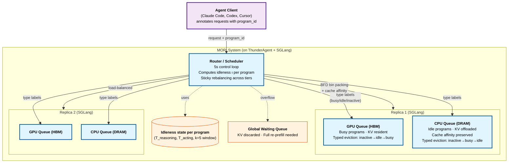

# MORI: Idleness is Relative — Exploiting Tool-Call Idle Windows for Offloading in Agentic Systems

> [!info] Paper metadata
> - **Paper**: [arXiv:2606.00866v1](https://arxiv.org/abs/2606.00866) — *Idleness is Relative: Exploiting Tool-Call Idle Windows for Offloading in Agentic Systems with MORI*, 2026-05-30
> - **Code**: Not released as of June 2026
> - **Authors**: Tian Xia¹, Hanchen Li¹, Zhifei Li², Xiaokun Chen³, Hao Kang⁴, Yifan Qiao¹, Yi Xu¹, Ion Stoica¹
> - **Affiliations**: ¹UC Berkeley, ²Renmin University of China, ³Stanford University, ⁴Georgia Institute of Technology
> - **Implementation**: ~3,300 lines Python on ThunderAgent + 500 lines on SGLang v0.5.10 HiCache

> [!important] Direct successor to [[continuum|Continuum]]
> Same first author (Hanchen Li, UC Berkeley) and same problem domain (program-aware agent serving). Where **Continuum** was single-tier (GPU HBM only) with TTL-based pinning, **MORI** is **two-tier (GPU + CPU DRAM)** with a continuous *idleness* metric that ranks all programs and dynamically partitions them across memory tiers. The progression is: Continuum decides "pin or not", MORI decides "which tier" along a relative-idleness spectrum. **MORI is what agent serving systems should converge to** for the next 12 months — read this as the new state of the art over Continuum.

---

## Summary (read this if you have 2 minutes)

**What it is.** MORI (**M**emory **O**ffloader with **R**elative **I**dleness) is a program-aware agent serving scheduler that places each program's KV cache across **two memory tiers — GPU HBM (fast, small) and CPU DRAM (slow, large)** — based on the program's current *idleness ratio*. Programs that are actively reasoning stay on GPU; programs blocked on long-running tool calls (subagent spawns, `pytest` runs, human input) get offloaded to CPU DRAM. A continuous idleness score ranks programs and the scheduler dynamically shifts the partition boundary to match hardware capacity. Evaluated on real Claude Code SWE-bench Pro traces, MORI delivers **20–71% higher throughput, 18–43% lower TTFT, and up to 2.8× TTFT reduction** over the best baseline.

**The one idea.** **Idleness is a continuous spectrum, not a binary label.** Three sub-pieces:

1. **Two-phase agent program structure** — programs alternate between *busy* phases (short tool calls of hundreds of ms, e.g., `cat`, `grep`, `Edit`) and *idle* phases (long tool calls of tens of seconds to minutes, e.g., test suites, compilations, human input, subagent spawns). Tool-call duration variance is **three orders of magnitude** (P50=1.1s, P99=20s, P99.95=83s per Claude Code traces).
2. **Idleness metric**: $\iota = T_{acting}^{(k)} / (T_{reasoning}^{(k)} + T_{acting}^{(k)})$ over a sliding window of $k=5$ recent inference/tool-call cycles. Close to 1 = idle phase (most time in tool calls); close to 0 = busy phase (most time reasoning). **Windowed average is both responsive to phase changes AND robust to outliers** — a single slow shell command doesn't trigger a misclassification.
3. **Sticky rebalancing across three tiers** — GPU queue (HBM-resident), CPU queue (DRAM-offloaded), Waiting queue (KV evicted entirely, must recompute). Programs stay in current tier until **idleness mismatch + capacity boundary crossed**; transitions only when forced. Avoids the per-tick reshuffling churn that would dominate the transfer cost.

Drop the continuous idleness and you're back to InferCept/Continuum-style binary classifications that fail when busy:idle program ratio doesn't match GPU:CPU capacity ratio; drop sticky rebalancing and you pay the offload-reload cost on every tick; drop the typed eviction (busy evicted last on GPU, idle evicted last on CPU) and the engine's LRU undoes the scheduler's decisions.

**Headline results** (Claude Code traces from SWE-bench Pro, real coding agents at 80 concurrent programs):

| Hardware | Model | Best baseline (TA+O) | **MORI** | Improvement |
| -------- | ----- | -------------------: | -------: | ----------: |
| H200 80GB | Qwen-2.5 7B | 667 tokens/s | **853 tokens/s** | **+28%** |
| B200 | Llama-3.1 70B | 124 tokens/s | **213 tokens/s** | **+71%** |
| H200 | Qwen-3 30B-A3B (MoE) | (similar trend) | **+significant** | — |
| H200 DP=3 (multi-replica) | various | baseline | **54-79% higher** | — |
| TTFT reduction (avg) | — | — | **18-43% lower** | — |
| TTFT reduction (peak) | — | — | **up to 2.8× lower** | — |
| GPU utilization at 80 concurrent | phase-oblivious 59-76% | **99%+** | — |

**Why it matters.**

- **First two-tier program-aware offloading scheduler** that explicitly handles dynamic agent workloads (Claude Code, Codex, Cursor) — prior work (Parrot, Teola, Ayo) assumed fixed workflows.
- **Solves the binary-classification fragility** that limits Continuum-class systems. A continuous idleness metric adapts to *any* GPU-to-CPU capacity ratio without per-hardware tuning, while Continuum-style "preserve threshold" requires retuning per deployment.
- **First quantitative answer to the GPU:CPU capacity ratio question** — H100 DGX = 1:1.6 ratio, same node with 2TB DRAM = 1:3.1. MORI shows binary policies break on this spectrum; the continuous one works on all.
- **2027 prediction.** Two-tier idleness-ranked KV offloading becomes the canonical agent serving memory architecture. Continuum's TTL pinning becomes a *component* (the pin-while-busy step) inside MORI-style systems. Expect vLLM/SGLang to ship `--enable-idleness-offloading` flags within 12 months. Continuum's first author publishing MORI is itself signal: this is the direction the UC Berkeley agent serving group is consolidating on.

---

# Depth (drill-down starts here)

## Background: where Continuum hit its ceiling

[[continuum|Continuum]] (same first author, Nov 2025) introduced **TTL-based KV pinning** — pin a program's KV in GPU HBM for a tool-call-duration-derived TTL, evict when TTL expires. It did this within a single tier (GPU HBM only). When GPU memory fills up, Continuum drops KV entirely (forcing re-prefill).

The MORI paper identifies three failure modes in this design (Section 3):

**(1) Tool-call duration variance is enormous** (Figure 3, n=16,886 from Claude Code traces):

| Percentile | Tool-call duration |
| ---------: | -----------------: |
| P50 | 1,096 ms |
| P90 | 2,034 ms |
| P99 | 19,980 ms |
| **P99.95** | **83,626 ms** |

**Three orders of magnitude span**. A TTL that's right for P50 (1s) is wildly wrong for P99 (20s) — the pinned KV occupies GPU memory for tens of seconds while the program waits on a `pytest` run. A TTL that handles P99 wastes memory on most calls.

**(2) Binary busy/idle classification breaks** when the busy:idle program ratio doesn't match GPU:CPU capacity ratio. Example:
- 80 concurrent programs: 50 busy, 30 idle (62.5%:37.5% ratio)
- H100 DGX node: 1:1.6 GPU:CPU capacity ratio (38%:62%)
- The 30 idle programs fit in CPU... but so could some busy ones, leaving GPU underutilized
- Or vice versa: 70 busy, 10 idle → GPU oversubscribed

A fixed phase boundary can't track the dynamic ratio.

**(3) Two memory tiers are both finite** — CPU DRAM is large but bounded too. Naive "offload everything idle" causes CPU contention and reload thrashing when programs come back.

## Three components in detail

### Component 1 — Idleness metric (Section 4.2)

The continuous spectrum that drives all placement decisions. For each program, maintain:
- Current status: Reasoning (executing on GPU) or Acting (waiting on tool call)
- Estimated KV cache size (tokens)
- Durations of recent Reasoning and Acting intervals over a window of $k$ steps

**Idleness ratio** (Equation 1):
$$\iota = \frac{T^{(k)}_{acting}}{T^{(k)}_{reasoning} + T^{(k)}_{acting}}$$

with $k = 5$ in all experiments.

> [!quote] Why windowed average, not instantaneous
> "Since programs are non-stationary and switch between phases, a recent-windowed signal provides a better estimate of the current phase than a global average over the program's entire history. ... It is *responsive*: when a busy-phase program enters an idle phase, the ongoing tool call's elapsed time keeps increasing and soon dominates the other terms in the window, causing the idleness score to rise quickly. ... It is *robust against outliers*: if a busy-phase program encounters a single unexpectedly long tool call, the window of recent short tool calls dilutes this outlier."

Critically, any time a program spends waiting on the scheduler (queued in CPU or Waiting tier) is **excluded** from both $T_{reasoning}$ and $T_{acting}$ — the metric reflects only the program's intrinsic behavior, not scheduler-imposed delays.

### Component 2 — Three-tier queue architecture (Section 4.1)

Each inference engine replica maintains:

| Tier | Capacity | Behavior |
| ---- | -------- | -------- |
| **GPU queue (HBM)** | Bounded by GPU memory | Holds programs classified busy. KV in HBM, requests forwarded directly to engine. |
| **CPU queue (DRAM)** | Bounded by CPU memory | Holds programs classified idle. KV offloaded to CPU DRAM, must be reloaded to HBM before inference proceeds. Provides **cache affinity** — offloaded KV stays on the replica that computed it, enabling fast PCIe reload. |
| **Waiting queue** | Global (shared across replicas) | KV discarded entirely. Promotion requires full re-prefill. |

When the number of concurrent programs exceeds combined GPU+CPU capacity, excess flows into the Waiting queue.

### Component 3 — Sticky rebalancing scheduling policy (Section 4.3)

The scheduler runs a **periodic control loop** (default 5s tick) that adjusts placement:

**Demotion from GPU** (capacity overflow):
- Rank programs by idleness $\iota$ (high = most idle)
- Demote highest-idleness first
- Among same-idleness programs: prefer **Acting status** (currently in tool call) over **Reasoning status** (currently doing inference) — Reasoning programs are doing useful work, don't interrupt
- **Lazy demotion** if only Reasoning programs remain: victim finishes its current inference step before being moved
- Demoted programs go to CPU queue if CPU capacity allows, otherwise Waiting queue

**Promotion to GPU** (capacity available):
- Priority order:
  1. CPU-queue programs whose tool call has completed and is waiting for inference
  2. Waiting-queue programs (with returning programs preferred over new arrivals, smallest context first)
- Within priority: pick program with **lowest idleness** $\iota$ first — most likely to make use of GPU residency
- Multi-replica: Best-Fit-Decreasing bin packing across replicas, preserving cache affinity

**Sticky property**: a program stays in its current tier until idleness mismatch *and* capacity boundary crossed. This avoids the eager-reshuffle thrashing that would dominate transfer cost (PCIe ~PCIe Gen5 ~32 GB/s per direction; transferring 5GB KV takes ~150ms).

### Component 4 — Typed offloading on the inference engine (Section 4.3.2)

The scheduler decides *which* programs belong on GPU vs CPU, but the engine still does its own block-level eviction when memory pressure arises within a tier. MORI propagates a **type label** (busy / idle / inactive) to the engine's KV blocks. The engine's eviction uses the type as a higher-priority sort key, with LRU as tiebreaker:

| Tier | Eviction priority (evict first → last) |
| ---- | --------------------------------------- |
| **GPU HBM** | inactive → idle → **busy (evicted last)** |
| **CPU DRAM** | inactive → busy → **idle (evicted last)** |

The priority is **reversed between tiers** so that programs assigned to each tier are preferentially retained there. A busy program assigned to GPU sees its blocks protected on GPU; if accidentally on CPU (transition state), the CPU evicts it first to bring it back.

> [!note]- The type label is the bridge between scheduler and engine
> Without typed offloading, the engine's LRU would undo scheduler decisions — it might evict a busy program's GPU blocks just because they hadn't been accessed in the last few ms (due to a tool call in progress). The type label is what makes scheduler-driven placement actually persist through the engine's local decisions.

## System architecture



## Headline evidence

### Setup (Section 6.1)

| Component | Configuration |
| --------- | ------------- |
| Inference engine | SGLang v0.5.10 with HiCache CPU offload |
| Hardware (3 GPU tiers) | H200 (80GB capped), H200 (full 141GB), B200 |
| Models (3 sizes) | Qwen-2.5 7B, Qwen-3 30B-A3B (MoE), Llama-3.1 70B |
| TP × DP configs | (1,1), (2,1), (1,3) |
| CPU:GPU memory ratio | 1× (tight) and 2× (relaxed) |
| Workload | Claude Code on SWE-bench Pro test split (claude-sonnet-4-6, high effort) |
| Traces collected | 186 complete (of 200 attempted; 14 failed) |
| Concurrency tested | 20, 50, 80 programs per DP replica |
| Experiment duration | 1 hour each |

**Baselines**:
- **SGLang Model Gateway (SMG)**: prefix-aware request scheduler, no offloading
- **ThunderAgent (TA)**: program-aware, no CPU offloading
- **ThunderAgent + Offloading (TA+O)**: program-aware + HiCache CPU offload, but **eviction is context-length based, not phase-aware** (this is the strongest comparable baseline)

### Single-replica throughput (Figure 7-9, Section 6.2.1)

At low concurrency (20 programs), MORI and TA+O are similar (KV cache fits comfortably in CPU; phase awareness gives marginal advantage). The gap widens dramatically at high concurrency.

**H200 80GB, Qwen-2.5 7B, 80 concurrent programs**:
- SMG: plateaus at 447 tokens/s
- TA: peaks at 557 tokens/s
- **TA+O: 667 tokens/s** (best non-MORI baseline)
- **MORI: 853 tokens/s** (+28% over TA+O, +91% over SMG)

**B200, Llama-3.1 70B, 80 concurrent programs** (most memory-constrained):
- SMG: stalls at 96 tokens/s (half of MORI's)
- **TA+O: 124 tokens/s**
- **MORI: 213 tokens/s** (+71%, the largest gap)

**Why the gap widens with model size**: larger models = larger per-program KV footprint = eviction policy becomes critical when aggregate KV exceeds combined GPU+CPU capacity. Phase-aware placement gives MORI a fundamental edge over phase-oblivious TA+O.

> [!success] The 71% improvement on B200/70B is the load-bearing number
> This is the regime real production agentic serving will hit — flagship-size models (70B+) with high concurrency stressing memory. Continuum-class single-tier policies cannot help here because GPU HBM alone is too small; phase-oblivious CPU offload thrashes because it can't tell which programs are about to resume. MORI's 71% gain at exactly this regime is the strongest argument for its design.

### TTFT reduction (Section 6.2)

- **Average TTFT 18-43% lower** than best baseline with offloading
- **Peak TTFT reduction up to 2.8×** vs non-offloading systems

### Multi-replica DP=3 deployment (Section 6.2.2, inferred from headline)

- **54-79% higher throughput** than offloading baseline
- **99%+ GPU utilization** at 80 concurrent programs
- Compared to 59-76% utilization for phase-oblivious schedulers

The multi-replica gain comes from MORI's load balancer that respects cache affinity (offloaded KV stays with computing replica) while still routing for capacity.

> [!example]- Why phase-oblivious schedulers collapse at high concurrency
>
> The paper's TA+O baseline does program-aware *eviction order* but uses **context-length-based** eviction (longer contexts evicted first). At 80 concurrent programs:
> - Many programs in busy phase with mid-length contexts get evicted to make room for newcomers
> - When those busy programs come back from a short tool call, their KV is gone, requiring full re-prefill
> - Re-prefill is the most expensive operation (GPU-bound, blocks other work)
> - Eviction cascade → re-prefill cascade → GPU utilization tanks
>
> MORI's typed eviction protects busy programs on GPU and idle programs on CPU, breaking the cascade.

## Strengths and limitations

**Strengths.**

- **First continuous-spectrum idleness metric** for agent serving; works on any GPU:CPU capacity ratio without per-deployment tuning.
- **Three-tier queue architecture** generalizes beyond two-tier — could trivially extend to NVMe SSD as third tier.
- **Sticky placement** is the right engineering call — avoids per-tick reshuffling cost that would dominate PCIe bandwidth.
- **Typed offloading is a clean primitive** — scheduler decides "what tier", engine decides "which blocks within tier"; the type label bridges them without coupling the two layers.
- **Real-world workload** — replays actual Claude Code SWE-bench Pro traces, not synthetic Poisson arrivals.
- **Tests across genuine hardware diversity** (H200 80GB / H200 / B200 + 7B / 30B MoE / 70B).
- **Direct quantitative comparison to ThunderAgent + offloading** — the strongest existing baseline.
- **Multi-replica evaluation** — most agent serving papers test single-replica only; MORI shows the 54-79% multi-replica gain.

**Limitations.**

> [!warning] The Continuum trajectory continues — limitations look similar
> Both papers come from the same group. Like Continuum: no code release; limited to sequential ReAct-style flows (parallel tool calls, speculative branching not in scope); only coding-agent workload tested (Claude Code + SWE-bench Pro), no GAIA/web/multimodal; LRU + typed eviction is heuristic — no learned policy; single inference engine (SGLang); single client/orchestrator (ThunderAgent).

- **No comparison vs Continuum**, despite Continuum being the obvious comparable system from the same group. This is the most glaring gap. The paper implicitly positions MORI as Continuum's successor but doesn't ablate "MORI without CPU offload vs Continuum".
- **Idleness ratio assumes synchronous reasoning↔acting alternation**. For parallel tool calls (which agents do) the formula needs extension; paper doesn't address.
- **Memory model assumes per-node CPU DRAM** — distributed CPU memory (e.g., shared across nodes) not addressed.
- **k=5 window size empirically chosen** — no sensitivity analysis or theoretical justification.
- **No analysis of cold-start ramp** — when first 80 programs arrive, idleness ratios are undefined; paper doesn't describe bootstrap behavior.
- **Tested at 80 concurrent programs max** — production deployments may serve hundreds or thousands. Scaling behavior beyond 80 is unmeasured.
- **No discussion of fairness** — high-priority programs that should preempt lower-priority ones; MORI is greedy throughput optimizer.

> [!bug] The "type label propagation" is fragile under engine restart
> If the SGLang engine restarts (which happens in production for OOM or weight updates), the scheduler's type labels on KV blocks are lost. The paper doesn't describe how recovery works — presumably all programs re-rank from scratch. For long-running deployments this could be a hidden cliff.

## What this means

MORI is the direct successor to Continuum and the new state of the art for agent serving memory management. The architectural progression is clean:

| Generation | Paper | Tier count | Decision granularity | Eviction policy |
| ---------- | ----- | ---------: | -------------------- | --------------- |
| 1 | vLLM, SGLang baselines | 1 (GPU only) | Per-request | LRU |
| 2 | [[continuum|Continuum]] | 1 (GPU only) | Per-program with TTL | TTL expiry |
| **3** | **MORI** | **2 (GPU + CPU)** | **Per-program with continuous idleness** | **Typed (busy/idle/inactive) + LRU tiebreaker** |
| 4 (future) | — | 3+ (GPU + CPU + SSD/NVMe) | Same + cross-cluster | Same + WAN-aware |

Three predictions for 2027:

1. **Two-tier idleness-ranked offloading becomes the canonical agent serving memory architecture**. Expect vLLM/SGLang to ship `--enable-idleness-offloading` flags within 12 months. ThunderAgent's role as the orchestration layer for MORI legitimizes it as the front-end of choice.
2. **Three-tier extension (NVMe SSD as third tier) is the next paper**. Tool-call durations span 3 orders of magnitude; MORI handles ~100s (CPU DRAM is fine), but for 10+ minute subagent spawns SSD makes sense. The framework extends trivially — same idleness ranking, third tier with appropriate eviction.
3. **MORI + SpecCache compose well**. [[speccache|SpecCache]] addresses *web environment* observation caching (extra-LLM); MORI addresses *intra-LLM KV* placement. A system combining MORI's tiered KV with SpecCache's action-observation prefetch should be the canonical agent serving cache by 2027.

MORI does **not** solve:

- **The fundamental KV cache size problem at flagship scale** — 70B-class models at 80+ concurrent agents still exceed any single-node memory hierarchy. Distributed KV (across nodes, à la PrfaaS) is the next dimension.
- **Speculative tool execution** — orthogonal to MORI; [[speculative-actions|Speculative Actions]] / [[speceyes|SpecEyes]] / [[speccache|SpecCache]] composable.
- **Non-ReAct agent flows** — parallel tool calls, speculative branching, multi-agent coordination. Same scope limitation as Continuum.

## Source code & reproduction

```bash
# Not released as of June 2026.
# Implementation built atop:
git clone https://github.com/sgl-project/sglang   # v0.5.10
# Plus ThunderAgent router (cited as [24]; likely from same group)
# HiCache (cited as [59]) for CPU offload backend
```

**Reproduction protocol** (Section 6.1):

| Component | Configuration |
| --------- | ------------- |
| Inference engine | SGLang v0.5.10 |
| Offload backend | HiCache (SGLang's CPU offloading) |
| Router/scheduler | ThunderAgent + 3,300 lines of MORI scheduler additions |
| Scheduler tick | 5 seconds (default) |
| Idleness window | k = 5 inference/tool-call cycles |
| Hardware | H200 (80GB capped to emulate H100), H200, B200 |
| Models | Qwen-2.5 7B (DP=1, TP=1), Qwen-3 30B-A3B MoE (DP=1, TP=1), Qwen-3 30B-A3B MoE (DP=3, TP=1), Llama-3.1 70B (DP=1, TP=2) |
| Workload | Claude Code on SWE-bench Pro test split, claude-sonnet-4-6 (high effort) |
| Trace collection | 200 tasks → 186 complete (14 failures from rate-limit/timeouts) |
| Concurrency levels | 20, 50, 80 programs per DP replica |
| Memory ratios tested | 1× (CPU:GPU=tight) and 2× (relaxed) |

**Estimated implementation files** (from §5):

| Module | Role | Lines |
| ------ | ---- | ----: |
| `mori/scheduler.py` | Async 5s control loop, sticky rebalancing | ~1000 |
| `mori/idleness.py` | Windowed idleness metric computation | ~300 |
| `mori/tier_manager.py` | GPU/CPU/Waiting queue management | ~800 |
| `mori/admission.py` | Demotion/promotion logic | ~600 |
| `mori/load_balancer.py` | BFD bin-packing across replicas with cache affinity | ~600 |
| `sglang/hicache/typed_eviction.py` | Type-label-aware eviction (busy/idle/inactive) | ~500 |
| Total | | ~3,800 |

## Related reading

- [[continuum]] — **Direct predecessor by the same first author**. Continuum: single-tier (GPU only) with TTL pinning. MORI: two-tier (GPU + CPU) with continuous idleness ranking. Read Continuum first for the program-aware framing, then MORI for the multi-tier generalization.
- [[speccache]] — SpecCache: orthogonal cache mechanism (action-observation environment cache); composes with MORI (which addresses LLM KV cache).
- [[speculative-actions]] / [[speceyes]] — Speculative tool execution; orthogonal to MORI's offloading.
- [[agentic-ai-workload-characteristics]] — Workload Characteristics paper that empirically motivates why agent serving needs program awareness (84.6-99.5% cache hit ratios = KV reuse is load-bearing).
- [[cpu-centric-agentic-ai]] — CPU-Centric Perspective: CPU-side compute scheduling. Different layer (compute vs memory); composes with MORI.
- [[prfaas]] — Cross-DC PD disaggregation; the *distributed-memory* generalization MORI's NVMe-tier extension would meet.
- [[multi-turn-optimization]] — Cross-turn KV reuse landscape; MORI is the multi-tier extension of that landscape.
- [[paged-attention]] — Underlying KV cache primitive; MORI's typed eviction extends PagedAttention's block-level eviction.
- [[continuous-batching]] — Underlying batching that MORI's typed scheduling order plugs into.
- [[vllm]], [[sglang]] — Inference engines; MORI specifically built on SGLang v0.5.10's HiCache.

## References

- Tian Xia, Hanchen Li, Zhifei Li, Xiaokun Chen, Hao Kang, Yifan Qiao, Yi Xu, Ion Stoica. *Idleness is Relative: Exploiting Tool-Call Idle Windows for Offloading in Agentic Systems with MORI.* arXiv:2606.00866, May 2026. https://arxiv.org/abs/2606.00866
- ThunderAgent [24]: program-aware scheduler MORI builds atop.
- SGLang v0.5.10 [68]: inference engine.
- HiCache [59]: CPU offload backend.
- Continuum [7]: direct predecessor system (same first author).
- Parrot [30], Teola [51], Ayo [52]: prior fixed-workflow scheduling work.
- KVFlow [38], Helium [54]: prior workflow-structure-aware caching.
- Intercept [1], Pie [13]: prior pin-during-tool-call work.
- SAGA [16]: workflow-atomic scheduling.
- PASTE [48]: speculative tool execution.
- Claude Code [5]: the agent framework used in the evaluation workload.
- SWE-bench Pro [10]: evaluation benchmark.
