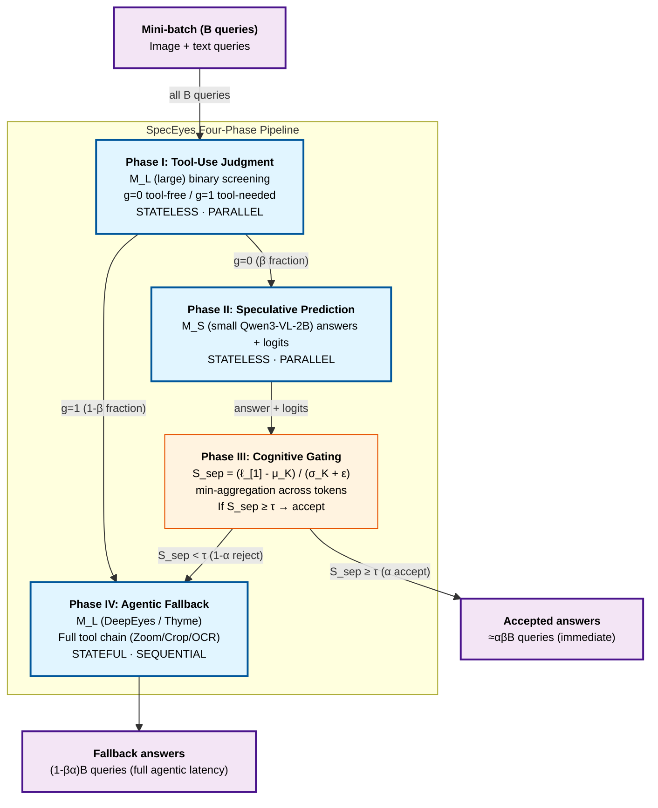

# SpecEyes: Accelerating Agentic Multimodal LLMs via Speculative Perception and Planning

> [!info] Paper metadata
> - **Paper**: [arXiv:2603.23483v1](https://arxiv.org/abs/2603.23483) — *SpecEyes: Accelerating Agentic Multimodal LLMs via Speculative Perception and Planning*, 2026-03-24
> - **Code**: [MAC-AutoML/SpecEyes](https://github.com/MAC-AutoML/SpecEyes) — released
> - **Authors**: Haoyu Huang\* (Xiamen U), Jinfa Huang\* (Rochester), Zhongwei Wan (OSU), Xiawu Zheng (Xiamen U), Rongrong Ji (Xiamen U), Jiebo Luo (Rochester) — \*equal contribution
> - **Contact**: jhuang90@ur.rochester.edu, huanghaoyu@stu.xmu.edu.cn
> - **Implementation**: Single 1× NVIDIA A100 40GB, greedy decoding

> [!important] The multimodal-LLM analog of [[speculative-actions|Speculative Actions]]
> Where [[speculative-actions|Speculative Actions]] (Columbia, Oct 2025) lifts speculation from token-level to API-call-level for general text agents, SpecEyes (Xiamen U + Rochester + OSU, March 2026) lifts it specifically for **agentic multimodal LLMs** that invoke vision tools (Zoom-in, Crop, OCR) in a tool-use chain. The key novelty: a *non-agentic* small MLLM acts as the speculator and answers tool-free queries directly, bypassing the entire tool chain. Gated by an information-theoretic **answer separability score** that measures decision-margin among top-K logits, not raw softmax probability.

---

## Summary (read this if you have 2 minutes)

**What it is.** An inference-time acceleration framework for **agentic multimodal LLMs** (OpenAI o3, Gemini Agentic Vision, DeepEyes, Thyme) — models that iteratively invoke vision tools (Zoom-in, Crop, OCR) to refine visual understanding. SpecEyes routes each input query through a four-phase pipeline: (1) the large agentic model decides if tools are needed, (2) a small *non-agentic* MLLM (Qwen3-VL-2B) speculatively answers tool-free queries, (3) an information-theoretic cognitive gate decides whether to trust the small model's answer, (4) only low-confidence queries fall back to the full tool-using agentic pipeline. Result: **1.42–1.73× average speedup** on three multimodal benchmarks (V*, HR-Bench, POPE) while **improving accuracy by up to +6.7%**.

**The one idea.** **Lift speculation from tokens to the agentic loop, gated by answer separability.** Three sub-pieces:

1. **Four-phase pipeline** — Phase I (large MLLM screens "tool-free vs tool-required"), Phase II (small MLLM speculatively answers tool-free queries with logits), Phase III (cognitive gating decides accept vs fallback), Phase IV (full agentic fallback if rejected).
2. **Answer Separability Score $S_{sep}$** — a calibration-free, scale-invariant gating metric defined as $(\ell_{[1]} - \mu_K) / (\sigma_K + \epsilon)$ where $\ell_{[1]}$ is the top logit and $(\mu_K, \sigma_K)$ are mean/std of top-K logits. Measures decision margin among competitors, not raw softmax confidence (which suffers from temperature miscalibration and token-wise spurious high-confidence at deterministic positions like punctuation).
3. **Heterogeneous parallel funnel** — Phase I + II are stateless (single forward pass), trivially batchable; only Phase IV is stateful and sequential. With batch B queries, batch time is dominated by the residual set $(1-\beta\alpha)B$ falling back to agentic execution, yielding throughput speedup $\Theta_{\text{SpecEyes}} / \Theta_{\text{agent}} \approx 1/(1-\beta\alpha)$.

Remove the cognitive gate and you accept all small-model answers (accuracy crashes); use raw softmax instead of $S_{sep}$ and the gate is too noisy (false acceptances spike); remove the funnel batching and per-query speedup doesn't translate to throughput.

**Headline results** (Table 1, three benchmarks × two agentic backbones):

| Backbone | SpecEyes variant | Avg accuracy | Avg speedup |
| -------- | ---------------- | -----------: | ----------: |
| DeepEyes (baseline) | — | 81.39% | 1.00× |
| **DeepEyes + SpecEyes (min)** | min-aggregation | **84.26%** (+2.87) | **1.73×** |
| Thyme (baseline) | — | 82.29% | 1.00× |
| **Thyme + SpecEyes (min)** | min-aggregation | **83.99%** (+1.70) | **1.42×** |
| SpecReason (baseline, lossy token-level) | — | 66.85% (DeepEyes) | 0.43× (decelerates!) |

Specific cells: SpecEyes (min) on DeepEyes/V*-Pos achieves **89.47% accuracy at 1.90× speedup** (vs baseline 82.89%, 1.00×); POPE/Adversarial reaches **85.13% at 2.13×** (vs baseline 78.43%).

**Why it matters.**

- **First speculative framework specifically for agentic multimodal LLMs**. Token-level spec decoding helps each forward but doesn't change the tool-chain length; SpecEyes bypasses tool chains entirely for queries that don't need them.
- **Answer separability is a better gating signal than softmax**. Calibration-free + scale-invariant + competitive-aware. The KDE peak distance Δ between correct and incorrect samples is 6× larger for $S_{sep}^{\min}$ than for raw softmax (Figure 3).
- **Improves accuracy, not just speed**. POPE Adversarial: baseline 78.43% → SpecEyes (min) 85.13%. The small model's "intuition" sometimes beats the large model's tool chain (likely because the tool chain introduces error accumulation on hallucination-trap queries).
- **2027 prediction.** Agentic-level speculative bypass becomes standard for any production agentic-MLLM deployment. Expect Anthropic, OpenAI, Google to ship "fast-path vs slow-path" routing as default for visual agents.

---

# Depth (drill-down starts here)

## Background: the stateful bottleneck of agentic MLLMs

Modern agentic multimodal LLMs (DeepEyes, Thyme, OpenAI o3, Gemini Agentic Vision) execute as a Markov chain of tool-call steps. The paper formalizes (Section 3.1):

A query $q$ + image $I$ generates a state trajectory $\{s_0, s_1, \ldots, s_D\}$ over $D$ reasoning steps. Initial state $s_0 = (q, I)$. At each step, the policy produces action $a_d = \pi(\cdot|s_d)$ — either invoking a tool $t_d \in \mathcal{T}$ (e.g., Zoom-in, Crop, OCR) or emitting a final answer. When a tool is invoked:
$$s_{d+1} = f(s_d, t_d(s_d))$$
where $t_d$ applies the selected tool to the current visual context.

**The dual disaster** (Section 1):

1. **Latency explosion**: per-query response time scales **linearly** with agentic depth $D$:
$$L_{\text{agent}}(q) = \sum_{d=0}^{D(q)} (c_{\text{llm}} + c_{\text{tool}}(t_d))$$
2. **Concurrency collapse**: because each query mutates per-query state, GPU batching is "effectively nullified" — agentic model can only advance one step at a time per query, leaving hardware parallelism idle.

This is the **stateful bottleneck** the paper names. Existing speculative decoding (Leviathan, EAGLE) accelerates individual generation steps but doesn't change the loop length. Token pruning and KV compression reduce per-step compute but leave the tool chain serial.

> [!quote] SpecEyes's conceptual leap
> "We lift the speculative paradigm from the token/semantic level to the **agentic level**. Our key observation is that a large fraction of queries directed at agentic MLLMs do *not* actually require deep tool-assisted reasoning. Instead, a lightweight, tool-free vision model can answer them correctly from the original image alone, provided we can reliably identify which queries fall into this category."

This motivates a **"think fast, think slow" architecture**: small non-agentic model rapidly generates speculative answers ("fast thinking"), large agentic model reserved for queries that genuinely demand multi-step tool interaction ("slow thinking").

## Three components in detail

### Component 1 — Four-phase speculative pipeline (Section 3.2)

The pipeline routes each query through four phases:

**Phase I: Heuristic Tool-Use Judgment.** The large agentic model $\mathcal{M}_L$ first determines whether tool invocation is necessary:
$$g(q, I) = \mathcal{M}_L(q, I; \mathcal{P}_{\text{judge}}) \in \{0, 1\}$$
- $g = 0$: query answerable from global image alone → forward to Phase II
- $g = 1$: tool-assisted perception needed → immediately forward to Phase IV (agentic fallback)

Why use $\mathcal{M}_L$ for this binary screening rather than $\mathcal{M}_S$? **Because the large model's tool-calling capability makes it a more reliable judge of tool necessity.** Phase I only emits a single binary token with no tool invocation — negligible overhead.

**Phase II: Speculative Prediction.** For tool-free queries, the small $\mathcal{M}_S$ generates an answer plus full logit distribution:
$$\hat{y}_S, \{\ell^{(n)}\}_{n=1}^{|\hat{y}_S|} = \mathcal{M}_S(q, I)$$

Critically, this inference is **stateless** — no tool execution, fully concurrent across all queries in the batch.

**Phase III: Cognitive Gating** (see Component 2). The logits from Phase II are passed to a separability function $S_{sep}$. If $S_{sep} \geq \tau$ (a calibrated threshold), accept $\hat{y}_S$; else fallback to Phase IV.

**Phase IV: Agentic Fallback.** Queries failing the cognitive gate route to $\mathcal{M}_L$, which executes the full stateful perception-reasoning loop:
$$\hat{y}_L = \mathcal{M}_L(q, I) = \pi(s_0 \xrightarrow{t_0} s_1 \xrightarrow{t_1} \cdots \xrightarrow{t_{D-1}} s_D)$$

**End-to-end latency formula** (Eq. 9):
$$\mathbb{E}[L_{\text{SpecEyes}}] = c_J + \beta c_S + (1 - \beta\alpha) L_{\text{agent}}$$
where $\beta$ = Phase I tool-free screening ratio, $\alpha$ = Phase III acceptance rate, $c_J$/$c_S$ = judgment/speculation costs. When $\beta\alpha > 0.6$, expected latency is dominated by lightweight front-end cost.

### Component 2 — Cognitive Gating via Answer Separability (Section 3.3)

The most distinctive contribution. The standard approach to confidence — geometric mean of max-softmax probabilities — has known failure modes:

> "$S_{\text{log}}$ remains unreliable for gating: (1) it inherits the well-known miscalibration of softmax, where large logit magnitudes can yield overconfident probabilities; (2) token-wise $p_{\max}^{(n)}$ can be spuriously high for low-entropy or nearly-deterministic positions (e.g., punctuation, formatting tokens), and the geometric aggregation does not explicitly measure how well the top prediction is separated from strong competitors."

**Answer Separability Score** (Eq. 12). For the $n$-th token with logit vector $\ell^{(n)}$, let $\ell_{[1]}^{(n)} \geq \ell_{[2]}^{(n)} \geq \cdots \geq \ell_{[|V|]}^{(n)}$ be the sorted logits. Define token-level separability:
$$S_{\text{sep}}^{(n)} = \frac{\ell_{[1]}^{(n)} - \mu_K^{(n)}}{\sigma_K^{(n)} + \epsilon}$$
where $\mu_K^{(n)}, \sigma_K^{(n)}$ are mean and std of top-$K$ logits $\{\ell_{[1]}^{(n)}, \ldots, \ell_{[K]}^{(n)}\}$. Standardizes the leading logit against its nearest competitors.

**Two advantages over softmax**:
1. **Scale-invariant** — both numerator and denominator scale linearly with logit magnitude, neutralizing softmax calibration artifacts.
2. **Competitive landscape modeled** via $\sigma_K^{(n)}$ — large value indicates clear decision boundary, small value signals ambiguity.

**Token-to-answer aggregation** (Eq. 13). Three strategies tested:
$$S_{\text{sep}}^{\text{mean}} = \frac{1}{|\hat{y}_S|}\sum_n S_{\text{sep}}^{(n)}, \quad S_{\text{sep}}^{\min} = \min_n S_{\text{sep}}^{(n)}, \quad S_{\text{sep}}^{\text{bottom}} = \frac{1}{|\mathcal{B}|}\sum_{n \in \mathcal{B}} S_{\text{sep}}^{(n)}$$
where $\mathcal{B}$ is the bottom $r$ fraction of tokens (worst $r |\hat{y}_S|$).

**Proposition 1** justifies the min aggregation (worst-case guard): if each $P(\mathcal{E}_n)$ — probability that token $n$ is incorrect — is monotonically decreasing in $S_{\text{sep}}^{(n)}$, then thresholding on $\min_n S_{\text{sep}}^{(n)}$ ensures *every* token exceeds the confidence threshold, bounding the union probability $P(\mathcal{E})$ most tightly.

> [!success] The KDE evidence (Figure 3)
> Kernel density estimation of confidence distributions on V*, with $\Delta$ = peak distance between correct and incorrect samples (a measure of discriminability):
>
> - $S_{\text{log}}$ (softmax): $\Delta = 0.004$
> - $S_{\text{sep}}^{\text{mean}}$: $\Delta = 0.001$
> - $S_{\text{sep}}^{\text{bottom}}$: $\Delta = 0.030$
> - $S_{\text{sep}}^{\min}$: $\Delta = 0.058$ — **14× better than mean, 6× better than bottom**
>
> Incorrect samples collapse to a low-score peak; correct samples form a sharp high-score mode — clean bimodal separation enables optimal accuracy-speed trade-off.

### Component 3 — Heterogeneous Parallel Funnel (Section 3.4)

The throughput multiplier. Phase I + II are stateless single-pass forwards — fully batchable across $B$ queries. Phase IV is stateful and sequential.

**Funnel mathematics** (Eq. 15):
```
B → M_L screen (parallel) → βB (g=0) + (1-β)B (g=1)
βB (g=0) → M_S speculate (parallel) → αβB (accept) + (1-α)βB (reject)
Residual R = (1-β)B + (1-α)βB = (1-βα)B
R → M_L agentic (sequential) → (1-βα)B fallback
```

Since $c_J + c_S \ll B \bar{L}_{\text{agent}}$ for practical batch sizes, batch time is dominated by the residual set falling back to agentic execution. **Throughput speedup**:
$$\Theta_{\text{SpecEyes}} / \Theta_{\text{agent}} \approx \frac{1}{1 - \beta\alpha}$$

Across all benchmarks, $\beta \approx 80\%$ (screening ratio) and $\alpha \approx 71\%$ (gate acceptance). So $\beta\alpha \approx 0.57$, theoretical speedup $\approx 1/0.43 = 2.32$× — matches empirical 1.42-2.19× range.

## System architecture



## Headline evidence

### Main results (Table 1)

Three benchmarks × two agentic backbones (DeepEyes, Thyme) × Qwen3-VL-2B as speculator. Tested on single 1× A100 40GB, greedy decoding, $K=64$ for top-K separability.

**SpecEyes (min aggregation) on DeepEyes backbone**:

| Benchmark | Baseline acc | SpecEyes acc | Baseline spd | SpecEyes spd |
| --------- | -----------: | -----------: | -----------: | -----------: |
| V*/Attr | 90.43% | 90.43% | 1.00× | **1.53×** |
| V*/Pos | 82.89% | **89.47%** | 1.00× | **1.90×** |
| HR-Bench/4K | 75.85% | 75.85% | 1.00× | 1.13× |
| HR-Bench/8K | 71.43% | **71.80%** | 1.00× | 1.08× |
| POPE/Adv | 78.43% | **85.13%** | 1.00× | **2.13×** |
| POPE/Pop | 81.90% | **87.00%** | 1.00× | **2.15×** |
| POPE/Rand | 88.83% | **90.13%** | 1.00× | **2.19×** |
| **Avg** | **81.39%** | **84.26%** (+2.87) | **1.00×** | **1.73×** |

**SpecEyes (min aggregation) on Thyme backbone** (averaged): **83.99% acc (+1.70), 1.42× speedup**.

### Why HR-Bench is the bottleneck

HR-Bench (4K and 8K) yields only 1.08-1.13× speedup on DeepEyes and even 0.95-1.01× on Thyme. The paper explains:

> "The marginal sub-1× speedup on HR-Bench 8K arises because high-resolution inputs suppress both β and α, keeping βα small. In this regime, fixed cost of running $\mathcal{M}_S$ slightly exceeds any savings, consistent with Eq. (9)."

High-resolution images genuinely require tool-assisted fine-grained inspection that the 2B small model cannot replace.

### Why POPE benefits most (and accuracy improves)

POPE Adversarial 78.43% → 85.13% (+6.7%) at 2.13× speedup. POPE is a hallucination probe (yes/no questions about object presence). The paper interprets:

> "POPE benefits most (2.13–2.19×) with accuracy consistently above baseline (e.g., Adversarial: 78.43% → 85.13%), suggesting that bypassing unnecessary tool trajectories can also reduce hallucination errors."

In other words, agentic tool chains can *introduce* hallucination by overcomplicating simple queries. The fast path is more reliable for these.

### SpecReason decelerates — comparison to the wrong baseline

The paper's most instructive comparison: SpecReason (Cao et al., 2025), which lets a small model propose tokens for a large model to verify *within* the agentic loop, **decelerates inference 0.37-0.61× on DeepEyes and 0.43-0.53× on Thyme** because the small model lacks tool-calling capability and incurs substantial token + turn overhead. SpecReason on POPE specifically degrades sharply to as low as 49.10% accuracy.

> [!warning] Naive token-level spec inside an agentic loop is counterproductive
> "SpecReason consistently *decelerates* inference (0.37–0.61× with DeepEyes; 0.43–0.53× with Thyme), as the small model lacks structured tool-calling capability and incurs substantial token and turn overhead (414 tokens and 3.48 rounds on average). ... By contrast, SpecEyes lets accepted queries bypass the tool-use chain entirely, avoiding this overhead."

### Ablations (Section 4.4)

> [!example]- Threshold sensitivity (Figure 4)
>
> Across V*/HR-Bench/POPE with both backbones, lowering threshold $\tau$ monotonically increases speedup while accuracy degrades gracefully. On V* and POPE there's a **broad operating region (0.94-0.99)** where SpecEyes simultaneously improves over baseline in both accuracy and speed. HR-Bench is more sensitive — speedup begins to drop at thresholds below 0.97.

> [!example]- Batch size scaling (Figure 5)
>
> As batch size increases from 1 to 6:
> - V* (Attr): 1.0× → 3.0× speedup
> - HR-Bench: 1.0× → 1.2× speedup (saturates earlier due to higher fallback rate)
> - POPE: 1.0× → 2.2× speedup
>
> Speedup gains diminish as agentic fallback becomes the bottleneck — consistent with the funnel architecture: speculative stage is fully batchable, agentic stage dominated by per-query dependencies.

> [!example]- Top-K parameter (Figure 6)
>
> Larger $K$ in separability computation monotonically increases speedup but may reduce accuracy. $K=32$ to $K=96$ tested across V* and HR-Bench. **Default $K=64$ matches baseline accuracy on V*/Attr (90.43%, 1.53×)** while achieving 1.94× on V*/Pos (89.47%). Larger $K$ over-optimizes for speed at accuracy cost.

## Strengths and limitations

**Strengths.**

- **First framework lifting speculation to agentic-level for multimodal LLMs**. Conceptual ancestor of the same idea in text-only domain ([[speculative-actions|Speculative Actions]]) but with mathematically richer gating mechanism.
- **Answer separability score is theoretically grounded** (Proposition 1) and empirically dominant (Δ 14× larger than softmax in Figure 3).
- **Accuracy *improves* on most benchmarks** — counter-intuitive but real, especially on hallucination-trap POPE.
- **Released code** at https://github.com/MAC-AutoML/SpecEyes; reproducible on single A100.
- **Heterogeneous parallel funnel** generalizes — same throughput math applies to any speculator/agentic-model pair.

**Limitations.**

> [!warning] Small model operates at agentic depth D=0
> "Our speculative model currently operates at agentic depth D=0 (fully tool-free), limiting speedups on benchmarks (e.g., HR-Bench) where most queries genuinely require tool assistance." Multi-depth speculation (D=1,2,...,n) is named as future work — allowing the speculative model to do a bounded number of lightweight tool calls before gating.

- **HR-Bench is the bottleneck workload** — speedup 0.95-1.13× shows the framework doesn't help when most queries genuinely need tools. Real production traffic may look more like HR-Bench than POPE.
- **Three benchmarks only** — V*, HR-Bench, POPE. No coding, GUI agent, document-understanding, or video benchmarks. Generalization to those is unmeasured.
- **Specific to backbones tested** — DeepEyes, Thyme, Qwen3-VL-2B. Other backbones (Claude, GPT-4o, Gemini Vision agentic mode) might have different $\alpha$/$\beta$ profiles.
- **Threshold $\tau$ needs per-benchmark calibration** — "selected by running $\mathcal{M}_S$ once per benchmark to collect the empirical confidence distribution (~5-10 min offline)". Per-deployment calibration overhead.
- **No comparison vs PASTE, IdleSpec, AsyncLM** (the speculative-tool-execution lineage). Comparison is against SpecReason and standard agentic baselines only.
- **Lossless guarantee is approximate** — accepted answers bypass the agentic pipeline, so there's no rollback. The paper relies on $\tau$ calibration to make false-acceptance rate low.

## What this means

SpecEyes is the multimodal-LLM-specific implementation of the same "speculate-then-verify at agentic level" pattern that [[speculative-actions|Speculative Actions]] formalized for general text agents. Together they establish the speculative pattern at three levels:

| Level | Example | Granularity |
| ----- | ------- | ----------- |
| Token | EAGLE, Medusa, [[aurora|Aurora]] | Per-token |
| Reasoning | SpecReason | Per-reasoning-step |
| **Agentic loop** | **SpecEyes / [[speculative-actions|Speculative Actions]]** | **Per-query (multimodal) / Per-API-call (text)** |

Three predictions for 2027:

1. **Cognitive gating becomes the standard alternative to softmax for "should I trust this answer" decisions** in serving systems. Expect $S_{\text{sep}}$ or similar separability metrics to replace raw confidence in router/cascade systems.
2. **Multi-depth speculative MLLM** — extending SpecEyes's $D=0$ speculator to $D=1, 2, \ldots$ bounded depth. Current work intercepts at the earliest sufficient depth.
3. **"Think fast, think slow" two-model serving** becomes default for production agentic-MLLM deployments. Anthropic Claude Vision, OpenAI o4-mini-vision, Google Gemini Agentic Vision likely ship this internally within 6 months.

What this paper does **not** solve:

- **Token-level acceleration** — focuses on agentic-loop bypass; token-level spec decoding ([[speculative-decoding]], [[aurora|Aurora]]) is composable.
- **Genuinely tool-required queries** — HR-Bench shows the framework helps less when tools really are needed.
- **Text-only agents** — [[speculative-actions|Speculative Actions]] is the text-agent counterpart.
- **Training-side speedup** — inference-only optimization; [[rose|ROSE]] / [[polar|Polar]] cover training.

## Source code & reproduction

```bash
git clone https://github.com/MAC-AutoML/SpecEyes
cd SpecEyes
# Implementation built atop DeepEyes + Thyme + Qwen3-VL-2B
# All experiments single 1× A100 40GB
```

**Reproduction protocol** (Section 4.1):

| Component | Configuration |
| --------- | ------------- |
| Hardware | Single 1× NVIDIA A100 40GB |
| Decoding | Greedy (temperature = 0) |
| Small model $\mathcal{M}_S$ | Qwen3-VL-2B |
| Large agentic models $\mathcal{M}_L$ | DeepEyes, Thyme (capped at 5 tool-use steps per query) |
| Top-K for separability | $K = 64$ |
| Bottom aggregation ratio | $r = 0.2$ |
| Numerical stability $\epsilon$ | $10^{-6}$ |
| Threshold $\tau$ | Calibrated per benchmark via ~5-10 min offline run |
| Benchmarks | V* (Direct Attributes 115 q, Relative Position 76 q), HR-Bench (4K + 8K, 800 q each), POPE (Adversarial + Popular + Random, 3000 q each) |

**Key implementation files** (from the GitHub repo):

| File / module | Role |
| ------------- | ---- |
| `speceyes/pipeline.py` | Four-phase pipeline orchestration |
| `speceyes/cognitive_gate.py` | Answer separability score computation + threshold gating |
| `speceyes/funnel.py` | Heterogeneous parallel batching |
| `speceyes/calibration/` | Per-benchmark threshold calibration scripts |
| `speceyes/backbones/` | DeepEyes + Thyme + Qwen3-VL-2B integration |

## Related reading

- [[speculative-actions]] — Speculative Actions: the **text-agent counterpart**. Same speculate-verify-at-agentic-level pattern; different application domain (general API calls vs MLLM tool chains) and gating mechanism (k-way breadth vs separability score). Composable in principle.
- [[aurora]] — Aurora: token-level speculative decoding trained online. Composable: Aurora speeds up each forward pass, SpecEyes bypasses entire forward chains.
- [[das-spec-rl]] — DAS: distribution-aware spec decoding for RL rollouts. Different layer.
- [[speculative-decoding]] — Token-level spec decoding overview (EAGLE, Medusa, etc.). The conceptual ancestor.
- [[continuum]] — KV cache TTL for agent serving. Orthogonal serving optimization; SpecEyes routing reduces the fraction of queries that need long-lived agent state.
- [[cpu-centric-agentic-ai]] — CPU-Centric Perspective: CPU-side acceleration. Orthogonal — SpecEyes is GPU-side LLM acceleration.
- [[agentic-ai-workload-characteristics]] — Workload characterization: SpecEyes's β (tool-needed fraction) is exactly what that paper measures in its tool-call breakdown.
- [[continuous-batching]] — Batching primitive that SpecEyes's parallel funnel relies on; speculative phase is fully batchable.
- [[ai-agent-overview]] — Higher-level agent paradigm description.

## References

- Haoyu Huang, Jinfa Huang, Zhongwei Wan, Xiawu Zheng, Rongrong Ji, Jiebo Luo. *SpecEyes: Accelerating Agentic Multimodal LLMs via Speculative Perception and Planning.* arXiv:2603.23483, March 2026. https://arxiv.org/abs/2603.23483
- DeepEyes [67]: backbone tested.
- Thyme [63]: backbone tested.
- Qwen3-VL-2B [45]: small speculator.
- SpecReason [37]: token-level spec baseline (decelerates here).
- V* Bench [52]; HR-Bench [50]; POPE [26]: evaluation benchmarks.
- OpenAI o3 [36]; Gemini Agentic Vision [9]: motivating examples of agentic MLLMs.
- Leviathan, Chen, Zhang [4, 5, 23, etc.]: token-level speculative decoding literature.
