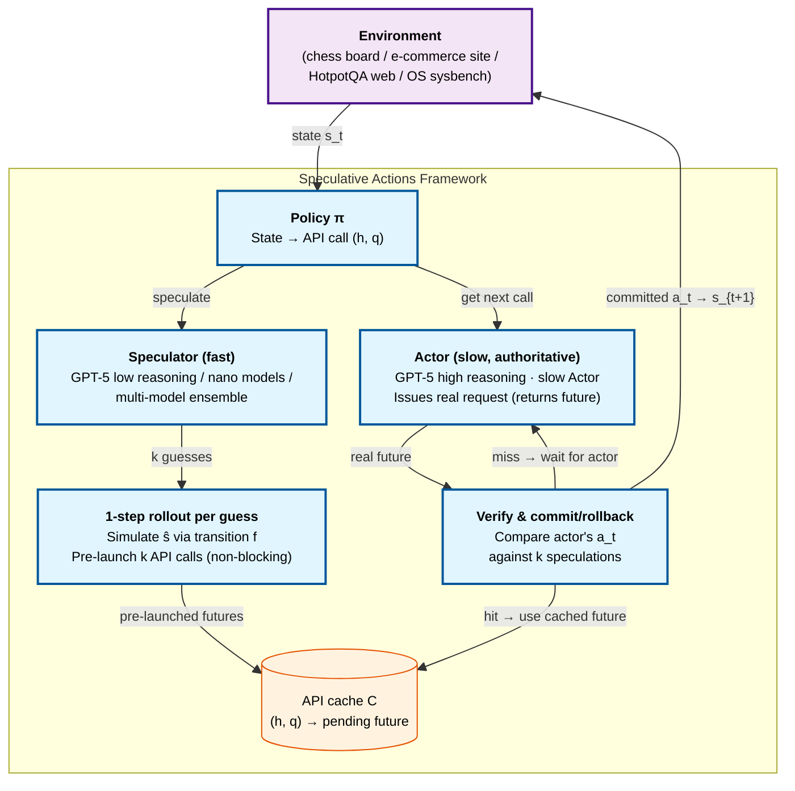

# Speculative Actions: A Lossless Framework for Faster Agentic Systems

> [!info] Paper metadata
> - **Paper**: [arXiv:2510.04371](https://arxiv.org/abs/2510.04371) — *Speculative Actions: A Lossless Framework for Faster Agentic Systems*, 2025-10-05 (v2: 2026-04-23)
> - **Code**: [naimengye/speculative-action](https://github.com/naimengye/speculative-action) — released
> - **Authors**: Naimeng Ye\*, Arnav Ahuja\*, Georgios Liargkovas\*, Yunan Lu\*, Kostis Kaffes, Tianyi Peng
> - **Affiliations**: Columbia University, New York
> - **Contact**: `{ny2336, aa5790, gl2902, yl4021, kk3664, tp2845}@columbia.edu`

> [!important] What this paper generalizes
> Speculative decoding (Leviathan 2023) operates at **token level**; Speculative Planning (Hua 2024) operates at **plan level** within a single agent. Speculative Actions **lifts the same speculate-verify pattern to API-call level across the entire agentic environment** — LLM calls, tool/MCP servers, even human-as-API. This is the generalization most consistent with the emerging "environment" + MCP perspective on agentic systems, and the framework supports both *lossless* (rollback-validated) and *lossy* (last-write-wins) modes.

---

## Summary (read this if you have 2 minutes)

**What it is.** Speculative Actions (SA) is a framework that pairs a slow authoritative **Actor** (e.g., GPT-5 with high reasoning effort) with a fast **Speculator** (smaller / cheaper LLM with low reasoning effort) and runs the Speculator's predicted next API calls in parallel with the Actor's deliberation. When the Actor's actual decision matches a speculation, the system commits and skips the wait; otherwise it rolls back to the actual decision. Across four environments (chess, e-commerce, multi-hop web search, OS tuning) with single-step k-way breadth speculation, SA delivers up to **20% end-to-end latency reduction** at up to **55% next-action prediction accuracy**, with formal losslessness guarantees in the first three settings.

**The one idea.** **Generalize speculate-verify from tokens to API calls.** Three sub-pieces:

1. **Two-role decomposition** — *Actor* (slow, authoritative: SOTA LLMs, tools, even humans whose outputs materialize the ground truth) and *Speculator* (cheap, low-latency: smaller LLM, same LLM with reduced prompts/reasoning, or domain heuristic). Speculator predicts the next action, its arguments, and the expected observation or state delta.
2. **Algorithm 1 (k-way parallel next calls)** — at each step, the Actor issues the real request; in parallel the Speculator generates $k$ candidate next actions, the framework simulates each via the transition function, and pre-launches all $k$ speculative next-step API calls. When the Actor's real action returns, the framework checks whether one of the $k$ speculations matches — if so, the pending pre-launched call's response is already (or soon) ready.
3. **Losslessness via three primitives** — (a) **semantic guards** (Actor verifies state-transition equivalence before commit), (b) **safety envelopes** (only speculate over idempotent / reversible / sandboxed side effects), (c) **repair paths** (rollback or compensating actions when a guess is rejected). In domains where this is hard (e.g., OS tuning), the paper proposes a *lossy* extension with last-write-wins semantics.

Drop the two-role split and you're back to monolithic agent execution; drop the k-way breadth and you only catch the most-confident guess; drop the safety primitives and speculation breaks correctness on stateful environments.

**Headline results across four environments.**

| Environment | Speculator/Actor | k | Accuracy | Speedup |
| ----------- | ---------------- | -: | --------: | ------: |
| **Chess (TextArena)** | GPT-5 (low) / GPT-5 (high) | 3 | **54.7%** | **19.5% time saved** |
| **E-commerce (τ-bench)** | Multi-model (gpt-5-nano+gemini-flash) / GPT-5 | varies | 22–38% | "~1/3 of turns immediate response" |
| **Multi-hop web search (HotpotQA)** | gpt-4.1-nano / gemini-2.5-flash | 3 | **46.25%** (top-3) | substantial speedup vs sequential |
| **OS tuning (lossy)** | Fast speculator / slow Actor (10-15s) | continuous | — | **P95 latency 37.93ms vs 54.00ms actor-only vs 102.97ms untuned** |

**Theorem 1** establishes the formal speedup upper bound: $\mathbb{E}[T_s]/\mathbb{E}[T_{\text{seq}}] \to 1 - \frac{p(k)}{1+p(k)} \cdot \frac{\alpha}{\alpha+\beta}$ where $p(k)$ is the probability of at least one of $k$ speculations hitting, $\alpha$ is speculator latency, $\beta$ is actor latency. **Maximum 50% reduction** when $p=1$, $\alpha \to \infty$.

**Why it matters.**

- **First framework to formalize and prove lossless speedup for agent actions** with explicit cost-latency tradeoff theorems (Theorems 1, 3, 4). The breadth-vs-depth tradeoff has closed-form expressions for tuning.
- **Generality is the point**: the same framework applies to LLM calls, MCP server invocations, browser-use API calls, and even human-response simulation. Each environment instantiates the same Algorithm 1.
- **Empirical demonstration that competent speculation is achievable** — 22–55% next-action accuracy is plausible across diverse domains, which combined with parallel pre-launch is enough for net speedup.
- **2027 prediction.** Action-level speculation becomes standard in agent serving frameworks, with `--enable-speculative-actions k=3` flags in vLLM/SGLang/Polar. The Speculator can be a fine-tuned 7B model trained on production traces, much like draft models for token-level spec decoding today.

---

# Depth (drill-down starts here)

## Background: API-call sequentiality is the agent bottleneck

The paper opens (Section 1) with Table 1 — current agent task durations:

| Task | Estimated duration |
| ---- | ------------------ |
| OS Tasks (Abhyankar 2025) | 10–20 min |
| Deep Research (OpenAI 2025) | 5–30 min |
| Data Pipeline (Jin 2025) | 30–45 min |
| Kaggle Chess Game (Kaggle 2025) | **1 hour** |

This inefficiency arises from "the inherently sequential nature of API calls." Each step in agent execution is an API invocation — LLM call, tool call, MCP server request, even human input — and each blocks until response. The paper asks:

> "Must an agent interact with its environment in a strictly sequential manner?"

The answer is no: in many environments, API intents are guessable with reasonable accuracy, and the rest of the work (next-step computation, parallel pre-launch) can proceed in parallel with the Actor's deliberation.

### Formal framing (Section 2)

An agentic system is modeled as MDP $(s_t, a_t)$. At each step, policy $\pi$ maps the current state $s_t$ to an API call:
$$(h_t, q_t) \leftarrow \pi(s_t)$$
where $h_t$ specifies the target API and $q_t$ the parameters. We write
$$\bar{a}_t \leftsquigarrow h_t(q_t), \quad a_t \leftarrow \text{await}(\bar{a}_t)$$
to denote an asynchronous API invocation that returns a *future* and the await for actual arrival. The cache $C: (h, q) \mapsto \bar{a}$ maps API call specifiers to pending responses.

The state transitions via $s_{t+1} \leftarrow f(s_t, a_t)$.

**The framework subsumes**:
- **LLM calls** — every LLM invocation is an action
- **Tool/MCP server calls** — every external/internal tool invocation is an action
- **Human-as-API calls** — human responses are actions with even longer latencies than tools

This abstraction matches the recent MCP perspective on agentic systems.

## Three components in detail

### Component 1 — Algorithm 1: k-way parallel next calls

The core algorithm (paper Algorithm 1, page 5):

```
Require: Initial state s_0, horizon T, transition f, policy π, predictor ĝ, cache C
1: for t = 0 to T-1 do
2:   Policy: (h_t, q_t) ← π(s_t)
3:   if (h_t, q_t) ∈ C then
4:     ā_t ← C[(h_t, q_t)]                  ▷ Cache hit
5:     a_t ← await(ā_t)                      ▷ Await pending action if not returned
6:     s_{t+1} ← f(s_t, a_t)
7:     continue
8:   end if
9:   Actor: Issue real request (returns future): ā_t ⇆ h_t(q_t)
10:  Speculator: {â_t^(i)}_{i=1}^k ← await(ĝ(s_t, (h_t, q_t)))   ▷ Actor and speculator run in parallel
11:  for i = 1 to k do                         ▷ One-step speculative rollout per guess
12:    ŝ_{t+1}^(i) ← f(s_t, â_t^(i))
13:    (ĥ_{t+1}^(i), q̂_{t+1}^(i)) ← π(ŝ_{t+1}^(i))
14:    Pre-launch: ā_{t+1}^(i) ⇆ ĥ_{t+1}^(i)(q̂_{t+1}^(i))   ▷ Return future, non-blocking
15:    C[(ĥ_{t+1}^(i), q̂_{t+1}^(i))] ← ā_{t+1}^(i)            ▷ Cache speculative pending actions
16:  end for
17:  Wait for resolved a_t from Actor: a_t ← await(ā_t)
18:  s_{t+1} ← f(s_t, a_t)
19: end for
```

**Two key roles formally defined** (Section 2):

- **Actor(s)**: "authoritative but slow executors — SOTA LLMs, external APIs, environment's own responses, or humans — whose outputs materialize the ground truth for correctness and side effects."
- **Speculator(s)**: "inexpensive, low-latency models that predict the next environment step, i.e., the action, its arguments, and the expected observation or state delta. Examples include smaller LLMs, same LLM with reduced prompts and reasoning steps, and domain heuristics."

### Component 2 — Theorem 1: speedup bound

**Proposition 1 (paper page 5)**: Under Assumptions 1 (speculation accuracy $p$) and 2 (concurrent reversible pre-launch), with Actor latency $\sim \text{Exp}(\beta)$ and Speculator latency $\sim \text{Exp}(\alpha)$ where $\beta < \alpha$, the ratio of expected runtimes is:

$$\frac{\mathbb{E}[T_s]}{\mathbb{E}[T_{\text{seq}}]} = 1 - \frac{1}{T} \cdot \frac{\alpha}{\alpha + \beta} \left[ \frac{(T-1)p(k)}{1+p(k)} + \frac{p(k)^2}{(1+p(k))^2} - \frac{p(k)^2}{(1+p(k))^2}(-p(k))^{T-1} \right]$$

As $T \to \infty$:
$$\to 1 - \frac{p(k)}{1+p(k)} \cdot \frac{\alpha}{\alpha+\beta}$$

where $p(k) = 1 - (1-p)^k$ is the probability of at least one of $k$ speculations hitting.

> [!important] Maximum 50% speedup with k-way breadth
> Proposition 1 implies the end-to-end latency reduction has an **upper bound of 50%**, occurring when $p=1$ (perfect speculation) and $\alpha \to \infty$ (free speculator). This is the fundamental ceiling of single-step k-way breadth speculation; the paper notes this "can be further improved by the multi-step extension." Multi-step speculation predicts $s$ steps ahead, yielding a tree structure with deeper savings.

### Component 3 — Losslessness primitives

The paper enforces losslessness via three design primitives (Section 2):

**(a) Semantic guards** — Actor confirms state-transition equivalence before commit. If $f(s_t, \hat{a}_t^{(i)}) = f(s_t, a_t)$, speculation is committed.

**(b) Safety envelopes** — only speculate over actions with reversible or sandboxed side effects. The paper lists web search, pre-checkout shopping carts, and OS-level sandbox operations as natural fits; warns against speculation on irreversible operations (deleting records, placing orders) where rollback isn't free.

**(c) Repair paths** — when a guess is rejected, the framework rolls back (chess, OS tuning) or applies compensating actions (refund/replace).

> [!quote] The framework's design philosophy
> "Speculative actions should not degrade final outcomes compared to a strictly sequential agent. ... A key design goal is losslessness relative to the environment's baseline semantics: speculative actions ... result in an *as-if-sequential, lossless interface with parallel, opportunistic internals*."

### Supporting machinery

> [!note]- Theorem 3: Cost of breadth speculation
>
> Let $\bar{k}$ denote the number of *distinct* actions across the $k$ speculative branches (duplicates are killed). Cost ratio (formal in Section 5.1):
>
> $$\frac{\mathbb{E}[M_{\text{spec}} - M_{\text{seq}}]}{\mathbb{E}[M_{\text{seq}}]} = \bar{k} - \frac{1}{T}\left( \bar{k} + \frac{\alpha}{\alpha+\beta} \right)\left[\frac{(T-1)p(k)}{1+p(k)} + \frac{p(k)^2}{(1+p(k))^2} - \frac{p(k)^2}{(1+p(k))^2}(-p(k))^{T-1}\right]$$
>
> As $T \to \infty$: $\bar{k} - (\bar{k} + \alpha/(α+\beta)) \cdot p(k)/(1+p(k))$.
>
> Combined with Proposition 1, this gives a closed-form **cost-latency tradeoff** that lets users tune $k$ offline based on their relative cost-vs-latency preferences.

> [!note]- Theorem 4: Confidence-aware selective speculation
>
> When per-speculation confidence estimates are available (from logits or auxiliary predictor), the paper derives the optimal number of branches to launch at each window. Branches added greedily in descending confidence order while $\Delta^* \cdot \delta q(m; p) \geq c$, where $\delta q$ is the marginal gain from adding one more branch. In the stationary case, continuation values collapse to a constant $\Delta^*$.
>
> Empirical validation (Figure 6): confidence-based heuristic attains the lowest cost at latency comparable to fixed 3-branch speculation, outperforming fixed 1- or 2-branch strategies.

## System architecture

Four-environment instantiation of Algorithm 1, each pairing a fast Speculator with a slow Actor:



## Headline evidence

### Chess (Section 3.1, TextArena)

The cleanest demonstration. Two GPT-5 agents play chess; Actor uses high reasoning effort, Speculator uses low effort with a "predict opponent's move quickly" system prompt.

| k (predictions) | Time saved | Speculative accuracy |
| ---------------: | ---------: | -------------------: |
| 1 | 11.8% | 31.3% |
| 2 | 15.0% | 41.3% |
| **3** | **19.5%** | **54.7%** |

Lossless: final game trajectory identical to non-speculative play. The time savings scale with $k$ but with diminishing returns (consistent with Theorem 3).

### E-commerce (Section 3.2, τ-bench)

Customer-agent retail interactions where the Speculator predicts the user's next query AND the target API calls (e.g., `get_user_details`, `get_order_details`).

| Reasoning capability | Speculator API prediction accuracy |
| -------------------- | ---------------------------------: |
| Low | 22.8–24.1% (single-model), 32.5% (multi-agent) |
| Medium | 23.4–27.2% (single), 34.9% (multi) |
| High | 23.3% (single), **38.5%** (multi) |

Speculative budget: 1024/2048/4096 tokens. **Low-budget speculators run in 2–3 seconds** vs the average ~30 second user typing time, meaning ~1/3 of turns can return an immediate response without waiting for API execution.

> [!example]- Multi-model speculation beats single-model
>
> Inspired by heterogeneous LLM ensembles outperforming single models (Jiang 2023, Chen 2025), the paper tests two configurations:
>
> - **Single-model speculator** (e.g., gpt-5-nano alone)
> - **Multi-model speculator** (gpt-5-nano with low budget + Gemini-2.5-Flash with medium budget, outputs aggregated)
>
> Multi-agent consistently outperforms (Figure 3: 32.5% vs 22.8% at low; 38.5% vs 23.3% at high). Different models hit different prediction modes.

### Multi-hop web search (Section 3.3, HotpotQA)

Agent answers multi-hop questions through sequential Wikipedia API calls. Speculator predicts likely Wikipedia content while actual API call executes.

| Speculator | Top-1 accuracy | Top-3 accuracy |
| ---------- | -------------: | -------------: |
| gpt-5-nano | 15.08% | 31.67% |
| gpt-4.1-nano | 18.75% | **46.25%** |
| gemini-2.5-flash | 19.58% | 38.33% |

Speculator successfully predicts ground-truth API call **up to 46% of the time** with top-3. Speculation provides value by precomputing reasoning paths during otherwise idle API waiting time.

### OS hyperparameter tuning (Section 4, lossy extension)

This is the *lossy* extension — last-write-wins semantics, no rollback. Tunes Linux Completely Fair Scheduler `min_granularity` parameter under `sysbench cpu` workload.

| Configuration | p95 latency (ms) |
| ------------- | --------------: |
| Untuned | 102.97 |
| Actor-only (10–15s interval) | 54.00 |
| **Actor + Speculator** (1s speculator, 10–15s actor) | **37.93** |

The Speculator proposes parameter updates every second using the latest performance metric; the Actor responds every 10–15 seconds with deeper analysis. **Speculator alone is suboptimal** (0.55 ms min_granularity, 36.24 ms latency — settles at local minimum). **Joint Actor+Speculator converges to optimal 0.2 ms in 10–15 s vs Actor-only's ~200 s** while costing 0.17 cents vs 2.18 cents.

> [!success] When losslessness is relaxed: cost and latency BOTH decrease
> Section 4 conclusion: "Despite additional speculative calls, **total cost is lower due to faster convergence**." This is unusual — speculation typically trades extra cost for latency. The OS-tuning scenario shows that when speculation drives the system to good states faster, the actor needs fewer (or shorter) deliberations, so total cost drops too.

## Strengths and limitations

**Strengths.**

- **Theoretically grounded** — Theorems 1, 3, 4 provide closed-form bounds on speedup, cost, and confidence-based selective branching.
- **Empirically diverse** — four genuinely different environments (game / dialog / retrieval / OS) instantiate the same algorithm.
- **Lossless guarantee is real** — in chess/e-commerce/HotpotQA the final trajectory matches non-speculative baseline exactly.
- **Lossy extension demonstrates the framework's reach** — when losslessness isn't required (OS), the speedups are larger and cost can decrease.
- **Open-source code** at https://github.com/naimengye/speculative-action.

**Limitations.**

> [!warning] 50% speedup is the formal ceiling
> Proposition 1 explicitly shows the upper bound is 50% latency reduction for single-step k-way speculation, regardless of $k$. To exceed this requires multi-step (s-step lookahead) speculation, which the paper sketches but doesn't deeply evaluate. Multi-step has tree-search complexity that grows fast.

- **All experiments use frontier LLMs as Actor** (GPT-5, Gemini-2.5-Flash). The Speculator is often a smaller variant of the same family, not a separately trained draft model. A purpose-trained 7B speculator (analogous to EAGLE's draft model) could plausibly do better.
- **Domain-specific success rate varies enormously** — 22–55% across the four environments. Generalization to entirely new agent domains is unmeasured.
- **Side-effect taxonomy is informal** — the paper says "limited to cases where mispredictions are reversible, via forking, snapshot restoration, or roll-forward repair" but doesn't provide an algorithm for classifying tools.
- **Latency model assumes exponential distributions** in Theorem 1. Real LLM API latency is bimodal (cached vs uncached) and long-tailed.
- **No comparison against PASTE or Conveyor on the same workload** — Related Work cites them but doesn't head-to-head measure.
- **Speculator costs are real** — multi-model ensemble doubles token cost; the cost-latency tradeoff (Section 5) characterizes this but optimal tuning requires per-deployment calibration.

## What this means

Speculative Actions is the conceptual **generalization** the speculative-decoding/speculative-planning literature was building toward. The same predict-then-verify pattern that accelerates token generation (Leviathan), reasoning chains (SpecReason, Lookahead), and single-agent plans (Hua, Guan) is now formalized at the level of arbitrary API calls — covering LLM invocations, tool/MCP server requests, browser-use APIs, and even human input.

Three predictions for 2027:

1. **Action-level speculation becomes standard** in agent serving frameworks. Expect `--enable-speculative-actions k=3 --speculator <model>` flags in vLLM, SGLang, Polar within 12 months.
2. **Production "draft models for actions" emerge**. The Speculator gets specialized — fine-tuned on production traces, with structured-action vocabulary, distillation from the Actor. This is the equivalent of EAGLE for actions.
3. **The breadth-vs-depth question gets resolved empirically**. This paper does breadth (k-way single-step); follow-up work will do depth (multi-step tree); the optimal combination is environment-dependent and will become a tunable hyperparameter.

What this paper does **not** solve:

- **Tool execution speed itself** — only the *waiting* around tools. Slow tools (compute-heavy CPU work) are addressed by [[cpu-centric-agentic-ai|CPU-Centric Perspective]]'s COMB/MAS.
- **Multi-turn agentic-RL training** — focused on inference; [[polar|Polar]] / [[prorl-agent|ProRL Agent]] / [[rose|ROSE]] cover the training side.
- **Multimodal speculation** — text only; [[speceyes|SpecEyes]] specifically addresses multimodal agentic LLM acceleration.

## Source code & reproduction

```bash
git clone https://github.com/naimengye/speculative-action
cd speculative-action
# Implementation built on TextArena (chess), τ-bench (e-commerce), HotpotQA + Wikipedia API, sysbench (OS tuning)
```

**Reproduction protocol** (from Section 3):

| Component | Configuration |
| --------- | ------------- |
| Chess platform | TextArena (Guertler et al., 2025) — standardized LLM gameplay interface |
| E-commerce platform | τ-bench (Yao et al., 2024) — retail customer-agent benchmark |
| Web search | HotpotQA (Yang et al., 2018) with Wikipedia API |
| OS tuning | `sysbench cpu` benchmark (Kopytov, 2020), Linux CFS `min_granularity` |
| Actor models | GPT-5 (high reasoning), Gemini-2.5-Flash |
| Speculator models | GPT-5 (low reasoning), gpt-5-nano, gpt-5-mini, gpt-4.1-nano, Gemini-2.5-Flash |
| Speculative branches k | 1, 2, 3 (chess); varies (others) |
| Speculative budget | 1024 / 2048 / 4096 tokens |
| Trials | 5 runs per configuration over 30 steps (chess); 100+ trials per benchmark elsewhere |

## Related reading

- [[speceyes]] — SpecEyes: agentic-level speculative acceleration specifically for **multimodal** LLMs (Xiamen U + Rochester + OSU, March 2026). Both lift speculation from tokens to agent loops; SA covers general text agents, SpecEyes covers MLLMs with vision tools.
- [[aurora]] — Aurora: token-level speculative decoding trained as async RL. Different layer (token vs action) but same speculate-verify family.
- [[das-spec-rl]] — DAS: distribution-aware token-level spec decoding for RL rollouts. Composable with Speculative Actions (DAS speeds up each Actor call; SA parallelizes across calls).
- [[speculative-decoding]] — Token-level speculative decoding overview; the conceptual ancestor.
- [[continuum]] — KV cache TTL for multi-turn agents; orthogonal serving optimization.
- [[cpu-centric-agentic-ai]] — CPU-Centric Perspective: addresses CPU-side tool latency; SA addresses LLM-side waiting latency. Composable.
- [[agentic-ai-workload-characteristics]] — Workload characterization that motivates why agent latency matters at all (LLM=71-98% of E2E time means SA's wait-elimination has meaningful impact).
- [[continuous-batching]] — Batching primitive that interacts with multi-branch speculation (multiple speculative calls share inference engine).
- [[ai-agent-overview]] — Higher-level ReAct paradigm description.

## References

- Naimeng Ye, Arnav Ahuja, Georgios Liargkovas, Yunan Lu, Kostis Kaffes, Tianyi Peng. *Speculative Actions: A Lossless Framework for Faster Agentic Systems.* arXiv:2510.04371, October 2025 (v2 April 2026). https://arxiv.org/abs/2510.04371
- Leviathan et al. 2023 — token-level speculative decoding foundation.
- Hua et al. 2024 — interactive speculative planning for agents (depth-oriented, single planning branch).
- Guan et al. 2025 — online RL for dynamic speculation depth.
- TextArena (Guertler 2025); τ-bench (Yao 2024); HotpotQA (Yang 2018); sysbench (Kopytov 2020).
- Tomasulo 1967 — original microarchitecture speculative execution; Lam & Wilson 1992 — rollback semantics.
- Mambretti et al. 2019 — Speculator (CPU speculation analysis).
- MCP (Anthropic, 2024) — Model Context Protocol that this framework's "everything is an API call" perspective aligns with.
