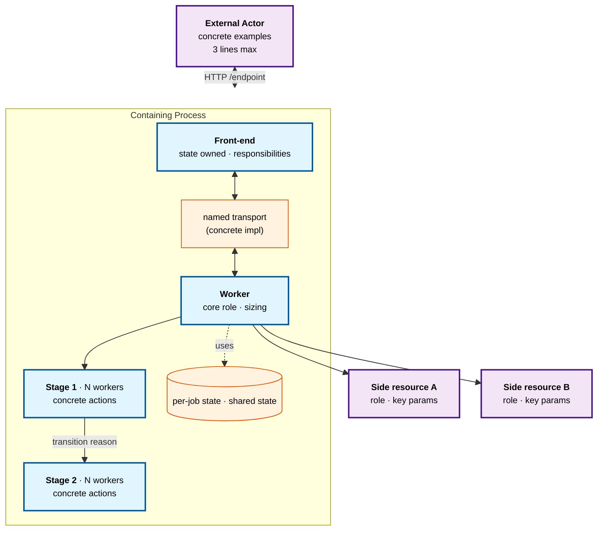

# WIKI-Format-Skill

This skill is the canonical reference for everything related to **Shiki's Knowledge Wiki** at `~/Desktop/Shiki's Knowledge Wiki/`. It consolidates three previously separate memories — *how I read papers*, *how I write wiki pages*, and *what the formatting standard is* — into one detailed document with concrete examples, GOOD-vs-BAD comparisons, full templates, quality checklists, and step-by-step workflows.

When this skill and any older memory note disagree, **the skill wins**. Future updates to wiki conventions go here first.

## Table of contents

1. [Vault basics](#1-vault-basics) — paths, structure, git state
2. [Part 1 — How I read a paper](#part-1--how-i-read-a-paper-the-8-axis-analytical-framework) (8-axis framework with examples)
3. [Part 2 — How I write a wiki page](#part-2--how-i-write-a-wiki-page-report-style-not-framework-dump) (report skeleton, GOOD vs BAD, Q&A pattern)
4. [Part 3 — Markdown format standard](#part-3--markdown-format-standard) (callouts, LaTeX, frontmatter, files)
5. [Operations cookbook](#operations-cookbook) (worked workflows)
6. [Quality checklist](#quality-checklist-before-declaring-a-page-done)
7. [Anti-patterns](#anti-patterns--things-not-to-do)
8. [Memory pointers](#memory-pointers)

---

## 1. Vault basics

### Location and structure

- **Path**: `~/Desktop/Shiki's Knowledge Wiki/`. Verify with `find ~/Desktop -maxdepth 4 -name "*Knowledge Wiki*"` before saving anything — the user has moved this directory at least once.
- **The empty path** `~/Shiki's Knowledge Wiki/` is stale; do NOT write there.
- **Git remote**: `git@github.com:shikicloud/MLSys.git`, branch `main`. (Note the repo was renamed from `MLsys` → `MLSys`; both URL forms redirect.)
- **Bilingual**: parallel `EN/` and `CN/` vaults. Every page exists in both languages with identical structure, identical math, identical callouts. Translated prose. Same file slug.

### Folder layout (per language)

```
EN/   (and CN/ mirrors this exactly)
├── CLAUDE.md             # Vault schema (referenced by Claude Code as project context)
├── index.md              # Catalog of all pages, organized by category
├── log.md                # Append-only chronological change log
├── sources/
│   ├── papers/<slug>/    # citation.md per paper
│   ├── articles/         # web articles, blog posts
│   ├── notes/            # personal notes
│   └── code/             # code snippets, repo references
└── wiki/                 # The actual knowledge pages
    ├── llm-inference/         # vLLM, SGLang, KV cache, quantization, etc.
    ├── rl-infra/              # RLHF, PPO, GRPO, DPO, reward modeling
    ├── ml-infra/              # distributed training, training frameworks, GPU clusters
    ├── ml-sys/                # MLOps, model registry, feature stores, Ray
    ├── agentic-rl/            # agentic RL, tool-use RL, environment design
    ├── ai-agent/              # agent architectures, MCP, multi-agent, tool use
    └── llm-serving-for-agents/ # serving challenges, long context, structured output
```

### Repo-level skill location

- **Active skill copy**: `~/.claude/skills/wiki-format-skill/SKILL.md` — what Claude Code's harness loads.
- **Git-tracked mirror**: `~/Desktop/Shiki's Knowledge Wiki/skills/wiki-format-skill/SKILL.md` — what gets pushed to GitHub.

Keep them in sync. Either `cp` after edits or `ln -s` once.

---

## Part 1 — How I read a paper: the 8-axis analytical framework

The 8-axis framework is the **private analytical lens** used to *understand* a paper. It is **NOT** the structure of the published wiki page — see Part 2 for that. Mixing the two produces academic-sounding pages that read like notes-to-self.

When the user asks to read, review, summarize, or 精读 a paper, walk through these eight orthogonal axes mentally as you read. Take notes that will feed into the wiki page, but write the page using Part 2's *report* skeleton, not these axis names.

### The 8 axes — what each one asks

| # | Axis | The question | What a strong answer looks like |
|---|------|--------------|--------------------------------|
| 1 | **Position** | What was the field doing? Why is the status quo unsatisfactory? | A comparison table against named prior work (e.g. ProRL Agent's table vs. SkyRL-Agent / VeRL-Tool / Agent Lightning / rLLM / GEM). |
| 2 | **Motivation** (立意) | What *general principle* do the authors think the field is missing? | One sentence. E.g. ProRL Agent: *"rollout and training have fundamentally different resource shapes; coupling them is an architectural mistake."* SAW-INT4: *"plain per-token INT4 is fine if you do one thing right at the kernel level."* |
| 3 | **Core idea (the delta)** | What is the smallest defensible new thing? | The named *thing*. E.g. "Rollout-as-a-Service", "Block-Diagonal Hadamard Rotation". Test: if I removed this one component, would the result still hold? |
| 4 | **The how** | What is the concrete mechanism? | For systems: architecture, kernel, API. For ML: algorithm, loss function. For theory: theorem + proof structure. For empirical: methodology. |
| 5 | **Implementation reality** | What does the code / appendix / supplement actually show? | Concrete bugs handled, hyperparameters used, kernel optimizations. *Always* fetch source/appendix; never rely on the abstract alone. This axis frequently reveals constraints the paper hides. |
| 6 | **Evidence (experiments)** | Does the empirical evidence support the claimed delta? Critically, **what is NOT measured?** | Specific missing baselines, missing ablations, missing benchmarks. E.g. "GPQA-only is thin; MMLU/MATH/HumanEval/RULER not run." |
| 7 | **Limitations** | Both author-acknowledged AND what I notice they don't. | Specific. *"Only validates on DAPO; PPO/GRPO/RLOO untested"* beats *"limited evaluation."* |
| 8 | **Generalization** | What broader pattern does this expose? Predict the next 12 months. | Opinionated take. E.g. *"Block-diagonal Hadamard will spread to vLLM and TensorRT-LLM; the system-aware framing is the more durable contribution."* |

### Worked example — applying the 8 axes to ProRL Agent

To make the framework concrete, here's how it produced the [[prorl-agent]] page:

| Axis | Note from the analytical pass | Where it landed in the wiki page |
|------|-------------------------------|----------------------------------|
| 1. Position | SkyRL-Agent / VeRL-Tool / Agent Lightning / rLLM / GEM all keep rollout in the trainer process | The Background section + comparison table |
| 2. Motivation | "Rollout and training have different resource shapes; coupling is wrong" | First sentence of *The key idea* |
| 3. Core idea | Rollout-as-a-Service: HTTP `/process` returning `(token_ids, logprobs, reward)` | Section title and `> [!quote]` callout |
| 4. The how | Three-stage pipeline INIT/RUN/EVAL with PausableTimer; min-heap LB; AgentHandler ABC | Multiple subsections under *How it works* |
| 5. Implementation reality | FastAPI parent + multiprocessing child; ThreadPoolExecutor sized `max_init+max_run+max_eval+30`; the `+30` is pragmatic slack | Inline note in *Inside the server process*, not a separate "Implementation Reality" section |
| 6. Evidence | SWE-Bench Verified +6.4 to +8.4 pp on Qwen3 4B/8B/14B, 8B is 2× SkyRL-Agent | *Experiments* section with `[!important]` callout for the 8B headline |
| 7. Limitations | HTTP overhead unquantified; only DAPO validated; reward-server abstraction underexplained; 293-instance training set is small | *Strengths and limitations* prose + `[!warning]` callout for the reward-server gap |
| 8. Generalization | Service-oriented design will spread; expect environment-as-a-service / reward-as-a-service in 12 months | *What this means* section, opinionated voice |

### Adapt by paper type

| Paper type | "The how" axis | "Implementation reality" axis | "Evidence" axis |
|------------|---------------|--------------------------------|----------------|
| **Systems / infra** (ProRL Agent, SAW-INT4, vLLM, SGLang) | Architecture diagram, API, kernel | The actual source — Pydantic models, ABC classes, Triton kernels, env-var gates | Throughput / latency benchmarks at multiple concurrencies; resource utilization |
| **ML / RL methods** (GRPO, DPO, SmoothQuant) | Algorithm pseudocode + loss function | Training tricks in appendix; hyperparameters; data preprocessing details; calibration data sensitivity | Per-task accuracy on held-out benchmarks; ablations of each technique component |
| **Theory** (rare in this wiki) | Main theorem statement + proof sketch | Full proofs in appendix where the real difficulty lives; assumption strength | Does the bound match observed behavior? Are the assumptions realistic? |
| **Empirical / benchmark** (Chroma "Context Rot", scaling laws) | Experimental protocol; what was held constant | Raw data tables; statistical tests; code that generates plots | Effect size, reproducibility (multi-seed), threats to validity |

### Reading order ≠ report order

The order I *read* a paper is not the order I *write* the wiki page. Reading order optimizes for revealing weaknesses fast.

| Paper type | Reading order |
|------------|---------------|
| Systems | abstract → intro → conclusion → figures → method → experiments → related → **code** |
| Theory | abstract → intro → main theorem statement → proof sketch → experiments → related → **full proofs** |
| ML methods | abstract → main results table → method → ablations → appendix hyperparameters → related |

Why end with the deepest layer (code, full proofs, raw data)? Because surface claims are easy to refute when you've already seen the high-level argument; you want to *check* the headline rather than be primed by it.

### Time budget guidance

For a typical systems paper that becomes a code-walking wiki page:

| Stage | Time | What to produce |
|-------|------|-----------------|
| First read (abstract, intro, figures) | 15–30 min | A 5-line summary of what the paper claims |
| Method and experiments | 30–60 min | Notes against the 8 axes |
| Source code dive | 60–120 min | At least 5 concrete code snippets that will go in the wiki |
| Cross-graph thinking | 15–30 min | List of existing wiki pages to update + decision on whether a synthesis page is warranted |
| Wiki page writing | 60–120 min | Full bilingual page with callouts + LaTeX + working cross-links |

Total: 3–6 hours for a major paper review. Worth doing right — the wiki page is reread far more often than written.

### Reading mistakes to avoid

- **Trusting the abstract.** Abstracts oversimplify and oversell. Always check the experiments section for what was *actually* measured.
- **Skipping ablations.** Ablations reveal which component does the work. A paper claiming many contributions where ablations show only one matters is overclaiming.
- **Skipping the appendix.** For theory papers, the actual difficulty lives in the appendix proofs. For ML papers, the calibration data details and hyperparameter sensitivity often live there.
- **Believing the comparison table.** Always check the baselines were run by the *paper authors* under matched conditions, not just quoted from the original work.
- **Reading code last.** For systems papers, code reading often changes the analysis; do it before writing the wiki page so the page reflects what the code actually does.

---

## Part 2 — How I write a wiki page: report style, not framework dump

A wiki page is a **report to others** (and to future-me), not my analytical scratchpad. The 8 axes from Part 1 govern what I *think about*; this section governs what I *publish*.

### The non-negotiable principle: content-named headers

Use headers that name the *thing* being discussed, not the analytical role.

✅ **GOOD** (content-named):
- `## Background: why INT4 KV breaks reasoning models`
- `## The key idea: block-diagonal Hadamard rotation before INT4`
- `### Three-stage async pipeline`
- `### Inside the fused Triton kernel`
- `### Q-correction at decode`

❌ **BAD** (analytical-role-named — these were in early drafts and got reformatted):
- `## Position` → rewrite as a content-descriptive Background header
- `## Motivation`
- `## Core Idea`
- `## Implementation Reality`
- `## Generalization`

The reader doesn't care about my analysis structure. They care about the topic. Save axis-named thinking for chat replies and private notes.

### The recommended report skeleton

This is the canonical structure for a paper-review page. Concept pages are similar but skip "Source code & reproduction" and may collapse "Strengths and limitations" into "Trade-offs."

```markdown
---
title: "Paper Title (or Concept Name): brief tagline"
category: <one of seven topic folders>
tags: [primary-tag, secondary-tag, …, paper-review]
created: YYYY-MM-DD
updated: YYYY-MM-DD
status: seed | growing | mature
paper: arXiv:NNNN.NNNNN     # paper-review pages only
code: github URL            # paper-review pages only
---

# <Page title without quotes>

> [!info] Paper metadata
> - **Paper**: [arXiv:NNNN.NNNNN](url) — venue, date
> - **Code**: [org/repo](url) (branch, commit, license)
> - **Authors**: full list

> [!abstract]+ TL;DR
> 2–4 sentences: what it is, why it matters, the headline result with a number.

---

## Background: <content-descriptive title>

Narrative covering what the field was doing and why it was unsatisfying.
This subsumes the Position + Motivation axes. Insert a comparison table here
if multiple prior works exist.

| Framework | Property A | Property B |
|-----------|-----------|------------|
| Prior #1  | ...       | ...        |
| **This paper** | ✓    | ✓          |

### Subsection if needed (e.g., what's already been tried)

---

## The key idea: <name the thing>

> [!quote] The contribution in one sentence
> Crisp restatement of the core delta, ideally in author voice.

Three or four sub-claims that hold the contribution up. Each claim gets one
or two sentences. Don't over-decompose.

> [!tip] Recommended config / mode
> Practical guidance lives in callouts so it's findable.

---

## How it works

### Where it sits in the pipeline

ASCII diagram showing the flow.

### Subsection: API / configuration

Real Pydantic models, real env-var gates, real CLI flags — not paraphrases.

```python
# memory_pool.py
_hadamard_enabled = 1 if os.environ.get("HADAMARD", "0") in (...) else 0
```

### Subsection: a key algorithm or kernel

Show the actual code from the source repo. Walk through what each step does
in prose between code blocks. Cite the file path inline:
*"From `openhands/nvidia/registry.py`:"*

> [!note] Implementation detail worth highlighting
> A subtle point that's easy to miss in a quick read.

### Subsection: another concrete mechanism

Continue with named subsections for each major mechanism. 4–8 `###`
subsections under "How it works" is normal for a paper-review page.

---

## Experiments

**Setup.** Hardware, hyperparameters, models, dataset.

### Main result

| Config | Metric A | Metric B |
|--------|---------:|---------:|
| Baseline | 14.8 % | ... |
| **Proposed** | **21.2 %** | ... |

> [!important] Headline number framed clearly
> "Recovers 65.82 % of the 66.67 % BF16 baseline" — note the framing.

### Generality

Other tasks, models, settings.

### Ablations

What does each component contribute? Table form is best.

---

## Strengths and limitations

Blended prose. Author-acknowledged limits + my own critiques, weaved.

> [!warning] A scope limit that matters
> Pull out anything load-bearing.

> [!bug] OSS bug or doc gap
> Real bugs (port mismatches, install gotchas) — separate from intellectual limits.

---

## What this means

1–2 paragraphs of perspective. Be opinionated. What does this paper teach
about where the field is going? What predictions does it make? What does it
*not* solve?

---

## Source code & reproduction

```bash
git clone --recurse-submodules <url>
# minimal-viable run that reproduces the headline result
```

Files worth reading next, with the role of each:

| File path | Role |
|-----------|------|
| `path/to/file.py` | One-line description of what's there |

---

## Related reading

- [[neighbor-page-1]] — why it's related (one line each)
- [[neighbor-page-2]] — ...
```

### Style guide — non-negotiable

1. **Narrative first, structure second.** Paragraphs that explain. Lists/tables only when they communicate faster than prose.
2. **Show real code and interfaces, not just descriptions.** A page that *describes* "there is an `AgentHandler` ABC" is weaker than one that *shows* the ABC and its seven abstract methods. Always fetch the source repo and quote real code blocks; cite file paths inline.
3. **Opinions are welcome but signaled.** When I write "the real contribution is X, not Y," frame it as my view, not the paper's claim. Use phrases like *"The system itself is solid, but the more interesting claim is the architectural one..."*
4. **Critiques are inline and specific.** Don't reserve a "limitations" section as a graveyard. *"Only validates DAPO; PPO/GRPO/RLOO untested"* beats *"limited evaluation."*
5. **Cross-link aggressively.** Every wiki page is part of a graph. Cite `[[neighbors]]` when concepts overlap. The wiki gets more useful as the graph thickens.
6. **No "How I Read Papers" preamble** in the wiki page. That's metacommentary; it lives in this skill, not in a published page.
7. **Bilingual mirror.** EN + CN parallel structure, same callout types, same math, translated prose. The only differences should be language — not content, not formatting, not section ordering.

### Length guidance

- **Paper-review pages**: 400–700 lines is typical for a major paper. Under 200 lines suggests under-coverage; over 1,000 lines suggests it should be split into multiple pages.
- **TL;DR callout**: 2–4 sentences. If it can't fit, the paper has more than one delta and needs a clearer thesis.
- **Each `###` subsection**: 3–8 paragraphs typically. Long enough to develop the idea, short enough that the reader doesn't lose the thread.
- **Q&A callouts** (Shiki questions): 3–5 compact paragraphs (2–4 sentences each). Avoid heavy bullet lists for explanatory answers.
- **Tables**: 4–10 rows is the sweet spot. Above 10 rows, consider splitting or moving to an appendix.

### Tone and voice

- **Concise and concrete** over verbose. Cut hedging like "perhaps" and "possibly" unless the claim is genuinely uncertain.
- **Opinionated where opinion is earned**. After surveying the field, take a stance on what works and what doesn't.
- **Honest about scope**. If a page covers only part of a topic, say so in the TL;DR.
- **No marketing language**. Avoid "revolutionary", "groundbreaking", "state-of-the-art". Prefer numbers and concrete comparisons.
- **Match the user's register.** Technical, precise. The user is studying LLM inference/serving professionally — assume professional vocabulary.

### When a paper cites others — pull on the wiki graph

When the paper I'm reviewing cites or builds on other named work:

1. **Mention the related papers in the current page** — compare/contrast, position the new paper in the lineage. Don't just dump them in the references list.
2. **Update existing wiki pages** that are conceptually adjacent. If [[kv-cache-optimization]] doesn't yet mention rotation-based KV quantization, add a subsection that links to the new page.
3. **Create a new synthesis/family page** when the cited works form a coherent technique family with a clear development arc. Examples:
   - QuIP → QuIP# → QuaRot → SpinQuant → BDR became `[[rotation-based-quantization]]` after SAW-INT4 brought the lineage to KV cache.

The rule: **the wiki is a graph**. Every new paper should pull on the surrounding topology — adding nodes for cited works that deserve them, adding edges to existing nodes that should now reference the new work.

What does NOT require a new page: papers cited only once or twice in passing. Reserve new pages for (a) papers I do a full code-walking review on, or (b) coherent families/lineages worth a synthesis hub.

### Logging Q&A inline (the "Shiki:" / "Answer:" pattern)

When the user asks a follow-up question about a specific paper, **record both the question and my answer on that paper's wiki page** — but NOT in a `## Q&A` section at the bottom. Do this:

1. **Inline placement** — put the Q&A at the *place where the discussed text appears*. If the user asks about a paragraph in the Background section, the Q&A goes right after that paragraph. The page becomes a stratified study record — original review + clarifications layered exactly where the confusion was.
2. **Distinct visual format** — use an Obsidian callout `> [!question]+ Shiki — <short title> (YYYY-MM-DD)`. The `+` keeps it expanded.
3. **Compact-paragraph answer style** — answer body should be **3–5 compact paragraphs**, each one short (2–4 sentences) and self-contained. Avoid heavy bullet lists for explanatory answers; prose flows better when the user is trying to understand a concept.
4. **Cross-link** to the paper's own sections (`[[#Section Name]]`) so the answer extends the page's internal graph.
5. **Mirror in both EN and CN** with identical structure; keep "Shiki" as the questioner label in both.
6. **Don't accumulate at the bottom.** The inline location IS the index. Chat reply can be terse; the wiki version is the authoritative complete answer.

#### Annotated Q&A template

```markdown
> [!question]+ Shiki — What is an outlier channel and why does plain INT4 KV collapse? (2026-05-07)
>
> *(Quoted)*: "Per-token scale-and-zero INT4 quantization computes one
> `(scale, zero)` pair per token vector and divides the 16 INT4 levels
> evenly across `[min, max]`. ... accuracy collapses." What does this paragraph mean?
>
> An **outlier channel** is one of the `head_dim` dimensions in a K (or V)
> token vector whose magnitude is systematically 1–2 orders larger than the
> rest, *across all tokens*. With `head_dim = 128`, you might have 2–3
> channels at magnitude ~1.0 while the other 125 sit at ~0.01. ...
>
> Per-token scale-and-zero quantization compresses the whole row of
> `head_dim` values to INT4 with a single `(scale, zero)` pair: ... `scale`
> gets stretched to about 0.1 magnitude (to fit those big values), while
> the 125 ordinary channels live at ±0.01.
>
> Divided by a `scale` that's ten times larger than they need, the
> ordinary channels all round to the same level — usually `zero` itself —
> i.e. they're effectively quantized to 0. So **>95 % of channels lose
> almost all their information**. ...
>
> What [[#The key idea: block-diagonal Hadamard rotation before INT4|BDR]]
> does is apply a Hadamard rotation per head_dim block *before*
> quantization. After the rotation the row's max/min is no longer
> dominated by a few channels; ... — recovering 65.82 % of the 66.67 %
> BF16 baseline.
```

The structure: question (with quoted excerpt) → 4 paragraphs that go *what it means* → *why it matters* → *the consequence* → *how it connects to elsewhere on the page*.

---

## Part 3 — Markdown format standard

This section governs every page in the wiki. Apply at minimum the top-of-page callouts (info + abstract) and key-result callouts (important / example / warning) to all pages; deep per-section reformat is opportunistic for long pre-existing concept pages.

### Frontmatter template

```yaml
---
title: "Page Title or Concept Name"
category: llm-inference | rl-infra | ml-infra | ml-sys | agentic-rl | ai-agent | llm-serving-for-agents
tags: [tag1, tag2, paper-review]    # paper-review | family-overview | concept | survey
created: YYYY-MM-DD
updated: YYYY-MM-DD                 # bump this on every meaningful edit
status: seed | growing | mature      # mature is the target for any page Shiki uses
paper: arXiv:NNNN.NNNNN             # paper-review pages only
code: https://github.com/...         # paper-review pages only
---
```

Field rules:
- `title` quoted because colons are common.
- `category` must be exactly one of the seven folders. No invented categories.
- `tags` lowercase-with-hyphens; first tag is the primary topic, last tag is the page kind (`paper-review` / `family-overview` / `concept` / `survey`).
- `status` ladder: **seed** (stub), **growing** (partial), **mature** (covers the topic well enough to teach from).

### Obsidian callout vocabulary

The standard set. Don't over-use — every callout that's also-ran loses distinctiveness. **Aim for 4–8 callouts on a typical paper-review page.**

| Callout | Renders as | When to use | When NOT to use |
|---------|-----------|-------------|------------------|
| `> [!info]` | Blue ℹ frame | Paper / repo metadata, link blocks | General prose — use a paragraph instead |
| `> [!abstract]+` | Purple 📄 frame, expanded | The TL;DR at top of every page | Any other context — only one abstract per page |
| `> [!important]` | Orange ⚠ frame | Headline numbers, the cliff-edge collapse, "this is the point" | Anywhere in body where the writing already conveys importance via prose |
| `> [!quote]` | Gray 💬 frame | One-line statement of the contribution; quoted lemma; canonical definition | Long passages — block-quote those instead |
| `> [!tip]` | Green 💡 frame | Recommended config, default mode, practical guidance ("use K-only") | Speculative advice — say so in prose |
| `> [!note]` | Blue 📝 frame | Sidebar observations, constraints, kernel-fusion side effects, "two design choices visible only in code" | Main thread of argument — write it as paragraphs |
| `> [!example]` | Cyan 📋 frame | Concrete worked-out memory math, throughput math, dimensional analysis, "Memory math for Qwen3" | Abstract examples — embed in prose |
| `> [!warning]` | Yellow ⚠ frame | Empty ablation tables, scope caveats, things the paper claims but doesn't show | Outright bugs — those are `[!bug]` |
| `> [!bug]` | Red 🐛 frame | Real bugs in the OSS release (port mismatches, doc errors, install gotchas) | Intellectual limits or scope caveats — those are `[!warning]` |
| `> [!question]+` | Blue ❓ frame, expanded | User Q&A logged inline near discussed text | Anywhere else — Q&A always has the `[!question]` type |
| `> [!success]` | Green ✓ frame | Rare. When something works as advertised against expectations. | Any expected positive result — most contributions are not surprising once you read the abstract |

### Callout patterns by page section

| Where on the page | Typical callout |
|-------------------|------------------|
| After H1, before TL;DR | `> [!info]` for paper metadata |
| TL;DR | `> [!abstract]+` |
| Main result table conclusion | `> [!important]` for the headline number |
| "The key idea" section | `> [!quote]` for the one-sentence contribution |
| Recommended config in *How it works* | `> [!tip]` |
| Subtle implementation detail | `> [!note]` |
| Worked memory/throughput math | `> [!example]` |
| Inside *Strengths and limitations* | `> [!warning]` for scope caveats |
| At the end of *Strengths and limitations* | `> [!bug]` for OSS bugs |
| Right after the paragraph the user asked about | `> [!question]+ Shiki — title (date)` |

### LaTeX math reference

Use `$...$` for inline math, `$$...$$` for display math. Standard mappings:

| Source phrase | Use |
|---------------|-----|
| `O(d log d)` | `$O(d \log d)$` |
| `O(d²)` | `$O(d^2)$` |
| `O(n log n)` | `$O(n \log n)$` |
| `1/√H`, `1/√d` | `$1/\sqrt{H}$`, `$1/\sqrt{d}$` |
| `H_d^T · H_d = I` | `$H_d^\top H_d = I$` |
| `R^T R = I` | `$R^\top R = I$` |
| `softmax(QK^T / √d) · V` | `$\text{softmax}(QK^\top / \sqrt{d}) \cdot V$` |
| `i XOR 2^s` | `$i \oplus 2^s$` |
| `[min, max]` | `$[\min, \max]$` |
| `≤`, `≥` | `\le`, `\ge` |
| `±` | `\pm` |
| `⊗` (Kronecker) | `\otimes` |
| `≈` | `\approx` |
| L2 norm | `$L_2$` |
| Subscripts with words | `R_1`, `R_2`, `\ldots`, written as `$R_1, R_2, \ldots$` |

Display-math examples:

```latex
$$
H_2 = \frac{1}{\sqrt{2}} \begin{bmatrix} 1 & 1 \\ 1 & -1 \end{bmatrix}, \qquad H_{2n} = H_2 \otimes H_n
$$
```

```latex
$$
\begin{aligned}
\text{range} &= \max(x) - \min(x) \quad \text{over the head\_dim row} \\
\text{scale} &= \text{range} / 15 \\
\text{zero}  &= -\min(x) / \text{scale} \\
q            &= \mathrm{round}(x / \text{scale} + \text{zero}) \quad \text{clipped to } [0, 15]
\end{aligned}
$$
```

Rules:
- Use `\text{...}` inside math for words / multi-letter variable names (e.g. `\text{scale}`, `\text{range}`).
- Don't use math for things prose handles fine. *"a 7-element list of fields"* doesn't need math.
- Step-by-step computation chains belong in `aligned` blocks, with one equation per line and `&=` alignment.

### Visual hierarchy

- **`---` horizontal rules** between top-level (`##`) sections. Major concepts get breathing room. Don't use between every `###`.
- **`####` sub-subsections** inside long `###` sections. Example: in [[saw-int4]], "Inside the fused Triton kernel" splits into `#### The butterfly`, `#### The full kernel body`, `#### The launcher`.
- **Tables** for: file → role lists, comparison matrices, mode matrices, parameter values. Max ~10 rows.
- **Right-align numeric columns** in tables: `| ----: |`. Multiplexed numeric columns (e.g. "throughput / TTFT") right-align too.
- **Code blocks** with language hints — `python`, `bash`, `toml`, `yaml`, `cpp`, `rust`, `markdown`, etc. **Never** untyped fences (` ``` `) for code; they're allowed only for inline ASCII diagrams.
- **Inline code** for identifiers (`AgentHandler`, `head_dim`, `--kv-cache-dtype`); math for expressions; bold for emphasis on prose nouns.

### Diagrams

Diagrams are how a reader gets the structure of a system in 5 seconds. Spend the time to make them informative — show queues, workers, communication channels, and key state objects, not just three boxes-and-arrows.

#### When to use Mermaid (preferred for system architecture)

Use a `mermaid` fenced code block for any **system-level** diagram with more than ~3 components. Both Obsidian and GitHub render Mermaid natively as SVG.

Required content for a system architecture diagram:

1. **External actors** at the boundaries (e.g. RL Trainer, vLLM Backend Pool, Sandbox).
2. **Process boundaries** as `subgraph` blocks (e.g. FastAPI parent, multiprocessing child).
3. **Concrete components** inside each process — queues, worker pools, dispatch tables, state objects — not just one box per process.
4. **Communication edges labeled** with the actual transport (`HTTP /process`, `multiprocessing.Queue`, `sandbox exec`, `sticky LLM calls`).
5. **Color/style classes** via `classDef` at the top (external / service / state).

#### Layout — single-direction, single-column inside subgraphs

> [!warning] Validated by Shiki 2026-05-08: two iterations of the ProRL Agent diagram both failed
> 1. **First iteration**: rich content but each node had 5–6 `<br/>` lines, and the Trainer node embedded the whole `① ② ③ ④` API sequence. Obsidian's renderer sized the SVG to fit the tallest box → multi-screen vertical scroll.
> 2. **Second iteration**: compressed to 2–3 lines per node, **but** the 3-stage pipeline was a separate `subgraph Pipeline` with `direction LR` while the rest was `flowchart TB`. Mermaid's auto-layout placed the LR sub-flow *off to the side* instead of in-line, requiring left–right scrolling to see EVAL.
>
> The lesson: **Mermaid does NOT lay out nested subgraphs with mixed directions cleanly.** Either everything is TB or everything is LR. If you need a horizontal-looking sub-flow inside a vertical layout, *unroll* it into TB sequential nodes — don't wrap it in its own `direction LR` subgraph.

The reliable layout rules:

1. **One direction throughout.** If the page is `flowchart TB`, every subgraph and every flow stays TB. Don't put `direction LR` inside a TB diagram (or vice versa) — the renderer will sprawl the inner block off to the side.
2. **Unroll horizontal sub-flows into vertical sequences.** A pipeline that is conceptually `INIT → RUN → EVAL` (left-to-right) renders as three sequential TB nodes inside the parent TB layout. The arrows still convey the sequence; you don't need an LR subgraph to express it.
3. **At most one subgraph level.** Nested subgraphs frequently lay out badly. Prefer one wrapping subgraph (e.g. `Server`) with all components flat inside it, including pipeline stages.
4. **Single column inside subgraphs.** Components inside one subgraph form a single vertical column with sequential edges. Branching out to side resources (Sandbox, vLLM) happens *outside* the subgraph from one anchor node.
5. **3–4 lines per node is fine.** The earlier "max 2–3 lines" rule was the wrong target — the real failure was layout, not content. Restoring richer per-node content (3–4 lines: `<b>name</b>` + role + key knobs) is good for understanding; the height stays controlled because nodes don't have to fit the whole call sequence.
6. **Move call sequences out of node labels.** The `① /endpoint → ② /endpoint → ③ /endpoint → ④ ← response` API contract belongs in a sentence above the diagram, not crammed into the actor's box.
7. **Drop bullet decorations** (`•`, `──`, `─────`) inside node labels. Use `·` between items if you need a separator: `rootless · --fakeroot · per-job IP`. Bullets force more vertical space than they're worth.
8. **Add an init directive** at the top of complex Mermaid blocks to control font size and spacing. The default `fontSize` is 16 px; dropping to 12–13 px with `nodeSpacing: 30` and `rankSpacing: 40` keeps the rendered area reasonable:

```text
%%{init: {"flowchart": {"nodeSpacing": 30, "rankSpacing": 40}, "themeVariables": {"fontSize": "12px"}}}%%
```

9. **If the diagram still doesn't fit on one screen,** split it: a high-level *map* (Trainer ↔ Server ↔ {Sandbox, vLLM}) and a separate *internals* diagram (the 3-stage pipeline). Don't try to fit everything into one figure with creative nesting — that's exactly what failed twice on ProRL Agent.

#### Reference template — single-column TB diagram



Note how everything inside `Server` lays out vertically (`direction TB` set explicitly), the pipeline stages are inline with the Worker rather than wrapped in a `direction LR` subgraph, and the side resources hang off Worker *outside* the Server subgraph. This renders predictably as a single vertical column with two side branches at the bottom.

#### Anti-patterns

- **Three boxes connected by arrows.** Strip layout for a real-time system that has 12 components is missing structure. The original ProRL Agent draft was rewritten because the diagram didn't show the FastAPI/multiprocessing split or the three-queue pipeline.
- **Five-or-more lines per node.** Nodes balloon, the SVG stretches to fit the largest box, the page becomes a vertical scroll-fest. 3–4 lines is the comfortable max.
- **Nested subgraphs with mixed directions.** A `direction LR` subgraph nested inside a `flowchart TB` parent will be placed off to the side by Mermaid's auto-layout, requiring horizontal scroll. Unroll the inner flow into the parent's direction.
- **Bare `flowchart`** with no `classDef` styling. Default monochrome is hard to scan; named classes for `ext` / `svc` / `state` make the diagram self-explaining.
- **Identifier-only labels** (`Worker1`, `Q2`) that the reader has to map back to prose. Use 3–4-line labels with the component's actual purpose.
- **No init directive on complex diagrams.** A 10+ node Mermaid block at default font size will render larger than necessary — set `fontSize: "12px"` (or `"13px"`) and tune `nodeSpacing` / `rankSpacing`.

#### When to use ASCII

Reserve ASCII for **inline simple flows** that don't merit a separate Mermaid block:

- Sequence flows in 1–3 steps (`Time → ────────►`)
- Terminal output samples
- Stack/heap layouts with byte offsets
- Memory layouts where rectangle proportions carry information

Box-drawing character set:

- Light corners and lines: `┌ ┐ └ ┘ ├ ┤ ┬ ┴ ┼ │ ─`
- Heavy corners (use sparingly for emphasis): `┏ ┓ ┗ ┛ ┃ ━`
- Double lines (use for outermost boundary in nested ASCII): `╔ ╗ ╚ ╝ ║ ═`
- Arrows: `◄ ► ▲ ▼ ↑ ↓ ← →`
- Bullets and dividers: `• · ─── ════`

ASCII diagrams go inside an untyped triple-fence so they render verbatim:

````markdown
```
Light pseudo-diagram for a quick flow
─────────────────────────────────────
  Stage A  ──►  Stage B  ──►  Stage C
                  │
                  ▼
              side note
```
````

#### Detail expectations

For a system architecture diagram in a paper-review page, assume the reader has read the TL;DR but not yet the prose. The diagram should answer: **what are the components, what are the boundaries, and what flows between them?** A reader who stops at the diagram should walk away with the right mental model.

Concrete: if the page describes a server with a 3-stage pipeline, the diagram MUST show the three queues, their worker pools, and the dispatch mechanism — not just a single "Server" box. If the page describes IPC between two processes, the diagram MUST name the transport (e.g. `multiprocessing.Queue`) — not a generic arrow.

### File and slug naming

- **Wiki page filenames**: lowercase-with-hyphens, matching the slug used in `[[wikilinks]]`. E.g. `prorl-agent.md`, `rotation-based-quantization.md`.
- **Don't** include the category prefix in the filename — the folder already does that. ✅ `wiki/agentic-rl/prorl-agent.md` ❌ `wiki/agentic-rl/agentic-rl-prorl-agent.md`.
- **Citation files**: `sources/papers/<paper-slug>/citation.md`. The slug matches the wiki page slug.
- **Paper slug**: prefer the canonical short name from the paper itself, lowercase. *ProRL Agent* → `prorl-agent`. *SAW-INT4* → `saw-int4`. *Rotation-Based Quantization* (synthesis) → `rotation-based-quantization`.

### Index and log discipline

When adding or substantially editing a page:

1. **`EN/index.md` and `CN/index.md`** — add a one-line entry under the right category. Pattern:

```markdown
- [[saw-int4]] — SAW-INT4: System-Aware 4-bit KV-cache quantization with block-diagonal Hadamard rotation (Together AI, arXiv 2604.19157) — paper review
```

   Tagline format: short description + (org, arXiv ID) + page kind.

2. **`EN/log.md` and `CN/log.md`** — append a line under today's date. Action prefixes:

   - `[INGEST]` — new paper review or external source ingested into the wiki
   - `[NEW]` — new wiki page (concept page, family overview)
   - `[EXPANDED]` — substantial expansion of an existing page
   - `[Q&A]` — Shiki Q&A logged inline on a page
   - `[FIX]` — typo / broken link fix

   Pattern:

```markdown
## YYYY-MM-DD
- [INGEST] arXiv:NNNN.NNNNN "<title>" (<org>, <month> 2026) — paper review at [[slug]] in `wiki/<category>/`. <one-line content summary>. Cross-linked from [[neighbor1]], [[neighbor2]].
```

3. **`sources/papers/<slug>/citation.md`** for paper reviews — minimal metadata + back-link to the wiki page:

```markdown
---
title: "<Paper Title> — Citation"
type: paper-citation
created: YYYY-MM-DD
---

# <Paper Title>

- **arXiv**: [NNNN.NNNNN](url)
- **Code**: <github url> (branch <name>)
- **Authors**: <full list>
- **License**: <code license>; <paper license>
- **Wiki page**: [[slug]]
```

---

## Operations cookbook

Step-by-step for the four most common workflows.

### Workflow 1: read a paper and put it in the wiki

```
1. Determine paper type (systems / methods / theory / empirical) → reading order.
2. Fetch the arXiv abstract+intro:
     WebFetch https://arxiv.org/abs/NNNN.NNNNN
3. If systems paper, also fetch GitHub README + key source files:
     curl -sL https://raw.githubusercontent.com/<org>/<repo>/<branch>/README.md
4. Mentally walk the 8-axis framework as I read.
5. Decide placement: which wiki/<category>/ folder.
6. Write the page using the Part 2 report skeleton + Part 3 format.
   Show real code; don't just describe it.
7. Update both index.md files with a one-line entry.
8. Append to both log.md files with [INGEST] and the date.
9. Add a citation.md in sources/papers/<slug>/ (both languages).
10. Pull on the wiki graph: update neighboring pages with cross-links to the new page.
    Consider creating a synthesis page if the lineage is coherent.
11. Mirror everything in EN + CN with parallel structure.
12. Run the quality checklist (next section) before declaring done.
```

### Workflow 2: answer a Q&A about a paper

```
1. Locate the paragraph in the paper's wiki page that the user is asking about.
2. Reply in chat with a tight version of the answer (≤ 5 paragraphs).
3. Insert a > [!question]+ Shiki — <short title> (YYYY-MM-DD) callout
   immediately after the discussed paragraph in BOTH the EN and CN page.
4. Format the answer as 3–5 compact paragraphs with cross-links back into
   the page (e.g., [[#Section Name]]).
5. Append [Q&A] line to both log.md files with the date.
6. Verify the question can be found via the page's internal graph
   (the inline location IS the index — no bottom-of-page Q&A section).
```

### Workflow 3: edit an existing page (lightweight upgrade)

For pages that haven't yet received the full callout treatment:

```
1. Read the first 30 lines to understand the existing structure.
2. Replace the H1 + ## Overview block with:
     H1 + > [!abstract]+ TL;DR callout containing 2-4 sentences from the
     existing overview (compressed).
3. If the page has a clear paper-metadata block at top, convert it to
   > [!info] Paper metadata (or "Links" / "相关链接").
4. Look for headline numbers in the body — wrap with > [!important].
5. Look for OSS bugs / install gotchas — wrap with > [!bug].
6. Look for recommended-config sections — wrap with > [!tip].
7. Mirror the same callout pattern in the CN page.
8. Bump `updated:` in frontmatter to today's date.
9. DO NOT rewrite every section. Lightweight upgrade only.
```

### Workflow 4: push to GitHub

```
1. cd ~/Desktop/Shiki's Knowledge Wiki/
2. git status to see uncommitted work.
3. Verify .gitignore excludes .obsidian/workspace.json (and any other noisy local state).
4. Stage relevant files explicitly:
     git add .gitignore CN/ EN/ skills/   # avoid `git add -A`
5. Verify the staged diff is what you intended:
     git diff --cached --stat
6. Commit with a clear summary referencing what was added/expanded.
   Use a HEREDOC for proper formatting and include the Co-Authored-By line.
7. git push origin main
8. If you see a "repository moved" warning, update the remote:
     git remote set-url origin git@github.com:<new-path>.git
9. After pushing, copy the SKILL.md to ~/.claude/skills/wiki-format-skill/
   if it was edited (or symlink once and forget).
```

### Workflow 5: create a synthesis / family-overview page

Use when 3+ cited works form a coherent technique family.

```
1. Pick a slug that names the *family*, not any one member.
   ✅ rotation-based-quantization     ❌ quarot-and-related
2. Frontmatter `tags` includes `family-overview` as the kind tag.
3. Page sections (this is different from a paper-review skeleton):
     # Family Name
     > [!abstract]+ Family overview
     > [!info] Where to go next (links to deep-dive paper pages)
     ---
     ## The shared insight (the unifying principle)
     ## The lineage (chronological table of methods + citations)
     ## What gets <something>, in detail (per-method depth)
     ## Practical guidance (table: "you want X → use Y")
     > [!warning] Trap or interaction to avoid
     ## Open questions (what's unsolved)
     ## Related reading
     ## References
4. Cross-link from EVERY paper-review page in the family to this synthesis page.
5. The synthesis page is a navigation hub, NOT a paper review.
   Don't include code-walking — that lives on the individual paper pages.
```

---

## Quality checklist — before declaring a page done

Run through this list before pushing a paper-review page:

**Structural**
- [ ] Frontmatter complete: `title`, `category`, `tags`, `created`, `updated`, `status`. For papers also `paper`, `code`.
- [ ] H1 matches the title in frontmatter.
- [ ] `> [!info]` paper metadata block is present right after H1.
- [ ] `> [!abstract]+` TL;DR is 2–4 sentences and contains the headline number.
- [ ] `---` horizontal rules separate top-level sections.
- [ ] Section headers are content-named, not analytical-role-named.

**Content**
- [ ] At least 3 real code blocks from the source repo, not paraphrases.
- [ ] At least one comparison table positioning vs. prior work.
- [ ] An ablation or experiment table with right-aligned numeric columns.
- [ ] My own critiques in *Strengths and limitations*, distinct from author-acknowledged ones.
- [ ] *What this means* is opinionated and forward-looking, not just a recap.

**Graph integrity**
- [ ] All `[[wikilinks]]` resolve to existing pages (no broken links).
- [ ] Cross-links in *Related reading* are non-trivial (one-line "why related").
- [ ] If the paper cites work that already has a wiki page, that page is mentioned in body.
- [ ] If the paper opens a new family / lineage, a synthesis page exists or has been created.

**Bilingual parity**
- [ ] CN page exists with identical structure.
- [ ] Same callout types in both languages.
- [ ] Same math notation in both languages.
- [ ] Same number of `###` subsections in both languages.

**Index and log**
- [ ] Both `index.md` files updated with a one-line entry.
- [ ] Both `log.md` files have today's `[INGEST]` / `[NEW]` line.
- [ ] `sources/papers/<slug>/citation.md` exists in both languages.

**Format polish**
- [ ] Math uses `$...$` / `$$...$$` consistently, not unicode `O(d log d)` etc.
- [ ] Code blocks have language hints.
- [ ] `> [!question]+ Shiki` callouts use the dated title format and are placed inline near the discussed text (not at bottom).
- [ ] No "How I Read Papers" preamble in the page.

---

## Anti-patterns — things NOT to do

These come up repeatedly and are worth naming so they don't sneak back in.

### Page-level anti-patterns

- **Bottom-of-page `## Q&A` section.** Q&A goes inline near the discussed text. Don't accumulate at the bottom.
- **Analytical-role headers** (`## Position`, `## Implementation Reality`). Replace every one with a content-descriptive header.
- **"Overview" as a section name.** Use a callout `> [!abstract]+ TL;DR` for the summary; everything else gets a content-named section like *Background* or *How it works*.
- **Citation list dump.** Cited papers should be *positioned* in body prose, not just listed. The references list at the end is fine; the body should engage with the work.
- **Marketing language.** "Revolutionary", "groundbreaking", "state-of-the-art" — replace with numbers or specific claims.
- **Hedging without cause.** "May possibly be useful in some cases" → "useful for X, not Y."
- **Header soup.** Don't make every paragraph a `###`. Headers exist to give the reader navigation; if the section is two paragraphs, just write two paragraphs.

### Callout anti-patterns

- **Every paragraph is a callout.** Callouts lose visual distinctiveness when over-used. Aim for 4–8 per page.
- **`[!warning]` for things that are not warnings.** Reserve it for actual scope caveats and gotchas.
- **`[!info]` for body prose.** It's for metadata blocks at the top.
- **`[!quote]` for long passages.** Use a regular blockquote (`>`) for multi-paragraph quotes; `[!quote]` is for a single canonical statement.

### Math anti-patterns

- **Math for prose.** *"a 7-element vector"* doesn't need math. Use math for formulas, complexity bounds, equations.
- **Unicode operators in math.** `$O(d × log d)$` is wrong; use `$O(d \log d)$`.
- **Plain-text variable names that should be math.** `O(d log d)` should be `$O(d \log d)$`. `1/sqrt(H)` should be `$1/\sqrt{H}$`.
- **Inline math for display equations.** Long equations need `$$...$$` and their own line.

### Cross-link anti-patterns

- **Empty `[[link]]`** — if the target doesn't exist, either create the target page or remove the link.
- **Self-links in *Related reading***. Don't list the page itself.
- **Trivial cross-link reasons**. *"[[vllm]] — see vllm"* is useless. Write *"[[vllm]] — Supports speculative decoding which interacts with prefix caching."*

### Workflow anti-patterns

- **Editing without bumping `updated:`.** The `updated` date drives the change log; bump it on every meaningful edit.
- **Git-adding `.obsidian/workspace.json`.** It's noise. `.gitignore` should exclude it.
- **Pushing without pulling.** If working across machines, `git pull --rebase` first.
- **Skipping the bilingual mirror.** EN and CN must always be in sync. Editing only one and forgetting the other corrupts the parity.

---

## Memory pointers

- `MEMORY.md` references this skill rather than duplicating its content.
- The previous `feedback_paper_reading_framework.md` memory is reduced to a one-page redirect pointing here.
- `reference_knowledge_wiki.md` and `user_learner_llm_inference.md` remain as separate reference / user memories.
- If conventions evolve, update **this skill first**; only then update the redirect memory and any references in the wiki itself.

---

## Site layout convention (Quartz reader-mode)

The published site at https://shikicloud.github.io/MLSys uses Quartz v4.5.2 with a customized reader-mode that splits the original single toggle into **two independent sidebar toggles**. This is canonical — do not "simplify" back to one toggle without checking with Shiki.

### Behaviour matrix

| State | Grid template (override applied in `readermode.scss`) | Article column | Buffer |
| ----- | ----------------------------------------------------- | -------------- | ------ |
| Both sidebars shown (default) | `320px auto 320px` (Quartz default; no override) | ~860px | natural sidebars provide visual buffer |
| **Left only hidden** | `0 1fr 320px` | ~1180px column | **`padding-left: 6rem`** on `.center > article` and `.page-header` |
| **Right only hidden** | `320px 1fr 0` | ~1180px column | **`padding-right: 6rem`** on `.center > article` and `.page-header` |
| Both hidden (full reader mode) | `minmax(0, 1fr) minmax(0, 900px) minmax(0, 1fr)` | 900px centered | symmetric `1fr` gutters absorb the rest |

Use `minmax(0, 1fr)` (not bare `1fr`) for the both-hidden gutters — bare `1fr` is `minmax(auto, 1fr)` and grows beyond 1fr to fit child min-content, breaking centering when the (visibility-hidden) sidebar contents have wide natural width (e.g. Explorer with long folder names).

### How the toggle is wired

- **Component**: `site/quartz/components/ReaderMode.tsx` accepts a `{ side: "left" | "right" }` option and renders a button with class `readermode-{side}` plus `data-side="{side}"`.
- **Layout**: `site/quartz.layout.ts` instantiates two copies — `Component.ReaderMode({ side: "left" })` inside the left sidebar's Flex toolbar, `Component.ReaderMode({ side: "right" })` at the top of the right sidebar.
- **Script**: `site/quartz/components/scripts/readermode.inline.ts` keeps two independent state flags (`leftHidden`, `rightHidden`) and sets two attributes on `<html>` — `left-sidebar="hidden"|"shown"` and `right-sidebar="hidden"|"shown"`.
- **Styles**: `site/quartz/components/styles/readermode.scss` keys all rules off those two attributes. Floating-button rules use `position: fixed; top: 1rem; left/right: 1rem` so the toggle stays clickable even when its host sidebar is collapsed.

### Hiding sidebar contents without breaking the toggle

When a sidebar is hidden, ALL its descendants need `visibility: hidden !important` (with `!important` to override Explorer's own `.folder-outer.open { visibility: visible }` rule). Then white-list the `.readermode-{side}` button back to `visibility: visible !important` plus pull it out to `position: fixed`.

**Do not use `opacity: 0` on the sidebar** — opacity is multiplicatively inherited, so any child you then set `opacity: 0.4` on still computes to 0. Use `visibility` (independently overridable per descendant) instead.

### When editing these files

- The active SCSS is compiled into `index.css` at build time. To verify a change actually deployed, `curl -s https://shikicloud.github.io/MLSys/index.css | grep -oE '(left|right)-sidebar=hidden[^}]*\}'`.
- The browser caches CSS aggressively — after pushing changes, hard-refresh (Cmd+Shift+R) before judging the result.

---

## Sync workflow

The active skill at `~/.claude/skills/wiki-format-skill/SKILL.md` and the git-tracked mirror at `~/Desktop/Shiki's Knowledge Wiki/skills/wiki-format-skill/SKILL.md` must stay in sync.

**Option A — manual copy after edits:**

```bash
cp ~/.claude/skills/wiki-format-skill/SKILL.md \
   "/Users/shiki/Desktop/Shiki's Knowledge Wiki/skills/wiki-format-skill/SKILL.md"
```

Then commit and push.

**Option B — symlink once:**

```bash
rm ~/.claude/skills/wiki-format-skill/SKILL.md
ln -s "/Users/shiki/Desktop/Shiki's Knowledge Wiki/skills/wiki-format-skill/SKILL.md" \
      ~/.claude/skills/wiki-format-skill/SKILL.md
```

After a symlink is in place, all edits go through the git-tracked file and the active copy follows automatically.
